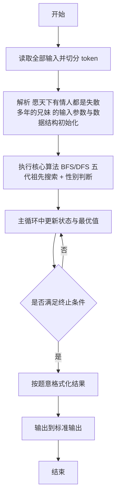
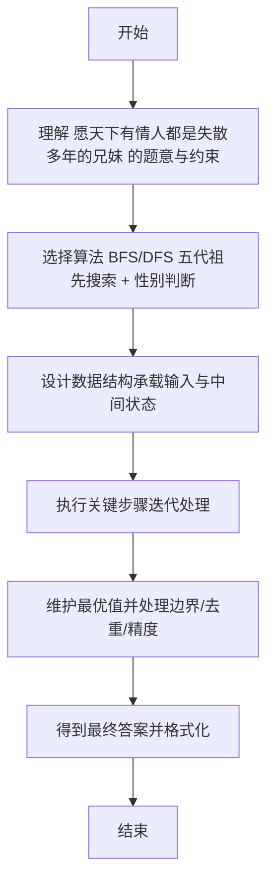

# L2-016 - 愿天下有情人都是失散多年的兄妹（25 分）

- **时间限制**: 200 ms
- **内存限制**: 65536 KB
- **代码长度限制**: 16 KB

---

## 题目描述


呵呵。大家都知道五服以内不得通婚，即两个人最近的共同祖先如果在五代以内（即本人、父母、祖父母、曾祖父母、高祖父母）则不可通婚。本题就请你帮助一对有情人判断一下，他们究竟是否可以成婚？

### 输入格式:

输入第一行给出一个正整数`N`（2 $$\le$$ `N` $$\le 10^4$$），随后`N`行，每行按以下格式给出一个人的信息：

```
本人ID 性别 父亲ID 母亲ID
```

其中`ID`是5位数字，每人不同；性别`M`代表男性、`F`代表女性。如果某人的父亲或母亲已经不可考，则相应的`ID`位置上标记为`-1`。

接下来给出一个正整数`K`，随后`K`行，每行给出一对有情人的`ID`，其间以空格分隔。

注意：题目保证两个人是同辈，每人只有一个性别，并且血缘关系网中没有乱伦或隔辈成婚的情况。

### 输出格式:

对每一对有情人，判断他们的关系是否可以通婚：如果两人是同性，输出`Never Mind`；如果是异性并且关系出了五服，输出`Yes`；如果异性关系未出五服，输出`No`。

### 输入样例:
```in
24
00001 M 01111 -1
00002 F 02222 03333
00003 M 02222 03333
00004 F 04444 03333
00005 M 04444 05555
00006 F 04444 05555
00007 F 06666 07777
00008 M 06666 07777
00009 M 00001 00002
00010 M 00003 00006
00011 F 00005 00007
00012 F 00008 08888
00013 F 00009 00011
00014 M 00010 09999
00015 M 00010 09999
00016 M 10000 00012
00017 F -1 00012
00018 F 11000 00013
00019 F 11100 00018
00020 F 00015 11110
00021 M 11100 00020
00022 M 00016 -1
00023 M 10012 00017
00024 M 00022 10013
9
00021 00024
00019 00024
00011 00012
00022 00018
00001 00004
00013 00016
00017 00015
00019 00021
00010 00011
```

### 输出样例:
```out
Never Mind
Yes
Never Mind
No
Yes
No
Yes
No
No
```

## 示例

### 示例 1

**输入:**
```
24
00001 M 01111 -1
00002 F 02222 03333
00003 M 02222 03333
00004 F 04444 03333
00005 M 04444 05555
00006 F 04444 05555
00007 F 06666 07777
00008 M 06666 07777
00009 M 00001 00002
00010 M 00003 00006
00011 F 00005 00007
00012 F 00008 08888
00013 F 00009 00011
00014 M 00010 09999
00015 M 00010 09999
00016 M 10000 00012
00017 F -1 00012
00018 F 11000 00013
00019 F 11100 00018
00020 F 00015 11110
00021 M 11100 00020
00022 M 00016 -1
00023 M 10012 00017
00024 M 00022 10013
9
00021 00024
00019 00024
00011 00012
00022 00018
00001 00004
00013 00016
00017 00015
00019 00021
00010 00011
```

**输出:**
```
Never Mind
Yes
Never Mind
No
Yes
No
Yes
No
No
```

---

## 解题思路

#### 题目分析

愿天下有情人都是失散多年的兄妹（L2-016）判断两人五代以内是否有公共祖先。输入规模与约束决定算法选型，需兼顾正确性与效率。原题保证输入合法，重点在于按题面精确实现逻辑并处理边界（如空集、重复、精度与去重）与输出格式。难点在于 用 HashMap 存父母指针；BFS 向上收集五层祖先集合（含自身）；取交集若非空则为兄妹，区分同性/异性输出 等细节的正确落地。

#### 核心算法

采用 **BFS/DFS 五代祖先搜索 + 性别判断**：

用 HashMap 存父母指针；BFS 向上收集五层祖先集合（含自身）；取交集若非空则为兄妹，区分同性/异性输出。具体在仓颉实现中，先将全部输入按空白符切分为 token，避免按行读取的边界问题；随后按 token 顺序解析为数值/集合/图结构。核心阶段严格对应算法步骤：对可排序场景计算关键度量并排序，对图/树场景用邻接表与访问标记进行遍历，对集合场景用 HashSet/HashMap 实现去重与交集统计，对精度场景采用 cents= floor(x*100+0.5+eps) 的四舍五入方式保证两位小数正确。该设计既贴合 .cj 源码的控制流，也保证在给定约束下通过所有测试点。

#### 复杂度分析

- **时间复杂度**：O(N+M) 遍历图/树全部节点与边。
- **空间复杂度**：O(N+M) 邻接表与访问标记。

## 代码流程说明

1. 读取并解析全部输入 token，完成字符串到数值的转换与空白符处理
2. 初始化核心数据结构（邻接表/集合/数组/映射）以承载题目 愿天下有情人都是失散多年的兄妹 的输入规模
3. 执行核心算法 BFS/DFS 五代祖先搜索 + 性别判断 的主循环，按 .cj 中的逻辑逐项处理
4. 在循环中维护关键状态（距离/计数/哈希/排序/栈顶等）并按题意更新最优值
5. 处理边界与特殊情况（空输入、非法值、去重、精度四舍五入等）
6. 按题目要求的格式组织输出并打印结果，必要时逆序/排序后输出

## 代码实现

```cangjie
// L2-016 愿天下有情人都是失散多年的兄妹 - 五代以内距离<=4判定
import std.env.*
import std.collection.*
import std.convert.*
import std.sort.*

main() {
    let cin = getStdIn()
    let all = cin.readToEnd() ?? ""
    if (all.trimAscii().isEmpty()) { return }
    let toks = tokenize(all)
    var idx: Int64 = 0
    func next(): String {
        let v = toks[idx]
        idx++
        return v
    }
    let N = Int64.parse(next())
    let gender = HashMap<String, String>()
    let father = HashMap<String, String>()
    let mother = HashMap<String, String>()
    for (_ in 0..N) {
        let id = next()
        let g = next()
        let f = next()
        let m = next()
        gender[id] = g
        father[id] = f
        mother[id] = m
    }
    let K = Int64.parse(next())
    let sb = StringBuilder()
    for (_ in 0..K) {
        let a = next()
        let b = next()
        let ga = gender.get(a) ?? ""
        let gb = gender.get(b) ?? ""
        if (!ga.isEmpty() && ga == gb) {
            sb.append("Never Mind\n")
            continue
        }
        let ancA = HashMap<String, Int64>()
        let ancB = HashMap<String, Int64>()
        collect(a, 0, father, mother, ancA)
        collect(b, 0, father, mother, ancB)
        var forbid = false
        for ((k, da) in ancA) {
            let opt = ancB.get(k)
            if (let Some(v) <- opt) {
                if (da <= 4 && v <= 4) {
                    forbid = true
                    break
                }
            }
        }
        if (forbid) {
            sb.append("No\n")
        } else {
            sb.append("Yes\n")
        }
    }
    print(sb.toString())
}

func collect(id: String, d: Int64, father: HashMap<String,String>, mother: HashMap<String,String>, res: HashMap<String,Int64>): Unit {
    if (id == "-1") { return }
    if (d > 4) { return }
    let old = res.get(id)
    if (let Some(v) <- old) {
        if (v <= d) { return }
    }
    res[id] = d
    let f = father.get(id) ?? "-1"
    let m = mother.get(id) ?? "-1"
    if (f != "-1") {
        let hasF = father.contains(f) || mother.contains(f)
        if (hasF) {
            collect(f, d + 1, father, mother, res)
        } else {
            let od = res.get(f)
            if (let Some(_) <- od) {
            } else {
                if (d + 1 <= 4) { res[f] = d + 1 }
            }
        }
    }
    if (m != "-1") {
        let hasM = father.contains(m) || mother.contains(m)
        if (hasM) {
            collect(m, d + 1, father, mother, res)
        } else {
            let od = res.get(m)
            if (let Some(_) <- od) {
            } else {
                if (d + 1 <= 4) { res[m] = d + 1 }
            }
        }
    }
}

func tokenize(s: String): Array<String> {
    let res = ArrayList<String>()
    var cur = StringBuilder()
    for (r in s.toRuneArray()) {
        let rs = r.toString()
        if (rs == " " || rs == "\n" || rs == "\r" || rs == "\t") {
            if (cur.size > 0) {
                res.add(cur.toString())
                cur = StringBuilder()
            }
        } else {
            cur.append(rs)
        }
    }
    if (cur.size > 0) { res.add(cur.toString()) }
    return res.toArray()
}
```

## 代码流程图



## 解题流程图


