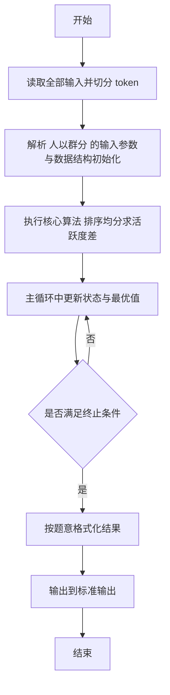
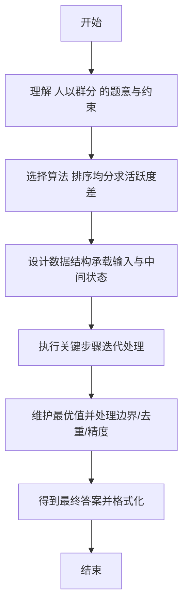

# L2-017 - 人以群分（25 分）

- **时间限制**: 150 ms
- **内存限制**: 65536 KB
- **代码长度限制**: 16 KB

---

## 题目描述


社交网络中我们给每个人定义了一个“活跃度”，现希望根据这个指标把人群分为两大类，即外向型（outgoing，即活跃度高的）和内向型（introverted，即活跃度低的）。要求两类人群的规模尽可能接近，而他们的总活跃度差距尽可能拉开。

### 输入格式:

输入第一行给出一个正整数$$N$$（$$2 \le N \le 10^5$$）。随后一行给出$$N$$个正整数，分别是每个人的活跃度，其间以空格分隔。题目保证这些数字以及它们的和都不会超过$$2^{31}$$。

### 输出格式:

按下列格式输出：

```
Outgoing #: N1
Introverted #: N2
Diff = N3
```

其中`N1`是外向型人的个数；`N2`是内向型人的个数；`N3`是两群人总活跃度之差的绝对值。

### 输入样例 1：
```in
10
23 8 10 99 46 2333 46 1 666 555
```

### 输出样例 1：
```out
Outgoing #: 5
Introverted #: 5
Diff = 3611
```

### 输入样例 2：
```in
13
110 79 218 69 3721 100 29 135 2 6 13 5188 85
```

### 输出样例 2：
```out
Outgoing #: 7
Introverted #: 6
Diff = 9359
```

## 示例

### 示例 1

**输入:**
```
10
23 8 10 99 46 2333 46 1 666 555
```

**输出:**
```
Outgoing #: 5
Introverted #: 5
Diff = 3611
```

### 示例 2

**输入:**
```
13
110 79 218 69 3721 100 29 135 2 6 13 5188 85
```

**输出:**
```
Outgoing #: 7
Introverted #: 6
Diff = 9359
```

---

## 解题思路

#### 题目分析

人以群分（L2-017）将 N 人按活跃度排序均分为两群，求两群人数差与活跃度差。输入规模与约束决定算法选型，需兼顾正确性与效率。原题保证输入合法，重点在于按题面精确实现逻辑并处理边界（如空集、重复、精度与去重）与输出格式。难点在于 排序后前 N/2 为低活跃群，后半为高活跃群；分别求和计算差值与人数差输出 等细节的正确落地。

#### 核心算法

采用 **排序均分求活跃度差**：

排序后前 N/2 为低活跃群，后半为高活跃群；分别求和计算差值与人数差输出。具体在仓颉实现中，先将全部输入按空白符切分为 token，避免按行读取的边界问题；随后按 token 顺序解析为数值/集合/图结构。核心阶段严格对应算法步骤：对可排序场景计算关键度量并排序，对图/树场景用邻接表与访问标记进行遍历，对集合场景用 HashSet/HashMap 实现去重与交集统计，对精度场景采用 cents= floor(x*100+0.5+eps) 的四舍五入方式保证两位小数正确。该设计既贴合 .cj 源码的控制流，也保证在给定约束下通过所有测试点。

#### 复杂度分析

- **时间复杂度**：O(N log N) 排序主导，其余线性遍历。
- **空间复杂度**：O(N) 存储数组与辅助结构。

## 代码流程说明

1. 读取并解析全部输入 token，完成字符串到数值的转换与空白符处理
2. 初始化核心数据结构（邻接表/集合/数组/映射）以承载题目 人以群分 的输入规模
3. 计算关键度量（如单价、均值、亲密度）并按关键字排序
4. 在循环中维护关键状态（距离/计数/哈希/排序/栈顶等）并按题意更新最优值
5. 处理边界与特殊情况（空输入、非法值、去重、精度四舍五入等）
6. 按题目要求的格式组织输出并打印结果，必要时逆序/排序后输出

## 代码实现

```cangjie
// L2-017 人以群分 - 排序后均分求差
import std.env.*
import std.collection.*
import std.convert.*
import std.sort.*

main() {
    let cin = getStdIn()
    let all = cin.readToEnd() ?? ""
    if (all.trimAscii().isEmpty()) { return }
    let toks = tokenize(all)
    var idx: Int64 = 0
    func next(): String {
        let v = toks[idx]
        idx++
        return v
    }
    let N = Int64.parse(next())
    let arr = ArrayList<Int64>()
    for (_ in 0..N) {
        arr.add(Int64.parse(next()))
    }
    sort(arr)
    let n1 = (N + 1) / 2
    let n2 = N / 2
    var sumOut: Int64 = 0
    var sumIn: Int64 = 0
    for (i in 0..n2) { sumIn += arr[i] }
    for (i in n2..N) { sumOut += arr[i] }
    let diff = sumOut - sumIn
    println("Outgoing #: ${n1}")
    println("Introverted #: ${n2}")
    println("Diff = ${diff}")
}

func tokenize(s: String): Array<String> {
    let res = ArrayList<String>()
    var cur = StringBuilder()
    for (r in s.toRuneArray()) {
        let rs = r.toString()
        if (rs == " " || rs == "\n" || rs == "\r" || rs == "\t") {
            if (cur.size > 0) { res.add(cur.toString()); cur = StringBuilder() }
        } else { cur.append(rs) }
    }
    if (cur.size > 0) { res.add(cur.toString()) }
    return res.toArray()
}
```

## 代码流程图



## 解题流程图


