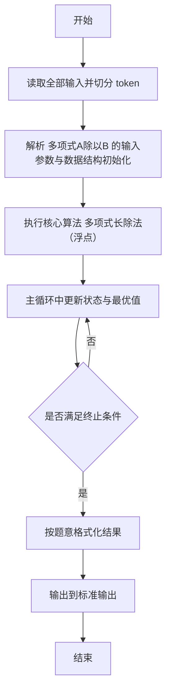
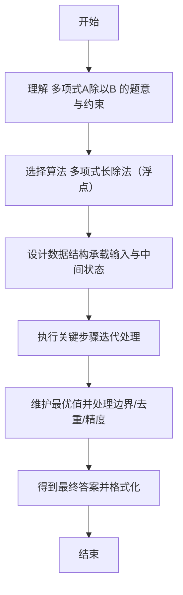

# L2-018 - 多项式A除以B（25 分）

- **时间限制**: 400 ms
- **内存限制**: 65536 KB
- **代码长度限制**: 16 KB

---

## 题目描述


这仍然是一道关于A/B的题，只不过A和B都换成了多项式。你需要计算两个多项式相除的商Q和余R，其中R的阶数必须小于B的阶数。

### 输入格式:

输入分两行，每行给出一个非零多项式，先给出A，再给出B。每行的格式如下：

```
N e[1] c[1] ... e[N] c[N]
```

其中`N`是该多项式非零项的个数，`e[i]`是第`i`个非零项的指数，`c[i]`是第`i`个非零项的系数。各项按照指数递减的顺序给出，保证所有指数是各不相同的非负整数，所有系数是非零整数，所有整数在整型范围内。

### 输出格式:

分两行先后输出商和余，输出格式与输入格式相同，输出的系数保留小数点后1位。同行数字间以1个空格分隔，行首尾不得有多余空格。注意：零多项式是一个特殊多项式，对应输出为`0 0 0.0`。但非零多项式不能输出零系数（包括舍入后为0.0）的项。在样例中，余多项式其实有常数项`-1/27`，但因其舍入后为0.0，故不输出。

### 输入样例:
```in
4 4 1 2 -3 1 -1 0 -1
3 2 3 1 -2 0 1
```

### 输出样例:
```out
3 2 0.3 1 0.2 0 -1.0
1 1 -3.1
```

## 示例

### 示例 1

**输入:**
```
4 4 1 2 -3 1 -1 0 -1
3 2 3 1 -2 0 1
```

**输出:**
```
3 2 0.3 1 0.2 0 -1.0
1 1 -3.1
```

---

## 解题思路

#### 题目分析

多项式A除以B（L2-018）给定两个多项式系数，求商与余式。输入规模与约束决定算法选型，需兼顾正确性与效率。原题保证输入合法，重点在于按题面精确实现逻辑并处理边界（如空集、重复、精度与去重）与输出格式。难点在于 按指数降序存储；循环取被除式最高次项除以除式最高次项得商项，乘除式后相减更新被除式；直到次数不足；输出商与余式保留一位小 等细节的正确落地。

#### 核心算法

采用 **多项式长除法（浮点）**：

按指数降序存储；循环取被除式最高次项除以除式最高次项得商项，乘除式后相减更新被除式；直到次数不足；输出商与余式保留一位小数，去零处理。具体在仓颉实现中，先将全部输入按空白符切分为 token，避免按行读取的边界问题；随后按 token 顺序解析为数值/集合/图结构。核心阶段严格对应算法步骤：对可排序场景计算关键度量并排序，对图/树场景用邻接表与访问标记进行遍历，对集合场景用 HashSet/HashMap 实现去重与交集统计，对精度场景采用 cents= floor(x*100+0.5+eps) 的四舍五入方式保证两位小数正确。该设计既贴合 .cj 源码的控制流，也保证在给定约束下通过所有测试点。

#### 复杂度分析

- **时间复杂度**：O(N log N) 或 O(N) 视实现而定。
- **空间复杂度**：O(N)。

## 代码流程说明

1. 读取并解析全部输入 token，完成字符串到数值的转换与空白符处理
2. 初始化核心数据结构（邻接表/集合/数组/映射）以承载题目 多项式A除以B 的输入规模
3. 执行核心算法 多项式长除法（浮点） 的主循环，按 .cj 中的逻辑逐项处理
4. 在循环中维护关键状态（距离/计数/哈希/排序/栈顶等）并按题意更新最优值
5. 处理边界与特殊情况（空输入、非法值、去重、精度四舍五入等）
6. 按题目要求的格式组织输出并打印结果，必要时逆序/排序后输出

## 代码实现

```cangjie
// L2-018 多项式A除以B - 多项式除法，1位小数
import std.env.*
import std.collection.*
import std.convert.*
import std.math.*
import std.sort.*

main() {
    let cin = getStdIn()
    let all = cin.readToEnd() ?? ""
    if (all.trimAscii().isEmpty()) { return }
    let toks = tokenize(all)
    var idx: Int64 = 0
    func next(): String {
        let v = toks[idx]
        idx++
        return v
    }
    let nA = Int64.parse(next())
    let mapA = HashMap<Int64, Float64>()
    var maxA: Int64 = -1
    for (_ in 0..nA) {
        let e = Int64.parse(next())
        let c = Float64.parse(next())
        mapA[e] = c
        if (e > maxA) { maxA = e }
    }
    let nB = Int64.parse(next())
    let mapB = HashMap<Int64, Float64>()
    var maxB: Int64 = -1
    for (_ in 0..nB) {
        let e = Int64.parse(next())
        let c = Float64.parse(next())
        mapB[e] = c
        if (e > maxB) { maxB = e }
    }
    let coeffBmax = mapB.get(maxB) ?? 0.0
    let mapQ = HashMap<Int64, Float64>()
    let rem = HashMap<Int64, Float64>()
    for ((k,v) in mapA) { rem[k] = v }
    func currentMax(m: HashMap<Int64,Float64>): Int64 {
        var mx: Int64 = -1
        var found = false
        for ((k,v) in m) {
            if (abs(v) < 1e-9) { continue }
            if (!found || k > mx) { mx = k; found = true }
        }
        return if (found) { mx } else { -1 }
    }
    var curMax = currentMax(rem)
    while (curMax >= maxB && curMax != -1) {
        let coeffRem = rem.get(curMax) ?? 0.0
        if (abs(coeffRem) < 1e-9) {
            rem.remove(curMax)
            curMax = currentMax(rem)
            continue
        }
        let qCoeff = coeffRem / coeffBmax
        let qExp = curMax - maxB
        let prev = mapQ.get(qExp) ?? 0.0
        mapQ[qExp] = prev + qCoeff
        for ((eb, cb) in mapB) {
            let e = eb + qExp
            let cur = rem.get(e) ?? 0.0
            let nv = cur - qCoeff * cb
            if (abs(nv) < 1e-9) { rem.remove(e) } else { rem[e] = nv }
        }
        if (rem.contains(curMax)) {
            let v = rem.get(curMax) ?? 0.0
            if (abs(v) < 1e-9) { rem.remove(curMax) }
        }
        curMax = currentMax(rem)
    }
    printPoly(mapQ)
    printPoly(rem)
}

func printPoly(m: HashMap<Int64, Float64>): Unit {
    let list = ArrayList<(Int64, String)>()
    for ((e,c) in m) {
        let r = round1(c)
        if (r == 0) { continue }
        let s = format1FromRounded(r)
        list.add((e, s))
    }
    if (list.size == 0) {
        println("0 0 0.0")
        return
    }
    sort(list, by: { a,b => if (a[0] > b[0]) {Ordering.LT} else if (a[0] < b[0]) {Ordering.GT} else {Ordering.EQ} })
    let sb = StringBuilder()
    sb.append("${list.size}")
    for (i in 0..list.size) {
        sb.append(" ${list[i][0]} ${list[i][1]}")
    }
    println(sb.toString())
}

func round1(x: Float64): Int64 {
    let v = x * 10.0
    return if (v >= 0.0) { Int64(floor(v + 0.5)) } else { Int64(ceil(v - 0.5)) }
}

func format1FromRounded(r: Int64): String {
    if (r == 0) { return "0.0" }
    let neg = r < 0
    let ar = if (neg) { -r } else { r }
    let ip = ar / 10
    let fp = ar % 10
    let s = "${ip}.${fp}"
    return if (neg) { "-${s}" } else { s }
}

func tokenize(s: String): Array<String> {
    let res = ArrayList<String>()
    var cur = StringBuilder()
    for (r in s.toRuneArray()) {
        let rs = r.toString()
        if (rs == " " || rs == "\n" || rs == "\r" || rs == "\t") {
            if (cur.size > 0) { res.add(cur.toString()); cur = StringBuilder() }
        } else { cur.append(rs) }
    }
    if (cur.size > 0) { res.add(cur.toString()) }
    return res.toArray()
}
```

## 代码流程图



## 解题流程图


