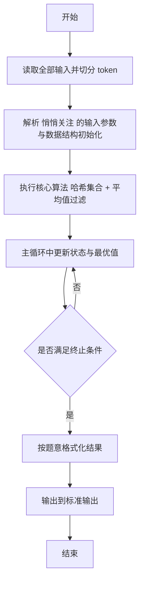
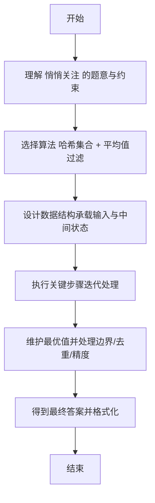

# L2-019 - 悄悄关注（25 分）

- **时间限制**: 150 ms
- **内存限制**: 65536 KB
- **代码长度限制**: 16 KB

---

## 题目描述


新浪微博上有个“悄悄关注”，一个用户悄悄关注的人，不出现在这个用户的关注列表上，但系统会推送其悄悄关注的人发表的微博给该用户。现在我们来做一回网络侦探，根据某人的关注列表和其对其他用户的点赞情况，扒出有可能被其悄悄关注的人。

### 输入格式:

输入首先在第一行给出某用户的关注列表，格式如下：

```
人数N 用户1 用户2 …… 用户N
```

其中`N`是不超过5000的正整数，每个`用户i`（`i`=1, ..., `N`）是被其关注的用户的ID，是长度为4位的由数字和英文字母组成的字符串，各项间以空格分隔。

之后给出该用户点赞的信息：首先给出一个不超过10000的正整数`M`，随后`M`行，每行给出一个被其点赞的用户ID和对该用户的点赞次数（不超过1000），以空格分隔。注意：用户ID是一个用户的唯一身份标识。题目保证在关注列表中没有重复用户，在点赞信息中也没有重复用户。

### 输出格式:

我们认为被该用户点赞次数大于其点赞平均数、且不在其关注列表上的人，很可能是其悄悄关注的人。根据这个假设，请你按用户ID字母序的升序输出可能是其悄悄关注的人，每行1个ID。如果其实并没有这样的人，则输出“Bing Mei You”。

### 输入样例 1：
```in
10 GAO3 Magi Zha1 Sen1 Quan FaMK LSum Eins FatM LLao
8
Magi 50
Pota 30
LLao 3
Ammy 48
Dave 15
GAO3 31
Zoro 1
Cath 60
```

### 输出样例 1：
```out
Ammy
Cath
Pota
```

### 输入样例 2：
```in
11 GAO3 Magi Zha1 Sen1 Quan FaMK LSum Eins FatM LLao Pota
7
Magi 50
Pota 30
LLao 48
Ammy 3
Dave 15
GAO3 31
Zoro 29
```

### 输出样例 2：
```out
Bing Mei You
```

## 示例

### 示例 1

**输入:**
```
10 GAO3 Magi Zha1 Sen1 Quan FaMK LSum Eins FatM LLao
8
Magi 50
Pota 30
LLao 3
Ammy 48
Dave 15
GAO3 31
Zoro 1
Cath 60
```

**输出:**
```
Ammy
Cath
Pota
```

### 示例 2

**输入:**
```
11 GAO3 Magi Zha1 Sen1 Quan FaMK LSum Eins FatM LLao Pota
7
Magi 50
Pota 30
LLao 48
Ammy 3
Dave 15
GAO3 31
Zoro 29
```

**输出:**
```
Bing Mei You
```

---

## 解题思路

#### 题目分析

悄悄关注（L2-019）筛选点赞数超过平均值且未被关注的人。输入规模与约束决定算法选型，需兼顾正确性与效率。原题保证输入合法，重点在于按题面精确实现逻辑并处理边界（如空集、重复、精度与去重）与输出格式。难点在于 累加计算平均 avg；用 HashSet 存关注集合；遍历被点赞人若点赞数>avg 且不在关注集则收集，排序后输出，无则 等细节的正确落地。

#### 核心算法

采用 **哈希集合 + 平均值过滤**：

累加计算平均 avg；用 HashSet 存关注集合；遍历被点赞人若点赞数>avg 且不在关注集则收集，排序后输出，无则输出特定提示。具体在仓颉实现中，先将全部输入按空白符切分为 token，避免按行读取的边界问题；随后按 token 顺序解析为数值/集合/图结构。核心阶段严格对应算法步骤：对可排序场景计算关键度量并排序，对图/树场景用邻接表与访问标记进行遍历，对集合场景用 HashSet/HashMap 实现去重与交集统计，对精度场景采用 cents= floor(x*100+0.5+eps) 的四舍五入方式保证两位小数正确。该设计既贴合 .cj 源码的控制流，也保证在给定约束下通过所有测试点。

#### 复杂度分析

- **时间复杂度**：O(N) 平均哈希操作线性。
- **空间复杂度**：O(N) 哈希集合/映射。

## 代码流程说明

1. 读取并解析全部输入 token，完成字符串到数值的转换与空白符处理
2. 初始化核心数据结构（邻接表/集合/数组/映射）以承载题目 悄悄关注 的输入规模
3. 执行核心算法 哈希集合 + 平均值过滤 的主循环，按 .cj 中的逻辑逐项处理
4. 在循环中维护关键状态（距离/计数/哈希/排序/栈顶等）并按题意更新最优值
5. 处理边界与特殊情况（空输入、非法值、去重、精度四舍五入等）
6. 按题目要求的格式组织输出并打印结果，必要时逆序/排序后输出

## 代码实现

```cangjie
// L2-019 悄悄关注 - 平均点赞过滤
import std.env.*
import std.collection.*
import std.convert.*
import std.sort.*

main() {
    let cin = getStdIn()
    let all = cin.readToEnd() ?? ""
    if (all.trimAscii().isEmpty()) { return }
    let toks = tokenize(all)
    var idx: Int64 = 0
    func next(): String { let v = toks[idx]; idx++; return v }
    let N = Int64.parse(next())
    let follows = HashSet<String>()
    for (_ in 0..N) { follows.add(next()) }
    let M = Int64.parse(next())
    let likes = HashMap<String, Int64>()
    var total: Int64 = 0
    for (_ in 0..M) {
        let id = next()
        let cnt = Int64.parse(next())
        likes[id] = cnt
        total += cnt
    }
    let avg = if (M == 0) { 0.0 } else { Float64(total) / Float64(M) }
    let suspects = ArrayList<String>()
    for ((k, v) in likes) {
        if (!follows.contains(k) && Float64(v) > avg) { suspects.add(k) }
    }
    if (suspects.size == 0) { println("Bing Mei You"); return }
    sort(suspects)
    for (s in suspects) { println(s) }
}

func tokenize(s: String): Array<String> {
    let res = ArrayList<String>()
    var cur = StringBuilder()
    for (r in s.toRuneArray()) {
        let rs = r.toString()
        if (rs == " " || rs == "\n" || rs == "\r" || rs == "\t") {
            if (cur.size > 0) { res.add(cur.toString()); cur = StringBuilder() }
        } else { cur.append(rs) }
    }
    if (cur.size > 0) { res.add(cur.toString()) }
    return res.toArray()
}
```

## 代码流程图



## 解题流程图


