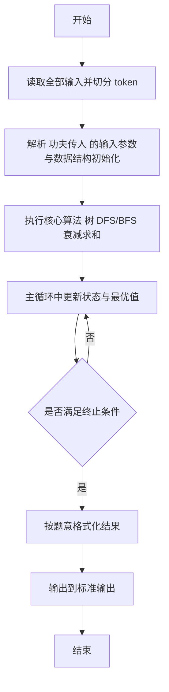
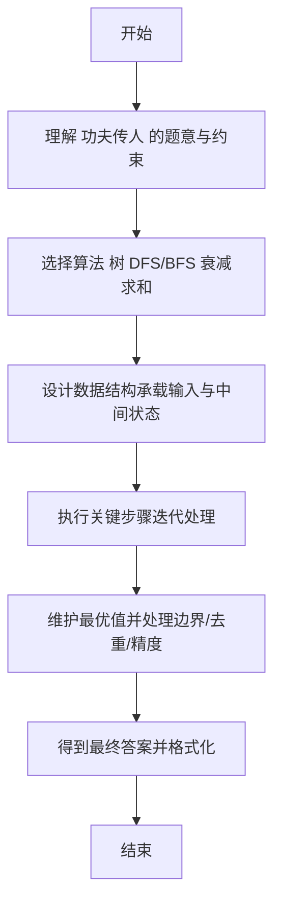

# L2-020 - 功夫传人（25 分）

- **时间限制**: 400 ms
- **内存限制**: 65536 KB
- **代码长度限制**: 16 KB

---

## 题目描述


一门武功能否传承久远并被发扬光大，是要看缘分的。一般来说，师傅传授给徒弟的武功总要打个折扣，于是越往后传，弟子们的功夫就越弱…… 直到某一支的某一代突然出现一个天分特别高的弟子（或者是吃到了灵丹、挖到了特别的秘笈），会将功夫的威力一下子放大N倍 —— 我们称这种弟子为“得道者”。

这里我们来考察某一位祖师爷门下的徒子徒孙家谱：假设家谱中的每个人只有1位师傅（除了祖师爷没有师傅）；每位师傅可以带很多徒弟；并且假设辈分严格有序，即祖师爷这门武功的每个第`i`代传人只能在第`i-1`代传人中拜1个师傅。我们假设已知祖师爷的功力值为`Z`，每向下传承一代，就会减弱`r%`，除非某一代弟子得道。现给出师门谱系关系，要求你算出所有得道者的功力总值。

### 输入格式:

输入在第一行给出3个正整数，分别是：$$N$$（$$\le 10^5$$）——整个师门的总人数（于是每个人从0到$$N-1$$编号，祖师爷的编号为0）；$$Z$$——祖师爷的功力值（不一定是整数，但起码是正数）；$$r$$ ——每传一代功夫所打的折扣百分比值（不超过100的正数）。接下来有$$N$$行，第$$i$$行（$$i=0, \cdots , N-1$$）描述编号为$$i$$的人所传的徒弟，格式为：

$$K_i$$ ID[1] ID[2] $$\cdots$$ ID[$$K_i$$]

其中$$K_i$$是徒弟的个数，后面跟的是各位徒弟的编号，数字间以空格间隔。$$K_i$$为零表示这是一位得道者，这时后面跟的一个数字表示其武功被放大的倍数。

### 输出格式:

在一行中输出所有得道者的功力总值，只保留其整数部分。题目保证输入和正确的输出都不超过$$10^{10}$$。

### 输入样例:
```in
10 18.0 1.00
3 2 3 5
1 9
1 4
1 7
0 7
2 6 1
1 8
0 9
0 4
0 3
```

### 输出样例:
```out
404
```

## 示例

### 示例 1

**输入:**
```
10 18.0 1.00
3 2 3 5
1 9
1 4
1 7
0 7
2 6 1
1 8
0 9
0 4
0 3
```

**输出:**
```
404
```

---

## 解题思路

#### 题目分析

功夫传人（L2-020）宗师功力为 z，每代衰减 r%，求得道者总功力。输入规模与约束决定算法选型，需兼顾正确性与效率。原题保证输入合法，重点在于按题面精确实现逻辑并处理边界（如空集、重复、精度与去重）与输出格式。难点在于 建邻接表树，记录每个得道者功力值；DFS 从根向下传递当前功力 cur = cur*(1-r)；在得道节点累加 cur* 等细节的正确落地。

#### 核心算法

采用 **树 DFS/BFS 衰减求和**：

建邻接表树，记录每个得道者功力值；DFS 从根向下传递当前功力 cur = cur*(1-r)；在得道节点累加 cur*power。具体在仓颉实现中，先将全部输入按空白符切分为 token，避免按行读取的边界问题；随后按 token 顺序解析为数值/集合/图结构。核心阶段严格对应算法步骤：对可排序场景计算关键度量并排序，对图/树场景用邻接表与访问标记进行遍历，对集合场景用 HashSet/HashMap 实现去重与交集统计，对精度场景采用 cents= floor(x*100+0.5+eps) 的四舍五入方式保证两位小数正确。该设计既贴合 .cj 源码的控制流，也保证在给定约束下通过所有测试点。

#### 复杂度分析

- **时间复杂度**：O(N+M) 遍历图/树全部节点与边。
- **空间复杂度**：O(N+M) 邻接表与访问标记。

## 代码流程说明

1. 读取并解析全部输入 token，完成字符串到数值的转换与空白符处理
2. 初始化核心数据结构（邻接表/集合/数组/映射）以承载题目 功夫传人 的输入规模
3. 执行核心算法 树 DFS/BFS 衰减求和 的主循环，按 .cj 中的逻辑逐项处理
4. 在循环中维护关键状态（距离/计数/哈希/排序/栈顶等）并按题意更新最优值
5. 处理边界与特殊情况（空输入、非法值、去重、精度四舍五入等）
6. 按题目要求的格式组织输出并打印结果，必要时逆序/排序后输出

## 代码实现

```cangjie
// L2-020 功夫传人 - 树BFS衰减
import std.env.*
import std.collection.*
import std.convert.*

main() {
    let cin = getStdIn()
    let all = cin.readToEnd() ?? ""
    if (all.trimAscii().isEmpty()) { return }
    let toks = tokenize(all)
    var idx: Int64 = 0
    func next(): String { let v = toks[idx]; idx++; return v }
    let N = Int64.parse(next())
    let Z = Float64.parse(next())
    let r = Float64.parse(next())
    let decay = 1.0 - r / 100.0
    let children = Array<ArrayList<Int64>>(N, { _ => ArrayList<Int64>() })
    let isLeaf = Array<Bool>(N, repeat: false)
    let mult = Array<Float64>(N, repeat: 0.0)
    for (i in 0..N) {
        let Ki = Int64.parse(next())
        if (Ki == 0) {
            isLeaf[i] = true
            mult[i] = Float64.parse(next())
        } else {
            for (_ in 0..Ki) {
                let cid = Int64.parse(next())
                children[i].add(cid)
            }
        }
    }
    var total = 0.0
    let qNode = ArrayList<Int64>()
    let qPow = ArrayList<Float64>()
    qNode.add(0)
    qPow.add(Z)
    var head: Int64 = 0
    while (head < qNode.size) {
        let node = qNode[head]
        let pow = qPow[head]
        head++
        if (isLeaf[node]) {
            total += pow * mult[node]
        } else {
            for (c in children[node]) {
                qNode.add(c)
                qPow.add(pow * decay)
            }
        }
    }
    let ans = Int64(total)
    println("${ans}")
}

func tokenize(s: String): Array<String> {
    let res = ArrayList<String>()
    var cur = StringBuilder()
    for (r in s.toRuneArray()) {
        let rs = r.toString()
        if (rs == " " || rs == "\n" || rs == "\r" || rs == "\t") {
            if (cur.size > 0) { res.add(cur.toString()); cur = StringBuilder() }
        } else { cur.append(rs) }
    }
    if (cur.size > 0) { res.add(cur.toString()) }
    return res.toArray()
}
```

## 代码流程图



## 解题流程图


