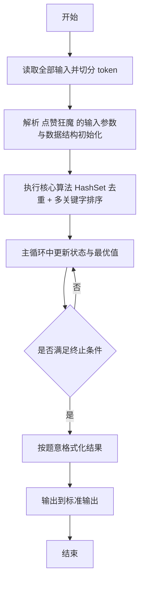
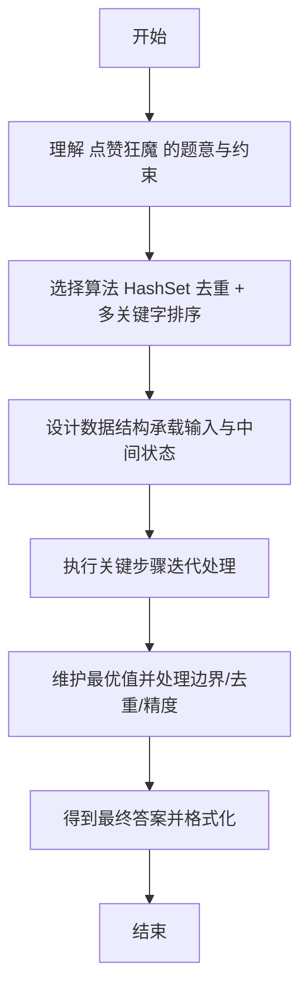

# L2-021 - 点赞狂魔（25 分）

- **时间限制**: 200 ms
- **内存限制**: 65536 KB
- **代码长度限制**: 16 KB

---

## 题目描述


微博上有个“点赞”功能，你可以为你喜欢的博文点个赞表示支持。每篇博文都有一些刻画其特性的标签，而你点赞的博文的类型，也间接刻画了你的特性。然而有这么一种人，他们会通过给自己看到的一切内容点赞来狂刷存在感，这种人就被称为“点赞狂魔”。他们点赞的标签非常分散，无法体现出明显的特性。本题就要求你写个程序，通过统计每个人点赞的不同标签的数量，找出前3名点赞狂魔。

### 输入格式:

输入在第一行给出一个正整数$$N$$（$$\le 100$$），是待统计的用户数。随后$$N$$行，每行列出一位用户的点赞标签。格式为“`Name` $$K$$ $$F_1 \cdots F_K$$”，其中`Name`是不超过8个英文小写字母的非空用户名，$$1\le K\le 1000$$，$$F_i$$（$$i=1, \cdots , K$$）是特性标签的编号，我们将所有特性标签从 1 到 $$10^7$$ 编号。数字间以空格分隔。

### 输出格式:

统计每个人点赞的不同标签的数量，找出数量最大的前3名，在一行中顺序输出他们的用户名,其间以1个空格分隔,且行末不得有多余空格。如果有并列，则输出标签出现次数平均值最小的那个，题目保证这样的用户没有并列。若不足3人，则用`-`补齐缺失，例如`mike jenny -`就表示只有2人。

### 输入样例:
```in
5
bob 11 101 102 103 104 105 106 107 108 108 107 107
peter 8 1 2 3 4 3 2 5 1
chris 12 1 2 3 4 5 6 7 8 9 1 2 3
john 10 8 7 6 5 4 3 2 1 7 5
jack 9 6 7 8 9 10 11 12 13 14
```

### 输出样例:
```out
jack chris john
```

## 示例

### 示例 1

**输入:**
```
5
bob 11 101 102 103 104 105 106 107 108 108 107 107
peter 8 1 2 3 4 3 2 5 1
chris 12 1 2 3 4 5 6 7 8 9 1 2 3
john 10 8 7 6 5 4 3 2 1 7 5
jack 9 6 7 8 9 10 11 12 13 14
```

**输出:**
```
jack chris john
```

---

## 解题思路

#### 题目分析

点赞狂魔（L2-021）按不同标签数与平均点赞排序取前 3。输入规模与约束决定算法选型，需兼顾正确性与效率。原题保证输入合法，重点在于按题面精确实现逻辑并处理边界（如空集、重复、精度与去重）与输出格式。难点在于 对每人用 HashSet 统计不同标签数 distinct，计算平均 avg=总数/distinct；按 distinc 等细节的正确落地。

#### 核心算法

采用 **HashSet 去重 + 多关键字排序**：

对每人用 HashSet 统计不同标签数 distinct，计算平均 avg=总数/distinct；按 distinct 降序、 avg 降序、名字升序排序取前三。具体在仓颉实现中，先将全部输入按空白符切分为 token，避免按行读取的边界问题；随后按 token 顺序解析为数值/集合/图结构。核心阶段严格对应算法步骤：对可排序场景计算关键度量并排序，对图/树场景用邻接表与访问标记进行遍历，对集合场景用 HashSet/HashMap 实现去重与交集统计，对精度场景采用 cents= floor(x*100+0.5+eps) 的四舍五入方式保证两位小数正确。该设计既贴合 .cj 源码的控制流，也保证在给定约束下通过所有测试点。

#### 复杂度分析

- **时间复杂度**：O(N log N) 排序主导，其余线性遍历。
- **空间复杂度**：O(N) 存储数组与辅助结构。

## 代码流程说明

1. 读取并解析全部输入 token，完成字符串到数值的转换与空白符处理
2. 初始化核心数据结构（邻接表/集合/数组/映射）以承载题目 点赞狂魔 的输入规模
3. 计算关键度量（如单价、均值、亲密度）并按关键字排序
4. 在循环中维护关键状态（距离/计数/哈希/排序/栈顶等）并按题意更新最优值
5. 处理边界与特殊情况（空输入、非法值、去重、精度四舍五入等）
6. 按题目要求的格式组织输出并打印结果，必要时逆序/排序后输出

## 代码实现

```cangjie
// L2-021 点赞狂魔 - 不同标签数排序
import std.env.*
import std.collection.*
import std.convert.*
import std.sort.*

main() {
    let cin = getStdIn()
    let all = cin.readToEnd() ?? ""
    if (all.trimAscii().isEmpty()) { return }
    let toks = tokenize(all)
    var idx: Int64 = 0
    func next(): String { let v = toks[idx]; idx++; return v }
    let N = Int64.parse(next())
    let users = ArrayList<(String, Int64, Float64)>()
    for (_ in 0..N) {
        let name = next()
        let K = Int64.parse(next())
        let set = HashSet<String>()
        for (_2 in 0..K) { set.add(next()) }
        let distinct: Int64 = set.size
        let avg = if (distinct == 0) { 0.0 } else { Float64(K) / Float64(distinct) }
        users.add((name, distinct, avg))
    }
    sort(users, by: { a,b =>
        if (a[1] != b[1]) {
            if (a[1] > b[1]) { Ordering.LT } else { Ordering.GT }
        } else if (a[2] != b[2]) {
            if (a[2] < b[2]) { Ordering.LT } else { Ordering.GT }
        } else { Ordering.EQ }
    })
    let res = ArrayList<String>()
    for (i in 0..3) {
        if (i < users.size) { res.add(users[i][0]) } else { res.add("-") }
    }
    println("${res[0]} ${res[1]} ${res[2]}")
}

func tokenize(s: String): Array<String> {
    let res = ArrayList<String>()
    var cur = StringBuilder()
    for (r in s.toRuneArray()) {
        let rs = r.toString()
        if (rs == " " || rs == "\n" || rs == "\r" || rs == "\t") {
            if (cur.size > 0) { res.add(cur.toString()); cur = StringBuilder() }
        } else { cur.append(rs) }
    }
    if (cur.size > 0) { res.add(cur.toString()) }
    return res.toArray()
}
```

## 代码流程图



## 解题流程图


