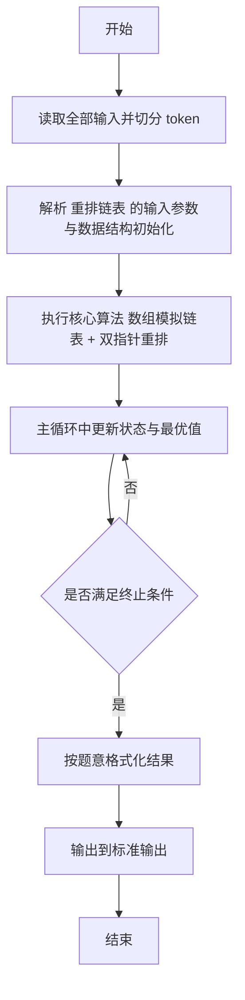
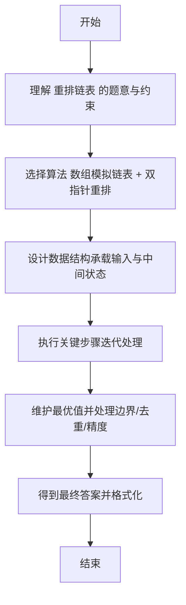

# L2-022 - 重排链表（25 分）

- **时间限制**: 500 ms
- **内存限制**: 65536 KB
- **代码长度限制**: 16 KB

---

## 题目描述


给定一个单链表 $$L_1$$→$$L_2$$→$$\cdots$$→$$L_{n-1}$$→$$L_n$$，请编写程序将链表重新排列为 $$L_n$$→$$L_1$$→$$L_{n-1}$$→$$L_2$$→$$\cdots$$。例如：给定$$L$$为1→2→3→4→5→6，则输出应该为6→1→5→2→4→3。

### 输入格式:

每个输入包含1个测试用例。每个测试用例第1行给出第1个结点的地址和结点总个数，即正整数$$N$$ ($$\le 10^5$$)。结点的地址是5位非负整数，NULL地址用$$-1$$表示。

接下来有$$N$$行，每行格式为：

```
Address Data Next
```

其中`Address`是结点地址；`Data`是该结点保存的数据，为不超过$$10^5$$的正整数；`Next`是下一结点的地址。题目保证给出的链表上至少有两个结点。

### 输出格式:

对每个测试用例，顺序输出重排后的结果链表，其上每个结点占一行，格式与输入相同。

### 输入样例:
```in
00100 6
00000 4 99999
00100 1 12309
68237 6 -1
33218 3 00000
99999 5 68237
12309 2 33218
```

### 输出样例:
```out
68237 6 00100
00100 1 99999
99999 5 12309
12309 2 00000
00000 4 33218
33218 3 -1
```

## 示例

### 示例 1

**输入:**
```
00100 6
00000 4 99999
00100 1 12309
68237 6 -1
33218 3 00000
99999 5 68237
12309 2 33218
```

**输出:**
```
68237 6 00100
00100 1 99999
99999 5 12309
12309 2 00000
00000 4 33218
33218 3 -1
```

---

## 解题思路

#### 题目分析

重排链表（L2-022）将链表按 L1→Ln→L2→Ln-1→... 重排。输入规模与约束决定算法选型，需兼顾正确性与效率。原题保证输入合法，重点在于按题面精确实现逻辑并处理边界（如空集、重复、精度与去重）与输出格式。难点在于 用数组 next/data 按地址索引存储；从头遍历还原顺序数组 order；双指针 i=0,j=n-1 交替拼接构造新 等细节的正确落地。

#### 核心算法

采用 **数组模拟链表 + 双指针重排**：

用数组 next/data 按地址索引存储；从头遍历还原顺序数组 order；双指针 i=0,j=n-1 交替拼接构造新链表顺序并输出地址与值。具体在仓颉实现中，先将全部输入按空白符切分为 token，避免按行读取的边界问题；随后按 token 顺序解析为数值/集合/图结构。核心阶段严格对应算法步骤：对可排序场景计算关键度量并排序，对图/树场景用邻接表与访问标记进行遍历，对集合场景用 HashSet/HashMap 实现去重与交集统计，对精度场景采用 cents= floor(x*100+0.5+eps) 的四舍五入方式保证两位小数正确。该设计既贴合 .cj 源码的控制流，也保证在给定约束下通过所有测试点。

#### 复杂度分析

- **时间复杂度**：O(N) 每个元素至多入出栈一次。
- **空间复杂度**：O(N) 栈/队列与数组。

## 代码流程说明

1. 读取并解析全部输入 token，完成字符串到数值的转换与空白符处理
2. 初始化核心数据结构（邻接表/集合/数组/映射）以承载题目 重排链表 的输入规模
3. 执行核心算法 数组模拟链表 + 双指针重排 的主循环，按 .cj 中的逻辑逐项处理
4. 利用栈/队列模拟题意过程，同步维护状态并触发出栈/入队条件
5. 处理边界与特殊情况（空输入、非法值、去重、精度四舍五入等）
6. 按题目要求的格式组织输出并打印结果，必要时逆序/排序后输出

## 代码实现

```cangjie
// L2-022 重排链表 - 双指针重排
import std.env.*
import std.collection.*
import std.convert.*

main() {
    let cin = getStdIn()
    let all = cin.readToEnd() ?? ""
    if (all.trimAscii().isEmpty()) { return }
    let toks = tokenize(all)
    var idx: Int64 = 0
    func next(): String { let v = toks[idx]; idx++; return v }
    let head = next()
    let N = Int64.parse(next())
    let nextMap = HashMap<String, String>()
    let dataMap = HashMap<String, String>()
    for (_ in 0..N) {
        let addr = next()
        let data = next()
        let nxt = next()
        dataMap[addr] = data
        nextMap[addr] = nxt
    }
    let nextMap2 = HashMap<String,String>()
    let dataMap2 = HashMap<String,String>()
    for ((k,v) in nextMap) {
        let pk = pad(k)
        nextMap2[pk] = pad(v)
    }
    for ((k,v) in dataMap) { dataMap2[pad(k)] = v }
    var list = ArrayList<String>()
    var cur = pad(head)
    var cnt: Int64 = 0
    while (cur != "-1" && cnt <= N + 5) {
        if (!dataMap2.contains(cur)) { break }
        list.add(cur)
        let nxt = nextMap2.get(cur) ?? "-1"
        cur = nxt
        cnt++
        if (cur == "-1") { break }
    }
    if (list.size == 0) {
        var c2 = head
        var cnt2: Int64 = 0
        while (c2 != "-1" && cnt2 <= N + 5) {
            if (!dataMap.contains(c2)) { break }
            list.add(c2)
            let nxt = nextMap.get(c2) ?? "-1"
            c2 = nxt
            cnt2++
            if (c2 == "-1") { break }
        }
        for (i in 0..list.size) { list[i] = pad(list[i]) }
    }
    var res = ArrayList<String>()
    var left: Int64 = 0
    var right: Int64 = list.size - 1
    var takeRight = true
    while (left <= right) {
        if (takeRight) {
            res.add(list[right]); right--
        } else {
            res.add(list[left]); left++
        }
        takeRight = !takeRight
    }
    let sb = StringBuilder()
    for (i in 0..res.size) {
        let a = res[i]
        let d = dataMap2.get(a) ?? (dataMap.get(a) ?? "")
        let nxt = if (i + 1 < res.size) { res[i+1] } else { "-1" }
        sb.append("${a} ${d} ${nxt}\n")
    }
    print(sb.toString())
}

func pad(s: String): String {
    if (s == "-1") { return "-1" }
    var t = s
    while (t.size < 5) { t = "0" + t }
    return t
}

func tokenize(s: String): Array<String> {
    let res = ArrayList<String>()
    var cur = StringBuilder()
    for (r in s.toRuneArray()) {
        let rs = r.toString()
        if (rs == " " || rs == "\n" || rs == "\r" || rs == "\t") {
            if (cur.size > 0) { res.add(cur.toString()); cur = StringBuilder() }
        } else { cur.append(rs) }
    }
    if (cur.size > 0) { res.add(cur.toString()) }
    return res.toArray()
}
```

## 代码流程图



## 解题流程图


