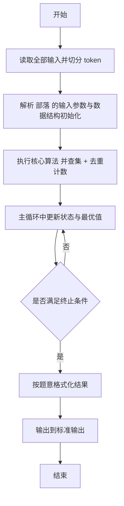
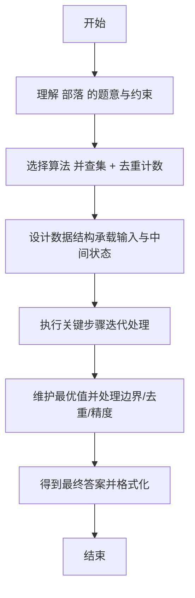

# L2-024 - 部落（25 分）

- **时间限制**: 150 ms
- **内存限制**: 65536 KB
- **代码长度限制**: 16 KB

---

## 题目描述


在一个社区里，每个人都有自己的小圈子，还可能同时属于很多不同的朋友圈。我们认为朋友的朋友都算在一个部落里，于是要请你统计一下，在一个给定社区中，到底有多少个互不相交的部落？并且检查任意两个人是否属于同一个部落。

### 输入格式:

输入在第一行给出一个正整数$$N$$（$$\le 10^4$$），是已知小圈子的个数。随后$$N$$行，每行按下列格式给出一个小圈子里的人：

$$K$$ $$P[1]$$ $$P[2]$$ $$\cdots$$ $$P[K]$$

其中$$K$$是小圈子里的人数，$$P[i]$$（$$i=1, \cdots , K$$）是小圈子里每个人的编号。这里所有人的编号从1开始连续编号，最大编号不会超过$$10^4$$。

之后一行给出一个非负整数$$Q$$（$$\le 10^4$$），是查询次数。随后$$Q$$行，每行给出一对被查询的人的编号。

### 输出格式:

首先在一行中输出这个社区的总人数、以及互不相交的部落的个数。随后对每一次查询，如果他们属于同一个部落，则在一行中输出`Y`，否则输出`N`。

### 输入样例:
```in
4
3 10 1 2
2 3 4
4 1 5 7 8
3 9 6 4
2
10 5
3 7
```

### 输出样例:
```out
10 2
Y
N
```

## 示例

### 示例 1

**输入:**
```
4
3 10 1 2
2 3 4
4 1 5 7 8
3 9 6 4
2
10 5
3 7
```

**输出:**
```
10 2
Y
N
```

---

## 解题思路

#### 题目分析

部落（L2-024）统计总人数与社区数。输入规模与约束决定算法选型，需兼顾正确性与效率。原题保证输入合法，重点在于按题面精确实现逻辑并处理边界（如空集、重复、精度与去重）与输出格式。难点在于 并查集按每组部落成员合并；HashSet 统计出现过的总人数；统计不同根的个数即为社区数 等细节的正确落地。

#### 核心算法

采用 **并查集 + 去重计数**：

并查集按每组部落成员合并；HashSet 统计出现过的总人数；统计不同根的个数即为社区数。具体在仓颉实现中，先将全部输入按空白符切分为 token，避免按行读取的边界问题；随后按 token 顺序解析为数值/集合/图结构。核心阶段严格对应算法步骤：对可排序场景计算关键度量并排序，对图/树场景用邻接表与访问标记进行遍历，对集合场景用 HashSet/HashMap 实现去重与交集统计，对精度场景采用 cents= floor(x*100+0.5+eps) 的四舍五入方式保证两位小数正确。该设计既贴合 .cj 源码的控制流，也保证在给定约束下通过所有测试点。

#### 复杂度分析

- **时间复杂度**：O((N+M) α(N)) 接近线性，α 为反阿克曼函数。
- **空间复杂度**：O(N) 并查集与映射。

## 代码流程说明

1. 读取并解析全部输入 token，完成字符串到数值的转换与空白符处理
2. 初始化核心数据结构（邻接表/集合/数组/映射）以承载题目 部落 的输入规模
3. 执行核心算法 并查集 + 去重计数 的主循环，按 .cj 中的逻辑逐项处理
4. 在循环中维护关键状态（距离/计数/哈希/排序/栈顶等）并按题意更新最优值
5. 处理边界与特殊情况（空输入、非法值、去重、精度四舍五入等）
6. 按题目要求的格式组织输出并打印结果，必要时逆序/排序后输出

## 代码实现

```cangjie
// L2-024 部落 - 并查集
import std.env.*
import std.collection.*
import std.convert.*

main() {
    let cin = getStdIn()
    let all = cin.readToEnd() ?? ""
    if (all.trimAscii().isEmpty()) { return }
    let toks = tokenize(all)
    var idx: Int64 = 0
    func next(): String { let v = toks[idx]; idx++; return v }
    let N = Int64.parse(next())
    let MAX: Int64 = 10000
    let parent = Array<Int64>(MAX+1, { i => i })
    let exists = Array<Bool>(MAX+1, repeat: false)
    func find(x: Int64): Int64 {
        var r = x
        while (parent[r] != r) { r = parent[r] }
        var cur = x
        while (parent[cur] != r) {
            let nxt = parent[cur]
            parent[cur] = r
            cur = nxt
        }
        return r
    }
    func union(a: Int64, b: Int64): Unit {
        let ra = find(a)
        let rb = find(b)
        if (ra != rb) { parent[rb] = ra }
    }
    for (_ in 0..N) {
        let K = Int64.parse(next())
        var first: Int64 = -1
        for (j in 0..K) {
            let p = Int64.parse(next())
            exists[p] = true
            if (j == 0) { first = p } else { union(first, p) }
        }
    }
    var total: Int64 = 0
    let roots = HashSet<Int64>()
    for (i in 1..MAX+1) {
        if (exists[i]) {
            total += 1
            roots.add(find(Int64(i)))
        }
    }
    let sb = StringBuilder()
    sb.append("${total} ${roots.size}\n")
    let Q = Int64.parse(next())
    for (_ in 0..Q) {
        let a = Int64.parse(next())
        let b = Int64.parse(next())
        if (a == b) {
            sb.append("Y\n")
        } else {
            let fa = find(a)
            let fb = find(b)
            sb.append(if (fa == fb) {"Y\n"} else {"N\n"})
        }
    }
    print(sb.toString())
}

func tokenize(s: String): Array<String> {
    let res = ArrayList<String>()
    var cur = StringBuilder()
    for (r in s.toRuneArray()) {
        let rs = r.toString()
        if (rs == " " || rs == "\n" || rs == "\r" || rs == "\t") {
            if (cur.size > 0) { res.add(cur.toString()); cur = StringBuilder() }
        } else { cur.append(rs) }
    }
    if (cur.size > 0) { res.add(cur.toString()) }
    return res.toArray()
}
```

## 代码流程图



## 解题流程图


