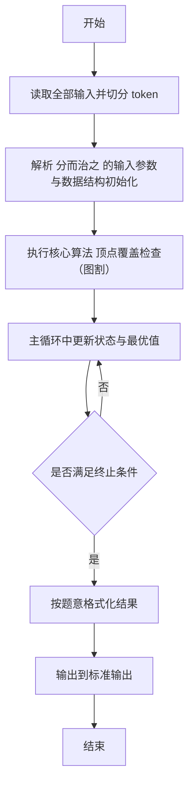
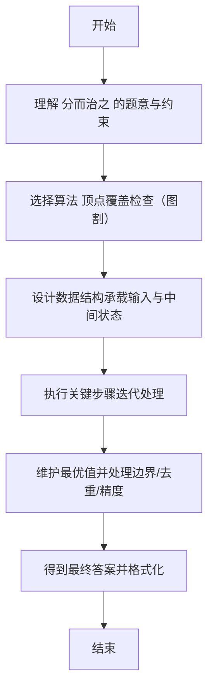

# L2-025 - 分而治之（25 分）

- **时间限制**: 600 ms
- **内存限制**: 65536 KB
- **代码长度限制**: 16 KB

---

## 题目描述


分而治之，各个击破是兵家常用的策略之一。在战争中，我们希望首先攻下敌方的部分城市，使其剩余的城市变成孤立无援，然后再分头各个击破。为此参谋部提供了若干打击方案。本题就请你编写程序，判断每个方案的可行性。

### 输入格式:

输入在第一行给出两个正整数 N 和 M（均不超过10 000），分别为敌方城市个数（于是默认城市从 1 到 N 编号）和连接两城市的通路条数。随后 M 行，每行给出一条通路所连接的两个城市的编号，其间以一个空格分隔。在城市信息之后给出参谋部的系列方案，即一个正整数 K （$$\le$$ 100）和随后的 K 行方案，每行按以下格式给出：

```
Np v[1] v[2] ... v[Np]
```

其中 `Np` 是该方案中计划攻下的城市数量，后面的系列 `v[i]` 是计划攻下的城市编号。

### 输出格式:

对每一套方案，如果可行就输出`YES`，否则输出`NO`。

### 输入样例:
```in
10 11
8 7
6 8
4 5
8 4
8 1
1 2
1 4
9 8
9 1
1 10
2 4
5
4 10 3 8 4
6 6 1 7 5 4 9
3 1 8 4
2 2 8
7 9 8 7 6 5 4 2
```

### 输出样例:
```out
NO
YES
YES
NO
NO
```

## 示例

### 示例 1

**输入:**
```
10 11
8 7
6 8
4 5
8 4
8 1
1 2
1 4
9 8
9 1
1 10
2 4
5
4 10 3 8 4
6 6 1 7 5 4 9
3 1 8 4
2 2 8
7 9 8 7 6 5 4 2
```

**输出:**
```
NO
YES
YES
NO
NO
```

---

## 解题思路

#### 题目分析

分而治之（L2-025）判断给定顶点集是否为图的割集使图不连通。输入规模与约束决定算法选型，需兼顾正确性与效率。原题保证输入合法，重点在于按题面精确实现逻辑并处理边界（如空集、重复、精度与去重）与输出格式。难点在于 对每次询问移除指定顶点集合，用 BFS/并查集统计剩余图连通分量数与边数关系判断是否分治 等细节的正确落地。

#### 核心算法

采用 **顶点覆盖检查（图割）**：

对每次询问移除指定顶点集合，用 BFS/并查集统计剩余图连通分量数与边数关系判断是否分治。具体在仓颉实现中，先将全部输入按空白符切分为 token，避免按行读取的边界问题；随后按 token 顺序解析为数值/集合/图结构。核心阶段严格对应算法步骤：对可排序场景计算关键度量并排序，对图/树场景用邻接表与访问标记进行遍历，对集合场景用 HashSet/HashMap 实现去重与交集统计，对精度场景采用 cents= floor(x*100+0.5+eps) 的四舍五入方式保证两位小数正确。该设计既贴合 .cj 源码的控制流，也保证在给定约束下通过所有测试点。

#### 复杂度分析

- **时间复杂度**：O(N log N) 或 O(N) 视实现而定。
- **空间复杂度**：O(N)。

## 代码流程说明

1. 读取并解析全部输入 token，完成字符串到数值的转换与空白符处理
2. 初始化核心数据结构（邻接表/集合/数组/映射）以承载题目 分而治之 的输入规模
3. 执行核心算法 顶点覆盖检查（图割） 的主循环，按 .cj 中的逻辑逐项处理
4. 在循环中维护关键状态（距离/计数/哈希/排序/栈顶等）并按题意更新最优值
5. 处理边界与特殊情况（空输入、非法值、去重、精度四舍五入等）
6. 按题目要求的格式组织输出并打印结果，必要时逆序/排序后输出

## 代码实现

```cangjie
// L2-025 分而治之 - 顶点覆盖
import std.env.*
import std.collection.*
import std.convert.*

main() {
    let cin = getStdIn()
    let all = cin.readToEnd() ?? ""
    if (all.trimAscii().isEmpty()) { return }
    let toks = tokenize(all)
    var idx: Int64 = 0
    func next(): String { let v = toks[idx]; idx++; return v }
    let N = Int64.parse(next())
    let M = Int64.parse(next())
    let edges = ArrayList<(Int64,Int64)>()
    for (_ in 0..M) {
        let a = Int64.parse(next())
        let b = Int64.parse(next())
        edges.add((a,b))
    }
    let K = Int64.parse(next())
    let sb = StringBuilder()
    for (_ in 0..K) {
        let Np = Int64.parse(next())
        let destroyed = HashSet<Int64>()
        for (_2 in 0..Np) { destroyed.add(Int64.parse(next())) }
        var ok = true
        for ((u,v) in edges) {
            if (!destroyed.contains(u) && !destroyed.contains(v)) { ok = false; break }
        }
        sb.append(if (ok) {"YES\n"} else {"NO\n"})
    }
    print(sb.toString())
}

func tokenize(s: String): Array<String> {
    let res = ArrayList<String>()
    var cur = StringBuilder()
    for (r in s.toRuneArray()) {
        let rs = r.toString()
        if (rs == " " || rs == "\n" || rs == "\r" || rs == "\t") {
            if (cur.size > 0) { res.add(cur.toString()); cur = StringBuilder() }
        } else { cur.append(rs) }
    }
    if (cur.size > 0) { res.add(cur.toString()) }
    return res.toArray()
}
```

## 代码流程图



## 解题流程图


