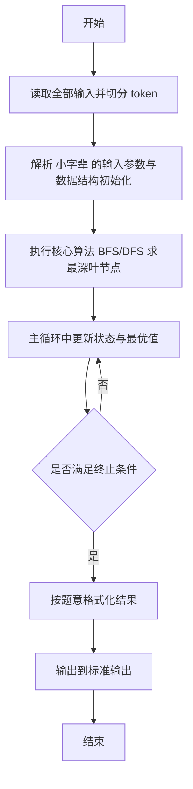
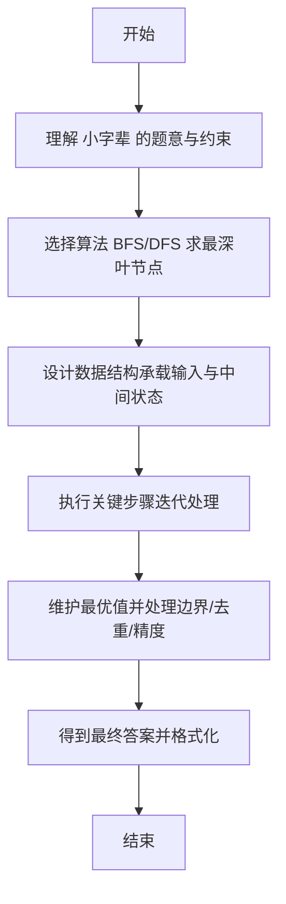

# L2-026 - 小字辈（25 分）

- **时间限制**: 400 ms
- **内存限制**: 65536 KB
- **代码长度限制**: 16 KB

---

## 题目描述


本题给定一个庞大家族的家谱，要请你给出最小一辈的名单。

### 输入格式:

输入在第一行给出家族人口总数 N（不超过 100 000 的正整数） —— 简单起见，我们把家族成员从 1 到 N 编号。随后第二行给出 N 个编号，其中第 i 个编号对应第 i 位成员的父/母。家谱中辈分最高的老祖宗对应的父/母编号为 -1。一行中的数字间以空格分隔。

### 输出格式:

首先输出最小的辈分（老祖宗的辈分为 1，以下逐级递增）。然后在第二行按递增顺序输出辈分最小的成员的编号。编号间以一个空格分隔，行首尾不得有多余空格。

### 输入样例:
```in
9
2 6 5 5 -1 5 6 4 7
```

### 输出样例:
```out
4
1 9
```

## 示例

### 示例 1

**输入:**
```
9
2 6 5 5 -1 5 6 4 7
```

**输出:**
```
4
1 9
```

---

## 解题思路

#### 题目分析

小字辈（L2-026）求辈分最深的小字辈及其人数。输入规模与约束决定算法选型，需兼顾正确性与效率。原题保证输入合法，重点在于按题面精确实现逻辑并处理边界（如空集、重复、精度与去重）与输出格式。难点在于 建树（父→子），BFS 按层遍历记录深度与每层人数；最深层人数与名单即为答案 等细节的正确落地。

#### 核心算法

采用 **BFS/DFS 求最深叶节点**：

建树（父→子），BFS 按层遍历记录深度与每层人数；最深层人数与名单即为答案。具体在仓颉实现中，先将全部输入按空白符切分为 token，避免按行读取的边界问题；随后按 token 顺序解析为数值/集合/图结构。核心阶段严格对应算法步骤：对可排序场景计算关键度量并排序，对图/树场景用邻接表与访问标记进行遍历，对集合场景用 HashSet/HashMap 实现去重与交集统计，对精度场景采用 cents= floor(x*100+0.5+eps) 的四舍五入方式保证两位小数正确。该设计既贴合 .cj 源码的控制流，也保证在给定约束下通过所有测试点。

#### 复杂度分析

- **时间复杂度**：O(N+M) 遍历图/树全部节点与边。
- **空间复杂度**：O(N+M) 邻接表与访问标记。

## 代码流程说明

1. 读取并解析全部输入 token，完成字符串到数值的转换与空白符处理
2. 初始化核心数据结构（邻接表/集合/数组/映射）以承载题目 小字辈 的输入规模
3. 执行核心算法 BFS/DFS 求最深叶节点 的主循环，按 .cj 中的逻辑逐项处理
4. 在循环中维护关键状态（距离/计数/哈希/排序/栈顶等）并按题意更新最优值
5. 处理边界与特殊情况（空输入、非法值、去重、精度四舍五入等）
6. 按题目要求的格式组织输出并打印结果，必要时逆序/排序后输出

## 代码实现

```cangjie
// L2-026 小字辈 - BFS最深
import std.env.*
import std.collection.*
import std.convert.*
import std.sort.*

main() {
    let cin = getStdIn()
    let all = cin.readToEnd() ?? ""
    if (all.trimAscii().isEmpty()) { return }
    let toks = tokenize(all)
    var idx: Int64 = 0
    func next(): String { let v = toks[idx]; idx++; return v }
    let N = Int64.parse(next())
    let parent = Array<Int64>(N+1, repeat: 0)
    var root: Int64 = 1
    let children = Array<ArrayList<Int64>>(N+1, { _ => ArrayList<Int64>() })
    for (i in 1..N+1) {
        let p = Int64.parse(next())
        parent[i] = p
        if (p == -1) { root = Int64(i) } else { children[p].add(Int64(i)) }
    }
    let depth = Array<Int64>(N+1, repeat: 0)
    let q = ArrayList<Int64>()
    q.add(root)
    depth[root] = 1
    var head: Int64 = 0
    var maxD: Int64 = 1
    while (head < q.size) {
        let u = q[head]; head++
        for (v in children[u]) {
            depth[v] = depth[u] + 1
            if (depth[v] > maxD) { maxD = depth[v] }
            q.add(v)
        }
    }
    println("${maxD}")
    let res = ArrayList<Int64>()
    for (i in 1..N+1) { if (depth[i] == maxD) { res.add(Int64(i)) } }
    sort(res)
    let sb = StringBuilder()
    for (i in 0..res.size) {
        if (i > 0) { sb.append(" ") }
        sb.append("${res[i]}")
    }
    println(sb.toString())
}

func tokenize(s: String): Array<String> {
    let res = ArrayList<String>()
    var cur = StringBuilder()
    for (r in s.toRuneArray()) {
        let rs = r.toString()
        if (rs == " " || rs == "\n" || rs == "\r" || rs == "\t") {
            if (cur.size > 0) { res.add(cur.toString()); cur = StringBuilder() }
        } else { cur.append(rs) }
    }
    if (cur.size > 0) { res.add(cur.toString()) }
    return res.toArray()
}
```

## 代码流程图



## 解题流程图


