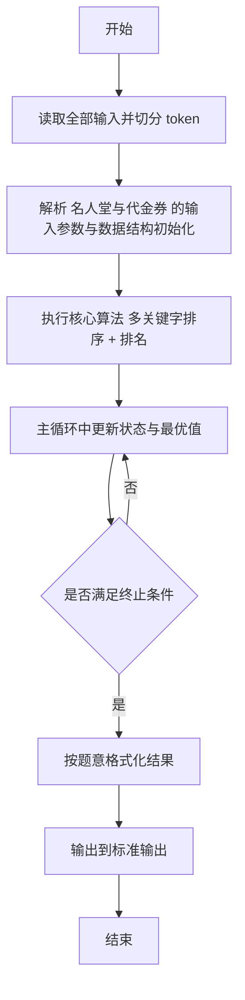
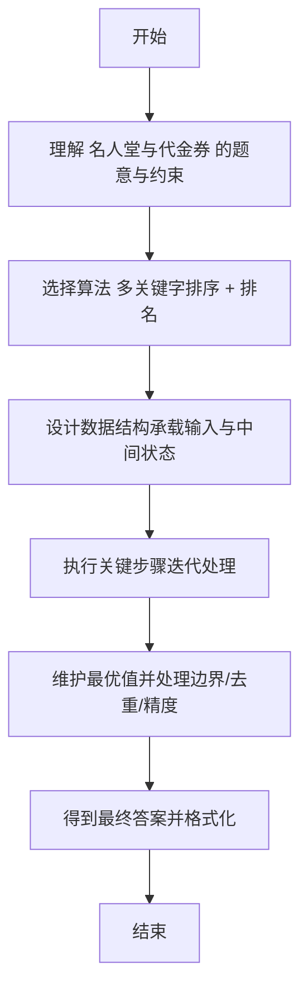

# L2-027 - 名人堂与代金券（25 分）

- **时间限制**: 150 ms
- **内存限制**: 65536 KB
- **代码长度限制**: 16 KB

---

## 题目描述


对于在中国大学MOOC（http://www.icourse163.org/ ）学习“数据结构”课程的学生，想要获得一张合格证书，总评成绩必须达到 60 分及以上，并且有另加福利：总评分在 [G, 100] 区间内者，可以得到 50 元 PAT 代金券；在 [60, G) 区间内者，可以得到 20 元PAT代金券。全国考点通用，一年有效。同时任课老师还会把总评成绩前 K 名的学生列入课程“名人堂”。本题就请你编写程序，帮助老师列出名人堂的学生，并统计一共发出了面值多少元的 PAT 代金券。

### 输入格式:

输入在第一行给出 3 个整数，分别是 N（不超过 10 000 的正整数，为学生总数）、G（在 (60,100) 区间内的整数，为题面中描述的代金券等级分界线）、K（不超过 100 且不超过 N 的正整数，为进入名人堂的最低名次）。接下来 N 行，每行给出一位学生的账号（长度不超过15位、不带空格的字符串）和总评成绩（区间 [0, 100] 内的整数），其间以空格分隔。题目保证没有重复的账号。

### 输出格式:

首先在一行中输出发出的 PAT 代金券的总面值。然后按总评成绩非升序输出进入名人堂的学生的名次、账号和成绩，其间以 1 个空格分隔。需要注意的是：成绩相同的学生享有并列的排名，排名并列时，按账号的字母序升序输出。

### 输入样例:
```in
10 80 5
cy@zju.edu.cn 78
cy@pat-edu.com 87
1001@qq.com 65
uh-oh@163.com 96
test@126.com 39
anyone@qq.com 87
zoe@mit.edu 80
jack@ucla.edu 88
bob@cmu.edu 80
ken@163.com 70
```

### 输出样例:
```out
360
1 uh-oh@163.com 96
2 jack@ucla.edu 88
3 anyone@qq.com 87
3 cy@pat-edu.com 87
5 bob@cmu.edu 80
5 zoe@mit.edu 80
```

## 示例

### 示例 1

**输入:**
```
10 80 5
cy@zju.edu.cn 78
cy@pat-edu.com 87
1001@qq.com 65
uh-oh@163.com 96
test@126.com 39
anyone@qq.com 87
zoe@mit.edu 80
jack@ucla.edu 88
bob@cmu.edu 80
ken@163.com 70
```

**输出:**
```
360
1 uh-oh@163.com 96
2 jack@ucla.edu 88
3 anyone@qq.com 87
3 cy@pat-edu.com 87
5 bob@cmu.edu 80
5 zoe@mit.edu 80
```

---

## 解题思路

#### 题目分析

名人堂与代金券（L2-027）按总分与券数排序，决出名人堂。输入规模与约束决定算法选型，需兼顾正确性与效率。原题保证输入合法，重点在于按题面精确实现逻辑并处理边界（如空集、重复、精度与去重）与输出格式。难点在于 按总分降序、代金券降序、编号升序排序；遍历计算排名，同分同名次输出 等细节的正确落地。

#### 核心算法

采用 **多关键字排序 + 排名**：

按总分降序、代金券降序、编号升序排序；遍历计算排名，同分同名次输出。具体在仓颉实现中，先将全部输入按空白符切分为 token，避免按行读取的边界问题；随后按 token 顺序解析为数值/集合/图结构。核心阶段严格对应算法步骤：对可排序场景计算关键度量并排序，对图/树场景用邻接表与访问标记进行遍历，对集合场景用 HashSet/HashMap 实现去重与交集统计，对精度场景采用 cents= floor(x*100+0.5+eps) 的四舍五入方式保证两位小数正确。该设计既贴合 .cj 源码的控制流，也保证在给定约束下通过所有测试点。

#### 复杂度分析

- **时间复杂度**：O(N log N) 排序主导，其余线性遍历。
- **空间复杂度**：O(N) 存储数组与辅助结构。

## 代码流程说明

1. 读取并解析全部输入 token，完成字符串到数值的转换与空白符处理
2. 初始化核心数据结构（邻接表/集合/数组/映射）以承载题目 名人堂与代金券 的输入规模
3. 计算关键度量（如单价、均值、亲密度）并按关键字排序
4. 在循环中维护关键状态（距离/计数/哈希/排序/栈顶等）并按题意更新最优值
5. 处理边界与特殊情况（空输入、非法值、去重、精度四舍五入等）
6. 按题目要求的格式组织输出并打印结果，必要时逆序/排序后输出

## 代码实现

```cangjie
// L2-027 名人堂与代金券 - 排序排名
import std.env.*
import std.collection.*
import std.convert.*
import std.sort.*

main() {
    let cin = getStdIn()
    let all = cin.readToEnd() ?? ""
    if (all.trimAscii().isEmpty()) { return }
    let toks = tokenize(all)
    var idx: Int64 = 0
    func next(): String { let v = toks[idx]; idx++; return v }
    let N = Int64.parse(next())
    let G = Int64.parse(next())
    let K = Int64.parse(next())
    let students = ArrayList<(String, Int64)>()
    var total: Int64 = 0
    for (_ in 0..N) {
        let name = next()
        let score = Int64.parse(next())
        students.add((name, score))
        if (score >= G) { total += 50 } else if (score >= 60) { total += 20 }
    }
    sort(students, by: { a,b =>
        if (a[1] != b[1]) {
            if (a[1] > b[1]) {Ordering.LT} else {Ordering.GT}
        } else {
            if (a[0] < b[0]) {Ordering.LT} else if (a[0] > b[0]) {Ordering.GT} else {Ordering.EQ}
        }
    })
    println("${total}")
    var rank: Int64 = 0
    var prevScore: Int64 = -1
    for (i in 0..students.size) {
        let sc = students[i][1]
        if (sc != prevScore) { rank = i + 1; prevScore = sc }
        if (rank > K) { break }
        println("${rank} ${students[i][0]} ${sc}")
    }
}

func tokenize(s: String): Array<String> {
    let res = ArrayList<String>()
    var cur = StringBuilder()
    for (r in s.toRuneArray()) {
        let rs = r.toString()
        if (rs == " " || rs == "\n" || rs == "\r" || rs == "\t") {
            if (cur.size > 0) { res.add(cur.toString()); cur = StringBuilder() }
        } else { cur.append(rs) }
    }
    if (cur.size > 0) { res.add(cur.toString()) }
    return res.toArray()
}
```

## 代码流程图



## 解题流程图


