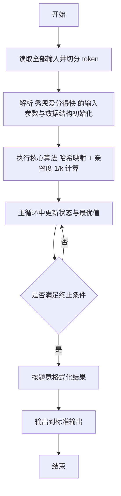
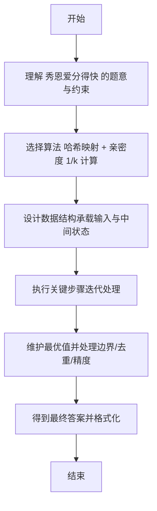

# L2-028 - 秀恩爱分得快（25 分）

- **时间限制**: 500 ms
- **内存限制**: 65536 KB
- **代码长度限制**: 16 KB

---

## 题目描述


古人云：秀恩爱，分得快。

互联网上每天都有大量人发布大量照片，我们通过分析这些照片，可以分析人与人之间的亲密度。如果一张照片上出现了 K 个人，这些人两两间的亲密度就被定义为 1/K。任意两个人如果同时出现在若干张照片里，他们之间的亲密度就是所有这些同框照片对应的亲密度之和。下面给定一批照片，请你分析一对给定的情侣，看看他们分别有没有亲密度更高的异性朋友？

### 输入格式:

输入在第一行给出 2 个正整数：N（不超过1000，为总人数——简单起见，我们把所有人从 0 到 N-1 编号。为了区分性别，我们用编号前的负号表示女性）和 M（不超过1000，为照片总数）。随后 M 行，每行给出一张照片的信息，格式如下：

```
K P[1] ... P[K]
```

其中 K（$$\le$$ 500）是该照片中出现的人数，P[1] ~ P[K] 就是这些人的编号。最后一行给出一对异性情侣的编号 A 和 B。同行数字以空格分隔。题目保证每个人只有一个性别，并且不会在同一张照片里出现多次。

### 输出格式:

首先输出 `A PA`，其中 `PA` 是与 `A` 最亲密的异性。如果 `PA` 不唯一，则按他们编号的绝对值递增输出；然后类似地输出 `B PB`。但如果 `A` 和 `B` 正是彼此亲密度最高的一对，则只输出他们的编号，无论是否还有其他人并列。

### 输入样例 1：
```in
10 4
4 -1 2 -3 4
4 2 -3 -5 -6
3 2 4 -5
3 -6 0 2
-3 2
```

### 输出样例 1：
```out
-3 2
2 -5
2 -6
```

### 输入样例 2：
```in
4 4
4 -1 2 -3 0
2 0 -3
2 2 -3
2 -1 2 
-3 2
```

### 输出样例 2：
```out
-3 2
```

## 示例

### 示例 1

**输入:**
```
10 4
4 -1 2 -3 4
4 2 -3 -5 -6
3 2 4 -5
3 -6 0 2
-3 2
```

**输出:**
```
-3 2
2 -5
2 -6
```

### 示例 2

**输入:**
```
4 4
4 -1 2 -3 0
2 0 -3
2 2 -3
2 -1 2 
-3 2
```

**输出:**
```
-3 2
```

---

## 解题思路

#### 题目分析

秀恩爱分得快（L2-028）求与给定人亲密度最大的人。输入规模与约束决定算法选型，需兼顾正确性与效率。原题保证输入合法，重点在于按题面精确实现逻辑并处理边界（如空集、重复、精度与去重）与输出格式。难点在于 对每张照片人数 k，照片内任意两人亲密度累加 1/k；用 HashMap 统计与查询对象相关的亲密度，找出最大值对应的性 等细节的正确落地。

#### 核心算法

采用 **哈希映射 + 亲密度 1/k 计算**：

对每张照片人数 k，照片内任意两人亲密度累加 1/k；用 HashMap 统计与查询对象相关的亲密度，找出最大值对应的性别分组输出。具体在仓颉实现中，先将全部输入按空白符切分为 token，避免按行读取的边界问题；随后按 token 顺序解析为数值/集合/图结构。核心阶段严格对应算法步骤：对可排序场景计算关键度量并排序，对图/树场景用邻接表与访问标记进行遍历，对集合场景用 HashSet/HashMap 实现去重与交集统计，对精度场景采用 cents= floor(x*100+0.5+eps) 的四舍五入方式保证两位小数正确。该设计既贴合 .cj 源码的控制流，也保证在给定约束下通过所有测试点。

#### 复杂度分析

- **时间复杂度**：O(N) 平均哈希操作线性。
- **空间复杂度**：O(N) 哈希集合/映射。

## 代码流程说明

1. 读取并解析全部输入 token，完成字符串到数值的转换与空白符处理
2. 初始化核心数据结构（邻接表/集合/数组/映射）以承载题目 秀恩爱分得快 的输入规模
3. 执行核心算法 哈希映射 + 亲密度 1/k 计算 的主循环，按 .cj 中的逻辑逐项处理
4. 在循环中维护关键状态（距离/计数/哈希/排序/栈顶等）并按题意更新最优值
5. 处理边界与特殊情况（空输入、非法值、去重、精度四舍五入等）
6. 按题目要求的格式组织输出并打印结果，必要时逆序/排序后输出

## 代码实现

```cangjie
// L2-028 秀恩爱分得快 - 亲密度1/K
import std.env.*
import std.collection.*
import std.convert.*
import std.sort.*

main() {
    let cin = getStdIn()
    let all = cin.readToEnd() ?? ""
    if (all.trimAscii().isEmpty()) { return }
    let toks = tokenize(all)
    var idx: Int64 = 0
    func next(): String { let v = toks[idx]; idx++; return v }
    let N = Int64.parse(next())
    let M = Int64.parse(next())
    let intimacy = HashMap<String, Float64>()
    func isFemale(s: String): Bool { return s.size > 0 && s[0] == 45 }
    func absVal(s: String): Int64 {
        let a = if (isFemale(s)) { s[1..s.size] } else { s }
        return if (a.isEmpty()) {0} else {Int64.parse(a)}
    }
    func makeKey(a: String, b: String): String {
        return if (a < b) {"${a},${b}"} else {"${b},${a}"}
    }
    for (_ in 0..M) {
        let K = Int64.parse(next())
        let people = ArrayList<String>()
        for (_2 in 0..K) { people.add(next()) }
        let w = 1.0 / Float64(K)
        for (i in 0..K) {
            for (j in i+1..K) {
                let p1 = people[i]
                let p2 = people[j]
                if (isFemale(p1) == isFemale(p2)) { continue }
                let key = makeKey(p1,p2)
                let cur = intimacy.get(key) ?? 0.0
                intimacy[key] = cur + w
            }
        }
    }
    let A = next()
    let B = next()
    var bestA = ArrayList<String>()
    var bestB = ArrayList<String>()
    var maxA: Float64 = -1.0
    var maxB: Float64 = -1.0
    for ((k,v) in intimacy) {
        let opt = k.indexOf(",")
        if (let None <- opt) { continue }
        let comma = opt.getOrThrow()
        let x = k[0..comma]
        let y = k[comma+1..k.size]
        if (x == A || y == A) {
            let other = if (x == A) {y} else {x}
            if (v > maxA + 1e-9) {
                maxA = v
                bestA = ArrayList<String>()
                bestA.add(other)
            } else if (v - maxA < 1e-9 && maxA - v < 1e-9) {
                bestA.add(other)
            }
        }
        if (x == B || y == B) {
            let other = if (x == B) {y} else {x}
            if (v > maxB + 1e-9) {
                maxB = v
                bestB = ArrayList<String>()
                bestB.add(other)
            } else if (v - maxB < 1e-9 && maxB - v < 1e-9) {
                bestB.add(other)
            }
        }
    }
    func contains(arr: ArrayList<String>, val: String): Bool {
        for (x in arr) { if (x == val) { return true } }
        return false
    }
    let aHasB = contains(bestA, B)
    let bHasA = contains(bestB, A)
    if (aHasB && bHasA) {
        println("${A} ${B}")
        return
    }
    sort(bestA, by: { a,b => if (absVal(a) < absVal(b)) {Ordering.LT} else if (absVal(a) > absVal(b)) {Ordering.GT} else {Ordering.EQ} })
    sort(bestB, by: { a,b => if (absVal(a) < absVal(b)) {Ordering.LT} else if (absVal(a) > absVal(b)) {Ordering.GT} else {Ordering.EQ} })
    let sb = StringBuilder()
    for (p in bestA) { sb.append("${A} ${p}\n") }
    for (p in bestB) { sb.append("${B} ${p}\n") }
    print(sb.toString())
}

func tokenize(s: String): Array<String> {
    let res = ArrayList<String>()
    var cur = StringBuilder()
    for (r in s.toRuneArray()) {
        let rs = r.toString()
        if (rs == " " || rs == "\n" || rs == "\r" || rs == "\t") {
            if (cur.size > 0) { res.add(cur.toString()); cur = StringBuilder() }
        } else { cur.append(rs) }
    }
    if (cur.size > 0) { res.add(cur.toString()) }
    return res.toArray()
}
```

## 代码流程图



## 解题流程图


