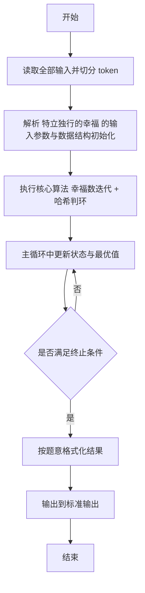
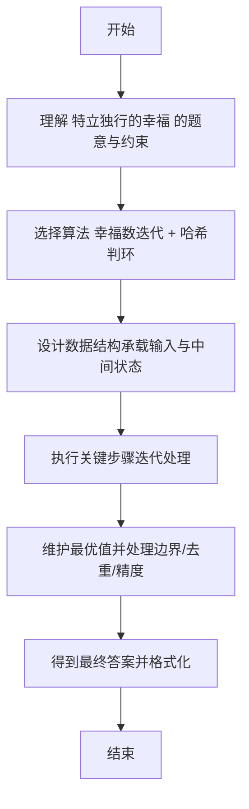

# L2-029 - 特立独行的幸福（25 分）

- **时间限制**: 400 ms
- **内存限制**: 65536 KB
- **代码长度限制**: 16 KB

---

## 题目描述


对一个十进制数的各位数字做一次平方和，称作一次迭代。如果一个十进制数能通过若干次迭代得到 1，就称该数为幸福数。1 是一个幸福数。此外，例如 19 经过 1 次迭代得到 82，2 次迭代后得到 68，3 次迭代后得到 100，最后得到 1。则 19 就是幸福数。显然，在一个幸福数迭代到 1 的过程中经过的数字都是幸福数，它们的幸福是依附于初始数字的。例如 82、68、100 的幸福是依附于 19 的。而一个**特立独行**的幸福数，是在一个有限的区间内不依附于任何其它数字的；其**独立性**就是依附于它的的幸福数的个数。如果这个数还是个素数，则其独立性加倍。例如 19 在区间[1, 100] 内就是一个特立独行的幸福数，其独立性为 $$2\times 4 = 8$$。

另一方面，如果一个大于1的数字经过数次迭代后进入了死循环，那这个数就不幸福。例如 29 迭代得到 85、89、145、42、20、4、16、37、58、89、…… 可见 89 到 58 形成了死循环，所以 29 就不幸福。

本题就要求你编写程序，列出给定区间内的所有特立独行的幸福数和它的独立性。

### 输入格式:

输入在第一行给出闭区间的两个端点：$$1<A<B\le 10^4$$。

### 输出格式:

按递增顺序列出给定闭区间 $$[A,B]$$ 内的所有特立独行的幸福数和它的独立性。每对数字占一行，数字间以 1 个空格分隔。

如果区间内没有幸福数，则在一行中输出 `SAD`。

### 输入样例 1：
```in
10 40
```

### 输出样例 1：
```out
19 8
23 6
28 3
31 4
32 3
```

### 输入样例 2：
```in
110 120
```

### 输出样例 2：
```out
SAD
```

## 示例

### 示例 1

**输入:**
```
10 40
```

**输出:**
```
19 8
23 6
28 3
31 4
32 3
```

### 示例 2

**输入:**
```
110 120
```

**输出:**
```
SAD
```

---

## 解题思路

#### 题目分析

特立独行的幸福（L2-029）判断区间内幸福数及其独立性。输入规模与约束决定算法选型，需兼顾正确性与效率。原题保证输入合法，重点在于按题面精确实现逻辑并处理边界（如空集、重复、精度与去重）与输出格式。难点在于 对每个数模拟求各位平方和迭代，用 HashSet 判环直到 1 或循环；记录步数与是否依赖于其他幸福数 等细节的正确落地。

#### 核心算法

采用 **幸福数迭代 + 哈希判环**：

对每个数模拟求各位平方和迭代，用 HashSet 判环直到 1 或循环；记录步数与是否依赖于其他幸福数。具体在仓颉实现中，先将全部输入按空白符切分为 token，避免按行读取的边界问题；随后按 token 顺序解析为数值/集合/图结构。核心阶段严格对应算法步骤：对可排序场景计算关键度量并排序，对图/树场景用邻接表与访问标记进行遍历，对集合场景用 HashSet/HashMap 实现去重与交集统计，对精度场景采用 cents= floor(x*100+0.5+eps) 的四舍五入方式保证两位小数正确。该设计既贴合 .cj 源码的控制流，也保证在给定约束下通过所有测试点。

#### 复杂度分析

- **时间复杂度**：O(N) 平均哈希操作线性。
- **空间复杂度**：O(N) 哈希集合/映射。

## 代码流程说明

1. 读取并解析全部输入 token，完成字符串到数值的转换与空白符处理
2. 初始化核心数据结构（邻接表/集合/数组/映射）以承载题目 特立独行的幸福 的输入规模
3. 执行核心算法 幸福数迭代 + 哈希判环 的主循环，按 .cj 中的逻辑逐项处理
4. 在循环中维护关键状态（距离/计数/哈希/排序/栈顶等）并按题意更新最优值
5. 处理边界与特殊情况（空输入、非法值、去重、精度四舍五入等）
6. 按题目要求的格式组织输出并打印结果，必要时逆序/排序后输出

## 代码实现

```cangjie
// L2-029 特立独行的幸福 - 幸福数迭代
import std.env.*
import std.collection.*
import std.convert.*
import std.sort.*

main() {
    let cin = getStdIn()
    let all = cin.readToEnd() ?? ""
    if (all.trimAscii().isEmpty()) { return }
    let toks = tokenize(all)
    var idx: Int64 = 0
    func next(): String { let v = toks[idx]; idx++; return v }
    let A = Int64.parse(next())
    let B = Int64.parse(next())
    let isHappy = HashMap<Int64, Bool>()
    let chainMap = HashMap<Int64, ArrayList<Int64>>()
    let lenMap = HashMap<Int64, Int64>()
    for (n in A..B+1) {
        let res = checkHappy(n)
        let happy = res[0]
        let chain = res[1]
        if (happy) {
            isHappy[n] = true
            chainMap[n] = chain
            lenMap[n] = chain.size
        } else {
            isHappy[n] = false
        }
    }
    let dependent = HashSet<Int64>()
    for ((m, ch) in chainMap) {
        for (i in 1..ch.size) { dependent.add(ch[i]) }
    }
    let resList = ArrayList<(Int64,Int64)>()
    for (n in A..B+1) {
        if (!(isHappy.get(n) ?? false)) { continue }
        if (dependent.contains(n)) { continue }
        var cnt = lenMap.get(n) ?? 0
        if (isPrime(n)) { cnt *= 2 }
        resList.add((n, cnt))
    }
    if (resList.size == 0) {
        println("SAD")
    } else {
        sort(resList, by: { a,b => if (a[0] < b[0]) {Ordering.LT} else if (a[0] > b[0]) {Ordering.GT} else {Ordering.EQ} })
        for ((n,c) in resList) { println("${n} ${c}") }
    }
}

func checkHappy(n: Int64): (Bool, ArrayList<Int64>) {
    var cur = n
    let seen = HashSet<Int64>()
    let chain = ArrayList<Int64>()
    while (true) {
        if (cur == 1) { return (true, chain) }
        if (seen.contains(cur)) { return (false, chain) }
        seen.add(cur)
        chain.add(cur)
        cur = digitSquareSum(cur)
        if (chain.size > 1000) { return (false, chain) }
    }
    return (false, chain)
}

func digitSquareSum(n: Int64): Int64 {
    var s: Int64 = 0
    var x = n
    if (x == 0) { return 0 }
    while (x > 0) {
        let d = x % 10
        s += d * d
        x /= 10
    }
    return s
}

func isPrime(n: Int64): Bool {
    if (n < 2) { return false }
    if (n == 2) { return true }
    if (n % 2 == 0) { return false }
    var i: Int64 = 3
    while (i * i <= n) {
        if (n % i == 0) { return false }
        i += 2
    }
    return true
}

func tokenize(s: String): Array<String> {
    let res = ArrayList<String>()
    var cur = StringBuilder()
    for (r in s.toRuneArray()) {
        let rs = r.toString()
        if (rs == " " || rs == "\n" || rs == "\r" || rs == "\t") {
            if (cur.size > 0) { res.add(cur.toString()); cur = StringBuilder() }
        } else { cur.append(rs) }
    }
    if (cur.size > 0) { res.add(cur.toString()) }
    return res.toArray()
}
```

## 代码流程图



## 解题流程图


