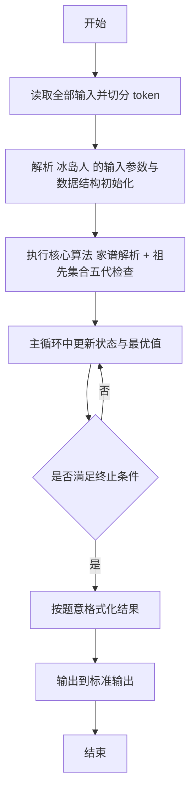
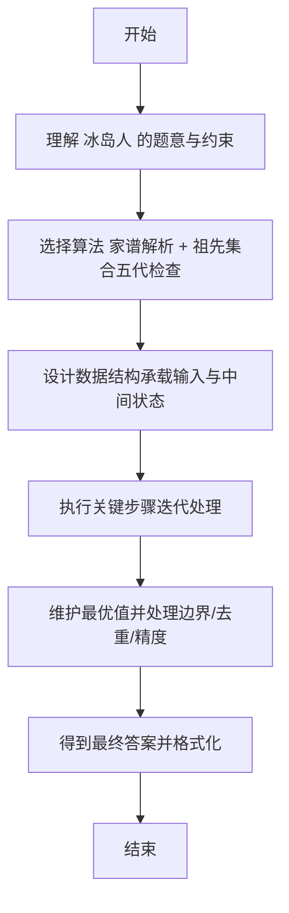

# L2-030 - 冰岛人（25 分）

- **时间限制**: 400 ms
- **内存限制**: 65536 KB
- **代码长度限制**: 16 KB

---

## 题目描述


2018年世界杯，冰岛队因1:1平了强大的阿根廷队而一战成名。好事者发现冰岛人的名字后面似乎都有个“松”（son），于是有网友科普如下：


冰岛人沿用的是维京人古老的父系姓制，孩子的姓等于父亲的名加后缀，如果是儿子就加 sson，女儿则加 sdottir。因为冰岛人口较少，为避免近亲繁衍，本地人交往前先用个 App 查一下两人祖宗若干代有无联系。本题就请你实现这个 App 的功能。

### 输入格式:

输入首先在第一行给出一个正整数 $$N$$（$$1 < N \le 10^5$$），为当地人口数。随后 $$N$$ 行，每行给出一个人名，格式为：`名 姓（带性别后缀）`，两个字符串均由不超过 20 个小写的英文字母组成。维京人后裔是可以通过姓的后缀判断其性别的，其他人则是在姓的后面加 `m` 表示男性、`f` 表示女性。题目保证给出的每个维京家族的起源人都是男性。

随后一行给出正整数 $$M$$，为查询数量。随后 $$M$$ 行，每行给出一对人名，格式为：`名1 姓1 名2 姓2`。注意：这里的`姓`是不带后缀的。四个字符串均由不超过 20 个小写的英文字母组成。

题目保证不存在两个人是同名的。

### 输出格式:

对每一个查询，根据结果在一行内显示以下信息：

- 若两人为异性，且五代以内无公共祖先，则输出 `Yes`；
- 若两人为异性，但五代以内（不包括第五代）有公共祖先，则输出 `No`；
- 若两人为同性，则输出 `Whatever`；
- 若有一人不在名单内，则输出 `NA`。

所谓“五代以内无公共祖先”是指两人的公共祖先（如果存在的话）必须比任何一方的曾祖父辈分高。

### 输入样例:
```in
15
chris smithm
adam smithm
bob adamsson
jack chrissson
bill chrissson
mike jacksson
steve billsson
tim mikesson
april mikesdottir
eric stevesson
tracy timsdottir
james ericsson
patrick jacksson
robin patricksson
will robinsson
6
tracy tim james eric
will robin tracy tim
april mike steve bill
bob adam eric steve
tracy tim tracy tim
x man april mikes
```

### 输出样例:
```out
Yes
No
No
Whatever
Whatever
NA
```

## 示例

### 示例 1

**输入:**
```
15
chris smithm
adam smithm
bob adamsson
jack chrissson
bill chrissson
mike jacksson
steve billsson
tim mikesson
april mikesdottir
eric stevesson
tracy timsdottir
james ericsson
patrick jacksson
robin patricksson
will robinsson
6
tracy tim james eric
will robin tracy tim
april mike steve bill
bob adam eric steve
tracy tim tracy tim
x man april mikes
```

**输出:**
```
Yes
No
No
Whatever
Whatever
NA
```

---

## 解题思路

#### 题目分析

冰岛人（L2-030）冰岛人姓名解析判断是否可婚。输入规模与约束决定算法选型，需兼顾正确性与效率。原题保证输入合法，重点在于按题面精确实现逻辑并处理边界（如空集、重复、精度与去重）与输出格式。难点在于 解析姓氏后缀判断性别，提取父系链；BFS 向上收集五代祖先；检查两人祖先是否有交集决定输出 等细节的正确落地。

#### 核心算法

采用 **家谱解析 + 祖先集合五代检查**：

解析姓氏后缀判断性别，提取父系链；BFS 向上收集五代祖先；检查两人祖先是否有交集决定输出。具体在仓颉实现中，先将全部输入按空白符切分为 token，避免按行读取的边界问题；随后按 token 顺序解析为数值/集合/图结构。核心阶段严格对应算法步骤：对可排序场景计算关键度量并排序，对图/树场景用邻接表与访问标记进行遍历，对集合场景用 HashSet/HashMap 实现去重与交集统计，对精度场景采用 cents= floor(x*100+0.5+eps) 的四舍五入方式保证两位小数正确。该设计既贴合 .cj 源码的控制流，也保证在给定约束下通过所有测试点。

#### 复杂度分析

- **时间复杂度**：O(N log N) 或 O(N) 视实现而定。
- **空间复杂度**：O(N)。

## 代码流程说明

1. 读取并解析全部输入 token，完成字符串到数值的转换与空白符处理
2. 初始化核心数据结构（邻接表/集合/数组/映射）以承载题目 冰岛人 的输入规模
3. 执行核心算法 家谱解析 + 祖先集合五代检查 的主循环，按 .cj 中的逻辑逐项处理
4. 在循环中维护关键状态（距离/计数/哈希/排序/栈顶等）并按题意更新最优值
5. 处理边界与特殊情况（空输入、非法值、去重、精度四舍五入等）
6. 按题目要求的格式组织输出并打印结果，必要时逆序/排序后输出

## 代码实现

```cangjie
// L2-030 冰岛人 - 维京姓氏五代判定(不含第五代)
import std.env.*
import std.collection.*
import std.convert.*
import std.sort.*

main() {
    let cin = getStdIn()
    let all = cin.readToEnd() ?? ""
    if (all.trimAscii().isEmpty()) { return }
    let toks = tokenize(all)
    var idx: Int64 = 0
    func next(): String { let v = toks[idx]; idx++; return v }
    let N = Int64.parse(next())
    let gender = HashMap<String, String>()
    let parentName = HashMap<String, String>()
    for (_ in 0..N) {
        let first = next()
        let last = next()
        var g = ""
        var father = ""
        if (last.endsWith("sson")) {
            g = "m"
            father = last[0..(last.size - 4)]
        } else if (last.endsWith("sdottir")) {
            g = "f"
            father = last[0..(last.size - 7)]
        } else if (last.endsWith("m")) {
            g = "m"
            father = ""
        } else if (last.endsWith("f")) {
            g = "f"
            father = ""
        }
        gender[first] = g
        parentName[first] = father
    }
    let M = Int64.parse(next())
    let sb = StringBuilder()
    for (_ in 0..M) {
        let fn1 = next()
        let ln1 = next()
        let fn2 = next()
        let ln2 = next()
        if (!gender.contains(fn1) || !gender.contains(fn2)) {
            sb.append("NA\n")
            continue
        }
        let g1 = gender[fn1]
        let g2 = gender[fn2]
        if (g1 == g2) {
            sb.append("Whatever\n")
            continue
        }
        let anc1 = HashMap<String,Int64>()
        let anc2 = HashMap<String,Int64>()
        collect(fn1, 0, parentName, anc1)
        collect(fn2, 0, parentName, anc2)
        var forbid = false
        for ((k, d1) in anc1) {
            let opt = anc2.get(k)
            if (let Some(v) <- opt) {
                if (d1 <= 3 && v <= 3) { forbid = true; break }
            }
        }
        sb.append(if (forbid) {"No\n"} else {"Yes\n"})
    }
    print(sb.toString())
}

func collect(name: String, d: Int64, parent: HashMap<String,String>, res: HashMap<String,Int64>): Unit {
    if (d >= 5) { return }
    if (!parent.contains(name)) {
        res[name] = d
        return
    }
    let old = res.get(name)
    if (let Some(v) <- old) { if (v <= d) { return } }
    res[name] = d
    let f = parent.get(name) ?? ""
    if (!f.isEmpty()) { collect(f, d+1, parent, res) }
}

func tokenize(s: String): Array<String> {
    let res = ArrayList<String>()
    var cur = StringBuilder()
    for (r in s.toRuneArray()) {
        let rs = r.toString()
        if (rs == " " || rs == "\n" || rs == "\r" || rs == "\t") {
            if (cur.size > 0) { res.add(cur.toString()); cur = StringBuilder() }
        } else { cur.append(rs) }
    }
    if (cur.size > 0) { res.add(cur.toString()) }
    return res.toArray()
}
```

## 代码流程图



## 解题流程图


