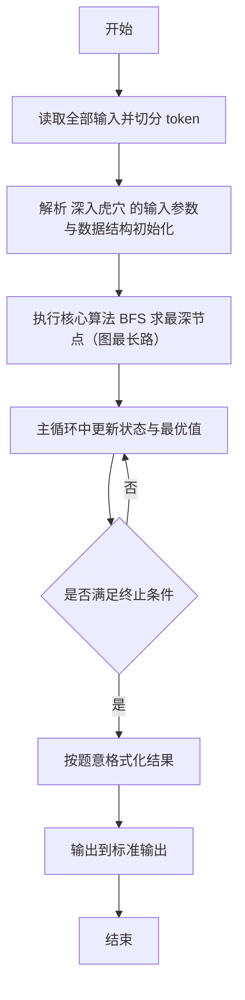
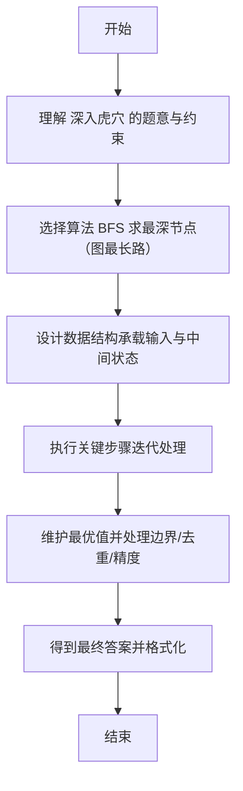

# L2-031 - 深入虎穴（25 分）

- **时间限制**: 400 ms
- **内存限制**: 65536 KB
- **代码长度限制**: 16 KB

---

## 题目描述


著名的王牌间谍 007 需要执行一次任务，获取敌方的机密情报。已知情报藏在一个地下迷宫里，迷宫只有一个入口，里面有很多条通路，每条路通向一扇门。每一扇门背后或者是一个房间，或者又有很多条路，同样是每条路通向一扇门…… 他的手里有一张表格，是其他间谍帮他收集到的情报，他们记下了每扇门的编号，以及这扇门背后的每一条通路所到达的门的编号。007 发现不存在两条路通向同一扇门。

内线告诉他，情报就藏在迷宫的最深处。但是这个迷宫太大了，他需要你的帮助 —— 请编程帮他找出距离入口最远的那扇门。

### 输入格式:

输入首先在一行中给出正整数 $$N$$（$$< 10^5$$），是门的数量。最后 $$N$$ 行，第 $$i$$ 行（$$1\le i \le N$$）按以下格式描述编号为 $$i$$ 的那扇门背后能通向的门：

```
K D[1] D[2] ... D[K]
```
其中 `K` 是通道的数量，其后是每扇门的编号。

### 输出格式:

在一行中输出距离入口最远的那扇门的编号。题目保证这样的结果是唯一的。

### 输入样例:
```in
13
3 2 3 4
2 5 6
1 7
1 8
1 9
0
2 11 10
1 13
0
0
1 12
0
0
```

### 输出样例:
```out
12
```

## 示例

### 示例 1

**输入:**
```
13
3 2 3 4
2 5 6
1 7
1 8
1 9
0
2 11 10
1 13
0
0
1 12
0
0
```

**输出:**
```
12
```

---

## 解题思路

#### 题目分析

深入虎穴（L2-031）在有向图中求离入口最远的门。输入规模与约束决定算法选型，需兼顾正确性与效率。原题保证输入合法，重点在于按题面精确实现逻辑并处理边界（如空集、重复、精度与去重）与输出格式。难点在于 建有向邻接表，BFS 从 1 开始分层遍历，记录最后访问层即为最深虎穴 等细节的正确落地。

#### 核心算法

采用 **BFS 求最深节点（图最长路）**：

建有向邻接表，BFS 从 1 开始分层遍历，记录最后访问层即为最深虎穴。具体在仓颉实现中，先将全部输入按空白符切分为 token，避免按行读取的边界问题；随后按 token 顺序解析为数值/集合/图结构。核心阶段严格对应算法步骤：对可排序场景计算关键度量并排序，对图/树场景用邻接表与访问标记进行遍历，对集合场景用 HashSet/HashMap 实现去重与交集统计，对精度场景采用 cents= floor(x*100+0.5+eps) 的四舍五入方式保证两位小数正确。该设计既贴合 .cj 源码的控制流，也保证在给定约束下通过所有测试点。

#### 复杂度分析

- **时间复杂度**：O(N+M) 遍历图/树全部节点与边。
- **空间复杂度**：O(N+M) 邻接表与访问标记。

## 代码流程说明

1. 读取并解析全部输入 token，完成字符串到数值的转换与空白符处理
2. 初始化核心数据结构（邻接表/集合/数组/映射）以承载题目 深入虎穴 的输入规模
3. 执行核心算法 BFS 求最深节点（图最长路） 的主循环，按 .cj 中的逻辑逐项处理
4. 在循环中维护关键状态（距离/计数/哈希/排序/栈顶等）并按题意更新最优值
5. 处理边界与特殊情况（空输入、非法值、去重、精度四舍五入等）
6. 按题目要求的格式组织输出并打印结果，必要时逆序/排序后输出

## 代码实现

```cangjie
// L2-031 深入虎穴 - 最深门
import std.env.*
import std.collection.*
import std.convert.*

main() {
    let cin = getStdIn()
    let all = cin.readToEnd() ?? ""
    if (all.trimAscii().isEmpty()) { return }
    let toks = tokenize(all)
    var idx: Int64 = 0
    func next(): String { let v = toks[idx]; idx++; return v }
    let N = Int64.parse(next())
    let children = Array<ArrayList<Int64>>(N+1, { _ => ArrayList<Int64>() })
    let indeg = Array<Int64>(N+1, repeat: 0)
    for (i in 1..N+1) {
        let K = Int64.parse(next())
        for (_ in 0..K) {
            let d = Int64.parse(next())
            children[i].add(d)
            indeg[d] += 1
        }
    }
    var root: Int64 = 1
    for (i in 1..N+1) { if (indeg[i] == 0) { root = Int64(i); break } }
    let depth = Array<Int64>(N+1, repeat: 0)
    let q = ArrayList<Int64>()
    q.add(root)
    depth[root] = 1
    var head: Int64 = 0
    while (head < q.size) {
        let u = q[head]; head++
        for (v in children[u]) {
            depth[v] = depth[u] + 1
            q.add(v)
        }
    }
    var best = root
    var md = depth[root]
    for (i in 1..N+1) {
        if (depth[i] > md) { md = depth[i]; best = Int64(i) }
    }
    println("${best}")
}

func tokenize(s: String): Array<String> {
    let res = ArrayList<String>()
    var cur = StringBuilder()
    for (r in s.toRuneArray()) {
        let rs = r.toString()
        if (rs == " " || rs == "\n" || rs == "\r" || rs == "\t") {
            if (cur.size > 0) { res.add(cur.toString()); cur = StringBuilder() }
        } else { cur.append(rs) }
    }
    if (cur.size > 0) { res.add(cur.toString()) }
    return res.toArray()
}
```

## 代码流程图



## 解题流程图


