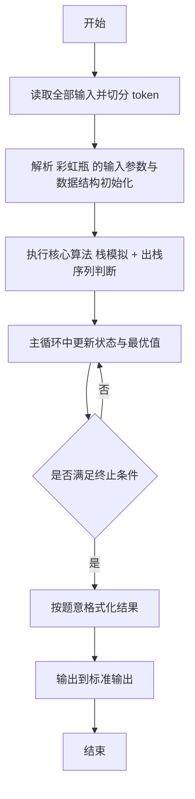
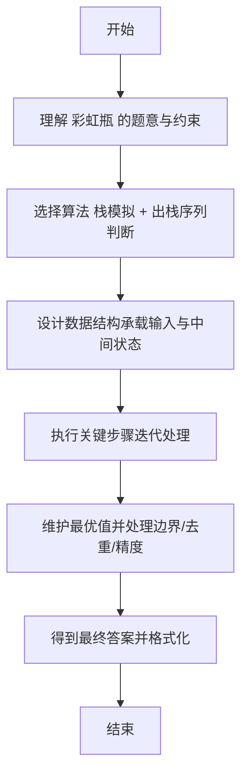

# L2-032 - 彩虹瓶（25 分）

- **时间限制**: 400 ms
- **内存限制**: 65536 KB
- **代码长度限制**: 16 KB

---

## 题目描述


彩虹瓶的制作过程（并不）是这样的：先把一大批空瓶铺放在装填场地上，然后按照一定的顺序将每种颜色的小球均匀撒到这批瓶子里。

假设彩虹瓶里要按顺序装 N 种颜色的小球（不妨将顺序就编号为 1 到 N）。现在工厂里有每种颜色的小球各一箱，工人需要一箱一箱地将小球从工厂里搬到装填场地。如果搬来的这箱小球正好是可以装填的颜色，就直接拆箱装填；如果不是，就把箱子先码放在一个临时货架上，码放的方法就是一箱一箱堆上去。当一种颜色装填完以后，先看看货架顶端的一箱是不是下一个要装填的颜色，如果是就取下来装填，否则去工厂里再搬一箱过来。

如果工厂里发货的顺序比较好，工人就可以顺利地完成装填。例如要按顺序装填 7 种颜色，工厂按照 7、6、1、3、2、5、4 这个顺序发货，则工人先拿到 7、6 两种不能装填的颜色，将其按照 7 在下、6 在上的顺序堆在货架上；拿到 1 时可以直接装填；拿到 3 时又得临时码放在 6 号颜色箱上；拿到 2 时可以直接装填；随后从货架顶取下 3 进行装填；然后拿到 5，临时码放到 6 上面；最后取了 4 号颜色直接装填；剩下的工作就是顺序从货架上取下 5、6、7 依次装填。

但如果工厂按照 3、1、5、4、2、6、7 这个顺序发货，工人就必须要愤怒地折腾货架了，因为装填完 2 号颜色以后，不把货架上的多个箱子搬下来就拿不到 3 号箱，就不可能顺利完成任务。

另外，货架的容量有限，如果要堆积的货物超过容量，工人也没办法顺利完成任务。例如工厂按照 7、6、5、4、3、2、1 这个顺序发货，如果货架够高，能码放 6 只箱子，那还是可以顺利完工的；但如果货架只能码放 5 只箱子，工人就又要愤怒了……

本题就请你判断一下，工厂的发货顺序能否让工人顺利完成任务。

### 输入格式:

输入首先在第一行给出 3 个正整数，分别是彩虹瓶的颜色数量 $$N$$（$$1 < N \le 10^3$$）、临时货架的容量 $$M$$（$$< N$$）、以及需要判断的发货顺序的数量 $$K$$。

随后 $$K$$ 行，每行给出 $$N$$ 个数字，是 1 到$$N$$ 的一个排列，对应工厂的发货顺序。

一行中的数字都以空格分隔。

### 输出格式:

对每个发货顺序，如果工人可以愉快完工，就在一行中输出 `YES`；否则输出 `NO`。

### 输入样例:
```in
7 5 3
7 6 1 3 2 5 4
3 1 5 4 2 6 7
7 6 5 4 3 2 1
```

### 输出样例:
```out
YES
NO
NO
```

## 示例

### 示例 1

**输入:**
```
7 5 3
7 6 1 3 2 5 4
3 1 5 4 2 6 7
7 6 5 4 3 2 1
```

**输出:**
```
YES
NO
NO
```

---

## 解题思路

#### 题目分析

彩虹瓶（L2-032）判断给定出栈序列是否可由入栈序列通过栈实现。输入规模与约束决定算法选型，需兼顾正确性与效率。原题保证输入合法，重点在于按题面精确实现逻辑并处理边界（如空集、重复、精度与去重）与输出格式。难点在于 用栈模拟：按入栈顺序压栈，每步检查栈顶是否等于出栈指针指向元素，相等则弹出并后移指针；最终指针是否走完判定 等细节的正确落地。

#### 核心算法

采用 **栈模拟 + 出栈序列判断**：

用栈模拟：按入栈顺序压栈，每步检查栈顶是否等于出栈指针指向元素，相等则弹出并后移指针；最终指针是否走完判定。具体在仓颉实现中，先将全部输入按空白符切分为 token，避免按行读取的边界问题；随后按 token 顺序解析为数值/集合/图结构。核心阶段严格对应算法步骤：对可排序场景计算关键度量并排序，对图/树场景用邻接表与访问标记进行遍历，对集合场景用 HashSet/HashMap 实现去重与交集统计，对精度场景采用 cents= floor(x*100+0.5+eps) 的四舍五入方式保证两位小数正确。该设计既贴合 .cj 源码的控制流，也保证在给定约束下通过所有测试点。

#### 复杂度分析

- **时间复杂度**：O(N) 每个元素至多入出栈一次。
- **空间复杂度**：O(N) 栈/队列与数组。

## 代码流程说明

1. 读取并解析全部输入 token，完成字符串到数值的转换与空白符处理
2. 初始化核心数据结构（邻接表/集合/数组/映射）以承载题目 彩虹瓶 的输入规模
3. 执行核心算法 栈模拟 + 出栈序列判断 的主循环，按 .cj 中的逻辑逐项处理
4. 利用栈/队列模拟题意过程，同步维护状态并触发出栈/入队条件
5. 处理边界与特殊情况（空输入、非法值、去重、精度四舍五入等）
6. 按题目要求的格式组织输出并打印结果，必要时逆序/排序后输出

## 代码实现

```cangjie
// L2-032 彩虹瓶 - 栈模拟
import std.env.*
import std.collection.*
import std.convert.*

main() {
    let cin = getStdIn()
    let all = cin.readToEnd() ?? ""
    if (all.trimAscii().isEmpty()) { return }
    let toks = tokenize(all)
    var idx: Int64 = 0
    func next(): String { let v = toks[idx]; idx++; return v }
    let N = Int64.parse(next())
    let M = Int64.parse(next())
    let K = Int64.parse(next())
    let sb = StringBuilder()
    for (_ in 0..K) {
        let order = ArrayList<Int64>()
        for (_2 in 0..N) { order.add(Int64.parse(next())) }
        var need: Int64 = 1
        let stack = ArrayList<Int64>()
        var ok = true
        for (c in order) {
            if (!ok) { break }
            if (c == need) {
                need += 1
                while (stack.size > 0 && stack[stack.size-1] == need) {
                    stack.remove(at: stack.size-1)
                    need += 1
                }
            } else {
                if (stack.size >= M) { ok = false; break }
                stack.add(c)
            }
        }
        while (ok && stack.size > 0 && stack[stack.size-1] == need) {
            stack.remove(at: stack.size-1)
            need += 1
        }
        sb.append(if (ok && stack.size == 0 && need == N+1) {"YES\n"} else {"NO\n"})
    }
    print(sb.toString())
}

func tokenize(s: String): Array<String> {
    let res = ArrayList<String>()
    var cur = StringBuilder()
    for (r in s.toRuneArray()) {
        let rs = r.toString()
        if (rs == " " || rs == "\n" || rs == "\r" || rs == "\t") {
            if (cur.size > 0) { res.add(cur.toString()); cur = StringBuilder() }
        } else { cur.append(rs) }
    }
    if (cur.size > 0) { res.add(cur.toString()) }
    return res.toArray()
}
```

## 代码流程图



## 解题流程图


