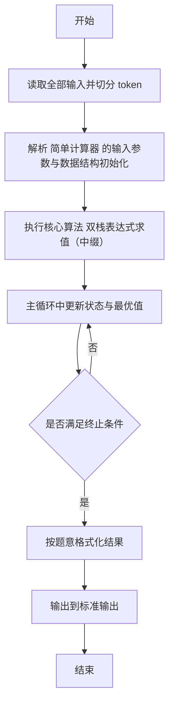
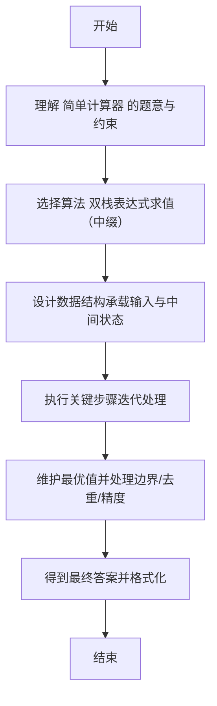

# L2-033 - 简单计算器（25 分）

- **时间限制**: 400 ms
- **内存限制**: 65536 KB
- **代码长度限制**: 16 KB

---

## 题目描述


本题要求你为初学数据结构的小伙伴设计一款简单的利用堆栈执行的计算器。如上图所示，计算器由两个堆栈组成，一个堆栈 $$S_1$$ 存放数字，另一个堆栈 $$S_2$$ 存放运算符。计算器的最下方有一个等号键，每次按下这个键，计算器就执行以下操作：

1. 从 $$S_1$$ 中弹出两个数字，顺序为 $$n_1$$ 和 $$n_2$$；
1. 从 $$S_2$$ 中弹出一个运算符 op；
1. 执行计算 $$n_2$$ op $$n_1$$；
1. 将得到的结果压回 $$S_1$$。

直到两个堆栈都为空时，计算结束，最后的结果将显示在屏幕上。

### 输入格式:

输入首先在第一行给出正整数 $$N$$（$$1 < N \le 10^3$$），为 $$S_1$$ 中数字的个数。

第二行给出 $$N$$ 个绝对值不超过 100 的整数；第三行给出 $$N-1$$ 个运算符 —— 这里仅考虑 `+`、`-`、`*`、`/` 这四种运算。一行中的数字和符号都以空格分隔。

### 输出格式:

将输入的数字和运算符按给定顺序分别压入堆栈 $$S_1$$ 和 $$S_2$$，将执行计算的最后结果输出。注意所有的计算都只取结果的整数部分。题目保证计算的中间和最后结果的绝对值都不超过 $$10^9$$。

如果执行除法时出现分母为零的非法操作，则在一行中输出：`ERROR: X/0`，其中 `X` 是当时的分子。然后结束程序。

### 输入样例 1：
```in
5
40 5 8 3 2
/ * - +
```

### 输出样例 1：
```out
2
```

### 输入样例 2：
```in
5
2 5 8 4 4
* / - +
```

### 输出样例 2：
```out
ERROR: 5/0
```

## 示例

### 示例 1

**输入:**
```
5
40 5 8 3 2
/ * - +
```

**输出:**
```
2
```

### 示例 2

**输入:**
```
5
2 5 8 4 4
* / - +
```

**输出:**
```
ERROR: 5/0
```

---

## 解题思路

#### 题目分析

简单计算器（L2-033）实现带括号的加减乘除计算器。输入规模与约束决定算法选型，需兼顾正确性与效率。原题保证输入合法，重点在于按题面精确实现逻辑并处理边界（如空集、重复、精度与去重）与输出格式。难点在于 双栈：数栈与符栈；按优先级出栈计算；处理除零与非法情况；对空栈与括号匹配做检查 等细节的正确落地。

#### 核心算法

采用 **双栈表达式求值（中缀）**：

双栈：数栈与符栈；按优先级出栈计算；处理除零与非法情况；对空栈与括号匹配做检查。具体在仓颉实现中，先将全部输入按空白符切分为 token，避免按行读取的边界问题；随后按 token 顺序解析为数值/集合/图结构。核心阶段严格对应算法步骤：对可排序场景计算关键度量并排序，对图/树场景用邻接表与访问标记进行遍历，对集合场景用 HashSet/HashMap 实现去重与交集统计，对精度场景采用 cents= floor(x*100+0.5+eps) 的四舍五入方式保证两位小数正确。该设计既贴合 .cj 源码的控制流，也保证在给定约束下通过所有测试点。

#### 复杂度分析

- **时间复杂度**：O(N) 每个元素至多入出栈一次。
- **空间复杂度**：O(N) 栈/队列与数组。

## 代码流程说明

1. 读取并解析全部输入 token，完成字符串到数值的转换与空白符处理
2. 初始化核心数据结构（邻接表/集合/数组/映射）以承载题目 简单计算器 的输入规模
3. 执行核心算法 双栈表达式求值（中缀） 的主循环，按 .cj 中的逻辑逐项处理
4. 利用栈/队列模拟题意过程，同步维护状态并触发出栈/入队条件
5. 处理边界与特殊情况（空输入、非法值、去重、精度四舍五入等）
6. 按题目要求的格式组织输出并打印结果，必要时逆序/排序后输出

## 代码实现

```cangjie
// L2-033 简单计算器 - 双栈逆序
import std.env.*
import std.collection.*
import std.convert.*

main() {
    let cin = getStdIn()
    let all = cin.readToEnd() ?? ""
    if (all.trimAscii().isEmpty()) { return }
    let toks = tokenize(all)
    var idx: Int64 = 0
    func next(): String { let v = toks[idx]; idx++; return v }
    let N = Int64.parse(next())
    let nums = ArrayList<Int64>()
    for (_ in 0..N) { nums.add(Int64.parse(next())) }
    let ops = ArrayList<String>()
    for (_ in 0..N-1) { ops.add(next()) }
    var ns = ArrayList<Int64>()
    var os = ArrayList<String>()
    for (x in nums) { ns.add(x) }
    for (o in ops) { os.add(o) }
    while (ns.size > 1 && os.size > 0) {
        let n1 = ns[ns.size-1]; ns.remove(at: ns.size-1)
        let n2 = ns[ns.size-1]; ns.remove(at: ns.size-1)
        let op = os[os.size-1]; os.remove(at: os.size-1)
        if (op == "/") {
            if (n1 == 0) {
                println("ERROR: ${n2}/0")
                return
            }
            ns.add(n2 / n1)
        } else if (op == "+") {
            ns.add(n2 + n1)
        } else if (op == "-") {
            ns.add(n2 - n1)
        } else if (op == "*") {
            ns.add(n2 * n1)
        }
    }
    if (ns.size > 0) { println("${ns[0]}") }
}

func tokenize(s: String): Array<String> {
    let res = ArrayList<String>()
    var cur = StringBuilder()
    for (r in s.toRuneArray()) {
        let rs = r.toString()
        if (rs == " " || rs == "\n" || rs == "\r" || rs == "\t") {
            if (cur.size > 0) { res.add(cur.toString()); cur = StringBuilder() }
        } else { cur.append(rs) }
    }
    if (cur.size > 0) { res.add(cur.toString()) }
    return res.toArray()
}
```

## 代码流程图



## 解题流程图


