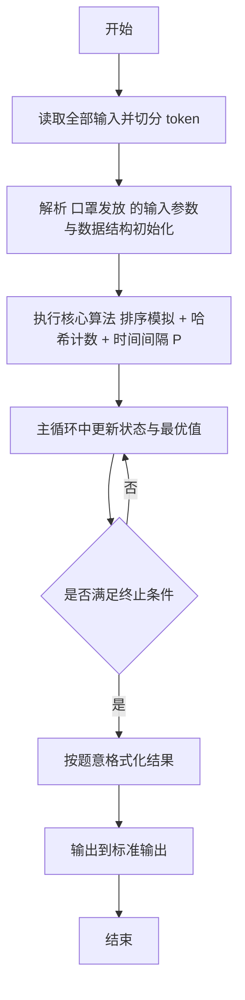
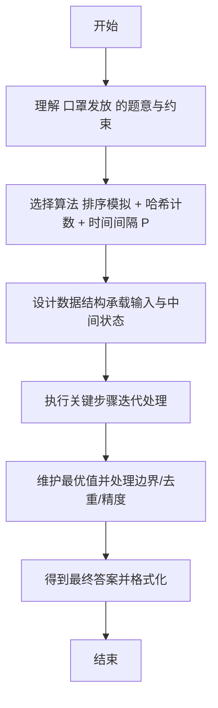

# L2-034 - 口罩发放（25 分）

- **时间限制**: 400 ms
- **内存限制**: 65536 KB
- **代码长度限制**: 16 KB

---

## 题目描述


为了抗击来势汹汹的  COVID19 新型冠状病毒，全国各地均启动了各项措施控制疫情发展，其中一个重要的环节是口罩的发放。

某市出于给市民发放口罩的需要，推出了一款小程序让市民填写信息，方便工作的开展。小程序收集了各种信息，包括市民的姓名、身份证、身体情况、提交时间等，但因为数据量太大，需要根据一定规则进行筛选和处理，请你编写程序，按照给定规则输出口罩的寄送名单。

### 输入格式:

输入第一行是两个正整数 $$D$$ 和 $$P$$（$$1 \le D, P \le 30$$），表示有 $$D$$ 天的数据，市民两次获得口罩的时间至少需要间隔 $$P$$ 天。

接下来 $$D$$ 块数据，每块给出一天的申请信息。第 $$i$$ 块数据（$$i=1, \cdots , D$$）的第一行是两个整数 $$T_i$$ 和 $$S_i$$（$$1 \le T_i \le 1000, 0 \le S_i \le 1000$$），表示在第 $$i$$ 天有 $$T_i$$ 条申请，总共有 $$S_i$$ 个口罩发放名额。随后 $$T_i$$ 行，每行给出一条申请信息，格式如下：
```
姓名 身份证号 身体情况 提交时间
```
给定数据约束如下：
* `姓名` 是一个长度不超过 10 的不包含空格的非空字符串；
* `身份证号` 是一个长度不超过 20 的非空字符串；
* `身体情况` 是 0 或者 1，0 表示自觉良好，1 表示有相关症状；
* `提交时间` 是 hh:mm，为24小时时间（由 ``00:00`` 到 ``23:59``。例如 09:08。）。注意，给定的记录的提交时间不一定有序；
* `身份证号` 各不相同，同一个身份证号被认为是同一个人，数据保证同一个身份证号姓名是相同的。

能发放口罩的记录要求如下：
* `身份证号` 必须是 18 位的**数字**（可以包含前导0）；
* 同一个身份证号若在第 $$i$$ 天申请成功，则接下来的 $$P$$ 天不能再次申请。也就是说，若第 $$i$$ 天申请成功，则等到第 $$i + P + 1$$ 天才能再次申请；
* 在上面两条都符合的情况下，按照提交时间的先后顺序发放，直至全部记录处理完毕或 $$S_i$$ 个名额用完。如果提交时间相同，则按照在列表中出现的先后顺序决定。

### 输出格式:

对于每一天的申请记录，每行输出一位得到口罩的人的姓名及身份证号，用一个空格隔开。顺序按照发放顺序确定。

在输出完发放记录后，你还需要输出有合法记录的、身体状况为 1 的申请人的姓名及身份证号，用空格隔开。顺序按照申请记录中出现的顺序确定，同一个人只需要输出一次。

### 输入样例:
```in
4 2
5 3
A 123456789012345670 1 13:58
B 123456789012345671 0 13:58
C 12345678901234567 0 13:22
D 123456789012345672 0 03:24
C 123456789012345673 0 13:59
4 3
A 123456789012345670 1 13:58
E 123456789012345674 0 13:59
C 123456789012345673 0 13:59
F F 0 14:00
1 3
E 123456789012345674 1 13:58
1 1
A 123456789012345670 0 14:11
```

### 输出样例:
```out
D 123456789012345672
A 123456789012345670
B 123456789012345671
E 123456789012345674
C 123456789012345673
A 123456789012345670
A 123456789012345670
E 123456789012345674
```

## 示例

### 示例 1

**输入:**
```
4 2
5 3
A 123456789012345670 1 13:58
B 123456789012345671 0 13:58
C 12345678901234567 0 13:22
D 123456789012345672 0 03:24
C 123456789012345673 0 13:59
4 3
A 123456789012345670 1 13:58
E 123456789012345674 0 13:59
C 123456789012345673 0 13:59
F F 0 14:00
1 3
E 123456789012345674 1 13:58
1 1
A 123456789012345670 0 14:11
```

**输出:**
```
D 123456789012345672
A 123456789012345670
B 123456789012345671
E 123456789012345674
C 123456789012345673
A 123456789012345670
A 123456789012345670
E 123456789012345674
```

---

## 解题思路

#### 题目分析

口罩发放（L2-034）按时间排序发放口罩，限制 P 天内每人一次。输入规模与约束决定算法选型，需兼顾正确性与效率。原题保证输入合法，重点在于按题面精确实现逻辑并处理边界（如空集、重复、精度与去重）与输出格式。难点在于 按时间排序所有记录，区分已发放与未发放；用 HashMap 记录每人上次发放时间，判断间隔是否 ≥P 且身份证合法后发放 等细节的正确落地。

#### 核心算法

采用 **排序模拟 + 哈希计数 + 时间间隔 P**：

按时间排序所有记录，区分已发放与未发放；用 HashMap 记录每人上次发放时间，判断间隔是否 ≥P 且身份证合法后发放。具体在仓颉实现中，先将全部输入按空白符切分为 token，避免按行读取的边界问题；随后按 token 顺序解析为数值/集合/图结构。核心阶段严格对应算法步骤：对可排序场景计算关键度量并排序，对图/树场景用邻接表与访问标记进行遍历，对集合场景用 HashSet/HashMap 实现去重与交集统计，对精度场景采用 cents= floor(x*100+0.5+eps) 的四舍五入方式保证两位小数正确。该设计既贴合 .cj 源码的控制流，也保证在给定约束下通过所有测试点。

#### 复杂度分析

- **时间复杂度**：O(N log N) 排序主导，其余线性遍历。
- **空间复杂度**：O(N) 存储数组与辅助结构。

## 代码流程说明

1. 读取并解析全部输入 token，完成字符串到数值的转换与空白符处理
2. 初始化核心数据结构（邻接表/集合/数组/映射）以承载题目 口罩发放 的输入规模
3. 计算关键度量（如单价、均值、亲密度）并按关键字排序
4. 利用栈/队列模拟题意过程，同步维护状态并触发出栈/入队条件
5. 处理边界与特殊情况（空输入、非法值、去重、精度四舍五入等）
6. 按题目要求的格式组织输出并打印结果，必要时逆序/排序后输出

## 代码实现

```cangjie
// L2-034 口罩发放 - 按时间排序、P间隔、18位数字
import std.env.*
import std.collection.*
import std.convert.*

main() {
    let cin = getStdIn()
    let all = cin.readToEnd() ?? ""
    if (all.size == 0) { return }
    var toks = ArrayList<String>()
    var cur = StringBuilder()
    for (r in all.toRuneArray()) {
        let s = r.toString()
        if (s == " " || s == "\n" || s == "\r" || s == "\t") {
            if (cur.toString().size > 0) { toks.add(cur.toString()); cur = StringBuilder() }
        } else {
            cur.append(s)
        }
    }
    if (cur.toString().size > 0) { toks.add(cur.toString()) }
    if (toks.size < 2) { return }
    var p: Int64 = 0
    let D = Int64.parse(toks[p]); p+=1
    let P = Int64.parse(toks[p]); p+=1
    var lastReceive = HashMap<String, Int64>()
    var sickSeen = HashMap<String, Bool>()
    var sickOrder = ArrayList<String>()
    var out = StringBuilder()
    for (day in 1..=D) {
        if (p+1 >= toks.size) { break }
        let Ti = Int64.parse(toks[p]); p+=1
        let Si = Int64.parse(toks[p]); p+=1
        var dayApps = ArrayList<ArrayList<String>>()
        // collect Ti records
        for (t in 0..Ti) {
            if (dayApps.size >= Ti) { break }
            if (p+3 >= toks.size) { break }
            let name = toks[p]; let id = toks[p+1]; let health = toks[p+2]; let tm = toks[p+3]
            p+=4
            var arr = ArrayList<String>()
            arr.add(name); arr.add(id); arr.add(health); arr.add(tm)
            dayApps.add(arr)
            // sick collection: valid id and health==1
            var valid = true
            if (id.size != 18) { valid = false } else {
                for (rr in id.toRuneArray()) {
                    let ss = rr.toString()
                    if (ss < "0" || ss > "9") { valid = false; break }
                }
            }
            if (valid && health == "1") {
                let key = "${name} ${id}"
                if (!sickSeen.contains(key)) {
                    sickSeen[key] = true
                    sickOrder.add(key)
                }
            }
        }
        // filter valid ids for distribution
        var validApps = ArrayList<ArrayList<String>>()
        var ord: Int64 = 0
        for (a in dayApps) {
            let id = a[1]
            var valid = true
            if (id.size != 18) { valid = false } else {
                for (rr in id.toRuneArray()) {
                    let ss = rr.toString()
                    if (ss < "0" || ss > "9") { valid = false; break }
                }
            }
            if (!valid) { continue }
            var e = ArrayList<String>()
            e.add(a[0]); e.add(a[1]); e.add(a[3]); e.add("${ord}")
            validApps.add(e)
            ord+=1
        }
        // sort by time then order
        for (i in 0..validApps.size) {
            for (j in i+1..validApps.size) {
                let ai = validApps[i]
                let aj = validApps[j]
                var needSwap = false
                if (ai[2] != aj[2]) {
                    if (ai[2] > aj[2]) { needSwap = true }
                } else {
                    if (Int64.parse(ai[3]) > Int64.parse(aj[3])) { needSwap = true }
                }
                if (needSwap) {
                    let tmp = validApps[i]
                    validApps[i] = validApps[j]
                    validApps[j] = tmp
                }
            }
        }
        var cnt: Int64 = 0
        for (app in validApps) {
            if (cnt >= Si) { break }
            let id = app[1]
            var can = true
            if (lastReceive.contains(id)) {
                let last = lastReceive[id]
                if (day - last <= P) { can = false }
            }
            if (can) {
                out.append("${app[0]} ${id}\n")
                lastReceive[id] = day
                cnt+=1
            }
        }
    }
    for (s in sickOrder) { out.append("${s}\n") }
    print(out.toString())
}
```

## 代码流程图



## 解题流程图


