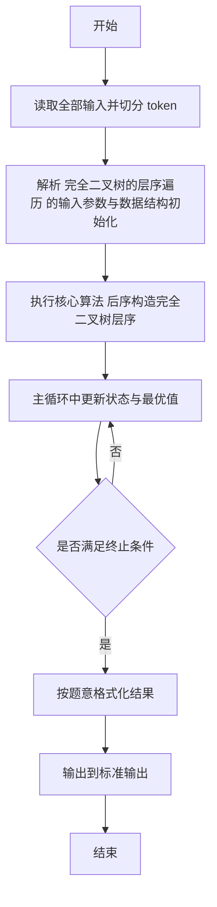
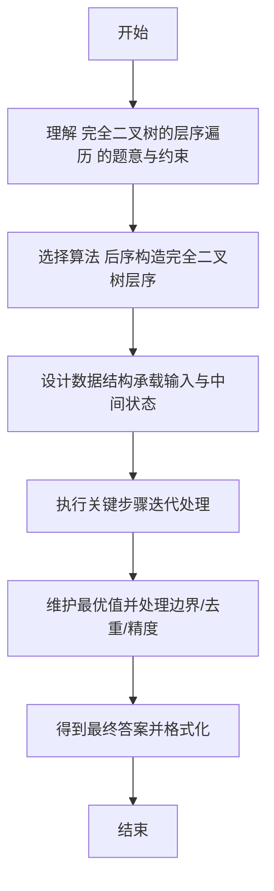

# L2-035 - 完全二叉树的层序遍历（25 分）

- **时间限制**: 400 ms
- **内存限制**: 65536 KB
- **代码长度限制**: 16 KB

---

## 题目描述


一个二叉树，如果每一个层的结点数都达到最大值，则这个二叉树就是**完美二叉树**。对于深度为 $$D$$ 的，有 $$N$$ 个结点的二叉树，若其结点对应于相同深度完美二叉树的层序遍历的前 $$N$$ 个结点，这样的树就是**完全二叉树**。

给定一棵完全二叉树的后序遍历，请你给出这棵树的层序遍历结果。

### 输入格式:

输入在第一行中给出正整数 $$N$$（$$\le 30$$），即树中结点个数。第二行给出后序遍历序列，为 $$N$$ 个不超过 100 的正整数。同一行中所有数字都以空格分隔。

### 输出格式:

在一行中输出该树的层序遍历序列。所有数字都以 1 个空格分隔，行首尾不得有多余空格。

### 输入样例:
```in
8
91 71 2 34 10 15 55 18
```

### 输出样例:
```out
18 34 55 71 2 10 15 91
```

## 示例

### 示例 1

**输入:**
```
8
91 71 2 34 10 15 55 18
```

**输出:**
```
18 34 55 71 2 10 15 91
```

---

## 解题思路

#### 题目分析

完全二叉树的层序遍历（L2-035）由后序遍历还原完全二叉树的层序遍历。输入规模与约束决定算法选型，需兼顾正确性与效率。原题保证输入合法，重点在于按题面精确实现逻辑并处理边界（如空集、重复、精度与去重）与输出格式。难点在于 后序遍历对应完全二叉树数组表示，递归按左右子树分割还原层序数组并输出 等细节的正确落地。

#### 核心算法

采用 **后序构造完全二叉树层序**：

后序遍历对应完全二叉树数组表示，递归按左右子树分割还原层序数组并输出。具体在仓颉实现中，先将全部输入按空白符切分为 token，避免按行读取的边界问题；随后按 token 顺序解析为数值/集合/图结构。核心阶段严格对应算法步骤：对可排序场景计算关键度量并排序，对图/树场景用邻接表与访问标记进行遍历，对集合场景用 HashSet/HashMap 实现去重与交集统计，对精度场景采用 cents= floor(x*100+0.5+eps) 的四舍五入方式保证两位小数正确。该设计既贴合 .cj 源码的控制流，也保证在给定约束下通过所有测试点。

#### 复杂度分析

- **时间复杂度**：O(N log N) 或 O(N) 视实现而定。
- **空间复杂度**：O(N)。

## 代码流程说明

1. 读取并解析全部输入 token，完成字符串到数值的转换与空白符处理
2. 初始化核心数据结构（邻接表/集合/数组/映射）以承载题目 完全二叉树的层序遍历 的输入规模
3. 执行核心算法 后序构造完全二叉树层序 的主循环，按 .cj 中的逻辑逐项处理
4. 在循环中维护关键状态（距离/计数/哈希/排序/栈顶等）并按题意更新最优值
5. 处理边界与特殊情况（空输入、非法值、去重、精度四舍五入等）
6. 按题目要求的格式组织输出并打印结果，必要时逆序/排序后输出

## 代码实现

```cangjie
// L2-035 完全二叉树的层序遍历 - 后序转层序
import std.env.*
import std.collection.*
import std.convert.*

main() {
    let cin = getStdIn()
    let all = cin.readToEnd() ?? ""
    if (all.size == 0) { return }
    var toks = ArrayList<String>()
    var cur = StringBuilder()
    for (r in all.toRuneArray()) {
        let s = r.toString()
        if (s == " " || s == "\n" || s == "\r" || s == "\t") {
            if (cur.toString().size > 0) { toks.add(cur.toString()); cur = StringBuilder() }
        } else { cur.append(s) }
    }
    if (cur.toString().size > 0) { toks.add(cur.toString()) }
    if (toks.size == 0) { return }
    let n = Int64.parse(toks[0])
    if (n == 0) { return }
    var post = Array<Int64>(n, repeat: 0)
    for (i in 0..n) {
        if (i+1 < toks.size) { post[i] = Int64.parse(toks[(i+1)]) }
    }
    var level = Array<Int64>(n+1, repeat: 0)
    build(level, post, 0, n-1, 1)
    var sb = StringBuilder()
    for (i in 1..=n) {
        if (i > 1) { sb.append(" ") }
        sb.append("${level[i]}")
    }
    println(sb.toString())
}
func build(level: Array<Int64>, post: Array<Int64>, l: Int64, r: Int64, pos: Int64): Unit {
    if (l > r) { return }
    if (pos >= level.size) { return }
    let root = post[r]
    level[pos] = root
    let cnt = r - l + 1
    if (cnt == 1) { return }
    let leftSize = getLeftSize(cnt)
    build(level, post, l, l + leftSize - 1, pos*2)
    build(level, post, l + leftSize, r-1, pos*2+1)
}
func getLeftSize(n: Int64): Int64 {
    if (n <= 1) { return 0 }
    var h: Int64 = 0
    while ((1 << (h+1)) <= n+1) { h+=1 }
    let pow: Int64 = 1 << h
    let full = pow - 1
    let last = n - full
    let half = pow / 2
    var left: Int64 = 0
    if (last <= half) {
        left = (half - 1) + last
    } else {
        left = (half - 1) + half
    }
    return left
}
```

## 代码流程图



## 解题流程图


