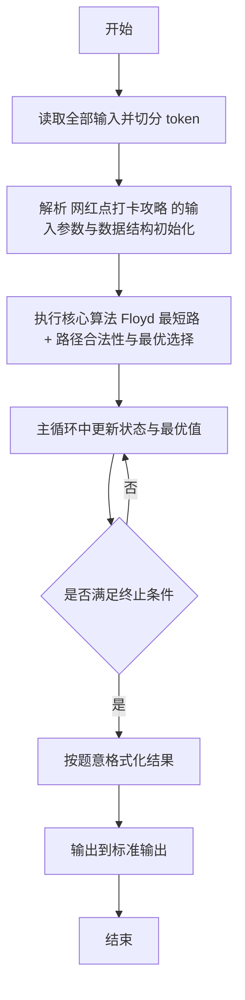
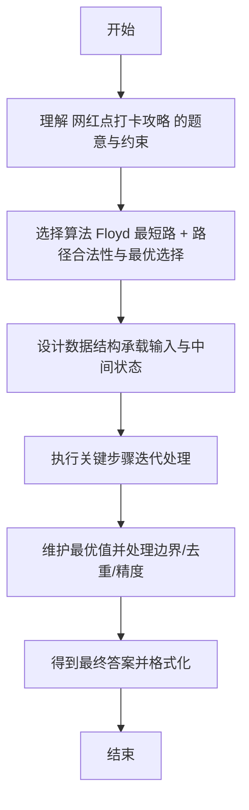

# L2-036 - 网红点打卡攻略（25 分）

- **时间限制**: 400 ms
- **内存限制**: 65536 KB
- **代码长度限制**: 16 KB

---

## 题目描述


一个旅游景点，如果被带火了的话，就被称为“网红点”。大家来网红点游玩，俗称“打卡”。在各个网红点打卡的快（省）乐（钱）方法称为“攻略”。你的任务就是从一大堆攻略中，找出那个能在每个网红点打卡仅一次、并且路上花费最少的攻略。

### 输入格式:

首先第一行给出两个正整数：网红点的个数 $$N$$（$$1 < N\le 200$$）和网红点之间通路的条数 $$M$$。随后 $$M$$ 行，每行给出有通路的两个网红点、以及这条路上的旅行花费（为正整数），格式为“网红点1 网红点2 费用”，其中网红点从 1 到 $$N$$ 编号；同时也给出你家到某些网红点的花费，格式相同，其中你家的编号固定为 `0`。

再下一行给出一个正整数 $$K$$，是待检验的攻略的数量。随后 $$K$$ 行，每行给出一条待检攻略，格式为：

$$n$$ $$V_1$$ $$V_2$$ $$\cdots$$ $$V_n$$

其中 $$n (\le 200)$$ 是攻略中的网红点数，$$V_i$$ 是路径上的网红点编号。这里假设你从家里出发，从 $$V_1$$ 开始打卡，最后从 $$V_n$$ 回家。

### 输出格式:

在第一行输出满足要求的攻略的个数。

在第二行中，首先输出那个能在每个网红点打卡仅一次、并且路上花费最少的攻略的序号（从 1 开始），然后输出这个攻略的总路费，其间以一个空格分隔。如果这样的攻略不唯一，则输出序号最小的那个。

题目保证至少存在一个有效攻略，并且总路费不超过 $$10^9$$。

### 输入样例:
```in
6 13
0 5 2
6 2 2
6 0 1
3 4 2
1 5 2
2 5 1
3 1 1
4 1 2
1 6 1
6 3 2
1 2 1
4 5 3
2 0 2
7
6 5 1 4 3 6 2
6 5 2 1 6 3 4
8 6 2 1 6 3 4 5 2
3 2 1 5
6 6 1 3 4 5 2
7 6 2 1 3 4 5 2
6 5 2 1 4 3 6
```

### 输出样例:
```out
3
5 11
```

## 示例

### 示例 1

**输入:**
```
6 13
0 5 2
6 2 2
6 0 1
3 4 2
1 5 2
2 5 1
3 1 1
4 1 2
1 6 1
6 3 2
1 2 1
4 5 3
2 0 2
7
6 5 1 4 3 6 2
6 5 2 1 6 3 4
8 6 2 1 6 3 4 5 2
3 2 1 5
6 6 1 3 4 5 2
7 6 2 1 3 4 5 2
6 5 2 1 4 3 6
```

**输出:**
```
3
5 11
```

---

## 解题思路

#### 题目分析

网红点打卡攻略（L2-036）给定图与若干攻略，判断攻略是否覆盖所有网红点且路径最短。输入规模与约束决定算法选型，需兼顾正确性与效率。原题保证输入合法，重点在于按题面精确实现逻辑并处理边界（如空集、重复、精度与去重）与输出格式。难点在于 Floyd 求全源最短路；对每条攻略检查是否访问所有点、是否重复、路径是否存在且计算总长度；选最短合法攻略输出 等细节的正确落地。

#### 核心算法

采用 **Floyd 最短路 + 路径合法性与最优选择**：

Floyd 求全源最短路；对每条攻略检查是否访问所有点、是否重复、路径是否存在且计算总长度；选最短合法攻略输出。具体在仓颉实现中，先将全部输入按空白符切分为 token，避免按行读取的边界问题；随后按 token 顺序解析为数值/集合/图结构。核心阶段严格对应算法步骤：对可排序场景计算关键度量并排序，对图/树场景用邻接表与访问标记进行遍历，对集合场景用 HashSet/HashMap 实现去重与交集统计，对精度场景采用 cents= floor(x*100+0.5+eps) 的四舍五入方式保证两位小数正确。该设计既贴合 .cj 源码的控制流，也保证在给定约束下通过所有测试点。

#### 复杂度分析

- **时间复杂度**：O(N³) Floyd 全源最短路。
- **空间复杂度**：O(N²) 邻接矩阵。

## 代码流程说明

1. 读取并解析全部输入 token，完成字符串到数值的转换与空白符处理
2. 初始化核心数据结构（邻接表/集合/数组/映射）以承载题目 网红点打卡攻略 的输入规模
3. 初始化 dist/cnt/maxTeams/prev 等数组并执行 Dijkstra/Floyd 最短路主循环
4. 在循环中维护关键状态（距离/计数/哈希/排序/栈顶等）并按题意更新最优值
5. 处理边界与特殊情况（空输入、非法值、去重、精度四舍五入等）
6. 按题目要求的格式组织输出并打印结果，必要时逆序/排序后输出

## 代码实现

```cangjie
// L2-036 网红点打卡攻略 - Floyd最短路+攻略检验
import std.env.*
import std.collection.*
import std.convert.*

main() {
    let cin = getStdIn()
    let all = cin.readToEnd() ?? ""
    if (all.size == 0) { return }
    var toks = ArrayList<String>()
    var cur = StringBuilder()
    for (r in all.toRuneArray()) {
        let s = r.toString()
        if (s == " " || s == "\n" || s == "\r" || s == "\t") {
            if (cur.toString().size > 0) { toks.add(cur.toString()); cur = StringBuilder() }
        } else { cur.append(s) }
    }
    if (cur.toString().size > 0) { toks.add(cur.toString()) }
    var p: Int64 = 0
    let N = Int64.parse(toks[p]); p+=1
    let M = Int64.parse(toks[p]); p+=1
    let SZ = N+1
    let INF: Int64 = 1000000000000
    var dist = Array<Array<Int64>>(SZ, repeat: Array<Int64>(0, repeat: 0))
    for (i in 0..SZ) { dist[i]=Array<Int64>(SZ, repeat: INF); dist[i][i]=0 }
    for (i in 0..M) {
        let a = Int64.parse(toks[p]); let b = Int64.parse(toks[p+1]); let c = Int64.parse(toks[p+2]); p+=3
        if (c < dist[a][b]) {
            dist[a][b]=c; dist[b][a]=c
        }
    }
    // no Floyd, direct edges only
    let K = Int64.parse(toks[p]); p+=1
    var validCnt: Int64 = 0
    var bestIdx: Int64 = 0
    var bestCost: Int64 = INF
    for (idx in 1..=K) {
        if (p >= toks.size) { break }
        let n = Int64.parse(toks[p]); p+=1
        var path = Array<Int64>(n, repeat: 0)
        for (i in 0..n) {
            if (p < toks.size) { path[i]=Int64.parse(toks[p]); p+=1 } else { path[i]=0 }
        }
        if (n != N) { continue }
        // check distinct and range 1..N
        var seen = HashSet<Int64>()
        var ok = true
        for (v in path) {
            if (v < 1 || v > N) { ok=false; break }
            if (seen.contains(v)) { ok=false; break }
            seen.add(v)
        }
        if (!ok) { continue }
        // check connectivity via INF (if any segment INF -> invalid)
        var cost: Int64 = 0
        var conn = true
        let first = path[0]
        if (dist[0][first] >= INF) { conn=false } else { cost+=dist[0][first] }
        for (i in 1..n) {
            if (!conn) { break }
            let u = path[i-1]; let v = path[i]
            if (dist[u][v] >= INF) { conn=false; break }
            cost+=dist[u][v]
        }
        let last = path[n-1]
        if (conn && dist[last][0] >= INF) { conn=false }
        if (conn) { cost+=dist[last][0] } else { continue }
        // valid
        validCnt+=1
        if (cost < bestCost) {
            bestCost=cost; bestIdx=idx
        }
    }
    println("${validCnt}")
    println("${bestIdx} ${bestCost}")
}
```

## 代码流程图



## 解题流程图


