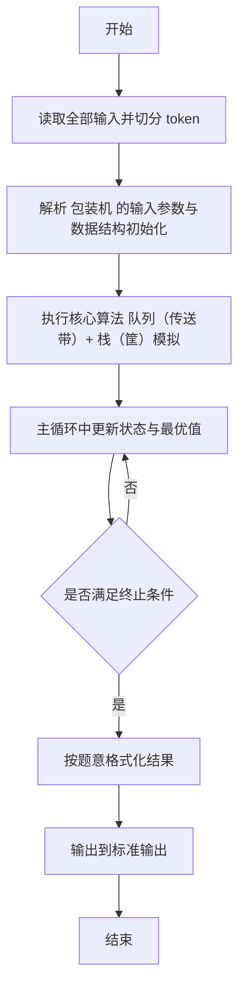
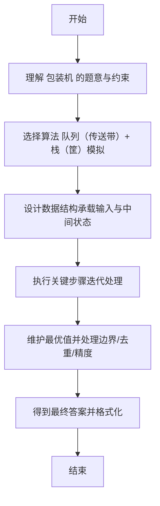

# L2-037 - 包装机（25 分）

- **时间限制**: 400 ms
- **内存限制**: 65536 KB
- **代码长度限制**: 16 KB

---

## 题目描述


一种自动包装机的结构如图 1 所示。首先机器中有 $$N$$ 条轨道，放置了一些物品。轨道下面有一个筐。当某条轨道的按钮被按下时，活塞向左推动，将轨道尽头的一件物品推落筐中。当 0 号按钮被按下时，机械手将抓取筐顶部的一件物品，放到流水线上。图 2 显示了顺序按下按钮 3、2、3、0、1、2、0 后包装机的状态。


图1 自动包装机的结构


图 2 顺序按下按钮 3、2、3、0、1、2、0 后包装机的状态

一种特殊情况是，因为筐的容量是有限的，当筐已经满了，但仍然有某条轨道的按钮被按下时，系统应强制启动 0 号键，先从筐里抓出一件物品，再将对应轨道的物品推落。此外，如果轨道已经空了，再按对应的按钮不会发生任何事；同样的，如果筐是空的，按 0 号按钮也不会发生任何事。

现给定一系列按钮操作，请你依次列出流水线上的物品。

### 输入格式:

输入第一行给出 3 个正整数 $$N$$（$$\le 100$$）、$$M$$（$$\le 1000$$）和 $$S_{max}$$（$$\le 100$$），分别为轨道的条数（于是轨道从 1 到 $$N$$ 编号）、每条轨道初始放置的物品数量、以及筐的最大容量。随后 $$N$$ 行，每行给出 $$M$$ 个英文大写字母，表示每条轨道的初始物品摆放。

最后一行给出一系列数字，顺序对应被按下的按钮编号，直到 $$-1$$ 标志输入结束，这个数字不要处理。数字间以空格分隔。题目保证至少会取出一件物品放在流水线上。

### 输出格式:

在一行中顺序输出流水线上的物品，不得有任何空格。

### 输入样例:
```in
3 4 4
GPLT
PATA
OMSA
3 2 3 0 1 2 0 2 2 0 -1
```

### 输出样例:
```out
MATA
```

## 示例

### 示例 1

**输入:**
```
3 4 4
GPLT
PATA
OMSA
3 2 3 0 1 2 0 2 2 0 -1
```

**输出:**
```
MATA
```

---

## 解题思路

#### 题目分析

包装机（L2-037）模拟包装机流水线取货过程。输入规模与约束决定算法选型，需兼顾正确性与效率。原题保证输入合法，重点在于按题面精确实现逻辑并处理边界（如空集、重复、精度与去重）与输出格式。难点在于 多条传送带队列与临时筐栈；按指令从传送带队首取货放入筐，筐满则弹出；按出货顺序输出 等细节的正确落地。

#### 核心算法

采用 **队列（传送带）+ 栈（筐）模拟**：

多条传送带队列与临时筐栈；按指令从传送带队首取货放入筐，筐满则弹出；按出货顺序输出。具体在仓颉实现中，先将全部输入按空白符切分为 token，避免按行读取的边界问题；随后按 token 顺序解析为数值/集合/图结构。核心阶段严格对应算法步骤：对可排序场景计算关键度量并排序，对图/树场景用邻接表与访问标记进行遍历，对集合场景用 HashSet/HashMap 实现去重与交集统计，对精度场景采用 cents= floor(x*100+0.5+eps) 的四舍五入方式保证两位小数正确。该设计既贴合 .cj 源码的控制流，也保证在给定约束下通过所有测试点。

#### 复杂度分析

- **时间复杂度**：O(N) 每个元素至多入出栈一次。
- **空间复杂度**：O(N) 栈/队列与数组。

## 代码流程说明

1. 读取并解析全部输入 token，完成字符串到数值的转换与空白符处理
2. 初始化核心数据结构（邻接表/集合/数组/映射）以承载题目 包装机 的输入规模
3. 执行核心算法 队列（传送带）+ 栈（筐）模拟 的主循环，按 .cj 中的逻辑逐项处理
4. 利用栈/队列模拟题意过程，同步维护状态并触发出栈/入队条件
5. 处理边界与特殊情况（空输入、非法值、去重、精度四舍五入等）
6. 按题目要求的格式组织输出并打印结果，必要时逆序/排序后输出

## 代码实现

```cangjie
// L2-037 包装机 - 轨道队列+筐栈模拟
import std.env.*
import std.collection.*
import std.convert.*

main() {
    let cin = getStdIn()
    let all = cin.readToEnd() ?? ""
    if (all.size == 0) { return }
    var lines = ArrayList<String>()
    var tmp = StringBuilder()
    for (r in all.toRuneArray()) {
        let s = r.toString()
        if (s=="\n") { lines.add(tmp.toString()); tmp=StringBuilder() } else if (s=="\r") {} else { tmp.append(s) }
    }
    lines.add(tmp.toString())
    var idx: Int64 = 0
    while (idx < lines.size && lines[idx].trimAscii().size == 0) { idx+=1 }
    if (idx >= lines.size) { return }
    let firstParts = lines[idx].trimAscii().split(" ").filter({x => x.size>0})
    idx+=1
    let N = Int64.parse(firstParts[0])
    let M = Int64.parse(firstParts[1])
    let Smax = Int64.parse(firstParts[2])
    var tracks = Array<ArrayList<String>>(N+1, repeat: ArrayList<String>())
    for (i in 1..=N) { tracks[i]=ArrayList<String>() }
    for (i in 1..=N) {
        while (idx < lines.size && lines[idx].size == 0) { idx+=1 }
        if (idx >= lines.size) { break }
        let s = lines[idx].trimAscii(); idx+=1
        var q = ArrayList<String>()
        for (rr in s.toRuneArray()) { q.add(rr.toString()) }
        tracks[i]=q
    }
    // collect buttons via token scan after header+tracks
    var allToks = ArrayList<String>()
    var cur2 = StringBuilder()
    for (r in all.toRuneArray()) {
        let s = r.toString()
        if (s==" "||s=="\n"||s=="\r"||s=="\t") {
            if (cur2.toString().size>0) { allToks.add(cur2.toString()); cur2=StringBuilder() }
        } else { cur2.append(s) }
    }
    if (cur2.toString().size>0) { allToks.add(cur2.toString()) }
    var pos: Int64 = 0
    pos+=3
    pos+=N
    var buttons = ArrayList<Int64>()
    while (pos < allToks.size) {
        let v = Int64.parse(allToks[pos]); pos+=1
        if (v==-1) { break }
        buttons.add(v)
    }
    var head = Array<Int64>(N+1, repeat: 0)
    var basket = ArrayList<String>()
    var out = StringBuilder()
    for (btn in buttons) {
        if (btn == 0) {
            if (basket.size > 0) {
                let top = basket[basket.size-1]
                out.append(top)
                basket.remove((basket.size-1)..basket.size)
            }
        } else {
            let id = btn
            if (id < 1 || id > N) { continue }
            if (head[id] >= tracks[id].size) { continue }
            if (basket.size >= Smax) {
                if (basket.size > 0) {
                    let top = basket[basket.size-1]
                    out.append(top)
                    basket.remove((basket.size-1)..basket.size)
                }
            }
            if (head[id] < tracks[id].size) {
                let item = tracks[id][head[id]]
                head[id]+=1
                basket.add(item)
            }
        }
    }
    println(out.toString())
}
```

## 代码流程图



## 解题流程图


