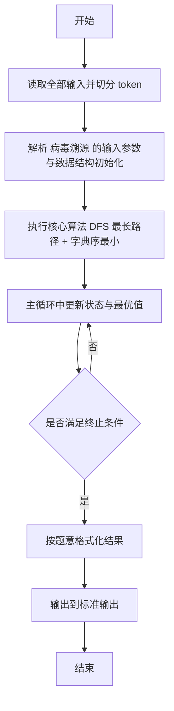
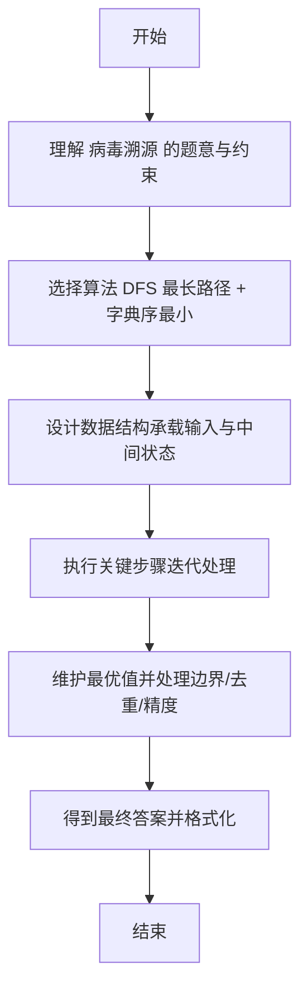

# L2-038 - 病毒溯源（25 分）

- **时间限制**: 400 ms
- **内存限制**: 65536 KB
- **代码长度限制**: 16 KB

---

## 题目描述


病毒容易发生变异。某种病毒可以通过突变产生若干变异的毒株，而这些变异的病毒又可能被诱发突变产生第二代变异，如此继续不断变化。

现给定一些病毒之间的变异关系，要求你找出其中最长的一条变异链。

在此假设给出的变异都是由突变引起的，不考虑复杂的基因重组变异问题 —— 即每一种病毒都是由唯一的一种病毒突变而来，并且不存在循环变异的情况。

### 输入格式:

输入在第一行中给出一个正整数 $$N$$（$$\le 10^4$$），即病毒种类的总数。于是我们将所有病毒从 0 到 $$N-1$$ 进行编号。

随后 $$N$$ 行，每行按以下格式描述一种病毒的变异情况：

```
k 变异株1 …… 变异株k
```

其中 `k` 是该病毒产生的变异毒株的种类数，后面跟着每种变异株的编号。第 $$i$$ 行对应编号为 $$i$$ 的病毒（$$0\le i <N$$）。题目保证病毒源头有且仅有一个。

### 输出格式:

首先输出从源头开始最长变异链的长度。

在第二行中输出从源头开始最长的一条变异链，编号间以 1 个空格分隔，行首尾不得有多余空格。如果最长链不唯一，则输出最小序列。

注：我们称序列 { $$a_1, \cdots , a_n$$ } 比序列 { $$b_1, \cdots , b_n$$ } “小”，如果存在 $$1\le k \le n$$ 满足 $$a_i = b_i$$ 对所有 $$i<k$$ 成立，且 $$a_k < b_k$$。

### 输入样例:
```in
10
3 6 4 8
0
0
0
2 5 9
0
1 7
1 2
0
2 3 1
```

### 输出样例:
```out
4
0 4 9 1
```

## 示例

### 示例 1

**输入:**
```
10
3 6 4 8
0
0
0
2 5 9
0
1 7
1 2
0
2 3 1
```

**输出:**
```
4
0 4 9 1
```

---

## 解题思路

#### 题目分析

病毒溯源（L2-038）在变异树中求最长变异链，深度相同取字典序最小。输入规模与约束决定算法选型，需兼顾正确性与效率。原题保证输入合法，重点在于按题面精确实现逻辑并处理边界（如空集、重复、精度与去重）与输出格式。难点在于 建树并对子节点排序；DFS 记录每个节点的深度与路径；维护全局最长路径，长度优先、字典序次优先比较更新 等细节的正确落地。

#### 核心算法

采用 **DFS 最长路径 + 字典序最小**：

建树并对子节点排序；DFS 记录每个节点的深度与路径；维护全局最长路径，长度优先、字典序次优先比较更新。具体在仓颉实现中，先将全部输入按空白符切分为 token，避免按行读取的边界问题；随后按 token 顺序解析为数值/集合/图结构。核心阶段严格对应算法步骤：对可排序场景计算关键度量并排序，对图/树场景用邻接表与访问标记进行遍历，对集合场景用 HashSet/HashMap 实现去重与交集统计，对精度场景采用 cents= floor(x*100+0.5+eps) 的四舍五入方式保证两位小数正确。该设计既贴合 .cj 源码的控制流，也保证在给定约束下通过所有测试点。

#### 复杂度分析

- **时间复杂度**：O(N+M) 遍历图/树全部节点与边。
- **空间复杂度**：O(N+M) 邻接表与访问标记。

## 代码流程说明

1. 读取并解析全部输入 token，完成字符串到数值的转换与空白符处理
2. 初始化核心数据结构（邻接表/集合/数组/映射）以承载题目 病毒溯源 的输入规模
3. 执行核心算法 DFS 最长路径 + 字典序最小 的主循环，按 .cj 中的逻辑逐项处理
4. 在循环中维护关键状态（距离/计数/哈希/排序/栈顶等）并按题意更新最优值
5. 处理边界与特殊情况（空输入、非法值、去重、精度四舍五入等）
6. 按题目要求的格式组织输出并打印结果，必要时逆序/排序后输出

## 代码实现

```cangjie
// L2-038 病毒溯源 - 最长变异链，字典序最小
import std.env.*
import std.collection.*
import std.convert.*
import std.sort.*

main() {
    let cin = getStdIn()
    let all = cin.readToEnd() ?? ""
    if (all.size == 0) { return }
    var toks = ArrayList<String>()
    var cur = StringBuilder()
    for (r in all.toRuneArray()) {
        let s = r.toString()
        if (s==" "||s=="\n"||s=="\r"||s=="\t") {
            if (cur.toString().size>0) { toks.add(cur.toString()); cur=StringBuilder() }
        } else { cur.append(s) }
    }
    if (cur.toString().size>0) { toks.add(cur.toString()) }
    var p: Int64 = 0
    let N = Int64.parse(toks[p]); p+=1
    var adj = Array<ArrayList<Int64>>(N, repeat: ArrayList<Int64>())
    for (i in 0..N) { adj[i]=ArrayList<Int64>() }
    var indeg = Array<Int64>(N, repeat: 0)
    for (i in 0..N) {
        let k = Int64.parse(toks[p]); p+=1
        for (j in 0..k) {
            let ch = Int64.parse(toks[p]); p+=1
            adj[i].add(ch)
            indeg[ch]+=1
        }
    }
    for (i in 0..N) { sort(adj[i]) }
    var root: Int64 = 0
    for (i in 0..N) { if (indeg[i]==0) { root=i; break } }
    var best = ArrayList<Int64>()
    var curPath = ArrayList<Int64>()
    var stackNode = ArrayList<Int64>()
    var stackIdx = ArrayList<Int64>()
    stackNode.add(root); stackIdx.add(0)
    curPath.add(root)
    if (adj[root].size==0) { best = ArrayList<Int64>(); for (x in curPath) { best.add(x) } }
    while (stackNode.size > 0) {
        let top = stackNode.size-1
        let node = stackNode[top]
        let idx = stackIdx[top]
        if (idx < adj[node].size) {
            let child = adj[node][idx]
            stackIdx[top] = idx+1
            stackNode.add(child); stackIdx.add(0)
            curPath.add(child)
        } else {
            if (adj[node].size==0) {
                if (curPath.size > best.size) {
                    best = ArrayList<Int64>()
                    for (x in curPath) { best.add(x) }
                } else if (curPath.size == best.size && curPath.size>0) {
                    var smaller = false
                    var larger = false
                    for (k in 0..curPath.size) {
                        let a = curPath[k]; let b = best[k]
                        if (a < b) { smaller=true; break }
                        if (a > b) { larger=true; break }
                    }
                    if (smaller) {
                        best = ArrayList<Int64>()
                        for (x in curPath) { best.add(x) }
                    }
                }
            }
            stackNode.remove(top..top+1); stackIdx.remove(top..top+1)
            curPath.remove((curPath.size-1)..curPath.size)
        }
    }
    println("${best.size}")
    var sb = StringBuilder()
    for (i in 0..best.size) {
        if (i>0) { sb.append(" ") }
        sb.append("${best[i]}")
    }
    println(sb.toString())
}
```

## 代码流程图



## 解题流程图


