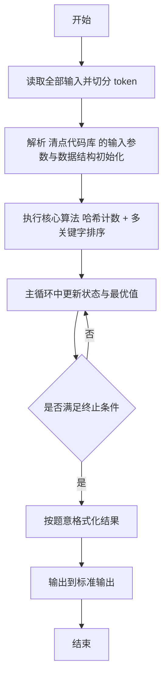
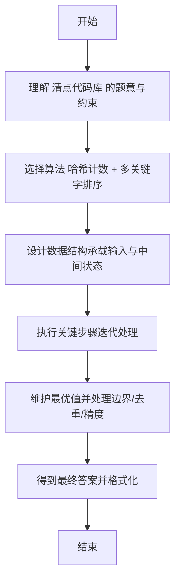

# L2-039 - 清点代码库（25 分）

- **时间限制**: 500 ms
- **内存限制**: 65536 KB
- **代码长度限制**: 16 KB

---

## 题目描述


上图转自新浪微博：“阿里代码库有几亿行代码，但其中有很多功能重复的代码，比如单单快排就被重写了几百遍。请设计一个程序，能够将代码库中所有功能重复的代码找出。各位大佬有啥想法，我当时就懵了，然后就挂了。。。”

这里我们把问题简化一下：首先假设两个功能模块如果接受同样的输入，总是给出同样的输出，则它们就是功能重复的；其次我们把每个模块的输出都简化为一个整数（在 **int** 范围内）。于是我们可以设计一系列输入，检查所有功能模块的对应输出，从而查出功能重复的代码。你的任务就是设计并实现这个简化问题的解决方案。

### 输入格式:

输入在第一行中给出 2 个正整数，依次为 $$N$$（$$\le 10^4$$）和 $$M$$（$$\le 10^2$$），对应功能模块的个数和系列测试输入的个数。

随后 $$N$$ 行，每行给出一个功能模块的 $$M$$ 个对应输出，数字间以空格分隔。

### 输出格式:

首先在第一行输出不同功能的个数 $$K$$。随后 $$K$$ 行，每行给出具有这个功能的模块的个数，以及这个功能的对应输出。数字间以 1 个空格分隔，行首尾不得有多余空格。输出首先按模块个数非递增顺序，如果有并列，则按输出序列的递增序给出。

注：所谓数列 { $$A_1$$, ..., $$A_M$$ } 比 { $$B_1$$, ..., $$B_M$$ } 大，是指存在 $$1\le i <M$$，使得 $$A_1=B_1$$，...，$$A_i=B_i$$ 成立，且 $$A_{i+1} > B_{i+1}$$。

### 输入样例:
```in
7 3
35 28 74
-1 -1 22
28 74 35
-1 -1 22
11 66 0
35 28 74
35 28 74
```

### 输出样例:
```out
4
3 35 28 74
2 -1 -1 22
1 11 66 0
1 28 74 35
```

## 示例

### 示例 1

**输入:**
```
7 3
35 28 74
-1 -1 22
28 74 35
-1 -1 22
11 66 0
35 28 74
35 28 74
```

**输出:**
```
4
3 35 28 74
2 -1 -1 22
1 11 66 0
1 28 74 35
```

---

## 解题思路

#### 题目分析

清点代码库（L2-039）统计代码库中每种功能组合出现次数。输入规模与约束决定算法选型，需兼顾正确性与效率。原题保证输入合法，重点在于按题面精确实现逻辑并处理边界（如空集、重复、精度与去重）与输出格式。难点在于 用 HashMap<String,Integer> 计数每种功能组合；按出现次数降序、功能组合升序排序输出 等细节的正确落地。

#### 核心算法

采用 **哈希计数 + 多关键字排序**：

用 HashMap<String,Integer> 计数每种功能组合；按出现次数降序、功能组合升序排序输出。具体在仓颉实现中，先将全部输入按空白符切分为 token，避免按行读取的边界问题；随后按 token 顺序解析为数值/集合/图结构。核心阶段严格对应算法步骤：对可排序场景计算关键度量并排序，对图/树场景用邻接表与访问标记进行遍历，对集合场景用 HashSet/HashMap 实现去重与交集统计，对精度场景采用 cents= floor(x*100+0.5+eps) 的四舍五入方式保证两位小数正确。该设计既贴合 .cj 源码的控制流，也保证在给定约束下通过所有测试点。

#### 复杂度分析

- **时间复杂度**：O(N log N) 排序主导，其余线性遍历。
- **空间复杂度**：O(N) 存储数组与辅助结构。

## 代码流程说明

1. 读取并解析全部输入 token，完成字符串到数值的转换与空白符处理
2. 初始化核心数据结构（邻接表/集合/数组/映射）以承载题目 清点代码库 的输入规模
3. 计算关键度量（如单价、均值、亲密度）并按关键字排序
4. 在循环中维护关键状态（距离/计数/哈希/排序/栈顶等）并按题意更新最优值
5. 处理边界与特殊情况（空输入、非法值、去重、精度四舍五入等）
6. 按题目要求的格式组织输出并打印结果，必要时逆序/排序后输出

## 代码实现

```cangjie
// L2-039 清点代码库 - 统计功能重复
import std.env.*
import std.collection.*
import std.convert.*

main() {
    let cin = getStdIn()
    let all = cin.readToEnd() ?? ""
    if (all.size==0) { return }
    var toks = ArrayList<String>()
    var cur = StringBuilder()
    for (r in all.toRuneArray()) {
        let s = r.toString()
        if (s==" "||s=="\n"||s=="\r"||s=="\t") {
            if (cur.toString().size>0) { toks.add(cur.toString()); cur=StringBuilder() }
        } else { cur.append(s) }
    }
    if (cur.toString().size>0) { toks.add(cur.toString()) }
    var p: Int64 = 0
    let N = Int64.parse(toks[p]); p+=1
    let M = Int64.parse(toks[p]); p+=1
    var freq = HashMap<String, Int64>()
    var seqMap = HashMap<String, ArrayList<Int64>>()
    for (i in 0..N) {
        var seq = ArrayList<Int64>()
        var keySb = StringBuilder()
        for (j in 0..M) {
            let v = Int64.parse(toks[p]); p+=1
            seq.add(v)
            if (j>0) { keySb.append(",") }
            keySb.append("${v}")
        }
        let key = keySb.toString()
        if (freq.contains(key)) {
            freq[key] = freq[key] + 1
        } else {
            freq[key] = 1
            seqMap[key] = seq
        }
    }
    var keys = ArrayList<String>()
    for ((k,v) in freq) { keys.add(k) }
    // sort by count desc then sequence lexicographically asc
    for (i in 0..keys.size) {
        for (j in i+1..keys.size) {
            let ka = keys[i]; let kb = keys[j]
            let ca = freq[ka]; let cb = freq[kb]
            var needSwap = false
            if (ca != cb) {
                if (ca < cb) { needSwap = true }
            } else {
                let sa = seqMap[ka]; let sb = seqMap[kb]
                var cmp: Int64 = 0
                for (k in 0..M) {
                    if (sa[k] < sb[k]) { cmp = -1; break }
                    if (sa[k] > sb[k]) { cmp = 1; break }
                }
                if (cmp > 0) { needSwap = true }
            }
            if (needSwap) {
                let tmp = keys[i]; keys[i]=keys[j]; keys[j]=tmp
            }
        }
    }
    println("${keys.size}")
    for (k in keys) {
        let cnt = freq[k]
        let seq = seqMap[k]
        var sb = StringBuilder()
        sb.append("${cnt}")
        for (x in seq) { sb.append(" ${x}") }
        println(sb.toString())
    }
}
```

## 代码流程图



## 解题流程图


