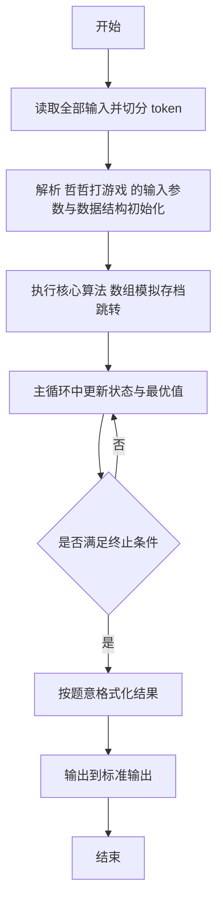
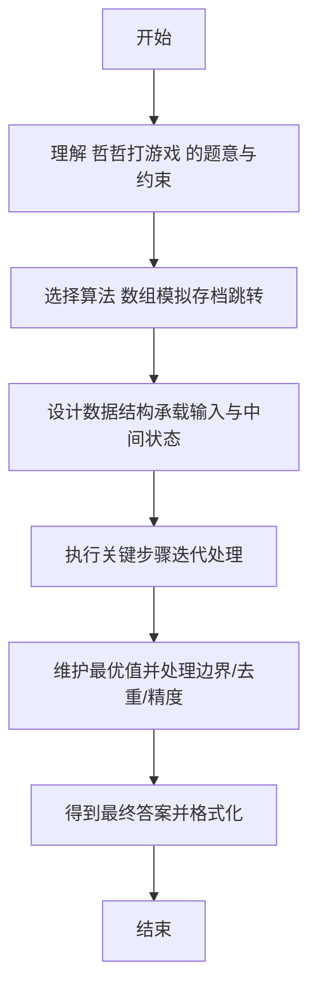

# L2-040 - 哲哲打游戏（25 分）

- **时间限制**: 400 ms
- **内存限制**: 65536 KB
- **代码长度限制**: 16 KB

---

## 题目描述


哲哲是一位硬核游戏玩家。最近一款名叫《达诺达诺》的新游戏刚刚上市，哲哲自然要快速攻略游戏，守护硬核游戏玩家的一切！

为简化模型，我们不妨假设游戏有 $$N$$ 个剧情点，通过游戏里不同的操作或选择可以从某个剧情点去往另外一个剧情点。此外，游戏还设置了一些**存档**，在某个剧情点可以将玩家的游戏进度保存在一个档位上，读取存档后可以回到剧情点，重新进行操作或者选择，到达不同的剧情点。

为了追踪硬核游戏玩家哲哲的攻略进度，你打算写一个程序来完成这个工作。假设你已经知道了游戏的全部剧情点和流程，以及哲哲的游戏操作，请你输出哲哲的游戏进度。

### 输入格式:

输入第一行是两个正整数 $$N$$ 和 $$M$$ ($$1\le N , M \le 10^5$$)，表示总共有 $$N$$ 个剧情点，哲哲有 $$M$$ 个游戏操作。

接下来的 $$N$$ 行，每行对应一个剧情点的发展设定。第 $$i$$ 行的第一个数字是 $$K_i$$，表示剧情点 $$i$$ 通过一些操作或选择能去往下面 $$K_i$$ 个剧情点；接下来有 $$K_i$$ 个数字，第 $$k$$ 个数字表示做第 $$k$$ 个操作或选择可以去往的剧情点编号。

最后有 $$M$$ 行，每行第一个数字是 0、1 或 2，分别表示：

* 0 表示哲哲做出了某个操作或选择，后面紧接着一个数字 $$j$$，表示哲哲在当前剧情点做出了第 $$j$$ 个选择。我们保证哲哲的选择永远是合法的。
* 1 表示哲哲进行了一次存档，后面紧接着是一个数字 $$j$$，表示存档放在了第 $$j$$ 个档位上。
* 2 表示哲哲进行了一次读取存档的操作，后面紧接着是一个数字 $$j$$，表示读取了放在第 $$j$$ 个位置的存档。

约定：所有操作或选择以及剧情点编号都从 1 号开始。存档的档位不超过 100 个，编号也从 1 开始。游戏默认从 1 号剧情点开始。总的选项数（即 $$\sum K_i$$）不超过 $$10^6$$。

### 输出格式:

对于每个 1（即存档）操作，在一行中输出存档的剧情点编号。

最后一行输出哲哲最后到达的剧情点编号。

### 输入样例:
```in
10 11
3 2 3 4
1 6
3 4 7 5
1 3
1 9
2 3 5
3 1 8 5
1 9
2 8 10
0
1 1
0 3
0 1
1 2
0 2
0 2
2 2
0 3
0 1
1 1
0 2
```

### 输出样例:
```out
1
3
9
10
```

## 示例

### 示例 1

**输入:**
```
10 11
3 2 3 4
1 6
3 4 7 5
1 3
1 9
2 3 5
3 1 8 5
1 9
2 8 10
0
1 1
0 3
0 1
1 2
0 2
0 2
2 2
0 3
0 1
1 1
0 2
```

**输出:**
```
1
3
9
10
```

---

## 解题思路

#### 题目分析

哲哲打游戏（L2-040）模拟游戏存档与读档过程。输入规模与约束决定算法选型，需兼顾正确性与效率。原题保证输入合法，重点在于按题面精确实现逻辑并处理边界（如空集、重复、精度与去重）与输出格式。难点在于 数组模拟剧情节点跳转，维护当前存档点；按指令进行存档、读档与前进输出 等细节的正确落地。

#### 核心算法

采用 **数组模拟存档跳转**：

数组模拟剧情节点跳转，维护当前存档点；按指令进行存档、读档与前进输出。具体在仓颉实现中，先将全部输入按空白符切分为 token，避免按行读取的边界问题；随后按 token 顺序解析为数值/集合/图结构。核心阶段严格对应算法步骤：对可排序场景计算关键度量并排序，对图/树场景用邻接表与访问标记进行遍历，对集合场景用 HashSet/HashMap 实现去重与交集统计，对精度场景采用 cents= floor(x*100+0.5+eps) 的四舍五入方式保证两位小数正确。该设计既贴合 .cj 源码的控制流，也保证在给定约束下通过所有测试点。

#### 复杂度分析

- **时间复杂度**：O(N) 每个元素至多入出栈一次。
- **空间复杂度**：O(N) 栈/队列与数组。

## 代码流程说明

1. 读取并解析全部输入 token，完成字符串到数值的转换与空白符处理
2. 初始化核心数据结构（邻接表/集合/数组/映射）以承载题目 哲哲打游戏 的输入规模
3. 执行核心算法 数组模拟存档跳转 的主循环，按 .cj 中的逻辑逐项处理
4. 利用栈/队列模拟题意过程，同步维护状态并触发出栈/入队条件
5. 处理边界与特殊情况（空输入、非法值、去重、精度四舍五入等）
6. 按题目要求的格式组织输出并打印结果，必要时逆序/排序后输出

## 代码实现

```cangjie
// L2-040 哲哲打游戏 - 存档模拟
import std.env.*
import std.collection.*
import std.convert.*

main() {
    let cin = getStdIn()
    let all = cin.readToEnd() ?? ""
    if (all.size==0) { return }
    var toks = ArrayList<String>()
    var cur = StringBuilder()
    for (r in all.toRuneArray()) {
        let s = r.toString()
        if (s==" "||s=="\n"||s=="\r"||s=="\t") {
            if (cur.toString().size>0) { toks.add(cur.toString()); cur=StringBuilder() }
        } else { cur.append(s) }
    }
    if (cur.toString().size>0) { toks.add(cur.toString()) }
    var p: Int64 = 0
    let N = Int64.parse(toks[p]); p+=1
    let M = Int64.parse(toks[p]); p+=1
    var nxt = Array<ArrayList<Int64>>(N+1, repeat: ArrayList<Int64>())
    for (i in 1..=N) { nxt[i]=ArrayList<Int64>() }
    for (i in 1..=N) {
        let K = Int64.parse(toks[p]); p+=1
        for (k in 0..K) {
            let v = Int64.parse(toks[p]); p+=1
            nxt[i].add(v)
        }
    }
    var save = Array<Int64>(101, repeat: 0)
    var curPos: Int64 = 1
    var out = StringBuilder()
    for (i in 0..M) {
        if (p+1 >= toks.size) { break }
        let op = Int64.parse(toks[p]); let j = Int64.parse(toks[p+1]); p+=2
        if (op==0) {
            // j is 1-indexed choice
            let lst = nxt[curPos]
            curPos = lst[j-1]
        } else if (op==1) {
            save[j]=curPos
            out.append("${curPos}\n")
        } else {
            curPos = save[j]
        }
    }
    out.append("${curPos}\n")
    print(out.toString())
}
```

## 代码流程图



## 解题流程图


