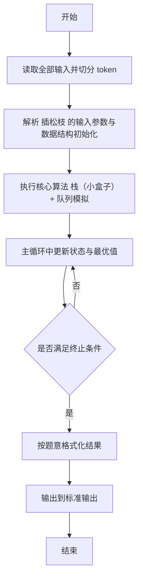
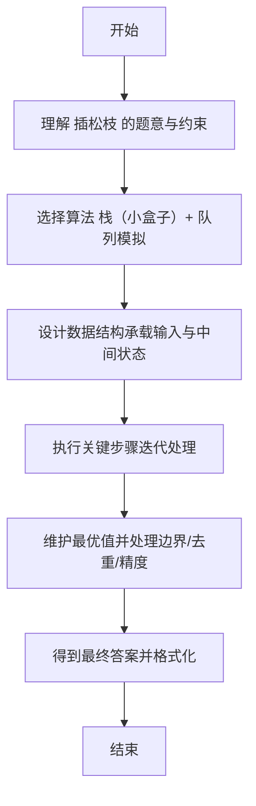

# L2-041 - 插松枝（25 分）

- **时间限制**: 400 ms
- **内存限制**: 65536 KB
- **代码长度限制**: 16 KB

---

## 题目描述


人造松枝加工场的工人需要将各种尺寸的塑料松针插到松枝干上，做成大大小小的松枝。他们的工作流程（并不）是这样的：

- 每人手边有一只小盒子，初始状态为空。
- 每人面前有用不完的松枝干和一个推送器，每次推送一片随机型号的松针片。
- 工人首先捡起一根空的松枝干，从小盒子里摸出最上面的一片松针 —— 如果小盒子是空的，就从推送器上取一片松针。将这片松针插到枝干的最下面。
- 工人在插后面的松针时，需要保证，每一步插到一根非空松枝干上的松针片，不能比前一步插上的松针片大。如果小盒子中最上面的松针满足要求，就取之插好；否则去推送器上取一片。如果推送器上拿到的仍然不满足要求，就把拿到的这片堆放到小盒子里，继续去推送器上取下一片。注意这里假设小盒子里的松针片是按放入的顺序堆叠起来的，工人每次只能取出最上面（即最后放入）的一片。
- 当下列三种情况之一发生时，工人会结束手里的松枝制作，开始做下一个：

（1）小盒子已经满了，但推送器上取到的松针仍然不满足要求。此时将手中的松枝放到成品篮里，推送器上取到的松针压回推送器，开始下一根松枝的制作。

（2）小盒子中最上面的松针不满足要求，但推送器上已经没有松针了。此时将手中的松枝放到成品篮里，开始下一根松枝的制作。

（3）手中的松枝干上已经插满了松针，将之放到成品篮里，开始下一根松枝的制作。

现在给定推送器上顺序传过来的 $$N$$ 片松针的大小，以及小盒子和松枝的容量，请你编写程序自动列出每根成品松枝的信息。

### 输入格式:

输入在第一行中给出 3 个正整数：$$N$$（$$\le 10^3$$），为推送器上松针片的数量；$$M$$（$$\le 20$$）为小盒子能存放的松针片的最大数量；$$K$$（$$\le 5$$）为一根松枝干上能插的松针片的最大数量。

随后一行给出 $$N$$ 个不超过 $$100$$ 的正整数，为推送器上顺序推出的松针片的大小。

### 输出格式:

每支松枝成品的信息占一行，顺序给出自底向上每片松针的大小。数字间以 1 个空格分隔，行首尾不得有多余空格。

### 输入样例:
```in
8 3 4
20 25 15 18 20 18 8 5
```

### 输出样例:
```out
20 15
20 18 18 8
25 5
```

## 示例

### 示例 1

**输入:**
```
8 3 4
20 25 15 18 20 18 8 5
```

**输出:**
```
20 15
20 18 18 8
25 5
```

---

## 解题思路

#### 题目分析

插松枝（L2-041）模拟松枝插盒过程。输入规模与约束决定算法选型，需兼顾正确性与效率。原题保证输入合法，重点在于按题面精确实现逻辑并处理边界（如空集、重复、精度与去重）与输出格式。难点在于 队列按顺序取松枝，尝试放入小盒子栈中；判断栈顶是否可弹出形成递增片段，否则继续；按批次输出结果 等细节的正确落地。

#### 核心算法

采用 **栈（小盒子）+ 队列模拟**：

队列按顺序取松枝，尝试放入小盒子栈中；判断栈顶是否可弹出形成递增片段，否则继续；按批次输出结果。具体在仓颉实现中，先将全部输入按空白符切分为 token，避免按行读取的边界问题；随后按 token 顺序解析为数值/集合/图结构。核心阶段严格对应算法步骤：对可排序场景计算关键度量并排序，对图/树场景用邻接表与访问标记进行遍历，对集合场景用 HashSet/HashMap 实现去重与交集统计，对精度场景采用 cents= floor(x*100+0.5+eps) 的四舍五入方式保证两位小数正确。该设计既贴合 .cj 源码的控制流，也保证在给定约束下通过所有测试点。

#### 复杂度分析

- **时间复杂度**：O(N) 每个元素至多入出栈一次。
- **空间复杂度**：O(N) 栈/队列与数组。

## 代码流程说明

1. 读取并解析全部输入 token，完成字符串到数值的转换与空白符处理
2. 初始化核心数据结构（邻接表/集合/数组/映射）以承载题目 插松枝 的输入规模
3. 执行核心算法 栈（小盒子）+ 队列模拟 的主循环，按 .cj 中的逻辑逐项处理
4. 利用栈/队列模拟题意过程，同步维护状态并触发出栈/入队条件
5. 处理边界与特殊情况（空输入、非法值、去重、精度四舍五入等）
6. 按题目要求的格式组织输出并打印结果，必要时逆序/排序后输出

## 代码实现

```cangjie
// L2-041 插松枝 - 小盒子栈模拟
import std.env.*
import std.collection.*
import std.convert.*

main() {
    let cin = getStdIn()
    let all = cin.readToEnd() ?? ""
    if (all.size==0) { return }
    var toks = ArrayList<String>()
    var cur = StringBuilder()
    for (r in all.toRuneArray()) {
        let s = r.toString()
        if (s==" "||s=="\n"||s=="\r"||s=="\t") {
            if (cur.toString().size>0) { toks.add(cur.toString()); cur=StringBuilder() }
        } else { cur.append(s) }
    }
    if (cur.toString().size>0) { toks.add(cur.toString()) }
    var p: Int64 = 0
    let N = Int64.parse(toks[p]); p+=1
    let BoxCap = Int64.parse(toks[p]); p+=1
    let K = Int64.parse(toks[p]); p+=1
    var push = Array<Int64>(N, repeat: 0)
    for (i in 0..N) { push[i]=Int64.parse(toks[p]); p+=1 }
    var box = ArrayList<Int64>()
    var curBranch = ArrayList<Int64>()
    var results = ArrayList<ArrayList<Int64>>()
    var idx: Int64 = 0
    while (idx < N || box.size > 0) {
        if (curBranch.size == 0) {
            if (box.size > 0) {
                let v = box[box.size-1]; box.remove((box.size-1)..box.size)
                curBranch.add(v)
                if (curBranch.size == K) {
                    var copy = ArrayList<Int64>()
                    for (x in curBranch) { copy.add(x) }
                    results.add(copy)
                    curBranch = ArrayList<Int64>()
                }
            } else {
                if (idx < N) {
                    curBranch.add(push[idx]); idx+=1
                    if (curBranch.size == K) {
                        var copy = ArrayList<Int64>()
                        for (x in curBranch) { copy.add(x) }
                        results.add(copy)
                        curBranch = ArrayList<Int64>()
                    }
                } else { break }
            }
            continue
        }
        let last = curBranch[curBranch.size-1]
        if (box.size > 0 && box[box.size-1] <= last) {
            let v = box[box.size-1]; box.remove((box.size-1)..box.size)
            curBranch.add(v)
            if (curBranch.size == K) {
                var copy = ArrayList<Int64>()
                for (x in curBranch) { copy.add(x) }
                results.add(copy)
                curBranch = ArrayList<Int64>()
            }
        } else {
            if (idx >= N) {
                var copy = ArrayList<Int64>()
                for (x in curBranch) { copy.add(x) }
                results.add(copy)
                curBranch = ArrayList<Int64>()
            } else {
                let needle = push[idx]; idx+=1
                if (needle <= last) {
                    curBranch.add(needle)
                    if (curBranch.size == K) {
                        var copy = ArrayList<Int64>()
                        for (x in curBranch) { copy.add(x) }
                        results.add(copy)
                        curBranch = ArrayList<Int64>()
                    }
                } else {
                    if (box.size < BoxCap) {
                        box.add(needle)
                    } else {
                        var copy = ArrayList<Int64>()
                        for (x in curBranch) { copy.add(x) }
                        results.add(copy)
                        curBranch = ArrayList<Int64>()
                        idx-=1
                    }
                }
            }
        }
    }
    if (curBranch.size > 0) {
        var copy = ArrayList<Int64>()
        for (x in curBranch) { copy.add(x) }
        results.add(copy)
    }
    for (b in results) {
        var sb = StringBuilder()
        for (i in 0..b.size) {
            if (i>0) { sb.append(" ") }
            sb.append("${b[i]}")
        }
        println(sb.toString())
    }
}
```

## 代码流程图



## 解题流程图


