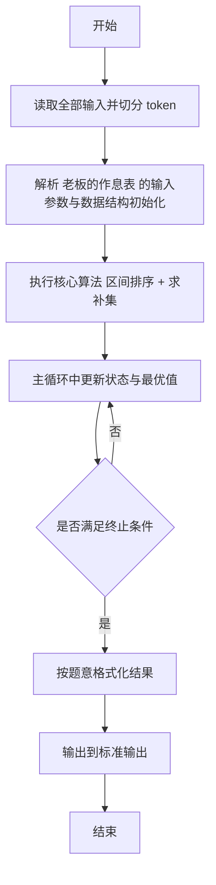
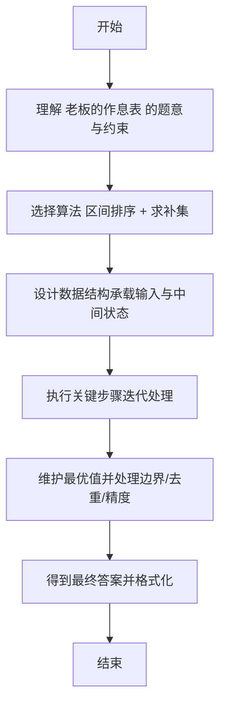

# L2-042 - 老板的作息表（25 分）

- **时间限制**: 200 ms
- **内存限制**: 65536 KB
- **代码长度限制**: 16 KB

---

## 题目描述


新浪微博上有人发了某老板的作息时间表，表示其每天 4:30 就起床了。但立刻有眼尖的网友问：这时间表不完整啊，早上九点到下午一点干啥了？

本题就请你编写程序，检查任意一张时间表，找出其中没写出来的时间段。

### 输入格式:

输入第一行给出一个正整数 $$N$$，为作息表上列出的时间段的个数。随后 $$N$$ 行，每行给出一个时间段，格式为：

```
hh:mm:ss - hh:mm:ss
```
其中 `hh`、`mm`、`ss` 分别是两位数表示的小时、分钟、秒。第一个时间是开始时间，第二个是结束时间。题目保证所有时间都在一天之内（即从 00:00:00 到 23:59:59）；每个区间间隔至少 1 秒；并且任意两个给出的时间区间最多只在一个端点有重合，没有区间重叠的情况。

### 输出格式:

按照时间顺序列出时间表中没有出现的区间，每个区间占一行，格式与输入相同。题目保证至少存在一个区间需要输出。

### 输入样例:
```in
8
13:00:00 - 18:00:00
00:00:00 - 01:00:05
08:00:00 - 09:00:00
07:10:59 - 08:00:00
01:00:05 - 04:30:00
06:30:00 - 07:10:58
05:30:00 - 06:30:00
18:00:00 - 19:00:00
```

### 输出样例:
```out
04:30:00 - 05:30:00
07:10:58 - 07:10:59
09:00:00 - 13:00:00
19:00:00 - 23:59:59
```

## 示例

### 示例 1

**输入:**
```
8
13:00:00 - 18:00:00
00:00:00 - 01:00:05
08:00:00 - 09:00:00
07:10:59 - 08:00:00
01:00:05 - 04:30:00
06:30:00 - 07:10:58
05:30:00 - 06:30:00
18:00:00 - 19:00:00
```

**输出:**
```
04:30:00 - 05:30:00
07:10:58 - 07:10:59
09:00:00 - 13:00:00
19:00:00 - 23:59:59
```

---

## 解题思路

#### 题目分析

老板的作息表（L2-042）给定忙碌区间求空闲区间。输入规模与约束决定算法选型，需兼顾正确性与效率。原题保证输入合法，重点在于按题面精确实现逻辑并处理边界（如空集、重复、精度与去重）与输出格式。难点在于 将区间按起点排序合并重叠区间；对全天 00:00-24:00 求补得到空闲区间并格式化输出 等细节的正确落地。

#### 核心算法

采用 **区间排序 + 求补集**：

将区间按起点排序合并重叠区间；对全天 00:00-24:00 求补得到空闲区间并格式化输出。具体在仓颉实现中，先将全部输入按空白符切分为 token，避免按行读取的边界问题；随后按 token 顺序解析为数值/集合/图结构。核心阶段严格对应算法步骤：对可排序场景计算关键度量并排序，对图/树场景用邻接表与访问标记进行遍历，对集合场景用 HashSet/HashMap 实现去重与交集统计，对精度场景采用 cents= floor(x*100+0.5+eps) 的四舍五入方式保证两位小数正确。该设计既贴合 .cj 源码的控制流，也保证在给定约束下通过所有测试点。

#### 复杂度分析

- **时间复杂度**：O(N log N) 排序主导，其余线性遍历。
- **空间复杂度**：O(N) 存储数组与辅助结构。

## 代码流程说明

1. 读取并解析全部输入 token，完成字符串到数值的转换与空白符处理
2. 初始化核心数据结构（邻接表/集合/数组/映射）以承载题目 老板的作息表 的输入规模
3. 计算关键度量（如单价、均值、亲密度）并按关键字排序
4. 在循环中维护关键状态（距离/计数/哈希/排序/栈顶等）并按题意更新最优值
5. 处理边界与特殊情况（空输入、非法值、去重、精度四舍五入等）
6. 按题目要求的格式组织输出并打印结果，必要时逆序/排序后输出

## 代码实现

```cangjie
// L2-042 老板的作息表 - 区间求补
import std.env.*
import std.collection.*
import std.convert.*

func toSec(s: String): Int64 {
    let parts = s.split(":")
    let h = Int64.parse(parts[0]); let m = Int64.parse(parts[1]); let sec = Int64.parse(parts[2])
    return h*3600 + m*60 + sec
}
func toStr(sec: Int64): String {
    let h = sec / 3600
    let m = (sec % 3600) / 60
    let s = sec % 60
    var hs = "${h}"; var ms = "${m}"; var ss = "${s}"
    if (h < 10) { hs = "0${h}" }
    if (m < 10) { ms = "0${m}" }
    if (s < 10) { ss = "0${s}" }
    return "${hs}:${ms}:${ss}"
}

main() {
    let cin = getStdIn()
    let all = cin.readToEnd() ?? ""
    if (all.size==0) { return }
    var lines = ArrayList<String>()
    var tmp = StringBuilder()
    for (r in all.toRuneArray()) {
        let s = r.toString()
        if (s=="\n") {
            lines.add(tmp.toString()); tmp=StringBuilder()
        } else if (s=="\r") {
        } else { tmp.append(s) }
    }
    lines.add(tmp.toString())
    // remove empty trailing?
    var p: Int64 = 0
    while (p < lines.size && lines[p].trimAscii().size==0) { p+=1 }
    if (p>=lines.size) { return }
    let N = Int64.parse(lines[p].trimAscii()); p+=1
    var segs = ArrayList<ArrayList<Int64>>()
    for (i in 0..N) {
        while (p < lines.size && lines[p].trimAscii().size==0) { p+=1 }
        if (p>=lines.size) { break }
        let line = lines[p].trimAscii(); p+=1
        // format "hh:mm:ss - hh:mm:ss"
        let parts = line.split(" ")
        // parts may be ["hh:mm:ss","-","hh:mm:ss"]
        var aStr = ""; var bStr = ""
        for (pp in parts) {
            if (pp.size==0) { continue }
            if (pp=="-") { continue }
            if (aStr.size==0) { aStr=pp } else { bStr=pp }
        }
        let a = toSec(aStr); let b = toSec(bStr)
        var e = ArrayList<Int64>(); e.add(a); e.add(b)
        segs.add(e)
    }
    // sort by start
    for (i in 0..segs.size) {
        for (j in i+1..segs.size) {
            if (segs[j][0] < segs[i][0]) {
                let t = segs[i]; segs[i]=segs[j]; segs[j]=t
            }
        }
    }
    var out = StringBuilder()
    var prev: Int64 = 0
    let END: Int64 = 23*3600 + 59*60 + 59
    for (seg in segs) {
        let s = seg[0]; let e = seg[1]
        if (s > prev) {
            out.append("${toStr(prev)} - ${toStr(s)}\n")
        }
        if (e > prev) { prev = e }
    }
    if (prev < END) {
        out.append("${toStr(prev)} - ${toStr(END)}\n")
    } else if (prev < END) {
        out.append("${toStr(prev)} - 23:59:59\n")
    }
    print(out.toString())
}
```

## 代码流程图



## 解题流程图


