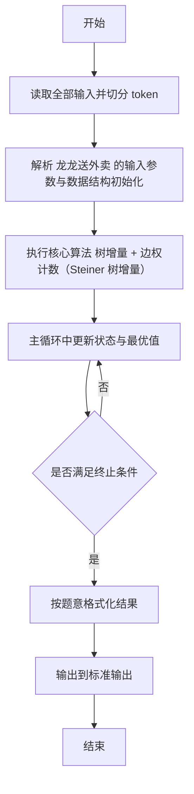
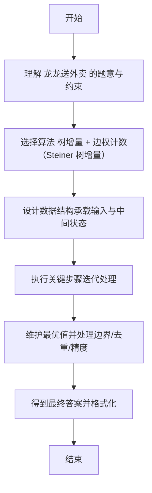

# L2-043 - 龙龙送外卖（25 分）

- **时间限制**: 400 ms
- **内存限制**: 65536 KB
- **代码长度限制**: 16 KB

---

## 题目描述


龙龙是“饱了呀”外卖软件的注册骑手，负责送帕特小区的外卖。帕特小区的构造非常特别，都是双向道路且没有构成环 —— 你可以简单地认为小区的路构成了一棵树，根结点是外卖站，树上的结点就是要送餐的地址。

每到中午 12 点，帕特小区就进入了点餐高峰。一开始，只有一两个地方点外卖，龙龙简单就送好了；但随着大数据的分析，龙龙被派了更多的单子，也就送得越来越累……

看着一大堆订单，龙龙想知道，从外卖站出发，访问所有点了外卖的地方至少一次（这样才能把外卖送到）所需的最短路程的距离到底是多少？每次新增一个点外卖的地址，他就想估算一遍整体工作量，这样他就可以搞明白新增一个地址给他带来了多少负担。

### 输入格式:

输入第一行是两个数 $N$ 和 $M$ ($2 \le N \le 10^5$, $1 \le M \le  10^5$)，分别对应树上节点的个数（包括外卖站），以及新增的送餐地址的个数。

接下来首先是一行 $N$ 个数，第 $i$ 个数表示第 $i$ 个点的双亲节点的编号。节点编号从 1 到 $N$，外卖站的双亲编号定义为 $-1$。

接下来有 $M$ 行，每行给出一个新增的送餐地点的编号 $X_i$。保证送餐地点中不会有外卖站，但地点有可能会重复。

为了方便计算，我们可以假设龙龙一开始一个地址的外卖都不用送，两个相邻的地点之间的路径长度统一设为 1，且从外卖站出发可以访问到所有地点。

注意：所有送餐地址可以按任意顺序访问，***且完成送餐后无需返回外卖站***。

### 输出格式:

对于每个新增的地点，在一行内输出题目需要求的最短路程的距离。

### 输入样例:
```in
7 4
-1 1 1 1 2 2 3
5
6
2
4
```

### 输出样例:
```out
2
4
4
6
```

## 示例

### 示例 1

**输入:**
```
7 4
-1 1 1 1 2 2 3
5
6
2
4
```

**输出:**
```
2
4
4
6
```

---

## 解题思路

#### 题目分析

龙龙送外卖（L2-043）动态加餐馆点，求包含所有点的最小子树边数*2 - 最远距离。输入规模与约束决定算法选型，需兼顾正确性与效率。原题保证输入合法，重点在于按题面精确实现逻辑并处理边界（如空集、重复、精度与去重）与输出格式。难点在于 维护已选点集与总边数 tot；每次新点用 LCA/父指针向上标记未访问边增量；用最远点距离维护答案 tot*2 - ma 等细节的正确落地。

#### 核心算法

采用 **树增量 + 边权计数（Steiner 树增量）**：

维护已选点集与总边数 tot；每次新点用 LCA/父指针向上标记未访问边增量；用最远点距离维护答案 tot*2 - maxDist。具体在仓颉实现中，先将全部输入按空白符切分为 token，避免按行读取的边界问题；随后按 token 顺序解析为数值/集合/图结构。核心阶段严格对应算法步骤：对可排序场景计算关键度量并排序，对图/树场景用邻接表与访问标记进行遍历，对集合场景用 HashSet/HashMap 实现去重与交集统计，对精度场景采用 cents= floor(x*100+0.5+eps) 的四舍五入方式保证两位小数正确。该设计既贴合 .cj 源码的控制流，也保证在给定约束下通过所有测试点。

#### 复杂度分析

- **时间复杂度**：O(N log N) 或 O(N) 视实现而定。
- **空间复杂度**：O(N)。

## 代码流程说明

1. 读取并解析全部输入 token，完成字符串到数值的转换与空白符处理
2. 初始化核心数据结构（邻接表/集合/数组/映射）以承载题目 龙龙送外卖 的输入规模
3. 初始化 dist/cnt/maxTeams/prev 等数组并执行 Dijkstra/Floyd 最短路主循环
4. 在循环中维护关键状态（距离/计数/哈希/排序/栈顶等）并按题意更新最优值
5. 处理边界与特殊情况（空输入、非法值、去重、精度四舍五入等）
6. 按题目要求的格式组织输出并打印结果，必要时逆序/排序后输出

## 代码实现

```cangjie
// L2-043 龙龙送外卖 - 树上增量 Steiner
import std.env.*
import std.collection.*
import std.convert.*

func find(par: Array<Int64>, x: Int64): Int64 {
    var cur = x
    while (par[cur] != cur) {
        par[cur] = par[par[cur]]
        cur = par[cur]
    }
    return cur
}

main() {
    let cin = getStdIn()
    let all = cin.readToEnd() ?? ""
    if (all.size==0) { return }
    var toks = ArrayList<String>()
    var curSb = StringBuilder()
    for (r in all.toRuneArray()) {
        let s = r.toString()
        if (s==" "||s=="\n"||s=="\r"||s=="\t") {
            if (curSb.toString().size>0) { toks.add(curSb.toString()); curSb=StringBuilder() }
        } else { curSb.append(s) }
    }
    if (curSb.toString().size>0) { toks.add(curSb.toString()) }
    var p: Int64 = 0
    let N = Int64.parse(toks[p]); p+=1
    let M = Int64.parse(toks[p]); p+=1
    var parent = Array<Int64>(N+1, repeat: 0)
    var root: Int64 = 1
    for (i in 1..=N) {
        let pr = Int64.parse(toks[p]); p+=1
        if (pr == -1) { root=i; parent[i]=i } else { parent[i]=pr }
        // store for DSU find? we use parentTree separately
    }
    // depth via BFS from root
    var children = Array<ArrayList<Int64>>(N+1, repeat: ArrayList<Int64>())
    for (i in 1..=N) { children[i]=ArrayList<Int64>() }
    for (i in 1..=N) {
        if (i==root) { continue }
        let pr = parent[i]
        if (pr>=1 && pr<=N) { children[pr].add(i) }
    }
    var depth = Array<Int64>(N+1, repeat: 0)
    var stack = ArrayList<Int64>(); stack.add(root)
    var visited = Array<Bool>(N+1, repeat: false)
    visited[root]=true
    var q = ArrayList<Int64>(); q.add(root)
    var qhead: Int64 = 0
    while (qhead < q.size) {
        let u = q[qhead]; qhead+=1
        for (v in children[u]) {
            depth[v]=depth[u]+1
            q.add(v)
        }
    }
    // DSU for uncovered edges
    var dsu = Array<Int64>(N+1, repeat: 0)
    for (i in 0..N) { dsu[i]=i }
    // helper find with path compression iterative
    var isMarked = Array<Bool>(N+1, repeat: false)
    isMarked[root]=true // root considered visited for edge counting? we count edges of non-root nodes only
    // Actually mark root as visited so its edge not counted
    // For DSU, root's parent is itself
    var total: Int64 = 0
    var maxDepth: Int64 = 0
    var out = StringBuilder()
    // need parentTree for DSU jumps: parentTree[i]
    var treePar = Array<Int64>(N+1, repeat: 0)
    for (i in 1..=N) { treePar[i]=parent[i] }
    treePar[root]=root

    func findRep(x: Int64): Int64 {
        var r = x
        while (dsu[r] != r) { r = dsu[r] }
        // path compress
        var cur2 = x
        while (dsu[cur2] != r) {
            let nxt = dsu[cur2]
            dsu[cur2]=r
            cur2=nxt
        }
        return r
    }

    for (i in 0..M) {
        if (p >= toks.size) { break }
        let x = Int64.parse(toks[p]); p+=1
        if (!isMarked[x]) {
            isMarked[x]=true
            if (depth[x] > maxDepth) { maxDepth = depth[x] }
            var curNode = findRep(x)
            while (curNode != root) {
                total+=1
                dsu[curNode]=findRep(treePar[curNode])
                curNode = dsu[curNode]
            }
        }
        let ans = total*2 - maxDepth
        out.append("${ans}\n")
    }
    print(out.toString())
}
```

## 代码流程图



## 解题流程图


