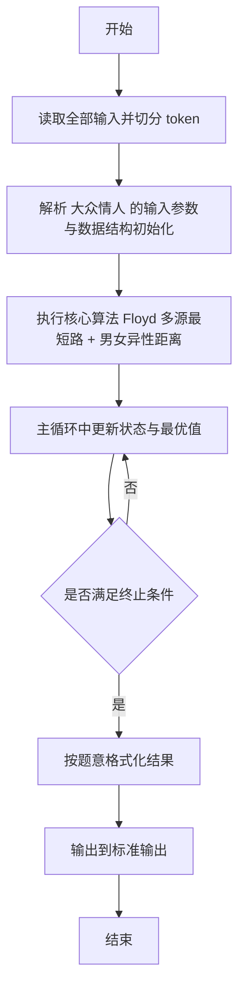
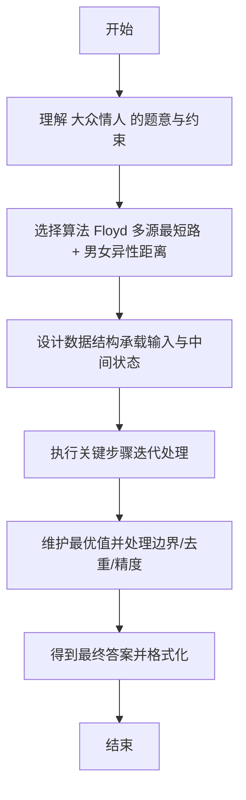

# L2-044 - 大众情人（25 分）

- **时间限制**: 400 ms
- **内存限制**: 65536 KB
- **代码长度限制**: 16 KB

---

## 题目描述


人与人之间总有一点距离感。我们假定两个人之间的亲密程度跟他们之间的距离感成反比，并且距离感是单向的。例如小蓝对小红患了单相思，从小蓝的眼中看去，他和小红之间的距离为 1，只差一层窗户纸；但在小红的眼里，她和小蓝之间的距离为 108000，差了十万八千里…… 另外，我们进一步假定，距离感在认识的人之间是可传递的。例如小绿觉得自己跟小蓝之间的距离为 2，则即使小绿并不直接认识小红，我们也默认小绿早晚会认识小红，并且因为跟小蓝很亲近的关系，小绿会觉得自己跟小红之间的距离为 1+2=3。当然这带来一个问题，如果小绿本来也认识小红，或者他通过其他人也能认识小红，但通过不同渠道推导出来的距离感不一样，该怎么算呢？我们在这里做个简单定义，就将小绿对小红的距离感定义为所有推导出来的距离感的最小值。

一个人的异性缘不是由最喜欢他/她的那个异性决定的，而是由对他/她最无感的那个异性决定的。我们记一个人 $$i$$ 在一个异性 $$j$$ 眼中的距离感为 $$D_{ij}$$；将 $$i$$ 的“异性缘”定义为 $$1/\max_{j\in S(i)} \{ D_{ij}\}$$，其中 $$S(i)$$ 是相对于 $$i$$ 的所有异性的集合。那么“大众情人”就是异性缘最好（值最大）的那个人。

本题就请你从给定的一批人与人之间的距离感中分别找出两个性别中的“大众情人”。

### 输入格式:

输入在第一行中给出一个正整数 $$N$$（$$\le 500$$），为总人数。于是我们默认所有人从 1 到 $$N$$ 编号。

随后 $$N$$ 行，第 $$i$$ 行描述了编号为 $$i$$ 的人与其他人的关系，格式为：

```
性别 K 朋友1:距离1 朋友2:距离2 …… 朋友K:距离K
```

其中 `性别` 是这个人的性别，`F` 表示女性，`M` 表示男性；`K`（$$<N$$ 的非负整数）为这个人直接认识的朋友数；随后给出的是这 `K` 个朋友的编号、以及这个人对该朋友的距离感。距离感是不超过 $$10^6$$ 的正整数。

题目保证给出的关系中一定两种性别的人都有，不会出现重复给出的关系，并且每个人的朋友中都不包含自己。

### 输出格式:

第一行给出自身为女性的“大众情人”的编号，第二行给出自身为男性的“大众情人”的编号。如果存在并列，则按编号递增的顺序输出所有。数字间以一个空格分隔，行首尾不得有多余空格。

### 输入样例:
```in
6
F 1 4:1
F 2 1:3 4:10
F 2 4:2 2:2
M 2 5:1 3:2
M 2 2:2 6:2
M 2 3:1 2:5
```

### 输出样例:
```out
2 3
4
```

## 示例

### 示例 1

**输入:**
```
6
F 1 4:1
F 2 1:3 4:10
F 2 4:2 2:2
M 2 5:1 3:2
M 2 2:2 6:2
M 2 3:1 2:5
```

**输出:**
```
2 3
4
```

---

## 解题思路

#### 题目分析

大众情人（L2-044）对男女分别求到异性的平均最短距离最优者。输入规模与约束决定算法选型，需兼顾正确性与效率。原题保证输入合法，重点在于按题面精确实现逻辑并处理边界（如空集、重复、精度与去重）与输出格式。难点在于 Floyd 求所有点最短路；对每个男/女计算到所有异性的最短路均值，选均值最小的集合输出 等细节的正确落地。

#### 核心算法

采用 **Floyd 多源最短路 + 男女异性距离**：

Floyd 求所有点最短路；对每个男/女计算到所有异性的最短路均值，选均值最小的集合输出。具体在仓颉实现中，先将全部输入按空白符切分为 token，避免按行读取的边界问题；随后按 token 顺序解析为数值/集合/图结构。核心阶段严格对应算法步骤：对可排序场景计算关键度量并排序，对图/树场景用邻接表与访问标记进行遍历，对集合场景用 HashSet/HashMap 实现去重与交集统计，对精度场景采用 cents= floor(x*100+0.5+eps) 的四舍五入方式保证两位小数正确。该设计既贴合 .cj 源码的控制流，也保证在给定约束下通过所有测试点。

#### 复杂度分析

- **时间复杂度**：O(N³) Floyd 全源最短路。
- **空间复杂度**：O(N²) 邻接矩阵。

## 代码流程说明

1. 读取并解析全部输入 token，完成字符串到数值的转换与空白符处理
2. 初始化核心数据结构（邻接表/集合/数组/映射）以承载题目 大众情人 的输入规模
3. 初始化 dist/cnt/maxTeams/prev 等数组并执行 Dijkstra/Floyd 最短路主循环
4. 在循环中维护关键状态（距离/计数/哈希/排序/栈顶等）并按题意更新最优值
5. 处理边界与特殊情况（空输入、非法值、去重、精度四舍五入等）
6. 按题目要求的格式组织输出并打印结果，必要时逆序/排序后输出

## 代码实现

```cangjie
// L2-044 大众情人 - Floyd
import std.env.*
import std.collection.*
import std.convert.*

main() {
    let cin = getStdIn()
    let all = cin.readToEnd() ?? ""
    if (all.size==0) { return }
    var lines = ArrayList<String>()
    var tmp = StringBuilder()
    for (r in all.toRuneArray()) {
        let s = r.toString()
        if (s=="\n") { lines.add(tmp.toString()); tmp=StringBuilder() } else if (s=="\r") {} else { tmp.append(s) }
    }
    lines.add(tmp.toString())
    var p: Int64 = 0
    while (p < lines.size && lines[p].trimAscii().size==0) { p+=1 }
    let N = Int64.parse(lines[p].trimAscii()); p+=1
    let INF: Int64 = 4000000000000
    var dist = Array<Array<Int64>>(N+1, repeat: Array<Int64>(0, repeat: 0))
    for (i in 0..N+1) { dist[i]=Array<Int64>(N+1, repeat: INF); dist[i][i]=0 }
    var gender = Array<String>(N+1, repeat: "")
    for (i in 1..=N) {
        while (p < lines.size && lines[p].trimAscii().size==0) { p+=1 }
        if (p>=lines.size) { break }
        let line = lines[p].trimAscii(); p+=1
        let parts = line.split(" ").filter({x => x.size>0})
        gender[i]=parts[0]
        let K = Int64.parse(parts[1])
        for (k in 0..K) {
            let idx = 2 + k
            if (idx >= parts.size) { break }
            let kv = parts[idx]
            let kvParts = kv.split(":")
            let friend = Int64.parse(kvParts[0]); let d = Int64.parse(kvParts[1])
            if (d < dist[i][friend]) { dist[i][friend]=d }
        }
    }
    for (k in 1..=N) {
        for (i in 1..=N) {
            for (j in 1..=N) {
                let nd = dist[i][k] + dist[k][j]
                if (nd < dist[i][j]) { dist[i][j]=nd }
            }
        }
    }
    var femaleMax = Array<Int64>(N+1, repeat: INF)
    var maleMax = Array<Int64>(N+1, repeat: INF)
    for (i in 1..=N) {
        var mx: Int64 = 0
        var hasInf = false
        for (j in 1..=N) {
            if (gender[i]==gender[j]) { continue }
            if (dist[j][i] >= INF/2) { hasInf=true; break }
            if (dist[j][i] > mx) { mx = dist[j][i] }
        }
        if (hasInf) { mx = INF }
        if (gender[i]=="F") { femaleMax[i]=mx } else { maleMax[i]=mx }
    }
    var minF = INF; var minM = INF
    for (i in 1..=N) {
        if (gender[i]=="F" && femaleMax[i] < minF) { minF = femaleMax[i] }
        if (gender[i]=="M" && maleMax[i] < minM) { minM = maleMax[i] }
    }
    var outF = ArrayList<Int64>()
    var outM = ArrayList<Int64>()
    for (i in 1..=N) {
        if (gender[i]=="F" && femaleMax[i]==minF) { outF.add(i) }
        if (gender[i]=="M" && maleMax[i]==minM) { outM.add(i) }
    }
    var sb1 = StringBuilder()
    for (i in 0..outF.size) {
        if (i>0) { sb1.append(" ") }
        sb1.append("${outF[i]}")
    }
    println(sb1.toString())
    var sb2 = StringBuilder()
    for (i in 0..outM.size) {
        if (i>0) { sb2.append(" ") }
        sb2.append("${outM[i]}")
    }
    println(sb2.toString())
}
```

## 代码流程图



## 解题流程图


