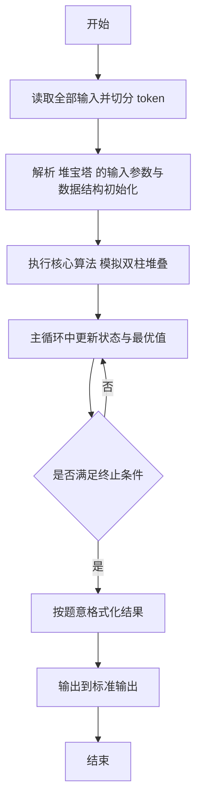
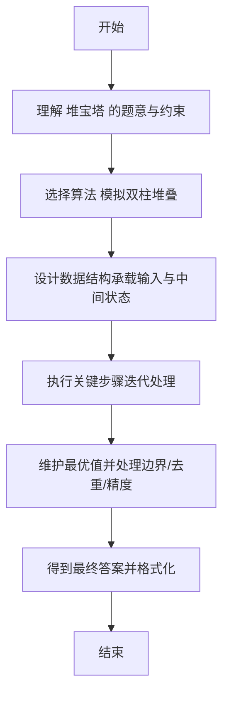

# L2-045 - 堆宝塔（25 分）

- **时间限制**: 400 ms
- **内存限制**: 65536 KB
- **代码长度限制**: 16 KB

---

## 题目描述


堆宝塔游戏是让小朋友根据抓到的彩虹圈的直径大小，按照从大到小的顺序堆起宝塔。但彩虹圈不一定是按照直径的大小顺序抓到的。聪明宝宝采取的策略如下：
- 首先准备两根柱子，一根 A 柱串宝塔，一根 B 柱用于临时叠放。
- 把第 1 块彩虹圈作为第 1 座宝塔的基座，在 A 柱放好。
- 将抓到的下一块彩虹圈 C 跟当前 A 柱宝塔最上面的彩虹圈比一下，如果比最上面的小，就直接放上去；否则把 C 跟 B 柱最上面的彩虹圈比一下：
-- 如果 B 柱是空的、或者 C 大，就在 B 柱上放好；
-- 否则把 A 柱上串好的宝塔取下来作为一件成品；然后把 B 柱上所有比 C 大的彩虹圈逐一取下放到 A 柱上，最后把 C 也放到 A 柱上。

重复此步骤，直到所有的彩虹圈都被抓完。最后 A 柱上剩下的宝塔作为一件成品，B 柱上剩下的彩虹圈被逐一取下，堆成另一座宝塔。问：宝宝一共堆出了几个宝塔？最高的宝塔有多少层？

### 输入格式:

输入第一行给出一个正整数 $$N$$（$$\le 10^3$$），为彩虹圈的个数。第二行按照宝宝抓取的顺序给出 $$N$$ 个不超过 100 的正整数，对应每个彩虹圈的直径。

### 输出格式:

在一行中输出宝宝堆出的宝塔个数，和最高的宝塔的层数。数字间以 1 个空格分隔，行首尾不得有多余空格。

### 输入样例:
```in
11
10 8 9 5 12 11 4 3 1 9 15
```

### 输出样例:
```out
4 5
```

## 示例

### 示例 1

**输入:**
```
11
10 8 9 5 12 11 4 3 1 9 15
```

**输出:**
```
4 5
```

---

## 解题思路

#### 题目分析

堆宝塔（L2-045）模拟在 A/B 两柱上堆宝塔，处理不稳定情况。输入规模与约束决定算法选型，需兼顾正确性与效率。原题保证输入合法，重点在于按题面精确实现逻辑并处理边界（如空集、重复、精度与去重）与输出格式。难点在于 按规则依次放置积木，维护两柱高度与稳定性判断，输出不稳定时的高度 等细节的正确落地。

#### 核心算法

采用 **模拟双柱堆叠**：

按规则依次放置积木，维护两柱高度与稳定性判断，输出不稳定时的高度。具体在仓颉实现中，先将全部输入按空白符切分为 token，避免按行读取的边界问题；随后按 token 顺序解析为数值/集合/图结构。核心阶段严格对应算法步骤：对可排序场景计算关键度量并排序，对图/树场景用邻接表与访问标记进行遍历，对集合场景用 HashSet/HashMap 实现去重与交集统计，对精度场景采用 cents= floor(x*100+0.5+eps) 的四舍五入方式保证两位小数正确。该设计既贴合 .cj 源码的控制流，也保证在给定约束下通过所有测试点。

#### 复杂度分析

- **时间复杂度**：O(N) 每个元素至多入出栈一次。
- **空间复杂度**：O(N) 栈/队列与数组。

## 代码流程说明

1. 读取并解析全部输入 token，完成字符串到数值的转换与空白符处理
2. 初始化核心数据结构（邻接表/集合/数组/映射）以承载题目 堆宝塔 的输入规模
3. 执行核心算法 模拟双柱堆叠 的主循环，按 .cj 中的逻辑逐项处理
4. 利用栈/队列模拟题意过程，同步维护状态并触发出栈/入队条件
5. 处理边界与特殊情况（空输入、非法值、去重、精度四舍五入等）
6. 按题目要求的格式组织输出并打印结果，必要时逆序/排序后输出

## 代码实现

```cangjie
// L2-045 堆宝塔 - 模拟A/B柱
import std.env.*
import std.collection.*
import std.convert.*

main() {
    let cin = getStdIn()
    let all = cin.readToEnd() ?? ""
    if (all.size==0) { return }
    var toks = ArrayList<String>()
    var cur = StringBuilder()
    for (r in all.toRuneArray()) {
        let s = r.toString()
        if (s==" "||s=="\n"||s=="\r"||s=="\t") {
            if (cur.toString().size>0) { toks.add(cur.toString()); cur=StringBuilder() }
        } else { cur.append(s) }
    }
    if (cur.toString().size>0) { toks.add(cur.toString()) }
    var p: Int64 = 0
    let N = Int64.parse(toks[p]); p+=1
    var arr = Array<Int64>(N, repeat: 0)
    for (i in 0..N) { arr[i]=Int64.parse(toks[p]); p+=1 }
    var A = ArrayList<Int64>()
    var B = ArrayList<Int64>()
    var towers = ArrayList<Int64>()
    for (i in 0..N) {
        let c = arr[i]
        if (A.size==0) {
            A.add(c)
        } else if (c < A[A.size-1]) {
            A.add(c)
        } else {
            if (B.size==0 || c > B[B.size-1]) {
                B.add(c)
            } else {
                towers.add(A.size)
                var newA = ArrayList<Int64>()
                while (B.size>0 && B[B.size-1] > c) {
                    let v = B[B.size-1]; B.remove((B.size-1)..B.size)
                    newA.add(v)
                }
                newA.add(c)
                A = newA
            }
        }
    }
    if (A.size>0) { towers.add(A.size) }
    if (B.size>0) { towers.add(B.size) }
    var maxH: Int64 = 0
    for (h in towers) { if (h>maxH) { maxH=h } }
    println("${towers.size} ${maxH}")
}
```

## 代码流程图



## 解题流程图


