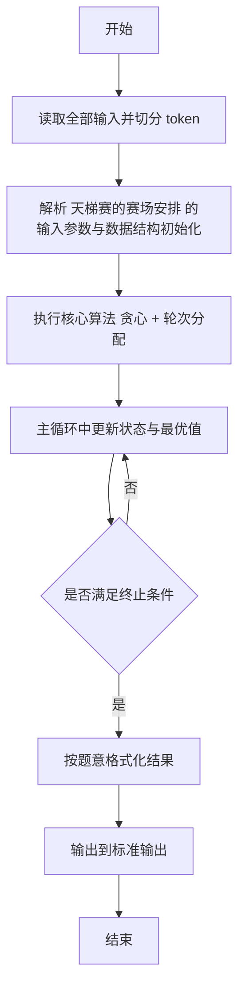
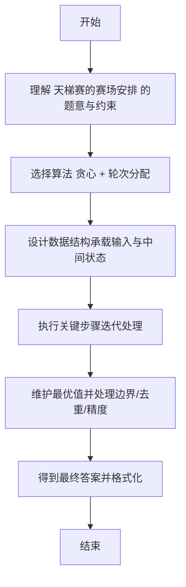

# L2-046 - 天梯赛的赛场安排（25 分）

- **时间限制**: 400 ms
- **内存限制**: 65536 KB
- **代码长度限制**: 16 KB

---

## 题目描述


天梯赛使用 OMS 监考系统，需要将参赛队员安排到系统中的虚拟赛场里，并为每个赛场分配一位监考老师。每位监考老师需要联系自己赛场内队员对应的教练们，以便发放比赛账号。为了尽可能减少教练和监考的沟通负担，我们要求赛场的安排满足以下条件：

* 每位监考老师负责的赛场里，队员人数不得超过赛场规定容量 $C$；
* 每位教练需要联系的监考人数尽可能少 —— 这里假设每所参赛学校只有一位负责联系的教练，且每个赛场的监考老师都不相同。

为此我们设计了多轮次排座算法，按照尚未安排赛场的队员人数从大到小的顺序，每一轮对当前未安排的人数最多的学校进行处理。记当前待处理的学校未安排人数为 $n$：

* 如果 $n\ge C$，则新开一个赛场，将 $C$ 位队员安排进去。剩下的人继续按人数规模排队，等待下一轮处理；
* 如果 $n<C$，则寻找剩余空位数大于等于 $n$ 的编号最小的赛场，将队员安排进去；
* 如果 $n<C$，且找不到任何非空的、剩余空位数大于等于 $n$ 的赛场了，则新开一个赛场，将队员安排进去。

由于近年来天梯赛的参赛人数快速增长，2023年超过了 480 所学校 1.6 万人，所以我们必须写个程序来处理赛场安排问题。

### 输入格式:

输入第一行给出两个正整数 $N$ 和 $C$，分别为参赛学校数量和每个赛场的规定容量，其中 $0<N\le 5000$，$10\le C \le 50$。随后 $N$ 行，每行给出一个学校的缩写（为长度不超过 6 的非空小写英文字母串）和该校参赛人数（不超过 500 的正整数），其间以空格分隔。题目保证每所学校只有一条记录。

### 输出格式:

按照输入的顺序，对每一所参赛高校，在一行中输出学校缩写和该校需要联系的监考人数，其间以 1 空格分隔。\
最后在一行中输出系统中应该开设多少个赛场。

### 输入样例:
```in
10 30
zju 30
hdu 93
pku 39
hbu 42
sjtu 21
abdu 10
xjtu 36
nnu 15
hnu 168
hsnu 20
```

### 输出样例:
```out
zju 1
hdu 4
pku 2
hbu 2
sjtu 1
abdu 1
xjtu 2
nnu 1
hnu 6
hsnu 1
16
```

## 示例

### 示例 1

**输入:**
```
10 30
zju 30
hdu 93
pku 39
hbu 42
sjtu 21
abdu 10
xjtu 36
nnu 15
hnu 168
hsnu 20
```

**输出:**
```
zju 1
hdu 4
pku 2
hbu 2
sjtu 1
abdu 1
xjtu 2
nnu 1
hnu 6
hsnu 1
16
```

---

## 解题思路

#### 题目分析

天梯赛的赛场安排（L2-046）多轮赛场安排，每轮按人数分配考场。输入规模与约束决定算法选型，需兼顾正确性与效率。原题保证输入合法，重点在于按题面精确实现逻辑并处理边界（如空集、重复、精度与去重）与输出格式。难点在于 按队伍人数排序后贪心分配到容量最小且足够的考场，更新剩余容量，多轮迭代 等细节的正确落地。

#### 核心算法

采用 **贪心 + 轮次分配**：

按队伍人数排序后贪心分配到容量最小且足够的考场，更新剩余容量，多轮迭代。具体在仓颉实现中，先将全部输入按空白符切分为 token，避免按行读取的边界问题；随后按 token 顺序解析为数值/集合/图结构。核心阶段严格对应算法步骤：对可排序场景计算关键度量并排序，对图/树场景用邻接表与访问标记进行遍历，对集合场景用 HashSet/HashMap 实现去重与交集统计，对精度场景采用 cents= floor(x*100+0.5+eps) 的四舍五入方式保证两位小数正确。该设计既贴合 .cj 源码的控制流，也保证在给定约束下通过所有测试点。

#### 复杂度分析

- **时间复杂度**：O(N log N) 排序主导，其余线性遍历。
- **空间复杂度**：O(N) 存储数组与辅助结构。

## 代码流程说明

1. 读取并解析全部输入 token，完成字符串到数值的转换与空白符处理
2. 初始化核心数据结构（邻接表/集合/数组/映射）以承载题目 天梯赛的赛场安排 的输入规模
3. 计算关键度量（如单价、均值、亲密度）并按关键字排序
4. 在循环中维护关键状态（距离/计数/哈希/排序/栈顶等）并按题意更新最优值
5. 处理边界与特殊情况（空输入、非法值、去重、精度四舍五入等）
6. 按题目要求的格式组织输出并打印结果，必要时逆序/排序后输出

## 代码实现

```cangjie
// L2-046 天梯赛的赛场安排 - 多轮分配
import std.env.*
import std.collection.*
import std.convert.*

main() {
    let cin = getStdIn()
    let all = cin.readToEnd() ?? ""
    if (all.size==0) { return }
    var toks = ArrayList<String>()
    var cur = StringBuilder()
    for (r in all.toRuneArray()) {
        let s = r.toString()
        if (s==" "||s=="\n"||s=="\r"||s=="\t") {
            if (cur.toString().size>0) { toks.add(cur.toString()); cur=StringBuilder() }
        } else { cur.append(s) }
    }
    if (cur.toString().size>0) { toks.add(cur.toString()) }
    var p: Int64 = 0
    let N = Int64.parse(toks[p]); p+=1
    let C = Int64.parse(toks[p]); p+=1
    var names = Array<String>(N, repeat: "")
    var counts = Array<Int64>(N, repeat: 0)
    var contact = Array<Int64>(N, repeat: 0)
    for (i in 0..N) {
        names[i]=toks[p]; p+=1
        counts[i]=Int64.parse(toks[p]); p+=1
    }
    var remaining = Array<Int64>(N, repeat: 0)
    for (i in 0..N) { remaining[i]=counts[i] }
    var rooms = ArrayList<Int64>() // occupancy
    // bucket for remaining values 0..500
    // Instead simple loop scanning max each iteration may still be okay for 5000*placements; we use bucket
    // We'll use while loop picking max
    while (true) {
        var maxRem: Int64 = 0
        var maxIdx: Int64 = -1
        for (i in 0..N) {
            if (remaining[i] > maxRem) { maxRem=remaining[i]; maxIdx=i }
        }
        if (maxRem==0) { break }
        let n = maxRem
        if (n >= C) {
            rooms.add(C)
            remaining[maxIdx] = n - C
            contact[maxIdx]+=1
        } else {
            var found: Int64 = -1
            for (r in 0..rooms.size) {
                let avail = C - rooms[r]
                if (avail >= n) { found=r; break }
            }
            if (found != -1) {
                rooms[found] = rooms[found] + n
                remaining[maxIdx]=0
                contact[maxIdx]+=1
            } else {
                rooms.add(n)
                remaining[maxIdx]=0
                contact[maxIdx]+=1
            }
        }
    }
    var out = StringBuilder()
    for (i in 0..N) {
        out.append("${names[i]} ${contact[i]}\n")
    }
    out.append("${rooms.size}\n")
    print(out.toString())
}
```

## 代码流程图



## 解题流程图


