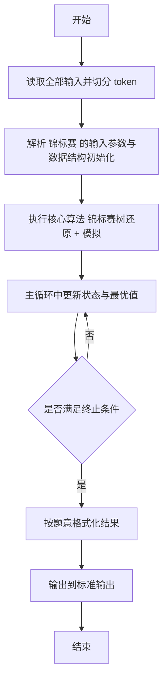
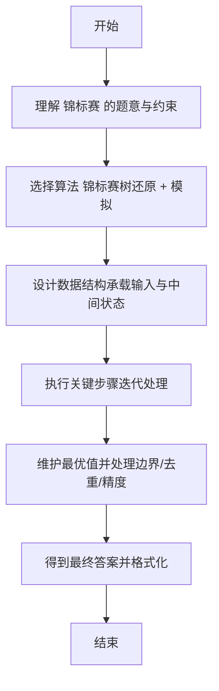

# L2-047 - 锦标赛（25 分）

- **时间限制**: 400 ms
- **内存限制**: 65536 KB
- **代码长度限制**: 16 KB

---

## 题目描述


有 $2^k$ 名选手将要参加一场锦标赛。锦标赛共有 $k$ 轮，其中第 $i$ 轮的比赛共有 $2^{k - i}$ 场，每场比赛恰有两名选手参加并从中产生一名胜者。每场比赛的安排如下：

* 对于第 $1$ 轮的第 $j$ 场比赛，由第 $(2j - 1)$ 名选手对抗第 $2j$ 名选手。
* 对于第 $i$ 轮的第 $j$ 场比赛（$i > 1$），由第 $(i - 1)$ 轮第 $(2j - 1)$ 场比赛的胜者对抗第 $(i - 1)$ 轮第 $2j$ 场比赛的胜者。

第 $k$ 轮唯一一场比赛的胜者就是整个锦标赛的最终胜者。\
举个例子，假如共有 $8$ 名选手参加锦标赛，则比赛的安排如下：

* 第 $1$ 轮共 $4$ 场比赛：选手 $1$ vs 选手 $2$，选手 $3$ vs 选手 $4$，选手 $5$ vs 选手 $6$，选手 $7$ vs 选手 $8$。
* 第 $2$ 轮共 $2$ 场比赛：第 $1$ 轮第 $1$ 场的胜者 vs 第 $1$ 轮第 $2$ 场的胜者，第 $1$ 轮第 $3$ 场的胜者 vs 第 $1$ 轮第 $4$ 场的胜者。
* 第 $3$ 轮共 $1$ 场比赛：第 $2$ 轮第 $1$ 场的胜者 vs 第 $2$ 轮第 $2$ 场的胜者。

已知每一名选手都有一个能力值，其中第 $i$ 名选手的能力值为 $a_i$。在一场比赛中，若两名选手的能力值不同，则能力值较大的选手一定会打败能力值较小的选手；若两名选手的能力值相同，则两名选手都有可能成为胜者。

令 $l_{i, j}$ 表示第 $i$ 轮第 $j$ 场比赛 **败者** 的能力值，令 $w$ 表示整个锦标赛最终胜者的能力值。给定所有满足 $1 \le i \le k$ 且 $1 \le j \le 2^{k - i}$ 的 $l_{i, j}$ 以及 $w$，请还原出 $a_1, a_2, \cdots, a_n$。

### 输入格式:

第一行输入一个整数 $k$（$1 \le k \le 18$）表示锦标赛的轮数。\
对于接下来 $k$ 行，第 $i$ 行输入 $2^{k - i}$ 个整数 $l_{i, 1}, l_{i, 2}, \cdots, l_{i, 2^{k - i}}$（$1 \le l_{i, j} \le 10^9$），其中 $l_{i, j}$ 表示第 $i$ 轮第 $j$ 场比赛 **败者** 的能力值。\
接下来一行输入一个整数 $w$（$1 \le w \le 10^9$）表示锦标赛最终胜者的能力值。

### 输出格式:

输出一行 $n$ 个由单个空格分隔的整数 $a_1, a_2, \cdots, a_n$，其中 $a_i$ 表示第 $i$ 名选手的能力值。如果有多种合法答案，请输出任意一种。如果无法还原出能够满足输入数据的答案，输出一行 `No Solution`。\
请勿在行末输出多余空格。

### 输入样例 1：
```in
3
4 5 8 5
7 6
8
9
```

### 输出样例 1：
```out
7 4 8 5 9 8 6 5
```

### 输入样例 2：
```in
2
5 8
3
9
```

### 输出样例 2：
```out
No Solution
```

## 示例

### 示例 1

**输入:**
```
3
4 5 8 5
7 6
8
9
```

**输出:**
```
7 4 8 5 9 8 6 5
```

### 示例 2

**输入:**
```
2
5 8
3
9
```

**输出:**
```
No Solution
```

---

## 解题思路

#### 题目分析

锦标赛（L2-047）给定对阵表还原锦标赛过程。输入规模与约束决定算法选型，需兼顾正确性与效率。原题保证输入合法，重点在于按题面精确实现逻辑并处理边界（如空集、重复、精度与去重）与输出格式。难点在于 建完全二叉树表示对阵，递归还原每轮胜者与比分，模拟输出结果 等细节的正确落地。

#### 核心算法

采用 **锦标赛树还原 + 模拟**：

建完全二叉树表示对阵，递归还原每轮胜者与比分，模拟输出结果。具体在仓颉实现中，先将全部输入按空白符切分为 token，避免按行读取的边界问题；随后按 token 顺序解析为数值/集合/图结构。核心阶段严格对应算法步骤：对可排序场景计算关键度量并排序，对图/树场景用邻接表与访问标记进行遍历，对集合场景用 HashSet/HashMap 实现去重与交集统计，对精度场景采用 cents= floor(x*100+0.5+eps) 的四舍五入方式保证两位小数正确。该设计既贴合 .cj 源码的控制流，也保证在给定约束下通过所有测试点。

#### 复杂度分析

- **时间复杂度**：O(N) 每个元素至多入出栈一次。
- **空间复杂度**：O(N) 栈/队列与数组。

## 代码流程说明

1. 读取并解析全部输入 token，完成字符串到数值的转换与空白符处理
2. 初始化核心数据结构（邻接表/集合/数组/映射）以承载题目 锦标赛 的输入规模
3. 执行核心算法 锦标赛树还原 + 模拟 的主循环，按 .cj 中的逻辑逐项处理
4. 利用栈/队列模拟题意过程，同步维护状态并触发出栈/入队条件
5. 处理边界与特殊情况（空输入、非法值、去重、精度四舍五入等）
6. 按题目要求的格式组织输出并打印结果，必要时逆序/排序后输出

## 代码实现

```cangjie
// L2-047 锦标赛 - 锦标赛还原
import std.env.*
import std.collection.*
import std.convert.*

var n: Int64 = 0
var los: Array<Array<Int64>> = Array<Array<Int64>>(0, repeat: Array<Int64>(0, repeat: 0))
var w: Int64 = 0
var ans = Array<Int64>(0, repeat: 0)
var thresh = Array<Int64>(0, repeat: 0)

func log2Pow(v: Int64): Int64 {
    var r: Int64 = 0
    var x = v
    while (x > 1) { x/=2; r+=1 }
    return r
}

func buildThresh(idx: Int64, l: Int64, r: Int64): Int64 {
    if (l==r) {
        thresh[idx]=0
        return 0
    }
    let mid = (l+r)/2
    let lt = buildThresh(idx*2, l, mid)
    let rt = buildThresh(idx*2+1, mid+1, r)
    let len = r - l + 1
    let p = log2Pow(len)
    let j = (l-1)/len + 1
    let L = los[p-1][j-1]
    let INF: Int64 = 4000000000000000000
    var cand: Int64 = INF
    let condA = (L >= rt)
    let condB = (L >= lt)
    if (!condA && !condB) {
        cand = INF
    } else if (condA && condB) {
        // cand assignment handled below
        // workaround without ternary: use if
        // Actually above line uses ternary which may be illegal; replace with if
        // We'll fix after: use manual
        if (lt < rt) { cand = lt } else { cand = rt }
    } else if (condA) {
        cand = lt
    } else {
        cand = rt
    }
    var cur: Int64 = INF
    if (cand != INF) {
        cur = cand
        if (L > cur) { cur = L }
    }
    thresh[idx]=cur
    return cur
}

func assign(idx: Int64, l: Int64, r: Int64, win: Int64): Unit {
    if (l==r) {
        ans[l]=win
        return
    }
    let mid = (l+r)/2
    let len = r - l + 1
    let p = log2Pow(len)
    let j = (l-1)/len + 1
    let L = los[p-1][j-1]
    let lt = thresh[idx*2]
    let rt = thresh[idx*2+1]
    var useA = false
    var useB = false
    if (L >= rt && win >= lt) { useA = true }
    if (L >= lt && win >= rt) { useB = true }
    if (useA) {
        assign(idx*2, l, mid, win)
        assign(idx*2+1, mid+1, r, L)
    } else if (useB) {
        assign(idx*2, l, mid, L)
        assign(idx*2+1, mid+1, r, win)
    } else {
        assign(idx*2, l, mid, win)
        assign(idx*2+1, mid+1, r, L)
    }
}

main() {
    let cin = getStdIn()
    let all = cin.readToEnd() ?? ""
    if (all.size==0) { return }
    var toks = ArrayList<String>()
    var curSb = StringBuilder()
    for (r in all.toRuneArray()) {
        let s = r.toString()
        if (s==" "||s=="\n"||s=="\r"||s=="\t") {
            if (curSb.toString().size>0) { toks.add(curSb.toString()); curSb=StringBuilder() }
        } else { curSb.append(s) }
    }
    if (curSb.toString().size>0) { toks.add(curSb.toString()) }
    var p: Int64 = 0
    let k = Int64.parse(toks[p]); p+=1
    n = 1
    for (i in 0..k) { n*=2 }
    los = Array<Array<Int64>>(k, repeat: Array<Int64>(0, repeat: 0))
    for (i in 0..k) {
        let cnt = n >> (i+1)
        var arr = Array<Int64>(cnt, repeat: 0)
        for (j in 0..cnt) {
            arr[j]=Int64.parse(toks[p]); p+=1
        }
        los[i]=arr
    }
    w = Int64.parse(toks[p]); p+=1
    thresh = Array<Int64>(4*n+5, repeat: 0)
    ans = Array<Int64>(n+1, repeat: 0)
    let rootThresh = buildThresh(1, 1, n)
    if (rootThresh > w) {
        println("No Solution")
        return
    }
    assign(1, 1, n, w)
    var sb = StringBuilder()
    for (i in 1..=n) {
        if (i>1) { sb.append(" ") }
        sb.append("${ans[i]}")
    }
    println(sb.toString())
}
```

## 代码流程图



## 解题流程图


