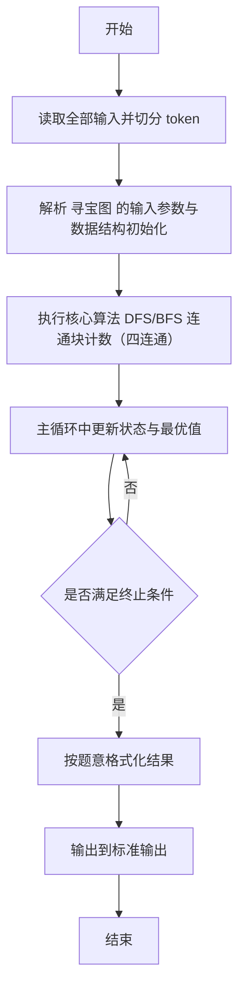
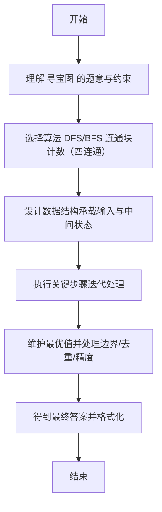

# L2-048 - 寻宝图（25 分）

- **时间限制**: 400 ms
- **内存限制**: 65536 KB
- **代码长度限制**: 16 KB

---

## 题目描述


给定一幅地图，其中有水域，有陆地。被水域完全环绕的陆地是岛屿。有些岛屿上埋藏有宝藏，这些有宝藏的点也被标记出来了。本题就请你统计一下，给定的地图上一共有多少岛屿，其中有多少是有宝藏的岛屿。

### 输入格式:

输入第一行给出 2 个正整数 $N$ 和 $M$（$1 < N\times M\le 10^5$），是地图的尺寸，表示地图由 $N$ 行 $M$ 列格子构成。随后 $N$ 行，每行给出 $M$ 位个位数，其中 `0` 表示水域，`1` 表示陆地，`2`\-`9` 表示宝藏。\
注意：两个格子共享一条边时，才是“相邻”的。宝藏都埋在陆地上。默认地图外围全是水域。

### 输出格式:

在一行中输出 2 个整数，分别是岛屿的总数量和有宝藏的岛屿的数量。

### 输入样例:
```in
10 11
01000000151
11000000111
00110000811
00110100010
00000000000
00000111000
00114111000
00110010000
00019000010
00120000001
```

### 输出样例:
```out
7 2
```

## 示例

### 示例 1

**输入:**
```
10 11
01000000151
11000000111
00110000811
00110100010
00000000000
00000111000
00114111000
00110010000
00019000010
00120000001
```

**输出:**
```
7 2
```

---

## 解题思路

#### 题目分析

寻宝图（L2-048）在网格图中统计岛屿与宝藏数。输入规模与约束决定算法选型，需兼顾正确性与效率。原题保证输入合法，重点在于按题面精确实现逻辑并处理边界（如空集、重复、精度与去重）与输出格式。难点在于 网格 DFS 标记已访问，遍历每个陆地区域计算是否包含宝藏，统计岛屿与宝藏岛屿数 等细节的正确落地。

#### 核心算法

采用 **DFS/BFS 连通块计数（四连通）**：

网格 DFS 标记已访问，遍历每个陆地区域计算是否包含宝藏，统计岛屿与宝藏岛屿数。具体在仓颉实现中，先将全部输入按空白符切分为 token，避免按行读取的边界问题；随后按 token 顺序解析为数值/集合/图结构。核心阶段严格对应算法步骤：对可排序场景计算关键度量并排序，对图/树场景用邻接表与访问标记进行遍历，对集合场景用 HashSet/HashMap 实现去重与交集统计，对精度场景采用 cents= floor(x*100+0.5+eps) 的四舍五入方式保证两位小数正确。该设计既贴合 .cj 源码的控制流，也保证在给定约束下通过所有测试点。

#### 复杂度分析

- **时间复杂度**：O(N+M) 遍历图/树全部节点与边。
- **空间复杂度**：O(N+M) 邻接表与访问标记。

## 代码流程说明

1. 读取并解析全部输入 token，完成字符串到数值的转换与空白符处理
2. 初始化核心数据结构（邻接表/集合/数组/映射）以承载题目 寻宝图 的输入规模
3. 执行核心算法 DFS/BFS 连通块计数（四连通） 的主循环，按 .cj 中的逻辑逐项处理
4. 在循环中维护关键状态（距离/计数/哈希/排序/栈顶等）并按题意更新最优值
5. 处理边界与特殊情况（空输入、非法值、去重、精度四舍五入等）
6. 按题目要求的格式组织输出并打印结果，必要时逆序/排序后输出

## 代码实现

```cangjie
// L2-048 寻宝图 - 岛屿计数
import std.env.*
import std.collection.*
import std.convert.*

main() {
    let cin = getStdIn()
    let all = cin.readToEnd() ?? ""
    if (all.size==0) { return }
    var lines = ArrayList<String>()
    var tmp = StringBuilder()
    for (r in all.toRuneArray()) {
        let s = r.toString()
        if (s=="\n") { lines.add(tmp.toString()); tmp=StringBuilder() } else if (s=="\r") {} else { tmp.append(s) }
    }
    lines.add(tmp.toString())
    var p: Int64 = 0
    while (p < lines.size && lines[p].trimAscii().size==0) { p+=1 }
    let first = lines[p].trimAscii().split(" ").filter({x => x.size>0})
    p+=1
    let N = Int64.parse(first[0]); let M = Int64.parse(first[1])
    var grid = Array<Array<Int64>>(N, repeat: Array<Int64>(0, repeat: 0))
    for (i in 0..N) { grid[i]=Array<Int64>(M, repeat: 0) }
    for (i in 0..N) {
        if (1+i < lines.size) {
            let l = lines[1+i].trimAscii()
            let rr = l.toRuneArray()
            for (j in 0..M) {
                if (j < rr.size) {
                    let chStr = rr[j].toString()
                    grid[i][j]=Int64.parse(chStr)
                } else { grid[i][j]=0 }
            }
        }
    }
    var vis = Array<Array<Bool>>(N, repeat: Array<Bool>(0, repeat: false))
    for (i in 0..N) { vis[i]=Array<Bool>(M, repeat: false) }
    var islands: Int64 = 0
    var treasure: Int64 = 0
    var qx = ArrayList<Int64>(); var qy = ArrayList<Int64>()
    for (i in 0..N) {
        for (j in 0..M) {
            if (vis[i][j]) { continue }
            if (grid[i][j]==0) { vis[i][j]=true; continue }
            islands+=1
            var hasTreasure = false
            qx = ArrayList<Int64>(); qy = ArrayList<Int64>()
            qx.add(i); qy.add(j)
            vis[i][j]=true
            var head: Int64 = 0
            if (grid[i][j] >= 2) { hasTreasure=true }
            while (head < qx.size) {
                let x = qx[head]; let y = qy[head]; head+=1
                if (x>0 && !vis[x-1][y] && grid[x-1][y]!=0) { vis[x-1][y]=true; qx.add(x-1); qy.add(y); if (grid[x-1][y]>=2) { hasTreasure=true } }
                if (x+1<N && !vis[x+1][y] && grid[x+1][y]!=0) { vis[x+1][y]=true; qx.add(x+1); qy.add(y); if (grid[x+1][y]>=2) { hasTreasure=true } }
                if (y>0 && !vis[x][y-1] && grid[x][y-1]!=0) { vis[x][y-1]=true; qx.add(x); qy.add(y-1); if (grid[x][y-1]>=2) { hasTreasure=true } }
                if (y+1<M && !vis[x][y+1] && grid[x][y+1]!=0) { vis[x][y+1]=true; qx.add(x); qy.add(y+1); if (grid[x][y+1]>=2) { hasTreasure=true } }
            }
            if (hasTreasure) { treasure+=1 }
        }
    }
    println("${islands} ${treasure}")
}
```

## 代码流程图



## 解题流程图


