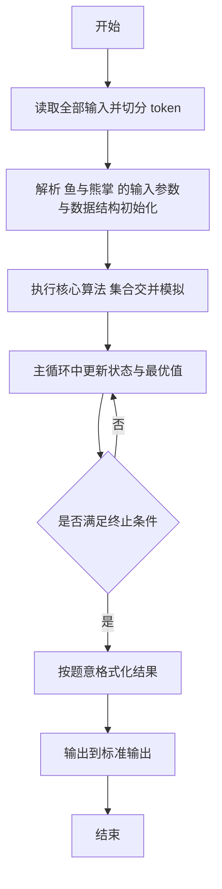
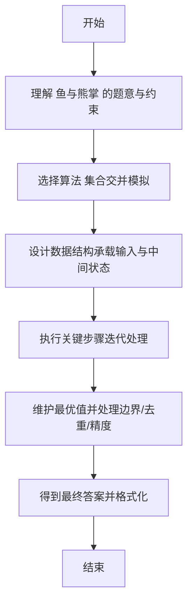

# L2-049 - 鱼与熊掌（25 分）

- **时间限制**: 400 ms
- **内存限制**: 65536 KB
- **代码长度限制**: 16 KB

---

## 题目描述


《孟子 · 告子上》有名言：“鱼，我所欲也，熊掌，亦我所欲也；二者不可得兼，舍鱼而取熊掌者也。”但这世界上还是有一些人可以做到鱼与熊掌兼得的。
给定 $n$ 个人对 $m$ 种物品的拥有关系。对其中任意一对物品种类（例如“鱼与熊掌”），请你统计有多少人能够兼得？

### 输入格式:

输入首先在第一行给出 2 个正整数，分别是：$n$（$\le 10^5$）为总人数（所有人从 1 到 $n$ 编号）、$m$（$2\le m \le 10^5$）为物品种类的总数（所有物品种类从 1 到 $m$ 编号）。
随后 $n$ 行，第 $i$ 行（$1\le i \le n$）给出编号为 $i$ 的人所拥有的物品种类清单，格式为：
```
K M[1] M[2] ... M[K]
```
其中 `K`（$\le 10^3$）是该人拥有的物品种类数量，后面的 `M[*]` 是物品种类的编号。题目保证每个人的物品种类清单中都没有重复给出的种类。
最后是查询信息：首先在一行中给出查询总量 $Q$（$\le 100$），随后 $Q$ 行，每行给出一对物品种类编号，其间以空格分隔。题目保证物品种类编号都是合法存在的。

### 输出格式:

对每一次查询，在一行中输出两种物品兼得的人数。

### 输入样例:
```in
4 8
3 4 1 8
4 7 1 8 4
5 6 5 1 2 3
4 3 2 4 8
3
2 3
7 6
8 4
```

### 输出样例:
```out
2
0
3
```

## 示例

### 示例 1

**输入:**
```
4 8
3 4 1 8
4 7 1 8 4
5 6 5 1 2 3
4 3 2 4 8
3
2 3
7 6
8 4
```

**输出:**
```
2
0
3
```

---

## 解题思路

#### 题目分析

鱼与熊掌（L2-049）判断鱼与熊掌兼得的集合关系。输入规模与约束决定算法选型，需兼顾正确性与效率。原题保证输入合法，重点在于按题面精确实现逻辑并处理边界（如空集、重复、精度与去重）与输出格式。难点在于 用 HashSet 表示鱼与熊掌集合，中序遍历判断交集与包含关系输出 等细节的正确落地。

#### 核心算法

采用 **集合交并模拟**：

用 HashSet 表示鱼与熊掌集合，中序遍历判断交集与包含关系输出。具体在仓颉实现中，先将全部输入按空白符切分为 token，避免按行读取的边界问题；随后按 token 顺序解析为数值/集合/图结构。核心阶段严格对应算法步骤：对可排序场景计算关键度量并排序，对图/树场景用邻接表与访问标记进行遍历，对集合场景用 HashSet/HashMap 实现去重与交集统计，对精度场景采用 cents= floor(x*100+0.5+eps) 的四舍五入方式保证两位小数正确。该设计既贴合 .cj 源码的控制流，也保证在给定约束下通过所有测试点。

#### 复杂度分析

- **时间复杂度**：O(N) 每个元素至多入出栈一次。
- **空间复杂度**：O(N) 栈/队列与数组。

## 代码流程说明

1. 读取并解析全部输入 token，完成字符串到数值的转换与空白符处理
2. 初始化核心数据结构（邻接表/集合/数组/映射）以承载题目 鱼与熊掌 的输入规模
3. 执行核心算法 集合交并模拟 的主循环，按 .cj 中的逻辑逐项处理
4. 利用栈/队列模拟题意过程，同步维护状态并触发出栈/入队条件
5. 处理边界与特殊情况（空输入、非法值、去重、精度四舍五入等）
6. 按题目要求的格式组织输出并打印结果，必要时逆序/排序后输出

## 代码实现

```cangjie
// L2-049 鱼与熊掌 - 集合交集
import std.env.*
import std.collection.*
import std.convert.*

main() {
    let cin = getStdIn()
    let all = cin.readToEnd() ?? ""
    if (all.size==0) { return }
    var toks = ArrayList<String>()
    var cur = StringBuilder()
    for (r in all.toRuneArray()) {
        let s = r.toString()
        if (s==" "||s=="\n"||s=="\r"||s=="\t") {
            if (cur.toString().size>0) { toks.add(cur.toString()); cur=StringBuilder() }
        } else { cur.append(s) }
    }
    if (cur.toString().size>0) { toks.add(cur.toString()) }
    var p: Int64 = 0
    let n = Int64.parse(toks[p]); p+=1
    let m = Int64.parse(toks[p]); p+=1
    var owners = Array<HashSet<Int64>>(m+1, repeat: HashSet<Int64>())
    for (i in 0..m) { owners[i]=HashSet<Int64>() }
    for (person in 1..=n) {
        let K = Int64.parse(toks[p]); p+=1
        for (k in 0..K) {
            let item = Int64.parse(toks[p]); p+=1
            owners[item].add(person)
        }
    }
    let Q = Int64.parse(toks[p]); p+=1
    var out = StringBuilder()
    for (q in 0..Q) {
        let a = Int64.parse(toks[p]); let b = Int64.parse(toks[p+1]); p+=2
        let setA = owners[a]
        let setB = owners[b]
        var small = setA
        var large = setB
        if (setA.size > setB.size) { small=setB; large=setA }
        var cnt: Int64 = 0
        for (x in small) {
            if (large.contains(x)) { cnt+=1 }
        }
        out.append("${cnt}\n")
    }
    print(out.toString())
}
```

## 代码流程图



## 解题流程图


