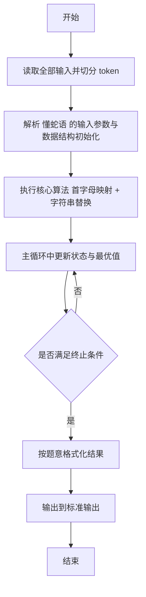
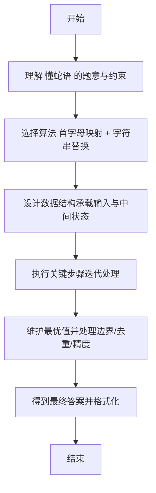

# L2-050 - 懂蛇语（25 分）

- **时间限制**: 400 ms
- **内存限制**: 65536 KB
- **代码长度限制**: 16 KB

---

## 题目描述


在《一年一度喜剧大赛》第二季中有一部作品叫《警察和我之蛇我其谁》，其中“毒蛇帮”内部用了一种加密语言，称为“蛇语”。蛇语的规则是，在说一句话 A 时，首先提取 A 的每个字的首字母，然后把整句话替换为另一句话 B，B 中每个字的首字母与 A 中提取出的字母依次相同。例如二当家说“九点下班哈”，对应首字母缩写是 `JDXBH`，他们解释为实际想说的是“京东新百货”……
本题就请你写一个蛇语的自动翻译工具，将输入的蛇语转换为实际要表达的句子。

### 输入格式:

输入第一行给出一个正整数 $$N$$（$$\le 10^5$$），为蛇语词典中句子的个数。随后 $$N$$ 行，每行用汉语拼音给出一句话。每句话由小写英文字母和空格组成，每个字的拼音由不超过 6 个小写英文字母组成，两个字的拼音之间用空格分隔。题目保证每句话总长度不超过 50 个字符，用回车结尾。注意：回车不算句中字符。
随后在一行中给出一个正整数 $$M$$（$$\le 10^3$$），为查询次数。后面跟 $$M$$ 行，每行用汉语拼音给出需要查询的一句话，格式同上。

### 输出格式:

对每一句查询，在一行中输出其对应的句子。如果句子不唯一，则按整句的字母序输出，句子间用 `|` 分隔。如果查不到，则将输入的句子原样输出。
注意：输出句子时，必须保持句中所有字符不变，包括空格。

### 输入样例:
```in
8
yong yuan de shen
yong yuan de she
jing dong xin bai huo
she yu wo ye hui shuo yi dian dian
liang wei bu yao chong dong
yi  dian dian
ni hui shuo she yu a
yong yuan de sha
7
jiu dian xia ban ha
shao ye wu ya he shui you dian duo
liu wan bu yao ci dao
ni hai shi su yan a
yao diao deng
sha ye ting bu jian
y y d s
```

### 输出样例:
```out
jing dong xin bai huo
she yu wo ye hui shuo yi dian dian
liang wei bu yao chong dong
ni hui shuo she yu a
yi  dian dian
sha ye ting bu jian
yong yuan de sha|yong yuan de she|yong yuan de shen
```

## 示例

### 示例 1

**输入:**
```
8
yong yuan de shen
yong yuan de she
jing dong xin bai huo
she yu wo ye hui shuo yi dian dian
liang wei bu yao chong dong
yi  dian dian
ni hui shuo she yu a
yong yuan de sha
7
jiu dian xia ban ha
shao ye wu ya he shui you dian duo
liu wan bu yao ci dao
ni hai shi su yan a
yao diao deng
sha ye ting bu jian
y y d s
```

**输出:**
```
jing dong xin bai huo
she yu wo ye hui shuo yi dian dian
liang wei bu yao chong dong
ni hui shuo she yu a
yi  dian dian
sha ye ting bu jian
yong yuan de sha|yong yuan de she|yong yuan de shen
```

---

## 解题思路

#### 题目分析

懂蛇语（L2-050）蛇语翻译为首字母对应规则。输入规模与约束决定算法选型，需兼顾正确性与效率。原题保证输入合法，重点在于按题面精确实现逻辑并处理边界（如空集、重复、精度与去重）与输出格式。难点在于 建立蛇语字母到首字母的映射表，按单词首字母还原明文，处理大小写与标点 等细节的正确落地。

#### 核心算法

采用 **首字母映射 + 字符串替换**：

建立蛇语字母到首字母的映射表，按单词首字母还原明文，处理大小写与标点。具体在仓颉实现中，先将全部输入按空白符切分为 token，避免按行读取的边界问题；随后按 token 顺序解析为数值/集合/图结构。核心阶段严格对应算法步骤：对可排序场景计算关键度量并排序，对图/树场景用邻接表与访问标记进行遍历，对集合场景用 HashSet/HashMap 实现去重与交集统计，对精度场景采用 cents= floor(x*100+0.5+eps) 的四舍五入方式保证两位小数正确。该设计既贴合 .cj 源码的控制流，也保证在给定约束下通过所有测试点。

#### 复杂度分析

- **时间复杂度**：O(N log N) 或 O(N) 视实现而定。
- **空间复杂度**：O(N)。

## 代码流程说明

1. 读取并解析全部输入 token，完成字符串到数值的转换与空白符处理
2. 初始化核心数据结构（邻接表/集合/数组/映射）以承载题目 懂蛇语 的输入规模
3. 执行核心算法 首字母映射 + 字符串替换 的主循环，按 .cj 中的逻辑逐项处理
4. 在循环中维护关键状态（距离/计数/哈希/排序/栈顶等）并按题意更新最优值
5. 处理边界与特殊情况（空输入、非法值、去重、精度四舍五入等）
6. 按题目要求的格式组织输出并打印结果，必要时逆序/排序后输出

## 代码实现

```cangjie
// L2-050 懂蛇语 - 首字母映射
import std.env.*
import std.collection.*
import std.convert.*

func acronym(s: String): String {
    let parts = s.split(" ")
    var sb = StringBuilder()
    for (p in parts) {
        if (p.size==0) { continue }
        // first character of p
        let rr = p.toRuneArray()
        if (rr.size>0) { sb.append(rr[0].toString()) }
    }
    return sb.toString()
}

main() {
    let cin = getStdIn()
    let all = cin.readToEnd() ?? ""
    if (all.size==0) { return }
    var lines = ArrayList<String>()
    var tmp = StringBuilder()
    for (r in all.toRuneArray()) {
        let s = r.toString()
        if (s=="\n") { lines.add(tmp.toString()); tmp=StringBuilder() } else if (s=="\r") {} else { tmp.append(s) }
    }
    lines.add(tmp.toString())
    var p: Int64 = 0
    while (p < lines.size && lines[p].trimAscii().size==0) { p+=1 }
    let N = Int64.parse(lines[p].trimAscii()); p+=1
    var dict = HashMap<String, ArrayList<String>>()
    for (i in 0..N) {
        if (p >= lines.size) { break }
        let sentence = lines[p]; p+=1
        let key = acronym(sentence)
        if (!dict.contains(key)) { dict[key]=ArrayList<String>() }
        dict[key].add(sentence)
    }
    // sort each list lexicographically
    for ((k, lst) in dict) {
        // bubble sort
        for (i in 0..lst.size) {
            for (j in i+1..lst.size) {
                if (lst[j] < lst[i]) {
                    let tmp2 = lst[i]; lst[i]=lst[j]; lst[j]=tmp2
                }
            }
        }
    }
    while (p < lines.size && lines[p].trimAscii().size==0) { p+=1 }
    if (p>=lines.size) { return }
    let M = Int64.parse(lines[p].trimAscii()); p+=1
    var out = StringBuilder()
    for (i in 0..M) {
        if (p >= lines.size) { break }
        let query = lines[p]; p+=1
        let key = acronym(query)
        if (dict.contains(key)) {
            let lst = dict[key]
            for (k in 0..lst.size) {
                if (k>0) { out.append("|") }
                out.append(lst[k])
            }
            out.append("\n")
        } else {
            out.append("${query}\n")
        }
    }
    print(out.toString())
}
```

## 代码流程图



## 解题流程图


