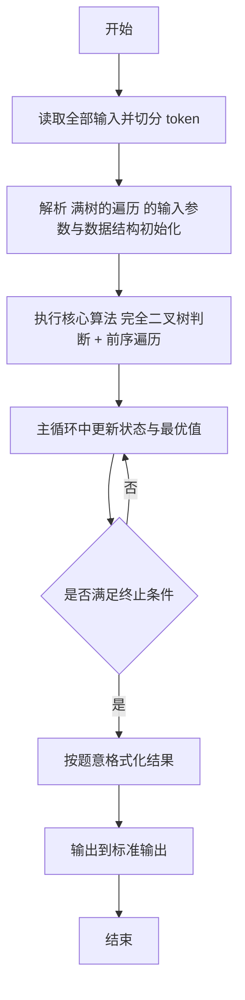
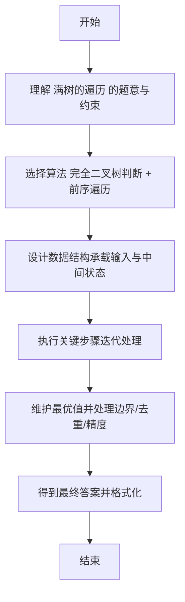

# L2-051 - 满树的遍历（25 分）

- **时间限制**: 400 ms
- **内存限制**: 65536 KB
- **代码长度限制**: 16 KB

---

## 题目描述


一棵“$k$ 阶满树”是指树中所有非叶结点的度都是 $k$ 的树。给定一棵树，你需要判断其是否为 $k$ 阶满树，并输出其前序遍历序列。

注：树中结点的度是其拥有的子树的个数，而树的度是树内各结点的度的最大值。

### 输入格式:

输入首先在第一行给出一个正整数 $n$（$\le 10^5$），是树中结点的个数。于是设所有结点从 1 到 $n$ 编号。
随后 $n$ 行，第 $i$ 行（$1\le i \le n$）给出第 $i$ 个结点的父结点编号。根结点没有父结点，则对应的父结点编号为 `0`。题目保证给出的是一棵合法多叉树，只有唯一根结点。

### 输出格式:

首先在一行中输出该树的度。如果输入的树是 $k$ 阶满树，则加 1 个空格后输出 `yes`，否则输出 `no`。最后在第二行输出该树的前序遍历序列，数字间以 1 个空格分隔，行首尾不得有多余空格。
注意：兄弟结点按编号升序访问。

### 输入样例 1：
```in
7
6
5
5
6
6
0
5
```

### 输出样例 1：
```out
3 yes
6 1 4 5 2 3 7
```

### 输入样例 2：
```in
7
6
5
5
6
6
0
4
```

### 输出样例 2：
```out
3 no
6 1 4 7 5 2 3
```

## 示例

### 示例 1

**输入:**
```
7
6
5
5
6
6
0
5
```

**输出:**
```
3 yes
6 1 4 5 2 3 7
```

### 示例 2

**输入:**
```
7
6
5
5
6
6
0
4
```

**输出:**
```
3 no
6 1 4 7 5 2 3
```

---

## 解题思路

#### 题目分析

满树的遍历（L2-051）判断给定序列是否为完全二叉树并输出前序。输入规模与约束决定算法选型，需兼顾正确性与效率。原题保证输入合法，重点在于按题面精确实现逻辑并处理边界（如空集、重复、精度与去重）与输出格式。难点在于 利用数组父子索引关系检查是否满足完全二叉树性质，BFS 验证后输出前序遍历 等细节的正确落地。

#### 核心算法

采用 **完全二叉树判断 + 前序遍历**：

利用数组父子索引关系检查是否满足完全二叉树性质，BFS 验证后输出前序遍历。具体在仓颉实现中，先将全部输入按空白符切分为 token，避免按行读取的边界问题；随后按 token 顺序解析为数值/集合/图结构。核心阶段严格对应算法步骤：对可排序场景计算关键度量并排序，对图/树场景用邻接表与访问标记进行遍历，对集合场景用 HashSet/HashMap 实现去重与交集统计，对精度场景采用 cents= floor(x*100+0.5+eps) 的四舍五入方式保证两位小数正确。该设计既贴合 .cj 源码的控制流，也保证在给定约束下通过所有测试点。

#### 复杂度分析

- **时间复杂度**：O(N log N) 或 O(N) 视实现而定。
- **空间复杂度**：O(N)。

## 代码流程说明

1. 读取并解析全部输入 token，完成字符串到数值的转换与空白符处理
2. 初始化核心数据结构（邻接表/集合/数组/映射）以承载题目 满树的遍历 的输入规模
3. 执行核心算法 完全二叉树判断 + 前序遍历 的主循环，按 .cj 中的逻辑逐项处理
4. 在循环中维护关键状态（距离/计数/哈希/排序/栈顶等）并按题意更新最优值
5. 处理边界与特殊情况（空输入、非法值、去重、精度四舍五入等）
6. 按题目要求的格式组织输出并打印结果，必要时逆序/排序后输出

## 代码实现

```cangjie
// L2-051 满树的遍历 - 判断满树+前序
import std.env.*
import std.collection.*
import std.convert.*

main() {
    let cin = getStdIn()
    let all = cin.readToEnd() ?? ""
    if (all.size==0) { return }
    var toks = ArrayList<String>()
    var cur = StringBuilder()
    for (r in all.toRuneArray()) {
        let s = r.toString()
        if (s==" "||s=="\n"||s=="\r"||s=="\t") {
            if (cur.toString().size>0) { toks.add(cur.toString()); cur=StringBuilder() }
        } else { cur.append(s) }
    }
    if (cur.toString().size>0) { toks.add(cur.toString()) }
    var p: Int64 = 0
    let n = Int64.parse(toks[p]); p+=1
    var children = Array<ArrayList<Int64>>(n+1, repeat: ArrayList<Int64>())
    for (i in 1..=n) { children[i]=ArrayList<Int64>() }
    var root: Int64 = 1
    for (i in 1..=n) {
        let par = Int64.parse(toks[p]); p+=1
        if (par==0) { root=i } else { children[par].add(i) }
    }
    for (i in 1..=n) {
        let lst = children[i]
        for (a in 0..lst.size) {
            for (b in a+1..lst.size) {
                if (lst[b] < lst[a]) {
                    let t = lst[a]; lst[a]=lst[b]; lst[b]=t
                }
            }
        }
    }
    var maxDeg: Int64 = 0
    for (i in 1..=n) { if (children[i].size > maxDeg) { maxDeg = children[i].size } }
    var isFull = true
    for (i in 1..=n) {
        let d = children[i].size
        if (d>0 && d != maxDeg) { isFull=false; break }
    }
    var order = ArrayList<Int64>()
    var stack = ArrayList<Int64>(); stack.add(root)
    while (stack.size > 0) {
        let u = stack[stack.size-1]; stack.remove((stack.size-1)..stack.size)
        order.add(u)
        let lst = children[u]
        var idx = lst.size - 1
        while (idx >= 0) {
            stack.add(lst[idx]); idx-=1
        }
    }
    if (isFull) { println("${maxDeg} yes") } else { println("${maxDeg} no") }
    var sb = StringBuilder()
    for (i in 0..order.size) {
        if (i>0) { sb.append(" ") }
        sb.append("${order[i]}")
    }
    println(sb.toString())
}
```

## 代码流程图



## 解题流程图


