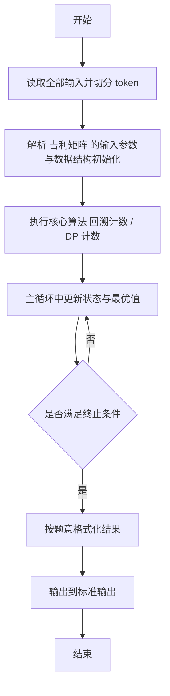
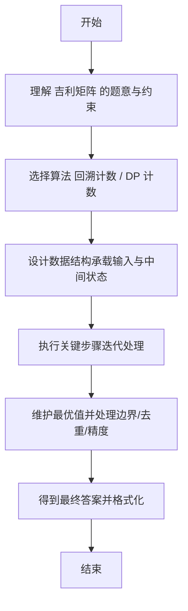

# L2-052 - 吉利矩阵（25 分）

- **时间限制**: 1000 ms
- **内存限制**: 65536 KB
- **代码长度限制**: 16 KB

---

## 题目描述


所有元素为非负整数，且各行各列的元素和都等于 $7$ 的 $3 \times 3$ 方阵称为“吉利矩阵”，因为这样的矩阵一共有 $666$ 种。
本题就请你统计一下，把 $7$ 换成任何一个 $[2, 9]$ 区间内的正整数 $L$，把矩阵阶数换成任何一个 $[2, 4]$ 区间内的正整数 $N$，满足条件“所有元素为非负整数，且各行各列的元素和都等于 $L$”的 $N \times N$ 方阵一共有多少种？

### 输入格式:

输入在一行中给出 2 个正整数 $L$ 和 $N$，意义如题面所述。数字间以空格分隔。

### 输出格式:

在一行中输出满足题目要求条件的方阵的个数。

### 输入样例:
```in
7 3
```

### 输出样例:
```out
666
```

## 示例

### 示例 1

**输入:**
```
7 3
```

**输出:**
```
666
```

---

## 解题思路

#### 题目分析

吉利矩阵（L2-052）统计满足行列和为特定值的矩阵个数。输入规模与约束决定算法选型，需兼顾正确性与效率。原题保证输入合法，重点在于按题面精确实现逻辑并处理边界（如空集、重复、精度与去重）与输出格式。难点在于 回溯枚举或 DP 按行列和约束剪枝计数，使用记忆化搜索优化 等细节的正确落地。

#### 核心算法

采用 **回溯计数 / DP 计数**：

回溯枚举或 DP 按行列和约束剪枝计数，使用记忆化搜索优化。具体在仓颉实现中，先将全部输入按空白符切分为 token，避免按行读取的边界问题；随后按 token 顺序解析为数值/集合/图结构。核心阶段严格对应算法步骤：对可排序场景计算关键度量并排序，对图/树场景用邻接表与访问标记进行遍历，对集合场景用 HashSet/HashMap 实现去重与交集统计，对精度场景采用 cents= floor(x*100+0.5+eps) 的四舍五入方式保证两位小数正确。该设计既贴合 .cj 源码的控制流，也保证在给定约束下通过所有测试点。

#### 复杂度分析

- **时间复杂度**：O(N log N) 或 O(N) 视实现而定。
- **空间复杂度**：O(N)。

## 代码流程说明

1. 读取并解析全部输入 token，完成字符串到数值的转换与空白符处理
2. 初始化核心数据结构（邻接表/集合/数组/映射）以承载题目 吉利矩阵 的输入规模
3. 执行核心算法 回溯计数 / DP 计数 的主循环，按 .cj 中的逻辑逐项处理
4. 在循环中维护关键状态（距离/计数/哈希/排序/栈顶等）并按题意更新最优值
5. 处理边界与特殊情况（空输入、非法值、去重、精度四舍五入等）
6. 按题目要求的格式组织输出并打印结果，必要时逆序/排序后输出

## 代码实现

```cangjie
// L2-052 吉利矩阵 - 计数
import std.env.*
import std.collection.*
import std.convert.*

func genRows(L: Int64, N: Int64, res: ArrayList<Array<Int64>>): Unit {
    var cur = Array<Int64>(N, repeat: 0)
    func dfs(pos: Int64, rem: Int64): Unit {
        if (pos == N-1) {
            cur[pos]=rem
            var copy = Array<Int64>(N, repeat: 0)
            for (i in 0..N) { copy[i]=cur[i] }
            res.add(copy)
            return
        }
        for (v in 0..=rem) {
            cur[pos]=v
            dfs(pos+1, rem - v)
        }
    }
    dfs(0, L)
}

main() {
    let cin = getStdIn()
    let all = cin.readToEnd() ?? ""
    if (all.size==0) { return }
    var toks = ArrayList<String>()
    var curSb = StringBuilder()
    for (r in all.toRuneArray()) {
        let s = r.toString()
        if (s==" "||s=="\n"||s=="\r"||s=="\t") {
            if (curSb.toString().size>0) { toks.add(curSb.toString()); curSb=StringBuilder() }
        } else { curSb.append(s) }
    }
    if (curSb.toString().size>0) { toks.add(curSb.toString()) }
    let L = Int64.parse(toks[0]); let N = Int64.parse(toks[1])
    var ans: Int64 = 0
    if (N == 2) {
        ans = L + 1
    } else if (N == 3) {
        var rows = ArrayList<Array<Int64>>()
        genRows(L, N, rows)
        for (r0 in rows) {
            for (r1 in rows) {
                var c0 = r0[0]+r1[0]; var c1 = r0[1]+r1[1]; var c2 = r0[2]+r1[2]
                if (c0 <= L && c1 <= L && c2 <= L) { ans+=1 }
            }
        }
    } else if (N == 4) {
        var rows = ArrayList<Array<Int64>>()
        genRows(L, N, rows)
        for (r0 in rows) {
            for (r1 in rows) {
                let c0_01 = r0[0]+r1[0]; let c1_01 = r0[1]+r1[1]; let c2_01 = r0[2]+r1[2]; let c3_01 = r0[3]+r1[3]
                if (c0_01 > L || c1_01 > L || c2_01 > L || c3_01 > L) { continue }
                for (r2 in rows) {
                    let c0 = c0_01 + r2[0]; let c1 = c1_01 + r2[1]; let c2 = c2_01 + r2[2]; let c3 = c3_01 + r2[3]
                    if (c0 <= L && c1 <= L && c2 <= L && c3 <= L) { ans+=1 }
                }
            }
        }
    }
    println("${ans}")
}
```

## 代码流程图



## 解题流程图


