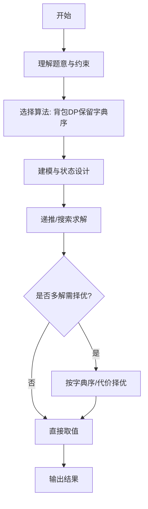

# L3-001 - 凑零钱（30 分）

- **时间限制**: 300 ms
- **内存限制**: 65536 KB
- **代码长度限制**: 16 KB

---

## 题目描述


韩梅梅喜欢满宇宙到处逛街。现在她逛到了一家火星店里，发现这家店有个特别的规矩：你可以用任何星球的硬币付钱，但是绝不找零，当然也不能欠债。韩梅梅手边有 $$10^4$$ 枚来自各个星球的硬币，需要请你帮她盘算一下，是否可能精确凑出要付的款额。

### 输入格式:

输入第一行给出两个正整数：$$N$$（$$\le 10^4$$）是硬币的总个数，$$M$$（$$\le 10^2$$）是韩梅梅要付的款额。第二行给出 $$N$$ 枚硬币的正整数面值。数字间以空格分隔。

### 输出格式:

在一行中输出硬币的面值 $$V_1 \le V_2 \le \cdots \le V_k$$，满足条件 $$V_1 + V_2 + ... + V_k = M$$。数字间以 1 个空格分隔，行首尾不得有多余空格。若解不唯一，则输出最小序列。若无解，则输出 `No Solution`。

注：我们说序列{ $$A[1], A[2], \cdots$$ }比{ $$B[1], B[2], \cdots$$ }“小”，是指存在 $$k \ge 1$$ 使得 $$A[i]=B[i]$$ 对所有 $$i < k$$ 成立，并且 $$A[k] < B[k]$$。

### 输入样例 1：
```in
8 9
5 9 8 7 2 3 4 1
```

### 输出样例 1：
```out
1 3 5
```

### 输入样例 2：
```in
4 8
7 2 4 3
```

### 输出样例 2：
```out
No Solution
```

## 示例

### 示例 1

**输入:**
```
8 9
5 9 8 7 2 3 4 1
```

**输出:**
```
1 3 5
```

### 示例 2

**输入:**
```
4 8
7 2 4 3
```

**输出:**
```
No Solution
```
---

## 解题思路

### 题目分析

本题为 L3-001 - 凑零钱（30 分），核心属于 **0/1背包字典序最小方案**。输入规模与约束决定了需要兼顾正确性与效率：既要处理最坏情况下的数据量，又要满足题面关于字典序/最优性/可行性的附加要求。题目通常包含多组数据或单组大规模数据，需在 O(n log n) 或 O(n·m) 量级内完成。

### 核心算法

- **算法选择**：背包DP保留字典序。
- **关键步骤**：将硬币按面值升序排序，dp[sum]存储当前最优的字典序序列，从小到大枚举硬币、从 M 到 coin 倒序更新，比较候选序列与已存序列的字典序。
- **实现要点**：仓颉实现中通过 `ArrayList`/`HashMap` 等集合类型组织数据，结合 `StringBuilder` 与 `readToEnd` 高效解析输入；按题面要求的排序与比较规则保证输出符合字典序/最短路等最优性定义。

### 复杂度分析

- **时间复杂度**： O(N·M + N log N)，空间 O(M·L)，M≤10^2。
- **空间复杂度**： O(M·L)，主要由 DP 表/图邻接表/辅助数组占据。

## 代码流程说明

1. 读取 tokens 解析 N 与 M，过滤大于 M 的硬币并收集到 coins 数组
2. 对 coins 按升序快速排序（手写 qs 分区，pivot 取中值）
3. 初始化 dp 大小 M+1 与 has 标记，置 has[0]=true 空序列可达
4. 遍历每枚硬币 c，从 M-c 倒序到 0 枚举和 s，若 has[s] 为真则构造 cand=dp[s]+[c]
5. 若 has[s+c] 为假则直接存入 dp[s+c]=cand，否则按字典序比较 cand 与 dp[s+c] 保留更小者
6. 完成所有硬币后检查 has[M]，为假则输出 No Solution 并结束
7. 否则将 dp[M] 按空格拼接输出，首元素前不加空格

## 代码实现

```cangjie
// L3-001 凑零钱 - 0/1背包求和为M且字典序最小的有序序列(升序)
// Approach: coins sorted ascending, DP keep best sequence per sum
import std.env.*
import std.collection.*
import std.convert.*

main(){
    let cin=getStdIn()
    let all=cin.readToEnd()??""
    let runes=all.toRuneArray()
    let tokens=ArrayList<String>()
    var sb=StringBuilder()
    let sp:Rune=' '
    let nl:Rune='\n'
    let tab:Rune='\t'
    let cr:Rune='\r'
    for(r in runes){
        if(r==sp||r==nl||r==tab||r==cr){
            let cur=sb.toString()
            if(cur.size>0){ tokens.add(cur) }
            sb=StringBuilder()
        } else { sb.append(r) }
    }
    let last=sb.toString()
    if(last.size>0){ tokens.add(last) }
    if(tokens.size<2){ return }
    let N=Int64.parse(tokens[0])
    let M=Int64.parse(tokens[1])
    let coins=ArrayList<Int64>()
    for(i in 0..N){
        let idx=i+2
        if(idx < tokens.size){
            let v=Int64.parse(tokens[idx])
            if(v<=M){ coins.add(v) }
        }
    }
    func qs(l:Int64,r:Int64):Unit{
        if(l>=r){return}
        var i=l; var j=r
        let piv=coins[(l+r)/2]
        while(i<=j){
            while(coins[i] < piv){ i++ }
            while(coins[j] > piv){ j-- }
            if(i<=j){
                let t=coins[i]; coins[i]=coins[j]; coins[j]=t
                i++; j--
            }
        }
        if(l<j){ qs(l,j) }
        if(i<r){ qs(i,r) }
    }
    if(coins.size>1){ qs(0, coins.size-1) }
    // dp[sum] = sequence (ArrayList<Int64>) or null sentinel empty indicates not reachable except 0
    let dp=ArrayList<ArrayList<Int64>>()
    let has=ArrayList<Bool>()
    for(i in 0..(M+1)){
        dp.add(ArrayList<Int64>())
        has.add(false)
    }
    has[0]=true // empty
    // For 0..coins.size
    for(ci in 0..coins.size){
        let c=coins[ci]
        var s=M - c
        while(s>=0){
            if(has[s]){
                let ns=s + c
                let cand=ArrayList<Int64>()
                for(v in dp[s]){ cand.add(v) }
                cand.add(c)
                if(!has[ns]){
                    dp[ns]=cand
                    has[ns]=true
                } else {
                    // compare cand vs dp[ns] lexicographically
                    let a=cand
                    let b=dp[ns]
                    var isSmaller=false
                    var isLarger=false
                    var mn: Int64 = 0
                    if(a.size < b.size){ mn = a.size } else { mn = b.size }
                    var diffFound=false
                    for(k in 0..mn){
                        if(a[k] < b[k]){ isSmaller=true; diffFound=true; break }
                        if(a[k] > b[k]){ isLarger=true; diffFound=true; break }
                    }
                    if(!diffFound){
                        // prefix equal, shorter is smaller
                        if(a.size < b.size){ isSmaller=true }
                        else if(a.size > b.size){ isLarger=true }
                    }
                    if(isSmaller){
                        dp[ns]=cand
                    }
                }
            }
            s--
        }
    }
    if(!has[M]){
        println("No Solution")
    } else {
        let seq=dp[M]
        let sb2=StringBuilder()
        for(i in 0..seq.size){
            if(i>0){ sb2.append(" ") }
            sb2.append(seq[i].toString())
        }
        println(sb2.toString())
    }
}
```

## 代码流程图


```mermaid
flowchart TD
    A[开始] --> B[读取N/M与硬币]
    B --> C[过滤并升序排序]
    C --> D[初始化dp/has]
    D --> E[倒序DP更新每个和]
    E --> F{has[M]为真?}
    F -- 否 --> G[输出No Solution]
    F -- 是 --> H[按字典序重建序列]
    H --> I[格式化输出]
    I --> J[结束]
    G --> J
```

## 解题流程图



