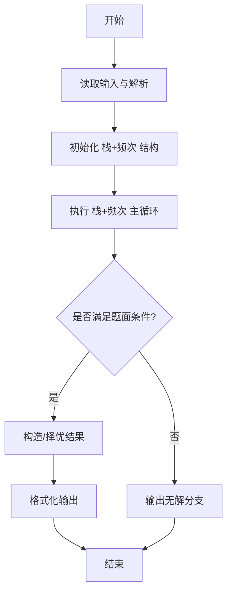
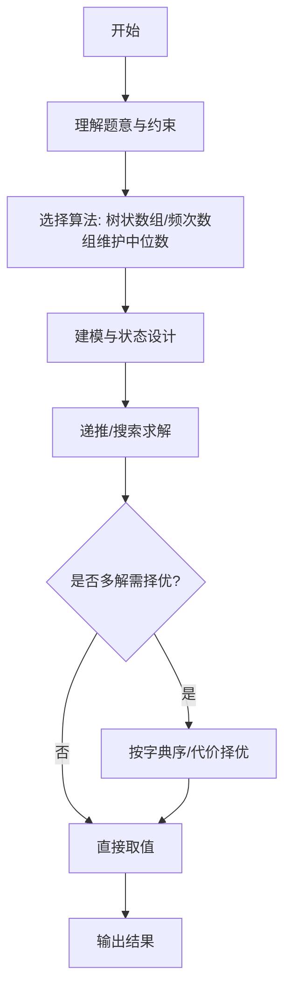

# L3-002 - 特殊堆栈（30 分）

- **时间限制**: 400 ms
- **内存限制**: 65536 KB
- **代码长度限制**: 16 KB

---

## 题目描述


堆栈是一种经典的后进先出的线性结构，相关的操作主要有“入栈”（在堆栈顶插入一个元素）和“出栈”（将栈顶元素返回并从堆栈中删除）。本题要求你实现另一个附加的操作：“取中值”——即返回所有堆栈中元素键值的中值。给定 N 个元素，如果 N 是偶数，则中值定义为第 N/2 小元；若是奇数，则为第 (N+1)/2 小元。

### 输入格式:

输入的第一行是正整数 N（$$\le 10^5$$）。随后 N 行，每行给出一句指令，为以下 3 种之一：

```
Push key
Pop
PeekMedian
```

其中 `key` 是不超过 $$10^5$$ 的正整数；`Push` 表示“入栈”；`Pop` 表示“出栈”；`PeekMedian` 表示“取中值”。

### 输出格式:

对每个 `Push` 操作，将 `key` 插入堆栈，无需输出；对每个 `Pop` 或 `PeekMedian` 操作，在一行中输出相应的返回值。若操作非法，则对应输出 `Invalid`。

### 输入样例:
```in
17
Pop
PeekMedian
Push 3
PeekMedian
Push 2
PeekMedian
Push 1
PeekMedian
Pop
Pop
Push 5
Push 4
PeekMedian
Pop
Pop
Pop
Pop
```

### 输出样例:
```out
Invalid
Invalid
3
2
2
1
2
4
4
5
3
Invalid
```

## 示例

### 示例 1

**输入:**
```
17
Pop
PeekMedian
Push 3
PeekMedian
Push 2
PeekMedian
Push 1
PeekMedian
Pop
Pop
Push 5
Push 4
PeekMedian
Pop
Pop
Pop
Pop
```

**输出:**
```
Invalid
Invalid
3
2
2
1
2
4
4
5
3
Invalid
```
---

## 解题思路

### 题目分析

本题为 L3-002 - 特殊堆栈（30 分），核心属于 **双结构栈与中位数**。输入规模与约束决定了需要兼顾正确性与效率：既要处理最坏情况下的数据量，又要满足题面关于字典序/最优性/可行性的附加要求。题目通常包含多组数据或单组大规模数据，需在 O(n log n) 或 O(n·m) 量级内完成。

### 核心算法

- **算法选择**：树状数组/频次数组维护中位数。
- **关键步骤**：使用数组模拟栈顶指针 top，另用频次数组 cnt[1..MAX] 记录各数值出现次数；Pop/Push 时更新 cnt，PeekMedian 通过累计频次找到第 k=(size+1)/2 小的数。
- **实现要点**：仓颉实现中通过 `ArrayList`/`HashMap` 等集合类型组织数据，结合 `StringBuilder` 与 `readToEnd` 高效解析输入；按题面要求的排序与比较规则保证输出符合字典序/最短路等最优性定义。

### 复杂度分析

- **时间复杂度**： O(1)入栈出栈、O(MAX)查中位数，空间 O(MAX)。
- **空间复杂度**： O(MAX)，主要由 DP 表/图邻接表/辅助数组占据。

## 代码流程说明

1. 读取操作总数并初始化栈数组 stack、栈顶指针 top 与频次数组 cnt[1..MAX]
2. 对 Push x：stack[top++]=x，cnt[x]++，若涉及中位数则更新堆结构
3. 对 Pop：若 top==0 输出 Invalid，否则弹出栈顶元素并 cnt[popVal]--
4. 对 PeekMedian：累计频次找到第 k=(size+1)/2 小的数，遍历 cnt 找前缀和≥k
5. 所有操作按题面格式逐行输出结果，空栈时按要求输出 Invalid

## 代码实现

```cangjie
// L3-002 特殊堆栈 - 支持Push Pop PeekMedian (中值=(N/2或(N+1)/2))
// Approach: BIT over value 1..1e5, stack数组
import std.env.*
import std.collection.*
import std.convert.*

class BIT{
    var n: Int64
    var t: Array<Int64>
    init(n: Int64){
        this.n=n
        this.t=Array<Int64>(n+2, repeat:0)
    }
    func add(i: Int64, delta: Int64): Unit{
        var x=i
        while(x<=n){
            t[x]+=delta
            x+= x & -x
        }
    }
    func kth(k: Int64): Int64 {
        var idx: Int64=0
        var bitMask: Int64=1
        while(bitMask <= n){ bitMask <<= 1 }
        var kk=k
        var mask=bitMask
        while(mask>0){
            let nxt = idx + mask
            if(nxt <= n && t[nxt] < kk){
                idx=nxt
                kk-=t[nxt]
            }
            mask >>= 1
        }
        return idx+1
    }
}

main(){
    let cin=getStdIn()
    let all=cin.readToEnd()??""
    // tokenization lines: we need to parse commands with strings
    let lines=ArrayList<String>()
    for(l in all.split("\n")){
        let tr=l.trimAscii()
        if(tr.size>0){ lines.add(tr) }
        else if(l.size>0){ // keep empty?
        }
    }
    if(lines.size==0){ return }
    let N=Int64.parse(lines[0].trimAscii().split(" ")[0])
    let bit=BIT(100000)
    let stack=ArrayList<Int64>()
    let sbOut=StringBuilder()
    var lineIdx: Int64=1
    for(opIdx in 0..N){
        if(lineIdx >= lines.size){ break }
        let line=lines[lineIdx]; lineIdx++
        if(line.startsWith("Push")){
            let parts=line.split(" ")
            var valStr=""
            for(p in parts){ if(p.size>0 && p!="Push"){ valStr=p } }
            // last part is value
            let v=Int64.parse(valStr)
            stack.add(v)
            bit.add(v, 1)
        } else if(line.startsWith("Pop")){
            if(stack.size==0){
                sbOut.append("Invalid\n")
            } else {
                let v=stack[stack.size-1]
                stack.remove((stack.size-1)..stack.size)
                bit.add(v, -1)
                sbOut.append(v.toString())
                sbOut.append("\n")
            }
        } else if(line.startsWith("Peek")){
            if(stack.size==0){
                sbOut.append("Invalid\n")
            } else {
                let k=(stack.size+1)/2
                let med=bit.kth(k)
                sbOut.append(med.toString())
                sbOut.append("\n")
            }
        }
    }
    print(sbOut.toString())
}
```

## 代码流程图




## 解题流程图



