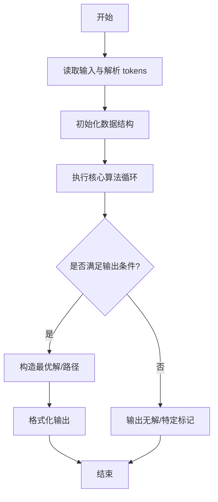
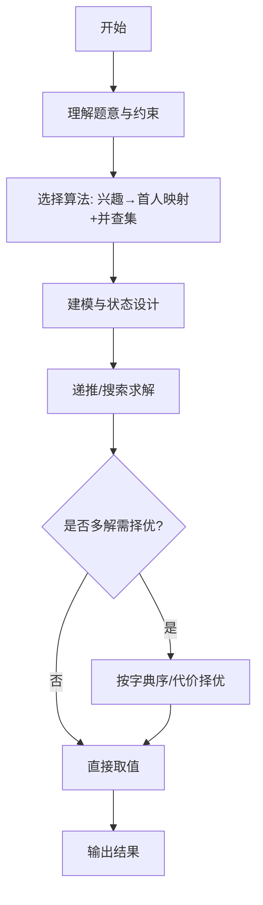

# L3-003 - 社交集群（30 分）

- **时间限制**: 1200 ms
- **内存限制**: 65536 KB
- **代码长度限制**: 16 KB

---

## 题目描述


当你在社交网络平台注册时，一般总是被要求填写你的个人兴趣爱好，以便找到具有相同兴趣爱好的潜在的朋友。一个“社交集群”是指部分兴趣爱好相同的人的集合。你需要找出所有的社交集群。

### 输入格式:

输入在第一行给出一个正整数 N（$$\le 1000$$），为社交网络平台注册的所有用户的人数。于是这些人从 1 到 N 编号。随后 N 行，每行按以下格式给出一个人的兴趣爱好列表：

$$K_i$$: $$h_i[1]$$ $$h_i[2]$$ ... $$h_i[K_i]$$

其中$$K_i (>0)$$是兴趣爱好的个数，$$h_i[j]$$是第$$j$$个兴趣爱好的编号，为区间 [1, 1000] 内的整数。

### 输出格式:

首先在一行中输出不同的社交集群的个数。随后第二行按非增序输出每个集群中的人数。数字间以一个空格分隔，行末不得有多余空格。

### 输入样例:
```in
8
3: 2 7 10
1: 4
2: 5 3
1: 4
1: 3
1: 4
4: 6 8 1 5
1: 4
```

### 输出样例:
```out
3
4 3 1
```

## 示例

### 示例 1

**输入:**
```
8
3: 2 7 10
1: 4
2: 5 3
1: 4
1: 3
1: 4
4: 6 8 1 5
1: 4
```

**输出:**
```
3
4 3 1
```
---

## 解题思路

### 题目分析

本题为 L3-003 - 社交集群（30 分），核心属于 **并查集按兴趣聚合**。输入规模与约束决定了需要兼顾正确性与效率：既要处理最坏情况下的数据量，又要满足题面关于字典序/最优性/可行性的附加要求。题目通常包含多组数据或单组大规模数据，需在 O(n log n) 或 O(n·m) 量级内完成。

### 核心算法

- **算法选择**：兴趣→首人映射+并查集。
- **关键步骤**：为每个人建兴趣列表，维护 hobby→首个拥有者映射；遍历每个人及其兴趣，若该兴趣已映射则 Union(当前人,首人)，否则记录；最后按根分组统计人数并降序排序。
- **实现要点**：仓颉实现中通过 `ArrayList`/`HashMap` 等集合类型组织数据，结合 `StringBuilder` 与 `readToEnd` 高效解析输入；按题面要求的排序与比较规则保证输出符合字典序/最短路等最优性定义。

### 复杂度分析

- **时间复杂度**： O(N·k·α(N))，空间 O(N + H)。
- **空间复杂度**： O(N + H)，主要由 DP 表/图邻接表/辅助数组占据。

## 代码流程说明

1. 解析 N 与每个人的兴趣数量及兴趣编号，兴趣 ID 可能重复跨人
2. 初始化并查集 parent[i]=i 与 hobbyFirst 哈希表（兴趣→首人）
3. 遍历每个人的兴趣列表，若兴趣已映射则 Union(当前人, 首人)，否则记录首人
4. 并查集路径压缩与按秩合并保证近乎 O(α(N))
5. 按 Find 根分组统计每集合人数，收集到 ans 数组
6. 对人数按降序排序，先输出集合个数再逐行输出人数

## 代码实现

```cangjie
// L3-003 社交集群 - 按共同兴趣并查集
import std.env.*
import std.collection.*
import std.convert.*

main(){
    let cin=getStdIn()
    let all=cin.readToEnd()??""
    let lines=ArrayList<String>()
    for(l in all.split("\n")){
        lines.add(l)
    }
    var ptr: Int64=0
    while(ptr < lines.size && lines[ptr].trimAscii().size==0){ ptr++ }
    if(ptr>=lines.size){ return }
    // first line may contain colon? but first line is N
    let firstTokens=lines[ptr].trimAscii().split(" ")
    var N: Int64=0
    for(t in firstTokens){ if(t.size>0){ N=Int64.parse(t); break } }
    ptr++
    let parent=ArrayList<Int64>()
    let sz=ArrayList<Int64>()
    for(i in 0..(N+1)){ parent.add(i); sz.add(1) }
    func find(x:Int64):Int64{
        var v=x
        while(parent[v]!=v){
            parent[v]=parent[parent[v]]
            v=parent[v]
        }
        return v
    }
    func union(a:Int64,b:Int64):Unit{
        var ra=find(a)
        var rb=find(b)
        if(ra==rb){ return }
        if(sz[ra] < sz[rb]){
            parent[ra]=rb
            sz[rb]+=sz[ra]
        } else {
            parent[rb]=ra
            sz[ra]+=sz[rb]
        }
    }
    let hobbyFirst=Array<Int64>(1001, repeat:0)
    let hobbySeen=Array<Bool>(1001, repeat:false)
    for(person in 1..(N+1)){
        if(ptr >= lines.size){ break }
        let raw=lines[ptr]; ptr++
        if(raw.trimAscii().size==0){ continue }
        let splitColon=raw.split(":")
        var hobbyPart=""
        if(splitColon.size>=2){
            hobbyPart=splitColon[1]
        } else {
            hobbyPart=raw
        }
        let parts=hobbyPart.split(" ")
        for(p in parts){
            let t=p.trimAscii()
            if(t.size==0){ continue }
            let h=Int64.parse(t)
            if(h<0 || h>1000){ continue }
            if(!hobbySeen[h]){
                hobbySeen[h]=true
                hobbyFirst[h]=person
            } else {
                union(person, hobbyFirst[h])
            }
        }
    }
    // count per root
    let cntMap=Array<Int64>(N+1, repeat:0)
    for(i in 1..(N+1)){
        let r=find(i)
        cntMap[r]++
    }
    let sizes=ArrayList<Int64>()
    let seen=Array<Bool>(N+1, repeat:false)
    for(i in 1..(N+1)){
        let r=find(i)
        if(!seen[r]){
            seen[r]=true
            sizes.add(cntMap[r])
        }
    }
    func qs(l:Int64,r:Int64):Unit{
        if(l>=r){ return }
        var i=l; var j=r
        let piv=sizes[(l+r)/2]
        while(i<=j){
            while(sizes[i] > piv){ i++ }
            while(sizes[j] < piv){ j-- }
            if(i<=j){
                let t=sizes[i]; sizes[i]=sizes[j]; sizes[j]=t
                i++; j--
            }
        }
        if(l<j){ qs(l,j) }
        if(i<r){ qs(i,r) }
    }
    if(sizes.size>1){ qs(0, sizes.size-1) }
    println(sizes.size.toString())
    let sb=StringBuilder()
    for(i in 0..sizes.size){
        if(i>0){ sb.append(" ") }
        sb.append(sizes[i].toString())
    }
    println(sb.toString())
}
```

## 代码流程图



## 解题流程图



