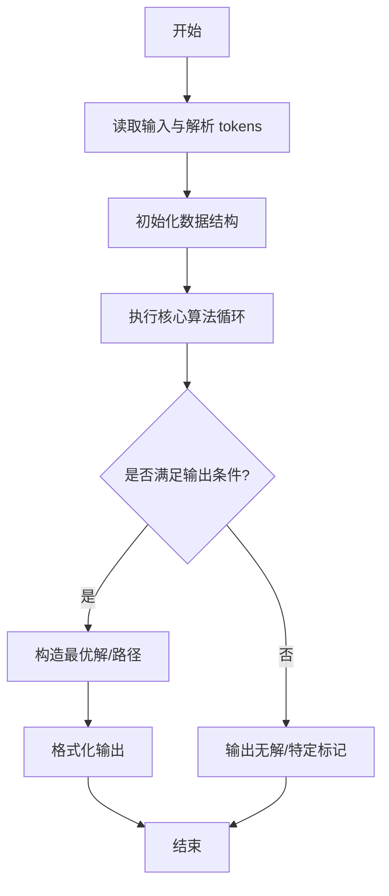
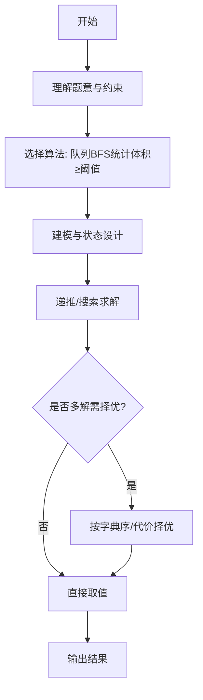

# L3-004 - 肿瘤诊断（30 分）

- **时间限制**: 600 ms
- **内存限制**: 65536 KB
- **代码长度限制**: 16 KB

---

## 题目描述


在诊断肿瘤疾病时，计算肿瘤体积是很重要的一环。给定病灶扫描切片中标注出的疑似肿瘤区域，请你计算肿瘤的体积。

### 输入格式:

输入第一行给出4个正整数：$$M$$、$$N$$、$$L$$、$$T$$，其中$$M$$和$$N$$是每张切片的尺寸（即每张切片是一个$$M\times N$$的像素矩阵。最大分辨率是$$1286\times 128$$）；$$L$$（$$\le 60$$）是切片的张数；$$T$$是一个整数阈值（若疑似肿瘤的连通体体积小于$$T$$，则该小块忽略不计）。

最后给出$$L$$张切片。每张用一个由0和1组成的$$M\times N$$的矩阵表示，其中1表示疑似肿瘤的像素，0表示正常像素。由于切片厚度可以认为是一个常数，于是我们只要数连通体中1的个数就可以得到体积了。麻烦的是，可能存在多个肿瘤，这时我们只统计那些体积不小于$$T$$的。两个像素被认为是“连通的”，如果它们有一个共同的切面，如下图所示，所有6个红色的像素都与蓝色的像素连通。


### 输出格式:

在一行中输出肿瘤的总体积。

### 输入样例:
```in
3 4 5 2
1 1 1 1
1 1 1 1
1 1 1 1
0 0 1 1
0 0 1 1
0 0 1 1
1 0 1 1
0 1 0 0
0 0 0 0
1 0 1 1
0 0 0 0
0 0 0 0
0 0 0 1
0 0 0 1
1 0 0 0
```

### 输出样例:
```out
26
```

## 示例

### 示例 1

**输入:**
```
3 4 5 2
1 1 1 1
1 1 1 1
1 1 1 1
0 0 1 1
0 0 1 1
0 0 1 1
1 0 1 1
0 1 0 0
0 0 0 0
1 0 1 1
0 0 0 0
0 0 0 0
0 0 0 1
0 0 0 1
1 0 0 0
```

**输出:**
```
26
```
---

## 解题思路

### 题目分析

本题为 L3-004 - 肿瘤诊断（30 分），核心属于 **三维BFS六连通体**。输入规模与约束决定了需要兼顾正确性与效率：既要处理最坏情况下的数据量，又要满足题面关于字典序/最优性/可行性的附加要求。题目通常包含多组数据或单组大规模数据，需在 O(n log n) 或 O(n·m) 量级内完成。

### 核心算法

- **算法选择**：队列BFS统计体积≥阈值。
- **关键步骤**：构建三维数组，六方向偏移 (±1,0,0) 等；遍历每个未访问的体素为1的点发起BFS，计数连通块体积，体积≥T则累加到答案。
- **实现要点**：仓颉实现中通过 `ArrayList`/`HashMap` 等集合类型组织数据，结合 `StringBuilder` 与 `readToEnd` 高效解析输入；按题面要求的排序与比较规则保证输出符合字典序/最短路等最优性定义。

### 复杂度分析

- **时间复杂度**： O(X·Y·Z)，空间 O(X·Y·Z)。
- **空间复杂度**： O(X·Y·Z)，主要由 DP 表/图邻接表/辅助数组占据。

## 代码流程说明

1. 读取 M、N、L、T 与三维体素数组，构建 X×Y×Z 的访问标记
2. 定义六方向偏移 dx,dy,dz，对每个未访问且值为1的体素发起 BFS
3. BFS 使用队列逐层扩展六邻接体素，计数连通块体积 vol
4. 若 vol ≥ T 则累加到答案 total，否则丢弃该小块
5. 遍历完所有体素后输出 total 体积

## 代码实现

```cangjie
// L3-004 肿瘤诊断 - 3D BFS六连通
import std.env.*
import std.collection.*
import std.convert.*

main(){
    let cin=getStdIn()
    let all=cin.readToEnd()??""
    let runes=all.toRuneArray()
    let tokens=ArrayList<String>()
    var sb=StringBuilder()
    let sp:Rune=' '
    let nl:Rune='\n'
    let tab:Rune='\t'
    let cr:Rune='\r'
    for(r in runes){
        if(r==sp||r==nl||r==tab||r==cr){
            let cur=sb.toString()
            if(cur.size>0){ tokens.add(cur) }
            sb=StringBuilder()
        } else { sb.append(r) }
    }
    let last=sb.toString()
    if(last.size>0){ tokens.add(last) }
    if(tokens.size<4){ return }
    var p: Int64=0
    let M=Int64.parse(tokens[p]); p++
    let N=Int64.parse(tokens[p]); p++
    let L=Int64.parse(tokens[p]); p++
    let T=Int64.parse(tokens[p]); p++
    let total = M * N * L
    let vol=Array<Int64>(total, repeat:0)
    // fill vol: order is L slices each with M rows each with N ints
    for(i in 0..total){
        if(p >= tokens.size){ break }
        vol[i]=Int64.parse(tokens[p]); p++
    }
    let visited=Array<Bool>(total, repeat:false)
    let strideN=N
    let strideMN=M*N
    func idx(l:Int64,m:Int64,n:Int64):Int64{
        return l*strideMN + m*strideN + n
    }
    var totalAns: Int64=0
    // direction deltas for 6 neighbors: dl, dm, dn
    let dL=Array<Int64>(6, repeat:0)
    let dM=Array<Int64>(6, repeat:0)
    let dN=Array<Int64>(6, repeat:0)
    dL[0]=1; dM[0]=0; dN[0]=0
    dL[1]=-1; dM[1]=0; dN[1]=0
    dL[2]=0; dM[2]=1; dN[2]=0
    dL[3]=0; dM[3]=-1; dN[3]=0
    dL[4]=0; dM[4]=0; dN[4]=1
    dL[5]=0; dM[5]=0; dN[5]=-1
    let queue=ArrayList<Int64>()
    for(l in 0..L){
        for(m in 0..M){
            for(n in 0..N){
                let id=idx(l,m,n)
                if(visited[id] || vol[id]==0){ continue }
                // BFS
                queue.clear()
                // Actually clear not available - recreate
                // Use manual pointer
                // For simplicity recreate new list each component
                let q=ArrayList<Int64>()
                q.add(id)
                visited[id]=true
                var head: Int64=0
                var cnt: Int64=1
                while(head < q.size){
                    let cur=q[head]; head++
                    let curL=cur / strideMN
                    let rem=cur % strideMN
                    let curM=rem / strideN
                    let curN=rem % strideN
                    for(k in 0..6){
                        let nl=curL + dL[k]
                        let nm=curM + dM[k]
                        let nn=curN + dN[k]
                        if(nl<0||nl>=L||nm<0||nm>=M||nn<0||nn>=N){ continue }
                        let nid=idx(nl,nm,nn)
                        if(visited[nid] || vol[nid]==0){ continue }
                        visited[nid]=true
                        q.add(nid)
                        cnt++
                    }
                }
                if(cnt >= T){ totalAns+=cnt }
            }
        }
    }
    println(totalAns.toString())
}
```

## 代码流程图



## 解题流程图



