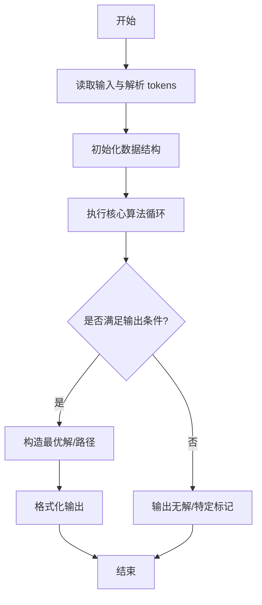
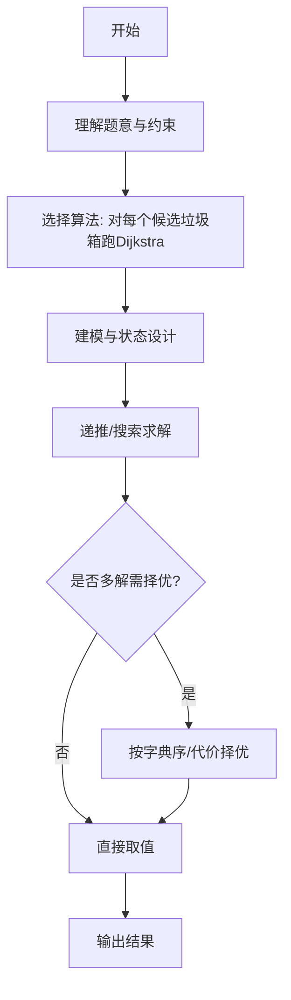

# L3-005 - 垃圾箱分布（30 分）

- **时间限制**: 200 ms
- **内存限制**: 65536 KB
- **代码长度限制**: 16 KB

---

## 题目描述


大家倒垃圾的时候，都希望垃圾箱距离自己比较近，但是谁都不愿意守着垃圾箱住。所以垃圾箱的位置必须选在到所有居民点的最短距离最长的地方，同时还要保证每个居民点都在距离它一个不太远的范围内。

现给定一个居民区的地图，以及若干垃圾箱的候选地点，请你推荐最合适的地点。如果解不唯一，则输出到所有居民点的平均距离最短的那个解。如果这样的解还是不唯一，则输出编号最小的地点。

### 输入格式:

输入第一行给出4个正整数：$$N$$（$$\le 10^3$$）是居民点的个数；$$M$$（$$\le 10$$）是垃圾箱候选地点的个数；$$K$$（$$\le 10^4$$）是居民点和垃圾箱候选地点之间的道路的条数；$$D_S$$是居民点与垃圾箱之间不能超过的最大距离。所有的居民点从1到$$N$$编号，所有的垃圾箱候选地点从$$G1$$到$$GM$$编号。

随后$$K$$行，每行按下列格式描述一条道路：
```
P1 P2 Dist
```
其中`P1`和`P2`是道路两端点的编号，端点可以是居民点，也可以是垃圾箱候选点。`Dist`是道路的长度，是一个正整数。

### 输出格式:

首先在第一行输出最佳候选地点的编号。然后在第二行输出该地点到所有居民点的最小距离和平均距离。数字间以空格分隔，保留小数点后1位。如果解不存在，则输出`No Solution`。

### 输入样例 1：
```in
4 3 11 5
1 2 2
1 4 2
1 G1 4
1 G2 3
2 3 2
2 G2 1
3 4 2
3 G3 2
4 G1 3
G2 G1 1
G3 G2 2
```

### 输出样例 1：
```out
G1
2.0 3.3
```

### 输入样例 2：
```in
2 1 2 10
1 G1 9
2 G1 20
```

### 输出样例 2：
```out
No Solution
```

## 示例

### 示例 1

**输入:**
```
4 3 11 5
1 2 2
1 4 2
1 G1 4
1 G2 3
2 3 2
2 G2 1
3 4 2
3 G3 2
4 G1 3
G2 G1 1
G3 G2 2
```

**输出:**
```
G1
2.0 3.3
```

### 示例 2

**输入:**
```
2 1 2 10
1 G1 9
2 G1 20
```

**输出:**
```
No Solution
```
---

## 解题思路

### 题目分析

本题为 L3-005 - 垃圾箱分布（30 分），核心属于 **多源Dijkstra选址**。输入规模与约束决定了需要兼顾正确性与效率：既要处理最坏情况下的数据量，又要满足题面关于字典序/最优性/可行性的附加要求。题目通常包含多组数据或单组大规模数据，需在 O(n log n) 或 O(n·m) 量级内完成。

### 核心算法

- **算法选择**：对每个候选垃圾箱跑Dijkstra。
- **关键步骤**：以候选点为源用邻接表+Dijkstra求到所有居民点的最短距离，取最小距离作为其实最短、平均距离作为均值；筛选满足最短≥期望且最短最大的方案，平均距离最小平局按编号升序。
- **实现要点**：仓颉实现中通过 `ArrayList`/`HashMap` 等集合类型组织数据，结合 `StringBuilder` 与 `readToEnd` 高效解析输入；按题面要求的排序与比较规则保证输出符合字典序/最短路等最优性定义。

### 复杂度分析

- **时间复杂度**： O(K·(E log V))，空间 O(V+E)。
- **空间复杂度**： O(V+E)，主要由 DP 表/图邻接表/辅助数组占据。

## 代码流程说明

1. 解析 N、M、K、DS，区分居民点 1..N 与候选点 G1..GM 的编号映射
2. 构建无向带权邻接表，K 条边双向加入
3. 对每个候选点 Gk 以其为源执行 Dijkstra（题解用 O(V²) 朴素版）求到所有居民的最短距离
4. 检查是否所有居民距离 ≤ DS，若有超限则该候选无效跳过
5. 计算该候选的最小距离 minD 与平均距离 avg，维护全局最优：minD 最大、avg 最小、编号最小的平局规则
6. 遍历结束若无可行候选输出 No Solution，否则输出 Gidx 与 minD、avg 保留一位小数

## 代码实现

```cangjie
// L3-005 垃圾箱分布 - Dijkstra多候选点
import std.env.*
import std.collection.*
import std.convert.*
import std.math.*

main(){
    let cin=getStdIn()
    let all=cin.readToEnd()??""
    let runes=all.toRuneArray()
    let tokens=ArrayList<String>()
    var sb=StringBuilder()
    let sp:Rune=' '
    let nl:Rune='\n'
    let tab:Rune='\t'
    let cr:Rune='\r'
    for(r in runes){
        if(r==sp||r==nl||r==tab||r==cr){
            let cur=sb.toString()
            if(cur.size>0){ tokens.add(cur) }
            sb=StringBuilder()
        } else { sb.append(r) }
    }
    let last=sb.toString()
    if(last.size>0){ tokens.add(last) }
    if(tokens.size<4){ return }
    var p: Int64=0
    let N=Int64.parse(tokens[p]); p++
    let M=Int64.parse(tokens[p]); p++
    let K=Int64.parse(tokens[p]); p++
    let DS=Int64.parse(tokens[p]); p++
    let V=N+M
    let adj=ArrayList<ArrayList<Array<Int64>>>()
    for(i in 0..(V+1)){ adj.add(ArrayList<Array<Int64>>()) }
    func parseNode(s:String):Int64{
        let rs=s.toRuneArray()
        let g:Rune='G'
        if(rs.size>0 && rs[0]==g){
            let sb2=StringBuilder()
            for(i in 1..rs.size){ sb2.append(rs[i]) }
            let num=Int64.parse(sb2.toString())
            return N + num
        } else {
            return Int64.parse(s)
        }
    }
    for(i in 0..K){
        if(p+2 >= tokens.size){ break }
        let p1=tokens[p]; p++
        let p2=tokens[p]; p++
        let d=Int64.parse(tokens[p]); p++
        let u=parseNode(p1)
        let v=parseNode(p2)
        adj[u].add([v,d])
        adj[v].add([u,d])
    }
    let INF: Int64 = 9000000000000000000
    var bestIdx: Int64 = -1
    var bestMin: Int64 = -1
    var bestAvg: Float64 = 1e100
    for(g in 1..(M+1)){
        let src=N+g
        let dist=Array<Int64>(V+1, repeat:INF)
        let vis=Array<Bool>(V+1, repeat:false)
        dist[src]=0
        for(iter in 0..(V)){
            var u: Int64=-1
            var best: Int64=INF
            for(v in 1..(V+1)){
                if(!vis[v] && dist[v] < best){ best=dist[v]; u=v }
            }
            if(u==-1){ break }
            vis[u]=true
            for(e in adj[u]){
                let to=e[0]; let w=e[1]
                if(!vis[to] && dist[to] > dist[u]+w){
                    dist[to]=dist[u]+w
                }
            }
        }
        var ok=true
        var minD: Int64=INF
        var sum: Int64=0
        for(i in 1..(N+1)){
            if(dist[i] > DS){ ok=false; break }
            if(dist[i] < minD){ minD=dist[i] }
            sum+=dist[i]
        }
        if(!ok){ continue }
        let avg = Float64(sum) / Float64(N)
        var take=false
        if(bestIdx==-1){ take=true }
        else if(minD > bestMin){ take=true }
        else if(minD==bestMin && avg < bestAvg - 1e-9){ take=true }
        else if(minD==bestMin && abs(avg - bestAvg) < 1e-9 && g < bestIdx){ take=true }
        if(take){
            bestIdx=g
            bestMin=minD
            bestAvg=avg
        }
    }
    if(bestIdx==-1){
        println("No Solution")
    } else {
        let sb2=StringBuilder()
        sb2.append("G")
        sb2.append(bestIdx.toString())
        println(sb2.toString())
        func fmtOne(v: Float64): String {
            var iv = Int64(floor(v*10.0 + 0.5 + 1e-9))
            let neg = iv < 0
            if(neg){ iv = -iv }
            let intPart = iv / 10
            let dec = iv % 10
            var s=""
            if(neg){ s="-" }
            s += intPart.toString()
            s += "."
            s += dec.toString()
            return s
        }
        let minStr = fmtOne(Float64(bestMin))
        let avgStr = fmtOne(bestAvg)
        println("${minStr} ${avgStr}")
    }
}
```

## 代码流程图



## 解题流程图



