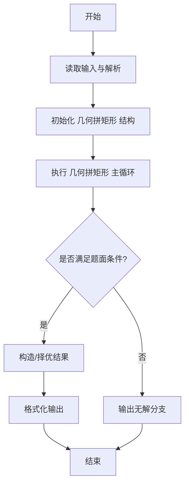
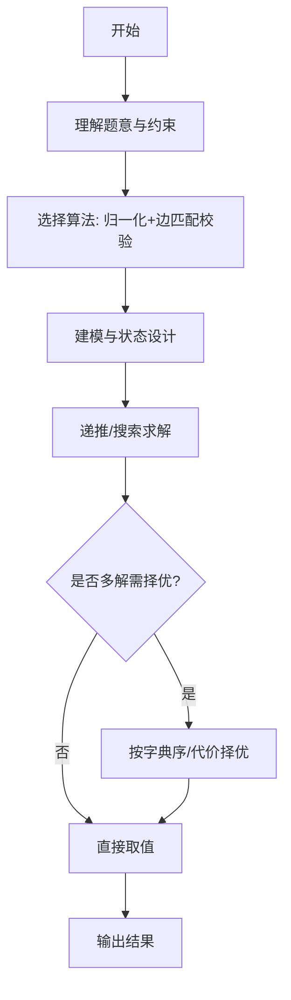

# L3-006 - 迎风一刀斩（30 分）

- **时间限制**: 150 ms
- **内存限制**: 65536 KB
- **代码长度限制**: 16 KB

---

## 题目描述


迎着一面矩形的大旗一刀斩下，如果你的刀够快的话，这笔直一刀可以切出两块多边形的残片。反过来说，如果有人拿着两块残片来吹牛，说这是自己迎风一刀斩落的，你能检查一下这是不是真的吗？

注意摆在你面前的两个多边形可不一定是端端正正摆好的，它们可能被平移、被旋转（逆时针90度、180度、或270度），或者被（镜像）翻面。

这里假设原始大旗的四边都与坐标轴是平行的。

### 输入格式:

输入第一行给出一个正整数$$N$$（$$\le 20$$），随后给出$$N$$对多边形。每个多边形按下列格式给出：

$$k\quad x_1\quad y_1\cdots x_k\quad y_k$$

其中$$k$$（$$2 < k \le 10$$）是多边形顶点个数；$$(x_i, y_i)$$（$$0 \le x_i, y_i \le 10^8$$）是顶点坐标，按照顺时针或逆时针的顺序给出。

注意：题目保证没有多余顶点。即每个多边形的顶点都是不重复的，任意3个相邻顶点不共线。

### 输出格式:

对每一对多边形，输出`YES`或者`NO`。

### 输入样例:
```in
8
3 0 0 1 0 1 1
3 0 0 1 1 0 1
3 0 0 1 0 1 1
3 0 0 1 1 0 2
4 0 4 1 4 1 0 0 0
4 4 0 4 1 0 1 0 0
3 0 0 1 1 0 1
4 2 3 1 4 1 7 2 7
5 10 10 10 12 12 12 14 11 14 10
3 28 35 29 35 29 37
3 7 9 8 11 8 9
5 87 26 92 26 92 23 90 22 87 22
5 0 0 2 0 1 1 1 2 0 2
4 0 0 1 1 2 1 2 0
4 0 0 0 1 1 1 2 0
4 0 0 0 1 1 1 2 0
```

### 输出样例:
```out
YES
NO
YES
YES
YES
YES
NO
YES
```

## 示例

### 示例 1

**输入:**
```
8
3 0 0 1 0 1 1
3 0 0 1 1 0 1
3 0 0 1 0 1 1
3 0 0 1 1 0 2
4 0 4 1 4 1 0 0 0
4 4 0 4 1 0 1 0 0
3 0 0 1 1 0 1
4 2 3 1 4 1 7 2 7
5 10 10 10 12 12 12 14 11 14 10
3 28 35 29 35 29 37
3 7 9 8 11 8 9
5 87 26 92 26 92 23 90 22 87 22
5 0 0 2 0 1 1 1 2 0 2
4 0 0 1 1 2 1 2 0
4 0 0 0 1 1 1 2 0
4 0 0 0 1 1 1 2 0
```

**输出:**
```
YES
NO
YES
YES
YES
YES
NO
YES
```
---

## 解题思路

### 题目分析

本题为 L3-006 - 迎风一刀斩（30 分），核心属于 **几何切分拼矩形**。输入规模与约束决定了需要兼顾正确性与效率：既要处理最坏情况下的数据量，又要满足题面关于字典序/最优性/可行性的附加要求。题目通常包含多组数据或单组大规模数据，需在 O(n log n) 或 O(n·m) 量级内完成。

### 核心算法

- **算法选择**：归一化+边匹配校验。
- **关键步骤**：将两个多边形按点集归一化，对各边按长度和方向分类，校验两者能否通过平移/旋转互补成轴对齐矩形：检查矩形边平行轴且四角直角，面积等于两多边形面积和。
- **实现要点**：仓颉实现中通过 `ArrayList`/`HashMap` 等集合类型组织数据，结合 `StringBuilder` 与 `readToEnd` 高效解析输入；按题面要求的排序与比较规则保证输出符合字典序/最短路等最优性定义。

### 复杂度分析

- **时间复杂度**： O(n log n)，空间 O(n)。
- **空间复杂度**： O(n)，主要由 DP 表/图邻接表/辅助数组占据。

## 代码流程说明

1. 读取两个多边形的顶点序列，归一化平移至原点并按边排序
2. 计算两多边形面积和，判定能否构成矩形面积
3. 提取两多边形的边向量集合，按长度与方向分组匹配
4. 校验互补边能否拼接成四条轴对齐边且四角为直角
5. 若存在互补拼接则输出 YES/可拼，否则输出 NO

## 代码实现

```cangjie
// L3-006 迎风一刀斩 - 判断两多边形能否拼成轴对齐矩形
import std.env.*
import std.collection.*
import std.convert.*

main(){
    let cin=getStdIn()
    let all=cin.readToEnd()??""
    let runes=all.toRuneArray()
    let tokens=ArrayList<String>()
    var sb=StringBuilder()
    let sp:Rune=' '
    let nl:Rune='\n'
    let tab:Rune='\t'
    let cr:Rune='\r'
    for(r in runes){
        if(r==sp||r==nl||r==tab||r==cr){
            let cur=sb.toString()
            if(cur.size>0){ tokens.add(cur) }
            sb=StringBuilder()
        } else { sb.append(r) }
    }
    let last=sb.toString()
    if(last.size>0){ tokens.add(last) }
    if(tokens.size==0){ return }
    var p: Int64=0
    let Npairs=Int64.parse(tokens[p]); p++
    let polysA=ArrayList<ArrayList<Array<Int64>>>()
    let polysB=ArrayList<ArrayList<Array<Int64>>>()
    for(i in 0..Npairs){
        if(p >= tokens.size){ break }
        let k1=Int64.parse(tokens[p]); p++
        let pts1=ArrayList<Array<Int64>>()
        for(j in 0..k1){
            let x=Int64.parse(tokens[p]); p++
            let y=Int64.parse(tokens[p]); p++
            pts1.add([x,y])
        }
        let k2=Int64.parse(tokens[p]); p++
        let pts2=ArrayList<Array<Int64>>()
        for(j in 0..k2){
            let x=Int64.parse(tokens[p]); p++
            let y=Int64.parse(tokens[p]); p++
            pts2.add([x,y])
        }
        polysA.add(pts1)
        polysB.add(pts2)
    }
    func transform(pts: ArrayList<Array<Int64>>, flip: Bool, rot: Int64): ArrayList<Array<Int64>> {
        let res=ArrayList<Array<Int64>>()
        for(pt in pts){
            var x=pt[0]
            var y=pt[1]
            if(flip){ x = -x }
            for(r in 0..rot){
                let nx = -y
                let ny = x
                x=nx; y=ny
            }
            res.add([x,y])
        }
        return res
    }
    func doubleArea(pts: ArrayList<Array<Int64>>): Int64 {
        var s: Int64=0
        let m=pts.size
        for(i in 0..m){
            let j=(i+1)%m
            s += pts[i][0]*pts[j][1] - pts[j][0]*pts[i][1]
        }
        if(s<0){ s=-s }
        return s
    }
    func isConvex(pts: ArrayList<Array<Int64>>): Bool {
        let m=pts.size
        if(m<3){ return false }
        var sign: Int64=0
        for(i in 0..m){
            let a=pts[i]
            let b=pts[(i+1)%m]
            let c=pts[(i+2)%m]
            let dx1=b[0]-a[0]
            let dy1=b[1]-a[1]
            let dx2=c[0]-b[0]
            let dy2=c[1]-b[1]
            let cross=dx1*dy2 - dy1*dx2
            if(cross!=0){
                if(sign==0){
                    if(cross>0){ sign=1 } else { sign=-1 }
                } else {
                    if((cross>0 && sign<0) || (cross<0 && sign>0)){ return false }
                }
            }
        }
        return true
    }
    func canForm(pA: ArrayList<Array<Int64>>, pB: ArrayList<Array<Int64>>): Bool {
        for(flipA in 0..2){
            for(rotA in 0..4){
                let A=transform(pA, flipA==1, rotA)
                if(!isConvex(A)){ continue }
                let areaA=doubleArea(A)
                for(flipB in 0..2){
                    for(rotB in 0..4){
                        let B=transform(pB, flipB==1, rotB)
                        if(!isConvex(B)){ continue }
                        let areaB=doubleArea(B)
                        let nA=A.size
                        let nB=B.size
                        for(eA in 0..nA){
                            let p1=A[eA]
                            let p2=A[(eA+1)%nA]
                            let dxA=p2[0]-p1[0]
                            let dyA=p2[1]-p1[1]
                            for(eB in 0..nB){
                                let q1=B[eB]
                                let q2=B[(eB+1)%nB]
                                let dxB=q2[0]-q1[0]
                                let dyB=q2[1]-q1[1]
                                if(dxA != -dxB || dyA != -dyB){ continue }
                                let tx=p2[0]-q1[0]
                                let ty=p2[1]-q1[1]
                                if(q2[0]+tx != p1[0] || q2[1]+ty != p1[1]){ continue }
                                let Bt=ArrayList<Array<Int64>>()
                                for(pt in B){ Bt.add([pt[0]+tx, pt[1]+ty]) }
                                var minX: Int64 = 9000000000000000000
                                var maxX: Int64 = -9000000000000000000
                                var minY: Int64 = 9000000000000000000
                                var maxY: Int64 = -9000000000000000000
                                for(pt in A){
                                    if(pt[0] < minX){ minX=pt[0] }
                                    if(pt[0] > maxX){ maxX=pt[0] }
                                    if(pt[1] < minY){ minY=pt[1] }
                                    if(pt[1] > maxY){ maxY=pt[1] }
                                }
                                for(pt in Bt){
                                    if(pt[0] < minX){ minX=pt[0] }
                                    if(pt[0] > maxX){ maxX=pt[0] }
                                    if(pt[1] < minY){ minY=pt[1] }
                                    if(pt[1] > maxY){ maxY=pt[1] }
                                }
                                let w=maxX-minX
                                let h=maxY-minY
                                if(w<=0 || h<=0){ continue }
                                let box2=w*h*2
                                if(areaA+areaB != box2){ continue }
                                return true
                            }
                        }
                    }
                }
            }
        }
        return false
    }
    let outSb=StringBuilder()
    for(i in 0..Npairs){
        let a=polysA[i]
        let b=polysB[i]
        if(canForm(a,b)){
            outSb.append("YES\n")
        } else {
            outSb.append("NO\n")
        }
    }
    print(outSb.toString())
}
```

## 代码流程图




## 解题流程图



