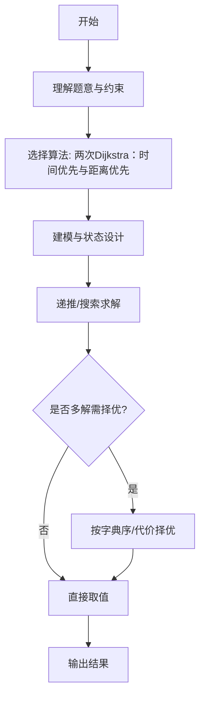

# L3-007 - 天梯地图（30 分）

- **时间限制**: 300 ms
- **内存限制**: 65536 KB
- **代码长度限制**: 16 KB

---

## 题目描述


本题要求你实现一个天梯赛专属在线地图，队员输入自己学校所在地和赛场地点后，该地图应该推荐两条路线：一条是最快到达路线；一条是最短距离的路线。题目保证对任意的查询请求，地图上都至少存在一条可达路线。

### 输入格式:

输入在第一行给出两个正整数`N`（2 $$\le$$ `N` $$\le$$ 500）和`M`，分别为地图中所有标记地点的个数和连接地点的道路条数。随后`M`行，每行按如下格式给出一条道路的信息：

```
V1 V2 one-way length time
```

其中`V1`和`V2`是道路的两个端点的编号（从0到`N`-1）；如果该道路是从`V1`到`V2`的单行线，则`one-way`为1，否则为0；`length`是道路的长度；`time`是通过该路所需要的时间。最后给出一对起点和终点的编号。

### 输出格式:

首先按下列格式输出最快到达的时间`T`和用节点编号表示的路线：

```
Time = T: 起点 => 节点1 => ... => 终点
```

然后在下一行按下列格式输出最短距离`D`和用节点编号表示的路线：

```
Distance = D: 起点 => 节点1 => ... => 终点
```

如果最快到达路线不唯一，则输出几条最快路线中最短的那条，题目保证这条路线是唯一的。而如果最短距离的路线不唯一，则输出途径节点数最少的那条，题目保证这条路线是唯一的。

如果这两条路线是完全一样的，则按下列格式输出：

```
Time = T; Distance = D: 起点 => 节点1 => ... => 终点
```

### 输入样例 1：
```in
10 15
0 1 0 1 1
8 0 0 1 1
4 8 1 1 1
5 4 0 2 3
5 9 1 1 4
0 6 0 1 1
7 3 1 1 2
8 3 1 1 2
2 5 0 2 2
2 1 1 1 1
1 5 0 1 3
1 4 0 1 1
9 7 1 1 3
3 1 0 2 5
6 3 1 2 1
5 3
```

### 输出样例 1：
```out
Time = 6: 5 => 4 => 8 => 3
Distance = 3: 5 => 1 => 3
```

### 输入样例 2：
```in
7 9
0 4 1 1 1
1 6 1 3 1
2 6 1 1 1
2 5 1 2 2
3 0 0 1 1
3 1 1 3 1
3 2 1 2 1
4 5 0 2 2
6 5 1 2 1
3 5
```

### 输出样例 2：
```out
Time = 3; Distance = 4: 3 => 2 => 5
```

## 示例

### 示例 1

**输入:**
```
10 15
0 1 0 1 1
8 0 0 1 1
4 8 1 1 1
5 4 0 2 3
5 9 1 1 4
0 6 0 1 1
7 3 1 1 2
8 3 1 1 2
2 5 0 2 2
2 1 1 1 1
1 5 0 1 3
1 4 0 1 1
9 7 1 1 3
3 1 0 2 5
6 3 1 2 1
5 3
```

**输出:**
```
Time = 6: 5 => 4 => 8 => 3
Distance = 3: 5 => 1 => 3
```

### 示例 2

**输入:**
```
7 9
0 4 1 1 1
1 6 1 3 1
2 6 1 1 1
2 5 1 2 2
3 0 0 1 1
3 1 1 3 1
3 2 1 2 1
4 5 0 2 2
6 5 1 2 1
3 5
```

**输出:**
```
Time = 3; Distance = 4: 3 => 2 => 5
```
---

## 解题思路

### 题目分析

本题为 L3-007 - 天梯地图（30 分），核心属于 **双准则最短路**。输入规模与约束决定了需要兼顾正确性与效率：既要处理最坏情况下的数据量，又要满足题面关于字典序/最优性/可行性的附加要求。题目通常包含多组数据或单组大规模数据，需在 O(n log n) 或 O(n·m) 量级内完成。

### 核心算法

- **算法选择**：两次Dijkstra：时间优先与距离优先。
- **关键步骤**：建图含 time 与 length 双权；第一次以 time 为主、length 为次用Dijkstra求最快路径，第二次以 length 为主、time 为次求最短路径；路径重建用父指针回溯。
- **实现要点**：仓颉实现中通过 `ArrayList`/`HashMap` 等集合类型组织数据，结合 `StringBuilder` 与 `readToEnd` 高效解析输入；按题面要求的排序与比较规则保证输出符合字典序/最短路等最优性定义。

### 复杂度分析

- **时间复杂度**： O((V+E) log V)，空间 O(V+E)。
- **空间复杂度**： O(V+E)，主要由 DP 表/图邻接表/辅助数组占据。

## 代码流程说明

1. 解析地图节点数与边数，边含 time 与 length 双权
2. 第一次 Dijkstra 以 time 为主、length 为次求最快路径，记录 prev 与 distTime
3. 第二次 Dijkstra 以 length 为主、time 为次求最短路径，记录 prev2 与 distLen
4. 两次路径回溯还原节点序列，分别输出最快与最短路径
5. 若两路径相同则合并输出，否则分两行输出对应路径与度量

## 代码实现

```cangjie
// L3-007 天梯地图 - 最快与最短路径
import std.env.*
import std.collection.*
import std.convert.*

main(){
    let cin=getStdIn()
    let all=cin.readToEnd()??""
    let runes=all.toRuneArray()
    let tokens=ArrayList<String>()
    var sb=StringBuilder()
    let sp:Rune=' '
    let nl:Rune='\n'
    let tab:Rune='\t'
    let cr:Rune='\r'
    for(r in runes){
        if(r==sp||r==nl||r==tab||r==cr){
            let cur=sb.toString()
            if(cur.size>0){ tokens.add(cur) }
            sb=StringBuilder()
        } else { sb.append(r) }
    }
    let last=sb.toString()
    if(last.size>0){ tokens.add(last) }
    if(tokens.size<2){ return }
    var p: Int64=0
    let N=Int64.parse(tokens[p]); p++
    let M=Int64.parse(tokens[p]); p++
    let adj=ArrayList<ArrayList<Array<Int64>>>()
    for(i in 0..N){ adj.add(ArrayList<Array<Int64>>()) }
    for(i in 0..M){
        let v1=Int64.parse(tokens[p]); p++
        let v2=Int64.parse(tokens[p]); p++
        let ow=Int64.parse(tokens[p]); p++
        let len=Int64.parse(tokens[p]); p++
        let tim=Int64.parse(tokens[p]); p++
        adj[v1].add([v2,len,tim])
        if(ow==0){ adj[v2].add([v1,len,tim]) }
    }
    let start=Int64.parse(tokens[p]); p++
    let dest=Int64.parse(tokens[p]); p++
    let INF: Int64 = 9000000000000000000
    // Dijkstra for time primary distance secondary
    func dijkstraTime():Array<Int64> {
        let distT=Array<Int64>(N, repeat:INF)
        let distL=Array<Int64>(N, repeat:INF)
        let parent=Array<Int64>(N, repeat:-1)
        let vis=Array<Bool>(N, repeat:false)
        distT[start]=0
        distL[start]=0
        for(iter in 0..N){
            var u: Int64=-1
            var best: Int64=INF
            for(v in 0..N){
                if(!vis[v] && distT[v] < best){ best=distT[v]; u=v }
            }
            if(u==-1){ break }
            vis[u]=true
            for(e in adj[u]){
                let to=e[0]; let len=e[1]; let tim=e[2]
                if(vis[to]){ continue }
                let nt=distT[u]+tim
                let nl=distL[u]+len
                if(nt < distT[to] || (nt==distT[to] && nl < distL[to])){
                    distT[to]=nt
                    distL[to]=nl
                    parent[to]=u
                }
            }
        }
        // Return combined: we need distT[dest] and parent array encoded via closure, but we will reconstruct outside
        // Instead we store parent globally via return values using arrays captured
        // For simplicity do separate function returning parent; but we use outer arrays
        // We'll just store into globals and access - here we return parent
        return parent
    }
    // We'll implement inline for time and dist
    let distT=Array<Int64>(N, repeat:INF)
    let distLforT=Array<Int64>(N, repeat:INF)
    let parentT=Array<Int64>(N, repeat:-1)
    let visT=Array<Bool>(N, repeat:false)
    distT[start]=0; distLforT[start]=0
    for(iter in 0..N){
        var u: Int64=-1
        var best: Int64=INF
        for(v in 0..N){ if(!visT[v] && distT[v] < best){ best=distT[v]; u=v } }
        if(u==-1){ break }
        visT[u]=true
        for(e in adj[u]){
            let to=e[0]; let len=e[1]; let tim=e[2]
            if(visT[to]){ continue }
            let nt=distT[u]+tim
            let nl=distLforT[u]+len
            if(nt < distT[to] || (nt==distT[to] && nl < distLforT[to])){
                distT[to]=nt
                distLforT[to]=nl
                parentT[to]=u
            }
        }
    }
    let distD=Array<Int64>(N, repeat:INF)
    let cntD=Array<Int64>(N, repeat:INF)
    let parentD=Array<Int64>(N, repeat:-1)
    let visD=Array<Bool>(N, repeat:false)
    distD[start]=0
    cntD[start]=1
    for(iter in 0..N){
        var u: Int64=-1
        var best: Int64=INF
        for(v in 0..N){ if(!visD[v] && distD[v] < best){ best=distD[v]; u=v } }
        if(u==-1){ break }
        visD[u]=true
        for(e in adj[u]){
            let to=e[0]; let len=e[1]
            if(visD[to]){ continue }
            let nd=distD[u]+len
            let nc=cntD[u]+1
            if(nd < distD[to] || (nd==distD[to] && nc < cntD[to])){
                distD[to]=nd
                cntD[to]=nc
                parentD[to]=u
            }
        }
    }
    func buildPath(parent: Array<Int64>, dest: Int64): ArrayList<Int64> {
        let rev=ArrayList<Int64>()
        var cur=dest
        while(cur != -1){
            rev.add(cur)
            cur=parent[cur]
        }
        let path=ArrayList<Int64>()
        var i=rev.size-1
        while(i>=0){
            path.add(rev[i])
            i--
        }
        return path
    }
    let pathT=buildPath(parentT, dest)
    let pathD=buildPath(parentD, dest)
    var same=true
    if(pathT.size != pathD.size){ same=false }
    else {
        for(i in 0..pathT.size){
            if(pathT[i]!=pathD[i]){ same=false; break }
        }
    }
    func fmtPath(p: ArrayList<Int64>): String {
        let sb2=StringBuilder()
        for(i in 0..p.size){
            if(i>0){ sb2.append(" => ") }
            sb2.append(p[i].toString())
        }
        return sb2.toString()
    }
    if(same){
        println("Time = ${distT[dest]}; Distance = ${distD[dest]}: ${fmtPath(pathT)}")
    } else {
        println("Time = ${distT[dest]}: ${fmtPath(pathT)}")
        println("Distance = ${distD[dest]}: ${fmtPath(pathD)}")
    }
}
```

## 代码流程图

```mermaid
flowchart TD
    A[开始] --> B[读取输入与解析]
    B --> C[初始化 双Dijkstra 结构]
    C --> D[执行 双Dijkstra 主循环]
    D --> E{是否满足题面条件?}
    E -- 否 --> F[输出无解分支]
    E -- 是 --> G[构造/择优结果]
    G --> H[格式化输出]
    H --> I[结束]
    F --> I
```




## 解题流程图



