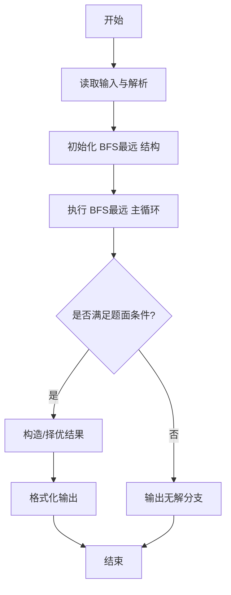
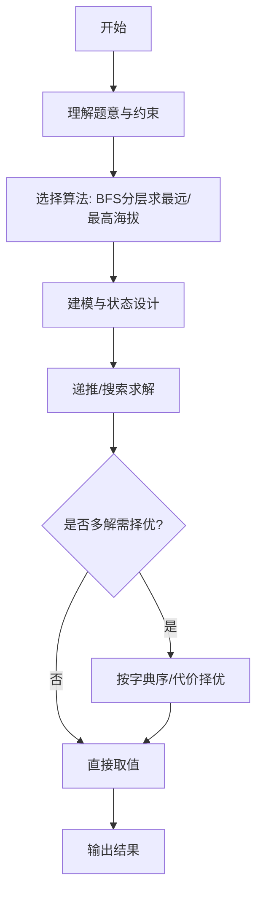

# L3-008 - 喊山（30 分）

- **时间限制**: 150 ms
- **内存限制**: 65536 KB
- **代码长度限制**: 16 KB

---

## 题目描述


喊山，是人双手围在嘴边成喇叭状，对着远方高山发出“喂—喂喂—喂喂喂……”的呼唤。呼唤声通过空气的传递，回荡于深谷之间，传送到人们耳中，发出约定俗成的“讯号”，达到声讯传递交流的目的。原来它是彝族先民用来求援呼救的“讯号”，慢慢地人们在生活实践中发现了它的实用价值，便把它作为一种交流工具世代传袭使用。（图文摘自：http://news.xrxxw.com/newsshow-8018.html）


一个山头呼喊的声音可以被临近的山头同时听到。题目假设每个山头最多有两个能听到它的临近山头。给定任意一个发出原始信号的山头，本题请你找出这个信号最远能传达到的地方。

### 输入格式:

输入第一行给出3个正整数`n`、`m`和`k`，其中`n`（$$\le$$10000）是总的山头数（于是假设每个山头从1到`n`编号）。接下来的`m`行，每行给出2个不超过`n`的正整数，数字间用空格分开，分别代表可以听到彼此的两个山头的编号。这里保证每一对山头只被输入一次，不会有重复的关系输入。最后一行给出`k`（$$\le$$10）个不超过`n`的正整数，数字间用空格分开，代表需要查询的山头的编号。

### 输出格式:

依次对于输入中的每个被查询的山头，在一行中输出其发出的呼喊能够连锁传达到的最远的那个山头。注意：被输出的首先必须是被查询的个山头能连锁传到的。若这样的山头不只一个，则输出编号最小的那个。若此山头的呼喊无法传到任何其他山头，则输出0。

### 输入样例:
```in
7 5 4
1 2
2 3
3 1
4 5
5 6
1 4 5 7
```

### 输出样例:
```out
2
6
4
0
```

## 示例

### 示例 1

**输入:**
```
7 5 4
1 2
2 3
3 1
4 5
5 6
1 4 5 7
```

**输出:**
```
2
6
4
0
```
---

## 解题思路

### 题目分析

本题为 L3-008 - 喊山（30 分），核心属于 **无权图BFS最远点**。输入规模与约束决定了需要兼顾正确性与效率：既要处理最坏情况下的数据量，又要满足题面关于字典序/最优性/可行性的附加要求。题目通常包含多组数据或单组大规模数据，需在 O(n log n) 或 O(n·m) 量级内完成。

### 核心算法

- **算法选择**：BFS分层求最远/最高海拔。
- **关键步骤**：从起点对无权图做队列BFS，记录层数与节点海拔/编号；在队列推进中维护最大距离层的最大海拔点，按海拔降序、编号升序择优；无法到达输出0。
- **实现要点**：仓颉实现中通过 `ArrayList`/`HashMap` 等集合类型组织数据，结合 `StringBuilder` 与 `readToEnd` 高效解析输入；按题面要求的排序与比较规则保证输出符合字典序/最短路等最优性定义。

### 复杂度分析

- **时间复杂度**： O(V+E)，空间 O(V+E)。
- **空间复杂度**： O(V+E)，主要由 DP 表/图邻接表/辅助数组占据。

## 代码流程说明

1. 读取 N、M、起点，构建无向邻接表并可选存储节点海拔/高度
2. 从起点执行队列 BFS，记录每个节点的层级距离 dist
3. 按层遍历，维护当前最大距离层中海拔最高（或编号最小）的候选节点
4. BFS 结束后若多节点同距离同海拔则按编号升序择优
5. 若起点孤立或无可达点则输出 0，否则输出最远最高点编号

## 代码实现

```cangjie
// L3-008 喊山 - BFS最远点
import std.env.*
import std.collection.*
import std.convert.*

main(){
    let cin=getStdIn()
    let all=cin.readToEnd()??""
    let runes=all.toRuneArray()
    let tokens=ArrayList<String>()
    var sb=StringBuilder()
    let sp:Rune=' '
    let nl:Rune='\n'
    let tab:Rune='\t'
    let cr:Rune='\r'
    for(r in runes){
        if(r==sp||r==nl||r==tab||r==cr){
            let cur=sb.toString()
            if(cur.size>0){ tokens.add(cur) }
            sb=StringBuilder()
        } else { sb.append(r) }
    }
    let last=sb.toString()
    if(last.size>0){ tokens.add(last) }
    if(tokens.size<3){ return }
    var p: Int64=0
    let n=Int64.parse(tokens[p]); p++
    let m=Int64.parse(tokens[p]); p++
    let k=Int64.parse(tokens[p]); p++
    let adj=ArrayList<ArrayList<Int64>>()
    for(i in 0..(n+1)){ adj.add(ArrayList<Int64>()) }
    for(i in 0..m){
        let a=Int64.parse(tokens[p]); p++
        let b=Int64.parse(tokens[p]); p++
        adj[a].add(b)
        adj[b].add(a)
    }
    let queries=ArrayList<Int64>()
    for(i in 0..k){
        if(p<tokens.size){ queries.add(Int64.parse(tokens[p])); p++ }
    }
    let sbOut=StringBuilder()
    for(q in queries){
        let dist=Array<Int64>(n+1, repeat:-1)
        let que=ArrayList<Int64>()
        var head: Int64=0
        que.add(q)
        dist[q]=0
        while(head < que.size){
            let cur=que[head]; head++
            for(nb in adj[cur]){
                if(dist[nb]==-1){
                    dist[nb]=dist[cur]+1
                    que.add(nb)
                }
            }
        }
        var maxD: Int64=0
        var ans: Int64=0
        for(i in 1..(n+1)){
            if(dist[i] > maxD || (dist[i]==maxD && i < ans && dist[i]!=-1)){
                maxD=dist[i]
                ans=i
            }
        }
        if(maxD==0){ sbOut.append("0\n") } else { sbOut.append(ans.toString()); sbOut.append("\n") }
    }
    print(sbOut.toString())
}
```

## 代码流程图




## 解题流程图



