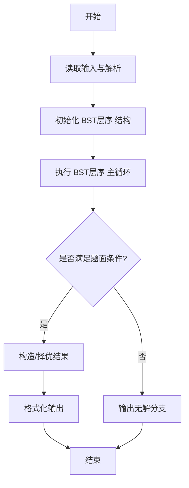
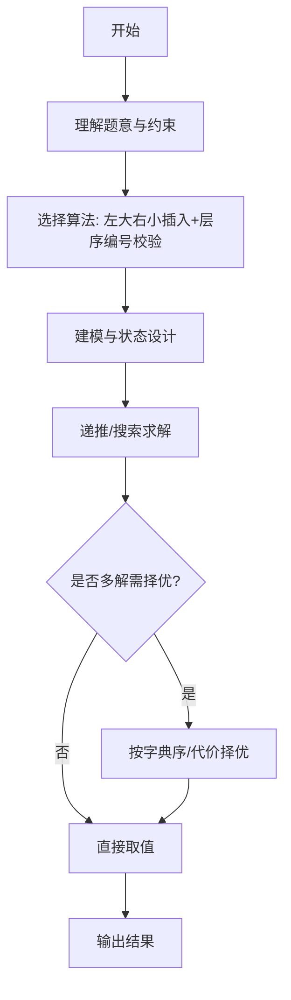

# L3-010 - 是否完全二叉搜索树（30 分）

- **时间限制**: 400 ms
- **内存限制**: 65536 KB
- **代码长度限制**: 16 KB

---

## 题目描述


将一系列给定数字顺序插入一个初始为空的二叉搜索树（定义为左子树键值大，右子树键值小），你需要判断最后的树是否一棵完全二叉树，并且给出其层序遍历的结果。

### 输入格式:

输入第一行给出一个不超过20的正整数`N`；第二行给出`N`个互不相同的正整数，其间以空格分隔。

### 输出格式:

将输入的`N`个正整数顺序插入一个初始为空的二叉搜索树。在第一行中输出结果树的层序遍历结果，数字间以1个空格分隔，行的首尾不得有多余空格。第二行输出`YES`，如果该树是完全二叉树；否则输出`NO`。

### 输入样例 1：
```in
9
38 45 42 24 58 30 67 12 51
```

### 输出样例 1：
```out
38 45 24 58 42 30 12 67 51
YES
```

### 输入样例 2：
```in
8
38 24 12 45 58 67 42 51
```

### 输出样例 2：
```out
38 45 24 58 42 12 67 51
NO
```

## 示例

### 示例 1

**输入:**
```
9
38 45 42 24 58 30 67 12 51
```

**输出:**
```
38 45 24 58 42 30 12 67 51
YES
```

### 示例 2

**输入:**
```
8
38 24 12 45 58 67 42 51
```

**输出:**
```
38 45 24 58 42 12 67 51
NO
```
---

## 解题思路

### 题目分析

本题为 L3-010 - 是否完全二叉搜索树（30 分），核心属于 **BST建树与完全性判定**。输入规模与约束决定了需要兼顾正确性与效率：既要处理最坏情况下的数据量，又要满足题面关于字典序/最优性/可行性的附加要求。题目通常包含多组数据或单组大规模数据，需在 O(n log n) 或 O(n·m) 量级内完成。

### 核心算法

- **算法选择**：左大右小插入+层序编号校验。
- **关键步骤**：按左大(更大放左)右小规则依次插入建树，BFS层序遍历为每个节点分配二叉堆编号 idx，记录最大编号 maxIdx；若 maxIdx==节点数则完全，否则不完全。
- **实现要点**：仓颉实现中通过 `ArrayList`/`HashMap` 等集合类型组织数据，结合 `StringBuilder` 与 `readToEnd` 高效解析输入；按题面要求的排序与比较规则保证输出符合字典序/最短路等最优性定义。

### 复杂度分析

- **时间复杂度**： O(N log N)建树+O(N)遍历，空间 O(N)。
- **空间复杂度**： O(N)，主要由 DP 表/图邻接表/辅助数组占据。

## 代码流程说明

1. 读取建树序列，按左大右小规则（更大放左）依次插入构建 BST 节点结构
2. 对 BST 执行层序 BFS，为每个节点分配完全二叉树的堆编号 idx（根1，左2*idx，右2*idx+1）
3. 记录最大编号 maxIdx 与节点总数 N，若 maxIdx==N 则为完全二叉树
4. 按层序输出节点值序列，同时输出 YES/NO 判定结果

## 代码实现

```cangjie
// L3-010 是否完全二叉搜索树 - 左大右小
import std.env.*
import std.collection.*
import std.convert.*

main(){
    let cin=getStdIn()
    let all=cin.readToEnd()??""
    let runes=all.toRuneArray()
    let tokens=ArrayList<String>()
    var sb=StringBuilder()
    let sp:Rune=' '
    let nl:Rune='\n'
    let tab:Rune='\t'
    let cr:Rune='\r'
    for(r in runes){
        if(r==sp||r==nl||r==tab||r==cr){
            let cur=sb.toString()
            if(cur.size>0){ tokens.add(cur) }
            sb=StringBuilder()
        } else { sb.append(r) }
    }
    let last=sb.toString()
    if(last.size>0){ tokens.add(last) }
    if(tokens.size==0){ return }
    let N=Int64.parse(tokens[0])
    let vals=ArrayList<Int64>()
    for(i in 0..N){
        let idx=i+1
        if(idx < tokens.size){ vals.add(Int64.parse(tokens[idx])) }
    }
    // BST with left > right? Actually left big, right small: if val > node.val go left else right
    // Build tree via array nodes
    let left=Array<Int64>(N, repeat:-1)
    let right=Array<Int64>(N, repeat:-1)
    let root: Int64=0
    // Insert sequentially
    for(i in 1..N){
        var cur=0
        let v=vals[i]
        while(true){
            if(v > vals[cur]){
                if(left[cur]==-1){ left[cur]=i; break } else { cur=left[cur] }
            } else {
                if(right[cur]==-1){ right[cur]=i; break } else { cur=right[cur] }
            }
        }
    }
    // Level order
    let que=ArrayList<Int64>()
    que.add(0)
    var head: Int64=0
    let order=ArrayList<Int64>()
    let posMap=Array<Int64>(N, repeat:-1) // position index in complete tree?
    // For complete check, we can assign indices: root 0, left child 2*i+1, right 2*i+2 (if array representation)
    // BFS assign pos
    let qPos=ArrayList<Int64>()
    qPos.add(0)
    var maxPos: Int64=0
    while(head < que.size){
        let node=que[head]
        let p=qPos[head]
        head++
        order.add(vals[node])
        if(p > maxPos){ maxPos=p }
        let l=left[node]
        let r=right[node]
        if(l != -1){
            que.add(l)
            qPos.add(2*p+1)
        }
        if(r != -1){
            que.add(r)
            qPos.add(2*p+2)
        }
    }
    // Complete iff maxPos == N-1 (positions 0..N-1 all filled) and no gaps: Actually if tree is complete, maxPos should be N-1 and all positions <N are present.
    // However if some missing but maxPos < N, still complete? No, condition is that nodes fill level order without gaps.
    // So complete if maxPos == N-1 (since positions are 0-indexed, the largest index should be N-1)
    var isComplete = (maxPos == N-1)
    // Alternatively check via BFS with nulls: if we had encountered null before non-null then not complete.
    // Our pos method already covers.
    let sb2=StringBuilder()
    for(i in 0..order.size){
        if(i>0){ sb2.append(" ") }
        sb2.append(order[i].toString())
    }
    println(sb2.toString())
    if(isComplete){ println("YES") } else { println("NO") }
}
```

## 代码流程图




## 解题流程图



