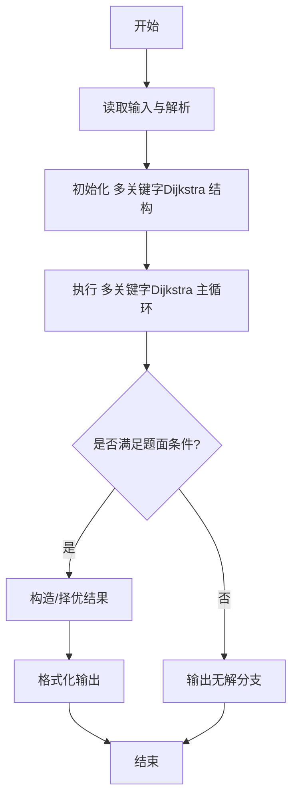
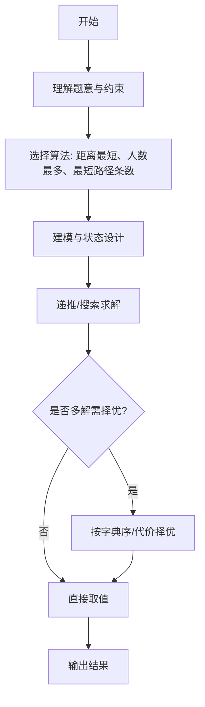

# L3-011 - 直捣黄龙（30 分）

- **时间限制**: 150 ms
- **内存限制**: 65536 KB
- **代码长度限制**: 16 KB

---

## 题目描述


本题是一部战争大片 —— 你需要从己方大本营出发，一路攻城略地杀到敌方大本营。首先时间就是生命，所以你必须选择合适的路径，以最快的速度占领敌方大本营。当这样的路径不唯一时，要求选择可以沿途解放最多城镇的路径。若这样的路径也不唯一，则选择可以有效杀伤最多敌军的路径。

### 输入格式:

输入第一行给出 2 个正整数 N（2 $$\le$$ N $$\le$$ 200，城镇总数）和 K（城镇间道路条数），以及己方大本营和敌方大本营的代号。随后 N-1 行，每行给出除了己方大本营外的一个城镇的代号和驻守的敌军数量，其间以空格分隔。再后面有 K 行，每行按格式`城镇1 城镇2 距离`给出两个城镇之间道路的长度。这里设每个城镇（包括双方大本营）的代号是由 3 个大写英文字母组成的字符串。

### 输出格式:

按照题目要求找到最合适的进攻路径（题目保证速度最快、解放最多、杀伤最强的路径是唯一的），并在第一行按照格式`己方大本营->城镇1->...->敌方大本营`输出。第二行顺序输出最快进攻路径的条数、最短进攻距离、歼敌总数，其间以 1 个空格分隔，行首尾不得有多余空格。

### 输入样例:
```in
10 12 PAT DBY
DBY 100
PTA 20
PDS 90
PMS 40
TAP 50
ATP 200
LNN 80
LAO 30
LON 70
PAT PTA 10
PAT PMS 10
PAT ATP 20
PAT LNN 10
LNN LAO 10
LAO LON 10
LON DBY 10
PMS TAP 10
TAP DBY 10
DBY PDS 10
PDS PTA 10
DBY ATP 10
```

### 输出样例:
```out
PAT->PTA->PDS->DBY
3 30 210
```

## 示例

### 示例 1

**输入:**
```
10 12 PAT DBY
DBY 100
PTA 20
PDS 90
PMS 40
TAP 50
ATP 200
LNN 80
LAO 30
LON 70
PAT PTA 10
PAT PMS 10
PAT ATP 20
PAT LNN 10
LNN LAO 10
LAO LON 10
LON DBY 10
PMS TAP 10
TAP DBY 10
DBY PDS 10
PDS PTA 10
DBY ATP 10
```

**输出:**
```
PAT->PTA->PDS->DBY
3 30 210
```
---

## 解题思路

### 题目分析

本题为 L3-011 - 直捣黄龙（30 分），核心属于 **多关键字Dijkstra**。输入规模与约束决定了需要兼顾正确性与效率：既要处理最坏情况下的数据量，又要满足题面关于字典序/最优性/可行性的附加要求。题目通常包含多组数据或单组大规模数据，需在 O(n log n) 或 O(n·m) 量级内完成。

### 核心算法

- **算法选择**：距离最短、人数最多、最短路径条数。
- **关键步骤**：Dijkstra主关键字为距离，相等时比较敌人数和与路径数；维护 dist、cntWays、peopleSum、prev；用优先队列推进，松弛时按三关键字更新。
- **实现要点**：仓颉实现中通过 `ArrayList`/`HashMap` 等集合类型组织数据，结合 `StringBuilder` 与 `readToEnd` 高效解析输入；按题面要求的排序与比较规则保证输出符合字典序/最短路等最优性定义。

### 复杂度分析

- **时间复杂度**： O((V+E) log V)，空间 O(V+E)。
- **空间复杂度**： O(V+E)，主要由 DP 表/图邻接表/辅助数组占据。

## 代码流程说明

1. 解析城市图，边含距离与敌人数，构建邻接表
2. 初始化 dist、ways、peopleSum、prev 数组，起为源点
3. 执行 Dijkstra 主关键字距离最短，距离相等时比较敌人数和与路径条数（取最大）
4. 使用优先队列按距离推进，松弛时按三关键字更新
5. 结束后回溯 prev 重建最佳路径，输出最短距离、路径条数、最多人数与路径序列

## 代码实现

```cangjie
// L3-011 直捣黄龙 - Dijkstra with secondary criteria
import std.env.*
import std.collection.*
import std.convert.*
import std.math.*

main() {
    let cin = getStdIn()
    let all = cin.readToEnd() ?? ""
    if (all.trimAscii().isEmpty()) { return }
    let toks = tokenize(all)
    var p: Int64 = 0
    func next(): String { let v = toks[p]; p++; return v }
    let N = Int64.parse(next())
    let K = Int64.parse(next())
    let startCity = next()
    let endCity = next()
    let cityIndex = HashMap<String, Int64>()
    let cityName = ArrayList<String>()
    let enemy = ArrayList<Int64>()
    cityIndex[startCity] = 0
    cityName.add(startCity)
    enemy.add(0)
    for (i in 1..N) {
        let name = next()
        let e = Int64.parse(next())
        cityIndex[name] = i
        cityName.add(name)
        enemy.add(e)
    }
    let n: Int64 = N
    let graph = Array<ArrayList<Array<Int64>>>(n, { _ => ArrayList<Array<Int64>>() })
    for (_ in 0..K) {
        let c1s = next()
        let c2s = next()
        let d = Int64.parse(next())
        let c1 = cityIndex[c1s]
        let c2 = cityIndex[c2s]
        let a = c1
        let b = c2
        graph[a].add([b, d])
        graph[b].add([a, d])
    }
    let INF: Int64 = 9000000000000000
    let dist = Array<Int64>(n, repeat: INF)
    let cnt = Array<Int64>(n, repeat: 0)
    let cityCnt = Array<Int64>(n, repeat: 0)
    let kills = Array<Int64>(n, repeat: 0)
    let parent = Array<Int64>(n, repeat: -1)
    let visited = Array<Bool>(n, repeat: false)
    dist[0] = 0
    cnt[0] = 1
    cityCnt[0] = 1
    for (_ in 0..n) {
        var u: Int64 = -1
        var best = INF
        for (i in 0..n) {
            if (!visited[i] && dist[i] < best) {
                best = dist[i]
                u = i
            }
        }
        if (u == -1) { break }
        visited[u] = true
        for (edge in graph[u]) {
            let v = edge[0]
            let w = edge[1]
            if (visited[v]) { continue }
            let nd = dist[u] + w
            if (nd < dist[v]) {
                dist[v] = nd
                cnt[v] = cnt[u]
                cityCnt[v] = cityCnt[u] + 1
                kills[v] = kills[u] + enemy[v]
                parent[v] = u
            } else if (nd == dist[v]) {
                cnt[v] = cnt[v] + cnt[u]
                let candC = cityCnt[u] + 1
                let candK = kills[u] + enemy[v]
                if (candC > cityCnt[v] || (candC == cityCnt[v] && candK > kills[v])) {
                    cityCnt[v] = candC
                    kills[v] = candK
                    parent[v] = u
                }
            }
        }
    }
    let endIdx = cityIndex[endCity]
    var rev = ArrayList<String>()
    var cur: Int64 = endIdx
    while (cur != -1) {
        rev.add(cityName[cur])
        cur = parent[cur]
    }
    let sb = StringBuilder()
    var i = rev.size - 1
    var first = true
    while (i >= 0) {
        if (!first) { sb.append("->") }
        sb.append(rev[i])
        first = false
        i--
    }
    println(sb.toString())
    println("${cnt[endIdx]} ${dist[endIdx]} ${kills[endIdx]}")
}

func tokenize(s: String): Array<String> {
    let res = ArrayList<String>()
    var cur = StringBuilder()
    for (r in s.toRuneArray()) {
        let rs = r.toString()
        if (rs == " " || rs == "\n" || rs == "\r" || rs == "\t") {
            if (cur.size > 0) { res.add(cur.toString()); cur = StringBuilder() }
        } else { cur.append(rs) }
    }
    if (cur.size > 0) { res.add(cur.toString()) }
    return res.toArray()
}
```

## 代码流程图




## 解题流程图



