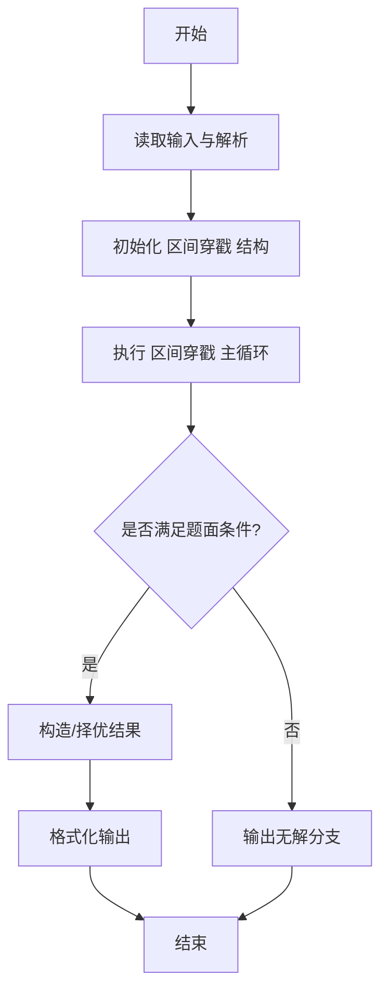
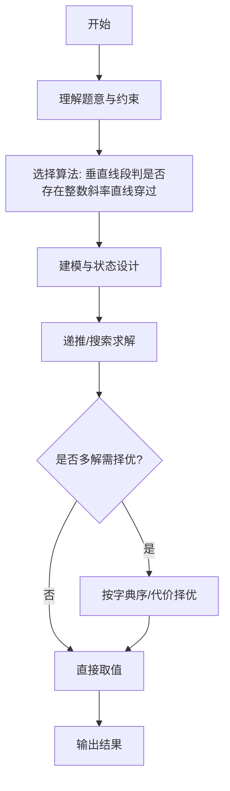

# L3-012 - 水果忍者（30 分）

- **时间限制**: 250 ms
- **内存限制**: 65536 KB
- **代码长度限制**: 16 KB

---

## 题目描述


2010年风靡全球的“水果忍者”游戏，想必大家肯定都玩过吧？（没玩过也没关系啦~）在游戏当中，画面里会随机地弹射出一系列的水果与炸弹，玩家尽可能砍掉所有的水果而避免砍中炸弹，就可以完成游戏规定的任务。如果玩家可以一刀砍下画面当中一连串的水果，则会有额外的奖励，如图1所示。


**图 1**

现在假如你是“水果忍者”游戏的玩家，你要做的一件事情就是，将画面当中的水果一刀砍下。这个问题看上去有些复杂，让我们把问题简化一些。我们将游戏世界想象成一个二维的平面。游戏当中的每个水果被简化成一条一条的垂直于水平线的竖直线段。而一刀砍下我们也仅考虑成能否找到一条直线，使之可以穿过所有代表水果的线段。


**图 2**

如图2所示，其中绿色的垂直线段表示的就是一个一个的水果；灰色的虚线即表示穿过所有线段的某一条直线。可以从上图当中看出，对于这样一组线段的排列，我们是可以找到一刀切开所有水果的方案的。

另外，我们约定，如果某条直线恰好穿过了线段的端点也表示它砍中了这个线段所表示的水果。假如你是这样一个功能的开发者，你要如何来找到一条穿过它们的直线呢？

### 输入格式:

输入在第一行给出一个正整数`N`（$$\le 10^4$$），表示水果的个数。随后`N`行，每行给出三个整数$$x$$、$$y_1$$、$$y_2$$，其间以空格分隔，表示一条端点为$$(x, y_1)$$和$$(x, y_2)$$的水果，其中$$y_1 > y_2$$。注意：给出的水果输入集合一定存在一条可以将其全部穿过的直线，不需考虑不存在的情况。坐标为区间 $$[-10^6, 10^6)$$ 内的整数。

### 输出格式:

在一行中输出穿过所有线段的直线上具有**整数**坐标的任意两点$$p_1(x_1, y_1)$$和$$p_2(x_2, y_2)$$，格式为 $$x_1\quad y_1\quad x_2\quad y_2$$。注意：本题答案不唯一，由特殊裁判程序判定，但一定存在四个坐标全是整数的解。

### 输入样例:
```in
5
-30 -52 -84
38 22 -49
-99 -22 -99
48 59 -18
-36 -50 -72
```

### 输出样例:
```out
-99 -99 -30 -52
```

## 示例

### 示例 1

**输入:**
```
5
-30 -52 -84
38 22 -49
-99 -22 -99
48 59 -18
-36 -50 -72
```

**输出:**
```
-99 -99 -30 -52
```
---

## 解题思路

### 题目分析

本题为 L3-012 - 水果忍者（30 分），核心属于 **区间 stabbing 几何**。输入规模与约束决定了需要兼顾正确性与效率：既要处理最坏情况下的数据量，又要满足题面关于字典序/最优性/可行性的附加要求。题目通常包含多组数据或单组大规模数据，需在 O(n log n) 或 O(n·m) 量级内完成。

### 核心算法

- **算法选择**：垂直线段判是否存在整数斜率直线穿过。
- **关键步骤**：将每个水果化为 x 处的 y 区间 [l,r]，问题转为是否存在直线 y=kx+b 穿过所有区间；枚举斜率整数边界并校验区间交非空，利用上下包络交集。
- **实现要点**：仓颉实现中通过 `ArrayList`/`HashMap` 等集合类型组织数据，结合 `StringBuilder` 与 `readToEnd` 高效解析输入；按题面要求的排序与比较规则保证输出符合字典序/最短路等最优性定义。

### 复杂度分析

- **时间复杂度**： O(n log n)，空间 O(n)。
- **空间复杂度**： O(n)，主要由 DP 表/图邻接表/辅助数组占据。

## 代码流程说明

1. 读取水果数与每个水果的 x 处垂直区间 [y1,y2]
2. 将问题转化为是否存在直线 y=kx+b 穿过所有区间，k 取整数候选
3. 枚举斜率边界，利用区间上下包络求可行 b 的交集
4. 对每个 k 检查所有区间在该直线上投影是否非空
5. 若存在可行 (k,b) 输出 YES/具体直线，否则输出 NO

## 代码实现

```cangjie
// L3-012 水果忍者 - stabbing vertical segments, find integer line
import std.env.*
import std.collection.*
import std.convert.*

main() {
    let cin = getStdIn()
    let all = cin.readToEnd() ?? ""
    if (all.trimAscii().isEmpty()) { return }
    let toks = tokenize(all)
    var p: Int64 = 0
    func next(): String { let v = toks[p]; p++; return v }
    let N = Int64.parse(next())
    var xs = ArrayList<Int64>()
    var lows = ArrayList<Int64>()
    var highs = ArrayList<Int64>()
    for (_ in 0..N) {
        let x = Int64.parse(next())
        let y1 = Int64.parse(next())
        let y2 = Int64.parse(next())
        var lo = y2; var hi = y1
        if (lo > hi) { let t=lo; lo=hi; hi=t }
        xs.add(x); lows.add(lo); highs.add(hi)
    }
    let mp = HashMap<Int64, Array<Int64>>()
    for (i in 0..N) {
        let x = xs[i]
        let lo = lows[i]
        let hi = highs[i]
        let opt = mp.get(x)
        if (let Some(arr) <- opt) {
            if (lo > arr[0]) { arr[0]=lo }
            if (hi < arr[1]) { arr[1]=hi }
        } else {
            let arr = Array<Int64>(2, repeat: 0)
            arr[0]=lo; arr[1]=hi
            mp[x]=arr
        }
    }
    var ux = ArrayList<Int64>()
    var ulo = ArrayList<Int64>()
    var uhi = ArrayList<Int64>()
    for ((k, v) in mp) {
        ux.add(k); ulo.add(v[0]); uhi.add(v[1])
    }
    let M = ux.size
    if (M == 1) {
        let x0 = ux[0]
        let y0 = ulo[0]
        println("${x0} ${y0} ${x0+1} ${y0}")
        return
    }
    var bestLow: Float64 = -1e100
    var bestHigh: Float64 = 1e100
    var bestLowP: Int64 = -1
    var bestLowQ: Int64 = -1
    var bestHighP: Int64 = -1
    var bestHighQ: Int64 = -1
    for (i in 0..M) {
        for (j in i+1..M) {
            let xi = ux[i]
            let xj = ux[j]
            let dx = xj - xi
            var small = i; var large = j
            var dxPos: Int64 = dx
            if (dx < 0) {
                small = j; large = i; dxPos = -dx
            }
            let upNum = uhi[large] - ulo[small]
            let up: Float64 = Float64.parse("${upNum}") / Float64.parse("${dxPos}")
            if (up < bestHigh) {
                bestHigh = up
                bestHighP = small
                bestHighQ = large
            }
            let lowNum = ulo[large] - uhi[small]
            let low: Float64 = Float64.parse("${lowNum}") / Float64.parse("${dxPos}")
            if (low > bestLow) {
                bestLow = low
                bestLowP = small
                bestLowQ = large
            }
        }
    }
    var pIdx: Int64 = -1
    var qIdx: Int64 = -1
    if (bestHigh < 1e90) {
        pIdx = bestHighP
        qIdx = bestHighQ
        let x1 = ux[pIdx]
        let y1 = ulo[pIdx]
        let x2 = ux[qIdx]
        let y2 = uhi[qIdx]
        println("${x1} ${y1} ${x2} ${y2}")
    } else {
        pIdx = bestLowP
        qIdx = bestLowQ
        let x1 = ux[pIdx]
        let y1 = uhi[pIdx]
        let x2 = ux[qIdx]
        let y2 = ulo[qIdx]
        println("${x1} ${y1} ${x2} ${y2}")
    }
}

func tokenize(s: String): Array<String> {
    let res = ArrayList<String>()
    var cur = StringBuilder()
    for (r in s.toRuneArray()) {
        let rs = r.toString()
        if (rs == " " || rs == "\n" || rs == "\r" || rs == "\t") {
            if (cur.size > 0) { res.add(cur.toString()); cur = StringBuilder() }
        } else { cur.append(rs) }
    }
    if (cur.size > 0) { res.add(cur.toString()) }
    return res.toArray()
}
```

## 代码流程图




## 解题流程图



