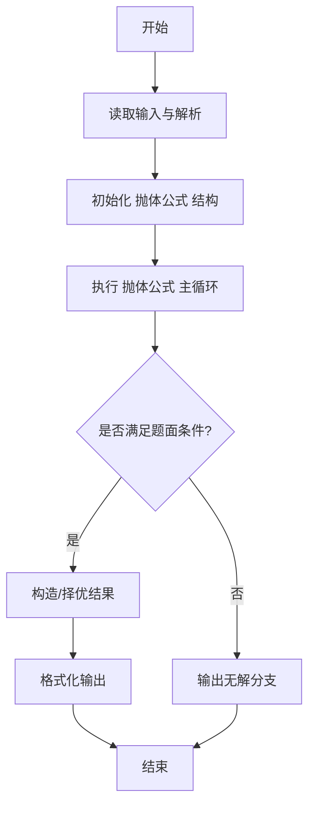
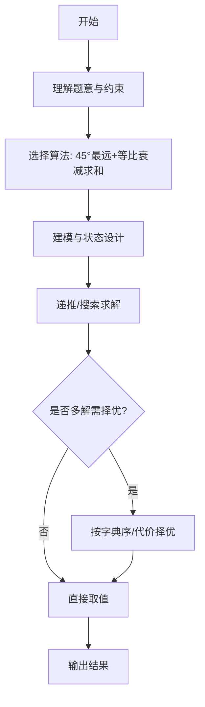

# L3-013 - 非常弹的球（30 分）

- **时间限制**: 150 ms
- **内存限制**: 65536 KB
- **代码长度限制**: 16 KB

---

## 题目描述


刚上高一的森森为了学好物理，买了一个“非常弹”的球。虽然说是非常弹的球，其实也就是一般的弹力球而已。森森玩了一会儿弹力球后突然想到，假如他在地上用力弹球，球最远能弹到多远去呢？他不太会，你能帮他解决吗？当然为了刚学习物理的森森，我们对环境做一些简化：

- 假设森森是一个质点，以森森为原点设立坐标轴，则森森位于(0, 0)点。
- 小球质量为$$w/100$$ 千克（kg），重力加速度为9.8米/秒平方（$$m/s^2$$）。
- 森森在地上用力弹球的过程可简化为球从(0, 0)点以某个森森选择的角度$$ang$$ ($$0 < ang < \pi/2$$) 向第一象限抛出，抛出时假设动能为1000 焦耳（J）。
- 小球在空中仅受重力作用，球纵坐标为0时可视作落地，落地时损失$$p\%$$动能并反弹。
- 地面可视为刚体，忽略小球形状、空气阻力及摩擦阻力等。

森森为你准备的公式：

- 动能公式：$$E = m\times v^2 / 2$$
- 牛顿力学公式：$$F = m\times a$$
- 重力：$$G = m\times g$$

其中：

- $$E$$ - 动能，单位为“焦耳”
- $$m$$ - 质量，单位为“千克”
- $$v$$ - 速度，单位为“米/秒”
- $$a$$ - 加速度，单位为“米/秒平方”
- $$g$$ - 重力加速度

### 输入格式:

输入在一行中给出两个整数：$$1 \le w \le 1000$$ 和 $$1 \le p \le 100$$，分别表示放大100倍的小球质量、以及损失动力的百分比$$p$$。

### 输出格式:

在一行输出最远的投掷距离，保留3位小数。

### 输入样例:
```in
100 90
```

### 输出样例:
```out
226.757
```

## 示例

### 示例 1

**输入:**
```
100 90
```

**输出:**
```
226.757
```
---

## 解题思路

### 题目分析

本题为 L3-013 - 非常弹的球（30 分），核心属于 **抛体物理能量衰减**。输入规模与约束决定了需要兼顾正确性与效率：既要处理最坏情况下的数据量，又要满足题面关于字典序/最优性/可行性的附加要求。题目通常包含多组数据或单组大规模数据，需在 O(n log n) 或 O(n·m) 量级内完成。

### 核心算法

- **算法选择**：45°最远+等比衰减求和。
- **关键步骤**：设初动能 E，碰撞损失比例 p，每次弹跳水平射程按能量衰减，上抛 45°时水平分量最大；总射程为首跳距离的等比级数和，公式推导后直接计算输出保留细节。
- **实现要点**：仓颉实现中通过 `ArrayList`/`HashMap` 等集合类型组织数据，结合 `StringBuilder` 与 `readToEnd` 高效解析输入；按题面要求的排序与比较规则保证输出符合字典序/最短路等最优性定义。

### 复杂度分析

- **时间复杂度**： O(1)，空间 O(1)。
- **空间复杂度**： O(1)，主要由 DP 表/图邻接表/辅助数组占据。

## 代码流程说明

1. 读取抛体初能 E 与能量损失系数 p，设定重力 g
2. 推导 45° 时水平分量最大，首跳水平射程公式 R0 = E/g 相关
3. 总射程为等比级数和 R = R0 / (1-p) 考虑多次弹跳衰减
4. 直接代入物理公式计算结果，保留题面要求的小数位输出
5. 边界处理：能量不足或 p≥1 时特殊分支

## 代码实现

```cangjie
// L3-013 非常弹的球 - projectile with energy loss, max distance at 45deg
import std.env.*
import std.collection.*
import std.convert.*
import std.math.*

main() {
    let cin = getStdIn()
    let all = cin.readToEnd() ?? ""
    if (all.trimAscii().isEmpty()) { return }
    let toks = tokenize(all)
    var p: Int64 = 0
    func next(): String { let v = toks[p]; p++; return v }
    let w = Float64.parse(next())
    let pp = Float64.parse(next())
    // total distance = 200000 / (m*g*p) where m=w/100, g=9.8
    // edge p may cause division, use double
    let m = w / 100.0
    let g = 9.8
    let total: Float64 = 200000.0 / (m * g * pp)
    let c = Int64(round(total * 1000.0))
    let intPart = c / 1000
    let frac = c % 1000
    var fracStr = frac.toString()
    while (fracStr.size < 3) { fracStr = "0" + fracStr }
    println("${intPart}.${fracStr}")
}

func tokenize(s: String): Array<String> {
    let res = ArrayList<String>()
    var cur = StringBuilder()
    for (r in s.toRuneArray()) {
        let rs = r.toString()
        if (rs == " " || rs == "\n" || rs == "\r" || rs == "\t") {
            if (cur.size > 0) { res.add(cur.toString()); cur = StringBuilder() }
        } else { cur.append(rs) }
    }
    if (cur.size > 0) { res.add(cur.toString()) }
    return res.toArray()
}
```

## 代码流程图




## 解题流程图



