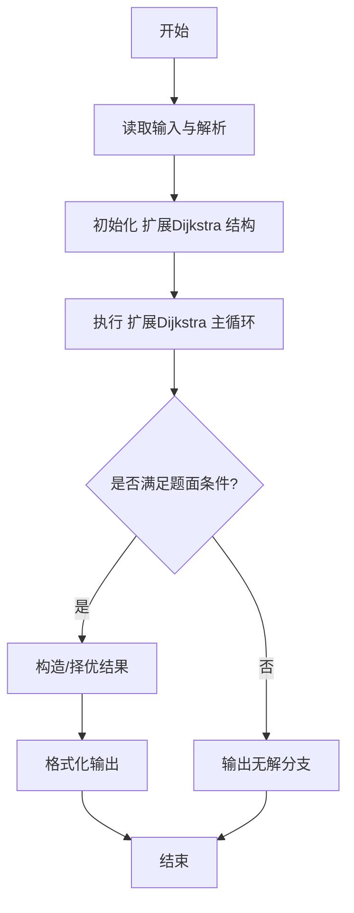
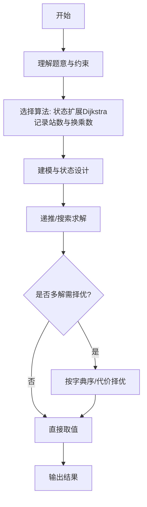

# L3-014 - 周游世界（30 分）

- **时间限制**: 200 ms
- **内存限制**: 65536 KB
- **代码长度限制**: 16 KB

---

## 题目描述


周游世界是件浪漫事，但规划旅行路线就不一定了…… 全世界有成千上万条航线、铁路线、大巴线，令人眼花缭乱。所以旅行社会选择部分运输公司组成联盟，每家公司提供一条线路，然后帮助客户规划由联盟内企业支持的旅行路线。本题就要求你帮旅行社实现一个自动规划路线的程序，使得对任何给定的起点和终点，可以找出最顺畅的路线。所谓“最顺畅”，首先是指中途经停站最少；如果经停站一样多，则取需要换乘线路次数最少的路线。

### 输入格式:

输入在第一行给出一个正整数$$N$$（$$\le 100$$），即联盟公司的数量。接下来有$$N$$行，第$$i$$行（$$i=1, \cdots , N$$）描述了第$$i$$家公司所提供的线路。格式为：

$$M$$ S[1] S[2] $$\cdots$$ S[$$M$$]

其中$$M$$（$$\le 100$$）是经停站的数量，S[$$i$$]（$$i=1, \cdots , M$$）是经停站的编号（由4位0-9的数字组成）。这里假设每条线路都是简单的一条可以双向运行的链路，并且输入保证是按照正确的经停顺序给出的 —— 也就是说，任意一对相邻的S[$$i$$]和S[$$i+1$$]（$$i=1, \cdots , M-1$$）之间都不存在其他经停站点。我们称相邻站点之间的线路为一个运营区间，每个运营区间只承包给一家公司。环线是有可能存在的，但不会不经停任何中间站点就从出发地回到出发地。当然，不同公司的线路是可能在某些站点有交叉的，这些站点就是客户的换乘点，我们假设任意换乘点涉及的不同公司的线路都不超过5条。

在描述了联盟线路之后，题目将给出一个正整数$$K$$（$$\le 10$$），随后$$K$$行，每行给出一位客户的需求，即始发地的编号和目的地的编号，中间以一空格分隔。

### 输出格式:

处理每一位客户的需求。如果没有现成的线路可以使其到达目的地，就在一行中输出“Sorry, no line is available.”；如果目的地可达，则首先在一行中输出最顺畅路线的经停站数量（始发地和目的地不包括在内），然后按下列格式给出旅行路线：

```
Go by the line of company #X1 from S1 to S2.
Go by the line of company #X2 from S2 to S3.
......
```

其中`Xi`是线路承包公司的编号，`Si`是经停站的编号。但必须只输出始发地、换乘点和目的地，不能输出中间的经停站。题目保证满足要求的路线是唯一的。

### 输入样例:
```in
4
7 1001 3212 1003 1204 1005 1306 7797
9 9988 2333 1204 2006 2005 2004 2003 2302 2001
13 3011 3812 3013 3001 1306 3003 2333 3066 3212 3008 2302 3010 3011
4 6666 8432 4011 1306
4
3011 3013
6666 2001
2004 3001
2222 6666
```

### 输出样例:
```out
2
Go by the line of company #3 from 3011 to 3013.
10
Go by the line of company #4 from 6666 to 1306.
Go by the line of company #3 from 1306 to 2302.
Go by the line of company #2 from 2302 to 2001.
6
Go by the line of company #2 from 2004 to 1204.
Go by the line of company #1 from 1204 to 1306.
Go by the line of company #3 from 1306 to 3001.
Sorry, no line is available.
```

## 示例

### 示例 1

**输入:**
```
4
7 1001 3212 1003 1204 1005 1306 7797
9 9988 2333 1204 2006 2005 2004 2003 2302 2001
13 3011 3812 3013 3001 1306 3003 2333 3066 3212 3008 2302 3010 3011
4 6666 8432 4011 1306
4
3011 3013
6666 2001
2004 3001
2222 6666
```

**输出:**
```
2
Go by the line of company #3 from 3011 to 3013.
10
Go by the line of company #4 from 6666 to 1306.
Go by the line of company #3 from 1306 to 2302.
Go by the line of company #2 from 2302 to 2001.
6
Go by the line of company #2 from 2004 to 1204.
Go by the line of company #1 from 1204 to 1306.
Go by the line of company #3 from 1306 to 3001.
Sorry, no line is available.
```
---

## 解题思路

### 题目分析

本题为 L3-014 - 周游世界（30 分），核心属于 **带换乘代价的最短路**。输入规模与约束决定了需要兼顾正确性与效率：既要处理最坏情况下的数据量，又要满足题面关于字典序/最优性/可行性的附加要求。题目通常包含多组数据或单组大规模数据，需在 O(n log n) 或 O(n·m) 量级内完成。

### 核心算法

- **算法选择**：状态扩展Dijkstra记录站数与换乘数。
- **关键步骤**：将每个站点按所属线路拆点，边权含乘车代价与换乘代价；Dijkstra状态为 (站,线路)，优先按站点数、次按换乘数松弛；重建路径时还原线路切换点。
- **实现要点**：仓颉实现中通过 `ArrayList`/`HashMap` 等集合类型组织数据，结合 `StringBuilder` 与 `readToEnd` 高效解析输入；按题面要求的排序与比较规则保证输出符合字典序/最短路等最优性定义。

### 复杂度分析

- **时间复杂度**： O((V·L+E) log (V·L))，空间 O(V·L)。
- **空间复杂度**： O(V·L)，主要由 DP 表/图邻接表/辅助数组占据。

## 代码流程说明

1. 解析地铁线路与站点，建立站点-线路二分图或扩展状态图
2. 状态定义为 (站点, 所在线路)，边权为乘车1站与换乘1次的双重代价
3. 执行 Dijkstra 优先按站点数最少、次按换乘数最少松弛
4. 维护 prev 状态以便重建最优路径的线路切换点
5. 输出最少站数、最少换乘数及对应路径序列

## 代码实现

```cangjie
// L3-014 周游世界 - expanded Dijkstra for min stops then transfers
import std.env.*
import std.collection.*
import std.convert.*

main() {
    let cin = getStdIn()
    let all = cin.readToEnd() ?? ""
    if (all.trimAscii().isEmpty()) { return }
    let toks = tokenize(all)
    var p: Int64 = 0
    func next(): String { let v = toks[p]; p++; return v }
    let N = Int64.parse(next())
    // station string -> id
    let idMap = HashMap<String, Int64>()
    var idCnt: Int64 = 0
    func getId(s: String): Int64 {
        let opt = idMap.get(s)
        if (let Some(v) <- opt) { return v }
        let nid = idCnt
        idMap[s] = nid
        idCnt++
        return nid
    }
    // adjacency per station: list of (neighbor, company)
    var adj = ArrayList<ArrayList<Array<Int64>>>()
    // we will expand after knowing idCnt, use dynamic
    // temporary store lines
    var lines = ArrayList<Array<Int64>>()
    // also store per line stations ids
    var lineStations = ArrayList<Array<Int64>>()
    for (comp in 1..=N) {
        let M = Int64.parse(next())
        var stations = ArrayList<Int64>()
        for (_ in 0..M) {
            let s = next()
            let sid = getId(s)
            stations.add(sid)
        }
        lineStations.add(stations.toArray())
    }
    // build id arrays and reverse map id -> string
    let V = idCnt
    // build string array
    var idToStr = Array<String>(V, repeat: "")
    for ((k, v) in idMap) { idToStr[v] = k }
    // rebuild adj sized V
    var g = Array<ArrayList<Array<Int64>>>(V, { _ => ArrayList<Array<Int64>>() })
    for (compIdx in 0..lineStations.size) {
        let stations = lineStations[compIdx]
        let comp = compIdx + 1
        for (i in 1..stations.size) {
            let a = stations[i-1]
            let b = stations[i]
            g[a].add([b, comp])
            g[b].add([a, comp])
        }
    }
    let K = Int64.parse(next())
    let out = StringBuilder()
    for (_ in 0..K) {
        let sStr = next()
        let tStr = next()
        if (!idMap.contains(sStr) || !idMap.contains(tStr)) {
            out.append("Sorry, no line is available.\n")
            continue
        }
        let s = idMap[sStr]
        let t = idMap[tStr]
        if (s == t) {
            out.append("0\n")
            continue
        }
        // expanded Dijkstra
        // states: map from (node*128 + comp) -> index in arrays
        // Since N<=100, comp up to 100, use 128 multiplier
        // We'll collect all state ids as we go: initially s with comp 0
        // Use HashMap for dist
        let INF: Int64 = 9000000000000000
        // distSteps and distTrans per state key
        var stateKeys = ArrayList<Int64>()
        let keyOf = { node: Int64, comp: Int64 => node * 128 + comp }
        let startKey = keyOf(s, 0)
        stateKeys.add(startKey)
        // For quick lookup, we will maintain maps
        let distSteps = HashMap<Int64, Int64>()
        let distTrans = HashMap<Int64, Int64>()
        let prevState = HashMap<Int64, Int64>()
        let prevNode = HashMap<Int64, Int64>() // predecessor node for path reconstruction? Actually need edge
        // Initialize
        distSteps[startKey] = 0
        distTrans[startKey] = 0
        prevState[startKey] = -1
        // visited set
        let visited = HashSet<Int64>()
        // To generate neighbours we need to know state set dynamically: when we relax to new state, add to stateKeys
        var found = false
        var bestKey: Int64 = -1
        var bestSteps: Int64 = INF
        var bestTrans: Int64 = INF
        while (true) {
            var curKey: Int64 = -1
            var curSteps: Int64 = INF
            var curTrans: Int64 = INF
            for (k in stateKeys) {
                if (visited.contains(k)) { continue }
                if (!distSteps.contains(k)) { continue }
                let ds = distSteps[k]
                let dt = distTrans[k]
                if (ds < curSteps || (ds == curSteps && dt < curTrans)) {
                    curSteps = ds; curTrans = dt; curKey = k
                }
            }
            if (curKey == -1) { break }
            visited.add(curKey)
            let curNode = curKey / 128
            let curComp = curKey % 128
            if (curNode == t) {
                // we have reached t; since Dijkstra in lex order, first t popped is optimal among all comps
                bestKey = curKey; bestSteps = curSteps; bestTrans = curTrans; found = true; break
            }
            // expand neighbours
            for (edge in g[curNode]) {
                let nb = edge[0]
                let comp = edge[1]
                let ns = curSteps + 1
                let nt = curTrans + (if (curComp == 0 || curComp == comp) {0} else {1})
                let nKey = keyOf(nb, comp)
                // if not yet in stateKeys, add
                if (!distSteps.contains(nKey)) {
                    stateKeys.add(nKey)
                }
                var needUpdate = false
                if (!distSteps.contains(nKey)) { needUpdate = true }
                else {
                    let oldSteps = distSteps[nKey]
                    let oldTrans = distTrans[nKey]
                    if (ns < oldSteps || (ns == oldSteps && nt < oldTrans)) { needUpdate = true }
                }
                if (needUpdate) {
                    distSteps[nKey] = ns
                    distTrans[nKey] = nt
                    prevState[nKey] = curKey
                }
            }
        }
        if (!found) {
            out.append("Sorry, no line is available.\n")
            continue
        }
        // reconstruct node path
        var revNodes = ArrayList<Int64>()
        var revComps = ArrayList<Int64>()
        var cur = bestKey
        while (cur != -1) {
            let node = cur / 128
            let comp = cur % 128
            revNodes.add(node)
            revComps.add(comp)
            if (!prevState.contains(cur)) { break }
            cur = prevState[cur]
            if (cur == -1) { break }
        }
        // rev is from t to s, reverse
        var pathNodes = ArrayList<Int64>()
        var pathComps = ArrayList<Int64>()
        var i = revNodes.size - 1
        while (i >= 0) {
            pathNodes.add(revNodes[i])
            pathComps.add(revComps[i])
            i--
        }
        // pathNodes[0]=s with comp 0, rest have comp of edge used to arrive
        // Build segments: compress consecutive same comp
        // pathNodes length = steps+1, pathComps length same, pathComps[0]=0
        let steps = bestSteps // equals pathNodes.size-1
        out.append("${steps}\n")
        // build segments list
        var segStartIdx: Int64 = 0 // index in pathNodes
        var curComp = pathComps[1]
        var segStartNode = pathNodes[0]
        var idx: Int64 = 1
        while (idx < pathNodes.size) {
            let comp = pathComps[idx]
            // if next comp differs or last node, close segment
            let isLast = idx == pathNodes.size - 1
            let nextComp = if (!isLast) { pathComps[idx+1] } else { -1 }
            if (isLast || nextComp != curComp) {
                let endNode = pathNodes[idx]
                // company is curComp
                out.append("Go by the line of company #${curComp} from ${idToStr[segStartNode]} to ${idToStr[endNode]}.\n")
                if (!isLast) {
                    segStartNode = endNode
                    curComp = nextComp
                }
            }
            idx++
        }
    }
    print(out.toString())
}

func tokenize(s: String): Array<String> {
    let res = ArrayList<String>()
    var cur = StringBuilder()
    for (r in s.toRuneArray()) {
        let rs = r.toString()
        if (rs == " " || rs == "\n" || rs == "\r" || rs == "\t") {
            if (cur.size > 0) { res.add(cur.toString()); cur = StringBuilder() }
        } else { cur.append(rs) }
    }
    if (cur.size > 0) { res.add(cur.toString()) }
    return res.toArray()
}
```

## 代码流程图




## 解题流程图



