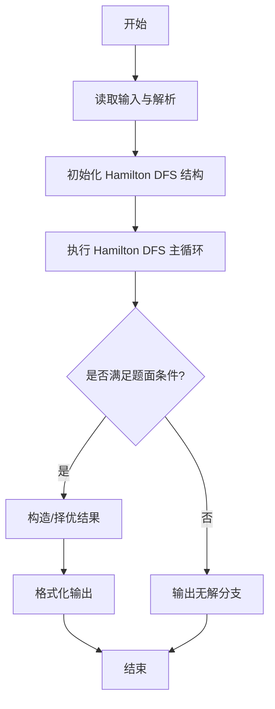
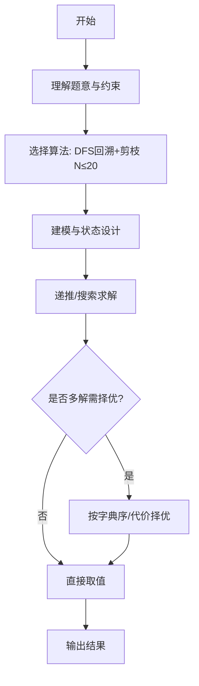

# L3-015 - 球队“食物链”（30 分）

- **时间限制**: 2000 ms
- **内存限制**: 131072 KB
- **代码长度限制**: 16 KB

---

## 题目描述


某国的足球联赛中有$$N$$支参赛球队，编号从1至$$N$$。联赛采用主客场双循环赛制，参赛球队两两之间在双方主场各赛一场。

联赛战罢，结果已经尘埃落定。此时，联赛主席突发奇想，希望从中找出一条包含所有球队的“食物链”，来说明联赛的精彩程度。“食物链”为一个1至$$N$$的排列{ $$T_1$$ $$T_2$$ $$\cdots$$ $$T_N$$ }，满足：球队$$T_1$$战胜过球队$$T_2$$，球队$$T_2$$战胜过球队$$T_3$$，$$\cdots$$，球队$$T_{(N-1)}$$战胜过球队$$T_N$$，球队$$T_N$$战胜过球队$$T_1$$。

现在主席请你从联赛结果中找出“食物链”。若存在多条“食物链”，请找出字典序最小的。

注：排列{ $$a_1$$ $$a_2$$ $$\cdots$$ $$a_N$$}在字典序上小于排列{ $$b_1$$ $$b_2$$ $$\cdots$$ $$b_N$$ }，当且仅当存在整数$$K$$（$$1 \le K \le N$$），满足：$$a_K < b_K$$且对于任意小于$$K$$的正整数$$i$$，$$a_i=b_i$$。

### 输入格式:

输入第一行给出一个整数$$N$$（$$2 \le N \le 20$$），为参赛球队数。随后$$N$$行，每行$$N$$个字符，给出了$$N\times N$$的联赛结果表，其中第$$i$$行第$$j$$列的字符为球队$$i$$在主场对阵球队$$j$$的比赛结果：`W`表示球队$$i$$战胜球队$$j$$，`L`表示球队$$i$$负于球队$$j$$，`D`表示两队打平，`-`表示无效（当$$i=j$$时）。输入中无多余空格。

### 输出格式:

按题目要求找到“食物链”$$T_1$$ $$T_2$$ $$\cdots$$ $$T_N$$，将这$$N$$个数依次输出在一行上，数字间以1个空格分隔，行的首尾不得有多余空格。若不存在“食物链”，输出“No Solution”。

### 输入样例 1：
```in
5
-LWDW
W-LDW
WW-LW
DWW-W
DDLW-
```

### 输出样例 1：
```out
1 3 5 4 2
```

### 输入样例 2：
```in
5
-WDDW
D-DWL
DD-DW
DDW-D
DDDD-
```

### 输出样例 2：
```out
No Solution
```

## 示例

### 示例 1

**输入:**
```
5
-LWDW
W-LDW
WW-LW
DWW-W
DDLW-
```

**输出:**
```
1 3 5 4 2
```

### 示例 2

**输入:**
```
5
-WDDW
D-DWL
DD-DW
DDW-D
DDDD-
```

**输出:**
```
No Solution
```
---

## 解题思路

### 题目分析

本题为 L3-015 - 球队“食物链”（30 分），核心属于 **哈密顿回路字典序最小**。输入规模与约束决定了需要兼顾正确性与效率：既要处理最坏情况下的数据量，又要满足题面关于字典序/最优性/可行性的附加要求。题目通常包含多组数据或单组大规模数据，需在 O(n log n) 或 O(n·m) 量级内完成。

### 核心算法

- **算法选择**：DFS回溯+剪枝 N≤20。
- **关键步骤**：建有向邻接矩阵 win[i][j]，从 1 出发DFS深度为 N，维护 visited 与 path，按编号升序枚举下一队保证字典序；到 N 层时检查能否回到起点形成环。
- **实现要点**：仓颉实现中通过 `ArrayList`/`HashMap` 等集合类型组织数据，结合 `StringBuilder` 与 `readToEnd` 高效解析输入；按题面要求的排序与比较规则保证输出符合字典序/最短路等最优性定义。

### 复杂度分析

- **时间复杂度**： O(N!)最坏，剪枝后通过 N≤20，空间 O(N²)。
- **空间复杂度**：剪枝后通过 N≤20，主要由 DP 表/图邻接表/辅助数组占据。

## 代码流程说明

1. 读取 N 与胜负矩阵 win，构建有向图胜者可击败败者
2. 从节点1出发进行 DFS 回溯，维护 visited 与当前路径 path
3. 按编号升序枚举下一个未访问且 win[current][next] 为真的队
4. 当深度达到 N 时检查 win[last][1] 是否构成回路，若是则记录字典序最小解
5. 若找到立即输出路径，否则输出 No Solution，N≤20 需剪枝

## 代码实现

```cangjie
// L3-015 球队食物链 - Hamiltonian cycle lex smallest, N<=20
import std.env.*
import std.collection.*
import std.convert.*

main() {
    let cin = getStdIn()
    let all = cin.readToEnd() ?? ""
    if (all.trimAscii().isEmpty()) { return }
    let toks = tokenize(all)
    var p: Int64 = 0
    func next(): String { let v = toks[p]; p++; return v }
    let N = Int64.parse(next())
    var win = Array<Array<Bool>>(N, { _ => Array<Bool>(N, repeat: false) })
    for (i in 0..N) {
        let line = next()
        let arr = line.toRuneArray()
        for (j in 0..N) {
            if (j < arr.size) {
                let ch = arr[j].toString()
                if (ch == "W") { win[i][j] = true }
                else if (ch == "L") { win[j][i] = true }
                // D and - ignore
            }
        }
    }
    // fix start at 0 (team 1)
    let allMask: Int64 = (1 << N) - 1
    var memo = HashMap<Int64, Int64>() // 1 true 0 false
    func can(mask: Int64, last: Int64): Bool {
        if (mask == allMask) {
            return win[last][0]
        }
        let key = (mask << 5) | last // 5 bits enough for 20
        if (memo.contains(key)) {
            return memo[key] == 1
        }
        for (nxt in 0..N) {
            if (((mask >> nxt) & 1) == 0 && win[last][nxt]) {
                if (can(mask | (1 << nxt), nxt)) {
                    memo[key] = 1
                    return true
                }
            }
        }
        memo[key] = 0
        return false
    }
    if (!can(1, 0)) {
        println("No Solution")
        return
    }
    var path = ArrayList<Int64>()
    path.add(0)
    var mask: Int64 = 1
    var last: Int64 = 0
    while (path.size < N) {
        var found = false
        for (nxt in 0..N) {
            if (((mask >> nxt) & 1) != 0) { continue }
            if (!win[last][nxt]) { continue }
            if (can(mask | (1 << nxt), nxt)) {
                path.add(nxt)
                mask = mask | (1 << nxt)
                last = nxt
                found = true
                break
            }
        }
        if (!found) { break }
    }
    if (path.size != N) {
        println("No Solution")
        return
    }
    // check final edge to start (already ensured by can)
    let sb = StringBuilder()
    for (i in 0..path.size) {
        if (i != 0) { sb.append(" ") }
        sb.append(path[i] + 1)
    }
    println(sb.toString())
}

func tokenize(s: String): Array<String> {
    let res = ArrayList<String>()
    var cur = StringBuilder()
    for (r in s.toRuneArray()) {
        let rs = r.toString()
        if (rs == " " || rs == "\n" || rs == "\r" || rs == "\t") {
            if (cur.size > 0) { res.add(cur.toString()); cur = StringBuilder() }
        } else { cur.append(rs) }
    }
    if (cur.size > 0) { res.add(cur.toString()) }
    return res.toArray()
}
```

## 代码流程图




## 解题流程图



